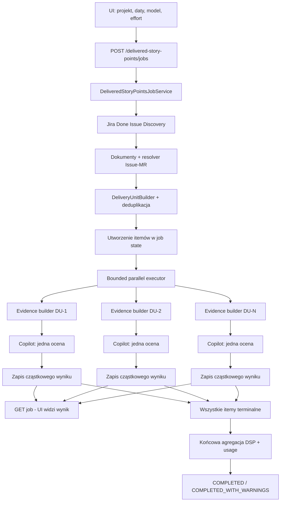

# Delivered Story Points - propozycja POC

## 1. Cel dokumentu

Ten dokument opisuje kompletny, możliwie mały zakres implementacyjny nowego
feature'a `Delivered Story Points` w `Team Delivery Workspace`.

Feature ma umożliwić operatorowi:

1. podanie projektu Jira,
2. podanie zakresu dat,
3. wybór modelu AI,
4. wybór `reasoningEffort`, jeżeli wybrany model go wspiera,
5. uruchomienie asynchronicznego joba,
6. obserwowanie cząstkowych wycen pojawiających się po zakończeniu analizy
   kolejnych elementów,
7. otrzymanie końcowej sumy Delivered Story Points dla wybranego zakresu.

Podstawowym pytaniem feature'a jest:

> Oceń obserwowalną złożoność dostarczonej zmiany według wspólnej rubryki.

POC nie próbuje odtwarzać rzeczywistego czasu pracy ani pełnego kosztu
wytworzenia. Ocenia wyłącznie złożoność zmiany widoczną w zakończonym issue,
powiązanych Merge Requestach i niewielkim, jawnie powiązanym kontekście
dokumentacyjnym.

## 2. Założenia wejściowe

Założenia wynikające z opisu feature'a:

- istnieje dostęp do Jira, GitLaba i Confluence,
- istnieje sposób rozwiązania powiązań `Jira issue -> Merge Request` używany
  przez feature Change Verification,
- projekt ma działającą platformę `aiplatform.copilot`, katalog modeli,
  obsługę `reasoningEffort`, Copilot auth, user-visible usage i asynchroniczne
  joby,
- GitLab potrafi zwrócić metadane MR-a, zmienione pliki i diff,
- Jira potrafi zwrócić issue oraz jawnie powiązane linki do dokumentacji.

Załączone dokumenty architektoniczne nie opisują kontraktu Change Verification
ani integracji Jira/Confluence. POC traktuje resolver powiązań MR jako gotową
capability do reuse. Jeżeli obecna implementacja znajduje się wewnątrz pakietu
innego feature'a, należy wydzielić wyłącznie mały neutralny serwis/port, zamiast
wprowadzać zależność `features.deliveredstorypoints -> features.changeverification`.

## 3. Zakres POC

### W zakresie

- osobny feature `features.deliveredstorypoints`,
- osobny ekran Angular `/delivered-story-points`,
- start joba po projekcie Jira, datach, modelu i `reasoningEffort`,
- wyszukanie issue znajdujących się obecnie w kategorii `Done`, których
  ostatnie przejście do `Done` nastąpiło w podanym zakresie,
- pobranie podstawowych danych issue,
- pobranie jawnie powiązanych linków dokumentacyjnych,
- rozwiązanie powiązanych MR-ów tą samą capability, której używa Change
  Verification,
- pobranie metadanych i ograniczonego diffu MR-ów,
- zbudowanie małego pakietu evidence,
- jedna sesja Copilota na jedną jednostkę dostawy,
- wyliczenie `Delivered Story Points` na skali `0, 1, 2, 3, 5, 8, 13`,
- równoległa analiza jednostek z limitem współbieżności,
- zapis cząstkowych wyników w stanie joba,
- polling joba przez UI,
- końcowa agregacja DSP i usage/cost,
- kontrolowane zachowanie przy częściowych błędach.

### Poza zakresem

- pomiar per osoba, zespół albo tribe,
- analiza refinementu i epików,
- współczynniki długu technicznego, ryzyka, blast radius i liczby konsumentów,
- model przewidywanego effortu albo czasu realizacji,
- historia i kalibracja statystyczna między okresami,
- follow-up chat,
- agentowe, szerokie przeszukiwanie GitLaba lub Confluence,
- automatyczna eskalacja do drugiego modelu,
- wieloetapowy pipeline LLM typu `summary -> scoring`,
- trwały cache wyników między jobami,
- ręczna korekta wyniku w UI,
- trwała baza jobów po restarcie aplikacji,
- ranking osób lub zespołów.

## 4. Najważniejsze decyzje POC

### 4.1. Jedna ocena opisuje dostarczoną zmianę, nie technologię

Nie liczymy osobno punktów za frontend, backend, parametryzację, orkiestrację,
kontrakty ani testy.

Te obszary są profilami evidence. Pomagają AI zrozumieć zmianę, ale nie są
sumowane jako niezależne punkty.

```text
źle:
frontend 3 + backend 5 + parametryzacja 3 + orkiestracja 3 = 14

poprawnie:
jedna dostarczona zmiana = 8 DSP
```

### 4.2. Data decydująca o zakresie to przejście do Done

Zakres `[fromDate, toDate]` oznacza lokalne daty kalendarzowe w konfigurowanej
strefie aplikacji, domyślnie `Europe/Warsaw`.

Issue kwalifikuje się, gdy:

- należy do wybranego projektu,
- jego aktualna kategoria statusu to `Done`,
- jego ostatnie przejście do kategorii `Done` mieści się w przedziale:

```text
[fromDate 00:00, toDate + 1 dzień 00:00)
```

Jeżeli issue zostało ponownie otwarte i później ponownie zamknięte, liczy się
ostatnie przejście do `Done`. Issue jest liczone tylko w okresie tego finalnego
zamknięcia.

Adapter Jira może użyć najlepszego dostępnego pola/JQL do prefiltracji, ale
powinien zwrócić jawne `doneAt`. Semantyka publicznego feature'a nie może
zależeć od nazwy konkretnego statusu typu `Done`, `Closed` albo `Resolved`;
liczy się kategoria statusu.

### 4.3. Model i reasoning effort są parametrami wykonania

`model` i `reasoningEffort`:

- są wybierane raz dla całego joba,
- obowiązują wszystkie analizy cząstkowe,
- nie są evidence,
- nie wpływają na zakres Jira, GitLaba ani Confluence,
- są walidowane względem istniejącego `GET /analysis/ai/options`.

### 4.4. Źródła są zbierane deterministycznie

Copilot nie dostaje narzędzia do wyszukania listy issue, MR-ów ani dokumentów.
Backend zbiera je przed uruchomieniem modelu.

Dzięki temu:

- koszt jest przewidywalny,
- model nie wykonuje szerokiej eksploracji,
- każde wyliczenie ma ten sam typ wejścia,
- łatwo audytować, co zostało ocenione.

### 4.5. Jedna sesja AI na jednostkę dostawy

Każda jednostka dostawy jest oceniana w jednej nowej sesji Copilota.

POC nie wykonuje:

- osobnego podsumowania każdego MR-a przez AI,
- osobnego wywołania do analizy dokumentacji,
- automatycznego drugiego wywołania naprawczego,
- agentowego dociągania pełnych plików.

Jeżeli evidence jest niepełne, wynik ma niższe `confidence` albo status
`NOT_SCORABLE`. System nie zwiększa automatycznie kosztu, aby wymusić pozorną
precyzję.

## 5. Publiczny UX i API

### 5.1. Ekran UI

Nowy ekran:

```text
Analysis Features / Delivered Story Points
route: /delivered-story-points
```

Formularz startowy zawiera:

- `Projekt Jira`,
- `Data od`,
- `Data do`,
- `Model`,
- `Reasoning effort`, widoczne tylko wtedy, gdy wybrany model je wspiera,
- jeden primary action: `Uruchom wycenę`.

Pole projektu w POC może być zwykłym tekstem. Etykieta mówi `Projekt Jira`, a
wartość powinna być jednoznacznym kluczem projektu albo dokładną nazwą
rozwiązywaną przez integrację. Preferowany jest klucz projektu, nawet jeżeli UI
nazywa pole projektem/nazwą projektu.

### 5.2. Endpointy

```http
POST /delivered-story-points/jobs
GET /delivered-story-points/jobs/{jobId}
```

Katalog modeli pozostaje wspólny:

```http
GET /analysis/ai/options
```

Nie tworzymy osobnego endpointu opcji modeli dla feature'a.

### 5.3. Request startu joba

```json
{
  "jiraProject": "CRD",
  "fromDate": "2026-07-01",
  "toDate": "2026-07-31",
  "model": "selected-model-id",
  "reasoningEffort": "medium"
}
```

Walidacje:

- `jiraProject` wymagane i niepuste,
- `fromDate` oraz `toDate` wymagane,
- `fromDate <= toDate`,
- zakres nie może przekroczyć konfigurowanego maksimum,
- model musi istnieć w katalogu dostępnych modeli,
- `reasoningEffort` może zostać wysłane tylko dla modelu, który je wspiera.

### 5.4. Statusy joba

```text
QUEUED
DISCOVERING
ANALYZING
COMPLETED
COMPLETED_WITH_WARNINGS
FAILED
```

Znaczenie:

- `QUEUED` - job został utworzony,
- `DISCOVERING` - trwa pobieranie issue i budowanie jednostek dostawy,
- `ANALYZING` - trwa równoległa analiza jednostek,
- `COMPLETED` - wszystkie jednostki zakończyły się bez błędu technicznego,
- `COMPLETED_WITH_WARNINGS` - job zakończył się, ale część jednostek była
  nieocenialna albo zakończyła się błędem,
- `FAILED` - nie udało się ustalić zakresu joba, np. Jira jest niedostępna.

### 5.5. Statusy analizy cząstkowej

```text
PENDING
COLLECTING_EVIDENCE
READY
ANALYZING
COMPLETED
EXCLUDED
NOT_SCORABLE
FAILED
```

Każda zmiana statusu aktualizuje job state widoczny przez polling.

## 6. Wybór issue i danych źródłowych

### 6.1. Dane pobierane z Jira

Dla każdego issue pobieramy tylko:

- `key`,
- `summary`,
- `description`, ograniczone limitem znaków,
- typ issue,
- komponenty,
- etykiety,
- acceptance criteria, jeżeli istnieją w skonfigurowanym polu,
- `doneAt`,
- jawne remote links i linki dokumentacyjne,
- identyfikatory potrzebne resolverowi MR-ów.

Nie pobieramy domyślnie:

- komentarzy,
- historii całej dyskusji,
- załączników,
- obecnych Story Points,
- time tracking,
- worklogów,
- estymat zespołu,
- autora, assignee i seniority jako inputu modelu.

Istniejące Story Points nie mogą być przekazane do AI, ponieważ zakotwiczałyby
nową ocenę.

### 6.2. Powiązane dokumenty

POC używa wyłącznie jawnych linków powiązanych z issue:

1. Jira remote links,
2. linki Confluence zapisane w polach issue,
3. linki w opisie issue, jeżeli wskazują obsługiwany host dokumentacji.

Nie wykonujemy broad search w Confluence po tytule, domenie ani podobieństwie
semantycznym.

Dla maksymalnie skonfigurowanej liczby dokumentów pobieramy:

- URL,
- tytuł,
- krótki oczyszczony fragment treści,
- informację, czy pobranie się udało.

Brak dokumentu nie blokuje wyceny. Dokumentacja jest wsparciem dla intencji,
a nie obowiązkowym źródłem prawdy o zaimplementowanej zmianie.

### 6.3. Powiązane Merge Requesty

Resolver powiązań działa tak samo jak w Change Verification.

Reguły POC:

- używamy wyłącznie jawnych, deterministycznie rozwiązanych powiązań,
- nie używamy AI do fuzzy matching issue i MR-a,
- uwzględniamy wyłącznie MR-y faktycznie zmergowane,
- MR może być zmergowany przed zakresem dat; liczy się data finalnego `Done`
  issue,
- MR zamknięty bez merge'a nie jest evidence dostawy,
- powiązania są kanonizowane jako `projectPath + mrIid`.

Dla MR-a pobieramy:

- projekt/repozytorium,
- IID,
- tytuł,
- opis ograniczony limitem,
- URL,
- datę merge'a,
- base SHA i head SHA, jeżeli są dostępne,
- listę zmienionych plików,
- diff wybranych zmian,
- informację o plikach wygenerowanych, binarnych, zbyt dużych i zwiniętych.

Autorzy i reviewerzy nie trafiają do promptu AI.

## 7. Jednostka dostawy i ochrona przed podwójnym liczeniem

Domyślnie:

```text
1 Jira issue + wszystkie jego powiązane MR-y = 1 Delivery Unit
```

Istnieje jednak ważny wyjątek: ten sam MR może być powiązany z kilkoma issue
w wybranym zakresie. Proste sumowanie wycen per issue policzyłoby tę samą
implementację kilka razy.

Dlatego POC buduje graf dwudzielny:

```text
Jira issue <-> Merge Request
```

Każdy spójny komponent grafu staje się jedną `Delivery Unit`.

Przykład:

```text
ABC-1 -> repo!10
ABC-2 -> repo!10
ABC-2 -> repo!11
```

Tworzy jedną jednostkę:

```text
DU-1 = [ABC-1, ABC-2, repo!10, repo!11]
```

AI ocenia tę jednostkę raz. UI pokazuje, że wynik dotyczy kilku issue.
Agregacja sumuje DSP po unikalnych `Delivery Unit`, nie po liczbie issue.

Dla typowego przypadku `1 issue -> 1..N MR` użytkownik nadal widzi zwykły
wiersz odpowiadający jednemu issue.

Issue bez żadnego zmergowanego MR-a otrzymuje:

```text
status = NOT_SCORABLE
reason = NO_MERGED_CODE_EVIDENCE
```

Nie otrzymuje automatycznie `0 DSP`, ponieważ brak kodu może oznaczać zmianę
non-code albo brakujące powiązanie, a nie zerową złożoność.

## 8. Runtime flow



Szczegółowy przebieg:

1. API waliduje request i rozwiązuje non-secret Copilot auth reference.
2. Job zostaje zapisany jako `QUEUED`.
3. Task tła ustawia `DISCOVERING`.
4. Jira source pobiera listę kwalifikujących się issue.
5. Backend odrzuca job, jeżeli liczba issue przekracza limit POC.
6. Dla issue rozwiązywane są linki dokumentacyjne i MR-y.
7. `DeliveryUnitBuilder` deduplikuje MR-y i buduje spójne jednostki.
8. Wszystkie jednostki zostają zapisane w job state jako `PENDING`.
9. Każda jednostka jest wykonywana jako niezależny task:
   - pobranie evidence,
   - zbudowanie Minimum Evidence Packet,
   - opcjonalne deterministyczne wykluczenie,
   - przygotowanie sesji Copilota,
   - jedna analiza JSON-only,
   - deterministyczne mapowanie wymiarów na DSP,
   - zapis wyniku i usage w job state.
10. UI polluje job i pokazuje zakończone jednostki natychmiast.
11. Po zakończeniu wszystkich tasków backend oblicza agregat.
12. Job przechodzi do `COMPLETED` albo `COMPLETED_WITH_WARNINGS`.

## 9. Model stanu joba

Przykładowy response z częściowo zakończonego joba:

```json
{
  "jobId": "dsp-20260814-0001",
  "status": "ANALYZING",
  "request": {
    "jiraProject": "CRD",
    "fromDate": "2026-07-01",
    "toDate": "2026-07-31",
    "model": "selected-model-id",
    "reasoningEffort": "medium"
  },
  "progress": {
    "discoveredIssues": 24,
    "deliveryUnits": 22,
    "pending": 8,
    "running": 3,
    "completed": 9,
    "excluded": 1,
    "notScorable": 1,
    "failed": 0
  },
  "items": [
    {
      "deliveryUnitId": "DU-0001",
      "issueKeys": ["CRD-101"],
      "issueSummaries": ["Dodatkowa walidacja decyzji"],
      "status": "COMPLETED",
      "mergeRequests": [
        {
          "ref": "credit-service!741",
          "url": "https://gitlab.example/..."
        }
      ],
      "documentationLinks": [
        {
          "title": "Opis procesu decyzji",
          "url": "https://confluence.example/...",
          "fetchStatus": "FETCHED"
        }
      ],
      "assessment": {
        "deliveredStoryPoints": 5,
        "confidence": 0.86,
        "confidenceLevel": "HIGH",
        "dimensions": {
          "outcomeBreadth": 2,
          "domainDecisionComplexity": 3,
          "applicationFlowComplexity": 2,
          "boundaryAndDataComplexity": 1,
          "verificationStateSpace": 2,
          "implementedCompatibilityScope": 1
        },
        "evidenceSummary": [
          "Zmieniono dwie współdziałające decyzje domenowe.",
          "Dodano nową ścieżkę obsługi błędu.",
          "Kontrakt został rozszerzony kompatybilnie."
        ],
        "visibilityLimits": []
      },
      "usage": {
        "inputTokens": 7200,
        "outputTokens": 430,
        "cachedInputTokens": 0,
        "model": "selected-model-id"
      }
    },
    {
      "deliveryUnitId": "DU-0002",
      "issueKeys": ["CRD-102"],
      "status": "ANALYZING"
    }
  ],
  "aggregate": null,
  "warnings": []
}
```

`aggregate` pozostaje `null` do momentu, gdy wszystkie itemy osiągną status
terminalny. UI może pokazywać liczbę zakończonych elementów, ale nie nazywa
częściowej sumy końcowym wynikiem zakresu.

## 10. Minimum Evidence Packet

AI nie otrzymuje pełnych repozytoriów, pełnych stron Confluence ani pełnych
plików źródłowych. Otrzymuje jeden ograniczony pakiet JSON.

Przykład:

```json
{
  "deliveryUnitId": "DU-0001",
  "issues": [
    {
      "key": "CRD-101",
      "type": "Story",
      "summary": "Dodatkowa walidacja decyzji",
      "description": "...",
      "acceptanceCriteria": "...",
      "components": ["decision"],
      "labels": ["feature"],
      "doneAt": "2026-07-17T14:21:00Z"
    }
  ],
  "documentation": [
    {
      "sourceRef": "DOC-1",
      "title": "Opis procesu decyzji",
      "url": "https://confluence.example/...",
      "excerpt": "...",
      "truncated": true
    }
  ],
  "mergeRequests": [
    {
      "sourceRef": "MR-1",
      "ref": "credit-service!741",
      "title": "CRD-101 additional decision validation",
      "description": "...",
      "mergedAt": "2026-07-16T10:12:00Z",
      "changedFiles": [
        {
          "path": "src/main/.../DecisionService.java",
          "profile": "DOMAIN_LOGIC",
          "changeType": "MODIFIED"
        },
        {
          "path": "src/main/resources/.../decision-config.xlsx",
          "profile": "ADVANCED_PARAMETERIZATION",
          "changeType": "MODIFIED"
        },
        {
          "path": "src/test/.../DecisionServiceTest.java",
          "profile": "VERIFICATION",
          "changeType": "MODIFIED"
        }
      ],
      "selectedDiffs": [
        {
          "path": "src/main/.../DecisionService.java",
          "profile": "DOMAIN_LOGIC",
          "content": "@@ ..."
        }
      ]
    }
  ],
  "changeOverview": {
    "profiles": [
      "DOMAIN_LOGIC",
      "ADVANCED_PARAMETERIZATION",
      "VERIFICATION"
    ],
    "productionFiles": 4,
    "testFiles": 3,
    "generatedFilesExcluded": 12,
    "binaryFilesExcluded": 1,
    "diffTruncated": false,
    "documentationTruncated": true
  },
  "coverage": {
    "issueIntent": "PARTIAL",
    "linkedMergeRequests": "COMPLETE",
    "implementationDiff": "COMPLETE",
    "linkedDocumentation": "PARTIAL"
  }
}
```

Profile są neutralne technologicznie:

```text
USER_INTERACTION
APPLICATION_LOGIC
DOMAIN_LOGIC
ADVANCED_PARAMETERIZATION
DYNAMIC_ORCHESTRATION
DATA_AND_CONTRACTS
RUNTIME_CONFIGURATION
VERIFICATION
DOCUMENTATION
MECHANICAL_OR_GENERATED
```

Profile nie dodają punktów. Są jedynie indeksem ułatwiającym modelowi
interpretację evidence.

## 11. Budowanie evidence i selekcja diffu

### 11.1. Normalizacja

Przed wysłaniem do AI backend:

1. usuwa pliki binarne,
2. usuwa pliki oznaczone przez GitLab jako generated, jeżeli informacja jest
   dostępna,
3. usuwa znane artefakty buildów, vendored dependencies i lockfile'y zgodnie
   z konfiguracją,
4. normalizuje końce linii i usuwa niepotrzebne metadata diffu,
5. nie przekazuje nazw autorów,
6. nie przekazuje liczby Story Points z Jira,
7. nie używa liczby linii jako sygnału punktowego.

### 11.2. Ranking plików

Pliki są klasyfikowane heurystycznie na podstawie ścieżki, rozszerzenia i
nazwy. Kolejność priorytetów dla fragmentów diffu:

1. logika domenowa i decyzje,
2. logika aplikacyjna,
3. zaawansowana parametryzacja,
4. dynamiczna orkiestracja,
5. publiczne kontrakty, eventy i dane,
6. migracje,
7. interakcja użytkownika,
8. testy i scenariusze weryfikacyjne,
9. konfiguracja runtime,
10. dokumentacja, style, tłumaczenia i pozostałe pliki.

### 11.3. Budżet diffu

Do modelu trafia:

- pełna lista ścieżek istotnych zmienionych plików,
- krótka klasyfikacja każdego pliku,
- wybrane hunki diffu do wspólnego limitu znaków,
- co najmniej jeden reprezentatywny hunk z każdego wykrytego profilu o wysokim
  priorytecie, o ile taki hunk istnieje,
- nazwy najważniejszych testów i wybrane fragmenty asercji/scenariuszy,
- informacja, co zostało pominięte.

Nie trafia:

- pełny diff wszystkich MR-ów bez limitu,
- całe klasy „na wszelki wypadek”,
- cała tabela parametryzacyjna,
- cały model orkiestracji w surowym formacie,
- cały wygenerowany klient,
- pełne pliki testowe,
- pełne strony Confluence.

Jeżeli limit zostanie osiągnięty:

```text
diffTruncated = true
coverage.implementationDiff = PARTIAL
```

Model musi uwzględnić tę informację w `confidence`.

### 11.4. Minimalne deterministic exclusions

Bez wywołania AI można zakończyć element jako `EXCLUDED` i `0 DSP`, gdy po
normalizacji wszystkie zmiany należą wyłącznie do jednej z kategorii:

- generated-only,
- format-only,
- metadata-only,
- branch synchronization,
- mechaniczny backport bez nowej semantyki,
- zmiana layoutu bez zmiany wykonywalnego zachowania,
- binarne artefakty builda.

Jeżeli klasyfikacja nie jest jednoznaczna, element trafia do AI. POC nie tworzy
rozbudowanego rule engine'a do zastępowania interpretacji modelu.

## 12. Definicja Delivered Story Points

`Delivered Story Points` mierzą:

> Obserwowalną, semantyczną złożoność zachowania, przepływu, decyzji, danych i
> kompatybilności, które zostały faktycznie dostarczone w analizowanej
> jednostce.

Nie mierzą bezpośrednio:

- czasu pracy,
- seniority wykonawcy,
- liczby plików,
- liczby linii,
- liczby commitów,
- jakości opisu Jira,
- wartości biznesowej,
- ryzyka organizacyjnego niewidocznego w implementacji,
- długu technicznego całego repozytorium,
- liczby spotkań i uzgodnień,
- pracy wykonanej poza obserwowalnymi artefaktami.

## 13. Rubryka DSP

AI ocenia sześć wymiarów w zakresie `0-4`.

| Wymiar | Waga | Pytanie |
|---|---:|---|
| `outcomeBreadth` | 10% | Jak szeroki rezultat został faktycznie dostarczony? |
| `domainDecisionComplexity` | 25% | Jak złożone są zmienione decyzje, reguły i inwarianty? |
| `applicationFlowComplexity` | 25% | Jak złożony jest zmieniony przebieg, stan i obsługa błędów? |
| `boundaryAndDataComplexity` | 15% | Jak złożone są zmiany kontraktów, danych i granic? |
| `verificationStateSpace` | 15% | Ile istotnych wariantów wymaga sensownej weryfikacji? |
| `implementedCompatibilityScope` | 10% | Ile pracy kompatybilnościowej lub migracyjnej faktycznie dostarczono? |

### 13.1. `outcomeBreadth`

| Ocena | Definicja |
|---:|---|
| 0 | Brak samodzielnego rezultatu; zmiana mechaniczna. |
| 1 | Jedno lokalne zachowanie albo niewielki rezultat techniczny. |
| 2 | Kilka wariantów w ramach jednego use case'u. |
| 3 | Kilka ról, produktów, etapów albo powiązanych zachowań. |
| 4 | Zmiana przekrojowa obejmująca wiele use case'ów lub większy fragment domeny. |

Ocena ma wynikać z implementacji i opisu issue. Słaby opis wymagań nie może
sam zwiększać wyniku.

### 13.2. `domainDecisionComplexity`

| Ocena | Definicja |
|---:|---|
| 0 | Brak zmiany decyzji lub reguł domenowych. |
| 1 | Jedna izolowana reguła, próg, parametr albo inwariant. |
| 2 | Kilka warunków i wyjątków w jednej rodzinie decyzji. |
| 3 | Kilka współdziałających rodzin decyzji, wspólne fakty lub zależności między regułami. |
| 4 | Decyzje kaskadowe, temporalne, wersjonowane albo silnie współzależne. |

Nie liczymy mechanicznie liczby `if`, reguł, wierszy tabeli ani parametrów.
Liczy się zmiana przestrzeni decyzji.

### 13.3. `applicationFlowComplexity`

| Ocena | Definicja |
|---:|---|
| 0 | Brak zmiany przepływu. |
| 1 | Jeden lokalny, liniowy krok. |
| 2 | Kilka kroków, rozgałęzienie albo zmiana stanu. |
| 3 | Asynchroniczność, retry, timery, kilka ścieżek błędów albo złożona koordynacja. |
| 4 | Długotrwały przebieg, kompensacja, współistnienie wersji albo migracja aktywnego stanu. |

Ocena jest niezależna od tego, czy przepływ zapisano w kodzie, konfiguracji
czy wykonywalnym modelu procesu.

### 13.4. `boundaryAndDataComplexity`

| Ocena | Definicja |
|---:|---|
| 0 | Zmiana wyłącznie wewnętrzna. |
| 1 | Kompatybilne rozszerzenie jednego kontraktu albo prostego modelu danych. |
| 2 | Kilka granic, nowa integracja albo prosta migracja danych. |
| 3 | Skoordynowana kompatybilność wielu konsumentów lub systemów. |
| 4 | Breaking change, backfill, dual-read/write albo spójność rozproszona. |

Do tego wymiaru trafia wyłącznie praca widoczna w dostawie. Sama informacja, że
system potencjalnie ma wielu konsumentów, nie zwiększa wyniku, jeżeli evidence
nie pokazuje pracy związanej z ich obsługą.

### 13.5. `verificationStateSpace`

| Ocena | Definicja |
|---:|---|
| 0 | Zmiana mechaniczna lub trywialna. |
| 1 | Kilka prostych, deterministycznych przypadków. |
| 2 | Kilka warunków, ścieżek albo wariantów danych. |
| 3 | Interakcje wielu osi decyzyjnych i przebiegów. |
| 4 | Kombinatoryka, czas, współistnienie wersji, aktywny stan albo zachowanie wielosystemowe. |

Wymiar mierzy wymagany zakres weryfikacji, a nie liczbę napisanych testów.
Brak testów nie obniża DSP. Powoduje flagę jakości i może obniżyć confidence.

### 13.6. `implementedCompatibilityScope`

| Ocena | Definicja |
|---:|---|
| 0 | Brak dodatkowej pracy kompatybilnościowej. |
| 1 | Lokalna kompatybilność albo niewielkie dostosowanie. |
| 2 | Dostosowanie kilku elementów, wersjonowanie jednego kontraktu lub prosta migracja. |
| 3 | Wielu konsumentów, kontrolowana migracja albo współistnienie zachowań. |
| 4 | Dual processing, szeroka migracja, aktywny stan albo skoordynowana zmiana wielu systemów. |

## 14. Deterministyczne mapowanie na punkty

AI zwraca wyłącznie oceny wymiarów, evidence, confidence i flagi. Backend
wylicza wynik.

```text
score100 =
    10 * outcomeBreadth / 4
  + 25 * domainDecisionComplexity / 4
  + 25 * applicationFlowComplexity / 4
  + 15 * boundaryAndDataComplexity / 4
  + 15 * verificationStateSpace / 4
  + 10 * implementedCompatibilityScope / 4
```

Mapowanie startowe:

| Warunek | Delivered Story Points |
|---|---:|
| Deterministycznie wykluczona zmiana semantycznie pusta | 0 |
| `score100 > 0` i `<= 14` | 1 |
| `score100 > 14` i `<= 27` | 2 |
| `score100 > 27` i `<= 42` | 3 |
| `score100 > 42` i `<= 58` | 5 |
| `score100 > 58` i `<= 75` | 8 |
| `score100 > 75` | 13 |

Backend zapisuje zarówno wymiary, `score100`, jak i końcowy bucket. Umożliwia
to audyt konkretnej oceny bez ponownego pytania modelu.

## 15. Guardraile punktowe

Guardraile są stosowane tylko wtedy, gdy warunek jest jawnie obserwowalny w
MR-ach.

### Maksimum

| Zmiana | Maksimum |
|---|---:|
| copy, style, i18n, rename bez zmiany zachowania | 1 |
| lokalny mapping lub konfiguracja bez wpływu na decyzje/przepływ | 1 |
| liniowa zmiana jednego lokalnego zachowania | 2 |
| refaktoring bez zmiany zachowania i bez zmiany granic | 3 |

### Minimum

| Obserwowalny warunek | Minimum |
|---|---:|
| zmiana współdzielonego modelu decyzji | 5 |
| nowe zachowanie asynchroniczne lub korelacja komunikatów | 5 |
| migracja istniejących danych | 5 |
| współistnienie wersji zachowania | 8 |
| migracja aktywnych przypadków/stanu | 8 |
| breaking change współdzielonego kontraktu | 8 |
| dual-run, dual-read albo dual-write | 8 |

Wynik `13` otrzymuje flagę:

```text
LARGE_DELIVERY_UNIT
```

POC nie uruchamia dodatkowej oceny człowieka ani modelu, ale UI powinno
wyróżnić taki wynik.

## 16. Interpretacja bucketów

| DSP | Interpretacja |
|---:|---|
| 0 | zmiana wykluczona: mechaniczna albo semantycznie pusta |
| 1 | bardzo mała, lokalna zmiana |
| 2 | mała zmiana jednego zachowania lub jednej powierzchni |
| 3 | mała zmiana end-to-end albo średnia lokalna zmiana |
| 5 | standardowa funkcja biznesowa z kilkoma regułami/krokami |
| 8 | złożona funkcja, integracja, decyzje lub dynamiczny przebieg |
| 13 | duża zmiana przekrojowa, wersjonowanie lub migracja aktywnego stanu |

## 17. Przykłady kalibracyjne

### 1 DSP

- zmiana lokalnego mappingu,
- prosta walidacja jednego pola,
- niewielka poprawka jednego warunku,
- zmiana komunikatu powiązana z jednym zachowaniem.

### 2 DSP

- mała zmiana formularza albo pojedynczego endpointu,
- izolowana reguła z kilkoma prostymi warunkami,
- lokalna zmiana jednego kroku aplikacyjnego.

### 3 DSP

- pole end-to-end: interakcja, kontrakt, zapis i test,
- kilka powiązanych walidacji,
- nowa prosta ścieżka przebiegu bez złożonej asynchroniczności.

### 5 DSP

- standardowa funkcja obejmująca kilka zachowań,
- kilka współdziałających reguł domenowych,
- nowa ścieżka procesu z obsługą błędu,
- kompatybilna zmiana kontraktu i danych.

### 8 DSP

- kilka rodzin decyzji i kilka ścieżek przebiegu,
- asynchroniczność, retry albo korelacja,
- znacząca migracja danych,
- współistnienie kilku wariantów zachowania.

### 13 DSP

- szeroka zmiana modelu domenowego,
- breaking contract wraz z migracją,
- aktywny stan wymagający migracji,
- dual processing i skoordynowana zmiana wielu systemów.

## 18. Kontrakt odpowiedzi AI

Copilot ma zwrócić JSON-only:

```json
{
  "classification": "DELIVERY",
  "dimensions": {
    "outcomeBreadth": 2,
    "domainDecisionComplexity": 3,
    "applicationFlowComplexity": 2,
    "boundaryAndDataComplexity": 1,
    "verificationStateSpace": 2,
    "implementedCompatibilityScope": 1
  },
  "confidence": 0.86,
  "evidenceSummary": [
    "Zmieniono dwie współdziałające decyzje domenowe.",
    "Dodano nową ścieżkę obsługi błędu.",
    "Rozszerzono kontrakt w sposób kompatybilny."
  ],
  "qualityFlags": [],
  "visibilityLimits": []
}
```

Dozwolone `classification`:

```text
DELIVERY
EXCLUDED
INSUFFICIENT_EVIDENCE
```

Zasady:

- `DELIVERY` wymaga wszystkich sześciu wymiarów,
- `EXCLUDED` powinno być rzadkie, ponieważ oczywiste przypadki wyklucza
  wcześniej backend,
- `INSUFFICIENT_EVIDENCE` nie dostaje DSP i przechodzi do `NOT_SCORABLE`,
- model nie zwraca końcowych punktów,
- backend nie ufa `score100` wyliczonemu przez model,
- parser waliduje zakres każdego wymiaru `0-4`,
- brak poprawnego JSON kończy tylko dany item jako `FAILED`.

POC nie wykonuje automatycznego repair/retry odpowiedzi modelu. Retry jest
dozwolony wyłącznie dla technicznego błędu transportowego przed uzyskaniem
odpowiedzi i nie może spowodować dwóch zapisanych ocen tego samego itemu.

## 19. Instrukcja dla skilla AI

Dedykowany skill, np.:

```text
src/main/resources/copilot/skills/delivered-story-points-evaluator/SKILL.md
```

powinien zawierać stałe zasady:

```text
Oceń obserwowalną złożoność dostarczonej zmiany.

1. Oceniaj wyłącznie evidence przekazane dla bieżącej Delivery Unit.
2. Nie estymuj czasu pracy ani liczby dni.
3. Nie używaj liczby plików, linii, commitów ani autorów jako bezpośredniej
   podstawy oceny.
4. Nie sumuj profili implementacyjnych. Ta sama zmiana zachowania zapisana
   w kilku miejscach jest liczona raz.
5. Rozróżniaj złożoność decyzji domenowych od złożoności przepływu aplikacji.
6. Oceniaj wymagany zakres weryfikacji, nie liczbę napisanych testów.
7. Uwzględniaj tylko pracę kompatybilnościową widoczną w dostawie.
8. Słaba dokumentacja obniża confidence, ale sama nie zwiększa złożoności.
9. Jeżeli diff został ograniczony, nie udawaj pełnej widoczności.
10. Zwróć wyłącznie JSON zgodny z kontraktem.
```

Rubryka wymiarów może znajdować się w skillu, aby nie powtarzać jej w pełnym
brzmieniu w każdym promptcie. Prompt konkretnego itemu powinien zawierać tylko:

- zadanie,
- Minimum Evidence Packet,
- krótki reminder JSON-only,
- informację o braku dostępnych narzędzi eksploracyjnych.

## 20. Przygotowanie i wykonanie sesji Copilota

Każda analiza cząstkowa składa własny neutralny `CopilotRunRequest` i korzysta
z istniejącego `aiplatform.copilot`.

Konfiguracja sesji:

- `sessionTarget = NEW`,
- model z requestu joba,
- `reasoningEffort` z requestu joba,
- dedykowany skill Delivered Story Points,
- brak integracyjnych tools GitLab/Jira/Confluence,
- blokada local workspace/filesystem/shell zgodnie z platformą,
- hidden context zawiera wyłącznie techniczny identyfikator joba i Delivery
  Unit, jeżeli jest potrzebny do logów,
- usage i activity events są przypisywane do konkretnego itemu.

Najważniejsza decyzja kosztowa:

```text
model nie otrzymuje capability do dalszej eksploracji
```

Jeżeli pakiet jest niewystarczający, model zwraca niższe `confidence`,
`visibilityLimits` albo `INSUFFICIENT_EVIDENCE`.

## 21. Efektywność kosztowa

### 21.1. Jedno wywołanie na jednostkę

Docelowy koszt POC:

```text
liczba sesji AI = liczba ocenialnych, unikalnych Delivery Units
```

Nie:

```text
liczba issue + liczba MR-ów + liczba dokumentów + liczba fragmentów kodu
```

### 21.2. Brak agentowego retrievalu

Najdroższy wzorzec jest zakazany:

```text
AI szuka issue -> AI szuka MR -> AI czyta repo -> AI szuka dokumentacji
```

Zamiast tego:

```text
backend zbiera -> backend ogranicza -> AI interpretuje jeden pakiet
```

### 21.3. Limity POC

Rekomendowane wartości startowe:

```properties
delivered-story-points.max-range-days=92
delivered-story-points.max-issues-per-job=200
delivered-story-points.max-parallel-analyses=4
delivered-story-points.max-parallel-source-requests=8

delivered-story-points.evidence.max-issues-per-unit=10
delivered-story-points.evidence.max-merge-requests-per-unit=20
delivered-story-points.evidence.max-changed-files-per-mr=300
delivered-story-points.evidence.max-jira-description-characters=6000
delivered-story-points.evidence.max-mr-description-characters=3000
delivered-story-points.evidence.max-diff-characters-per-unit=50000
delivered-story-points.evidence.max-documents-per-unit=2
delivered-story-points.evidence.max-document-characters-per-unit=8000

delivered-story-points.ai.item-timeout=5m
delivered-story-points.job-timeout=60m
```

Limity są backendowe. Model nie może ich obejść.

Jeżeli pojedyncza `Delivery Unit` przekracza `max-issues-per-unit` albo
`max-merge-requests-per-unit`, element otrzymuje:

```text
status = NOT_SCORABLE
reason = DELIVERY_UNIT_TOO_LARGE
```

Nie uruchamiamy dla niego sesji AI. Przekroczenie limitu liczby zmienionych
plików lub znaków diffu nie blokuje wyceny, ale powoduje truncation i obniża
coverage/confidence.

### 21.4. Preferencja małego pakietu

Cel dla zwykłego itemu:

```text
około 5-15 tys. tokenów wejściowych
kilkaset tokenów odpowiedzi
0 integracyjnych tool calls
```

Duży item może otrzymać ograniczony diff. Nie uruchamiamy automatycznie
pełniejszej analizy.

### 21.5. Bounded concurrency

Równoległość skraca czas joba, ale nie może uruchomić kilkudziesięciu sesji
jednocześnie.

Stosujemy:

- dedykowany executor, nie common ForkJoinPool,
- `max-parallel-analyses`, domyślnie `4`,
- osobny limit I/O do Jira/GitLab/Confluence,
- brak dynamicznego zwiększania równoległości przez model,
- timeout per item.

### 21.6. Widoczne usage i koszt

Dla każdego itemu zapisujemy:

- model,
- reasoning effort,
- input tokens,
- cached input tokens,
- output tokens,
- liczbę API calls,
- czas wykonania,
- AI credits/cost, jeżeli runtime je udostępnia.

Job agreguje te wartości. UI pokazuje całkowite usage obok finalnego DSP.

Pozwala to odpowiedzieć od razu na pytanie:

```text
Ile kosztowało zmierzenie tego zakresu?
```

### 21.7. Brak persistent cache w POC

POC nie implementuje cache wyników między jobami. To świadomy kompromis na
rzecz szybkiego dostarczenia. Użytkownik powinien widzieć koszt i unikać
wielokrotnego uruchamiania tego samego zakresu.

Deduplikacja MR-ów wewnątrz jednego joba jest obowiązkowa.

## 22. Równoległość i aktualizacja job state

`DeliveredStoryPointsJobService` uruchamia jeden background task dla joba.
Po discovery tworzy task per `Delivery Unit`.

Przykładowy pseudokod:

```java
List<DeliveryUnit> units = deliveryUnitBuilder.build(issues, links);
jobState.initializeItems(units);

List<CompletableFuture<Void>> futures = units.stream()
    .map(unit -> CompletableFuture
        .runAsync(() -> analyzeUnit(jobId, unit), analysisExecutor)
        .exceptionally(error -> {
            jobState.failItem(jobId, unit.id(), error);
            return null;
        }))
    .toList();

CompletableFuture.allOf(futures.toArray(CompletableFuture[]::new)).join();
finalizeJob(jobId);
```

Wymagania implementacyjne:

- item jest aktualizowany atomowo,
- tylko jeden task może zakończyć dany item,
- listener usage/activity zapisuje dane pod `jobId + deliveryUnitId`,
- błąd jednego itemu nie przerywa pozostałych,
- awaria discovery Jira kończy cały job,
- po zakończeniu wszystkich futures agregacja jest wykonywana dokładnie raz,
- GET zwraca niezmienny snapshot, nie mutable stan wewnętrzny.

## 23. Końcowa agregacja

Agregacja sumuje punkty wyłącznie dla unikalnych itemów ze statusem:

```text
COMPLETED
EXCLUDED
```

`EXCLUDED` wnosi `0`.

`NOT_SCORABLE` i `FAILED` nie wnoszą punktów i są jawnie pokazane w coverage.

Przykład:

```json
{
  "aggregate": {
    "totalDeliveredStoryPoints": 84,
    "deliveryUnits": 22,
    "scoredUnits": 19,
    "excludedUnits": 1,
    "notScorableUnits": 1,
    "failedUnits": 1,
    "scoredCoverage": 0.8636,
    "distribution": {
      "0": 1,
      "1": 2,
      "2": 3,
      "3": 5,
      "5": 5,
      "8": 3,
      "13": 1
    },
    "confidence": {
      "high": 12,
      "medium": 6,
      "low": 1
    },
    "usage": {
      "inputTokens": 151200,
      "cachedInputTokens": 0,
      "outputTokens": 9100,
      "apiCalls": 19,
      "estimatedCost": 4.31
    }
  }
}
```

Finalny ekran musi pokazać jednocześnie:

- sumę DSP,
- liczbę jednostek,
- coverage ocenionych jednostek,
- liczbę błędów i nieocenialnych elementów,
- rozkład bucketów,
- sumaryczny koszt analizy.

Sama suma bez coverage byłaby myląca.

## 24. Confidence i visibility limits

Model zwraca `confidence` w zakresie `0-1`. Backend mapuje:

```text
HIGH   >= 0.80
MEDIUM >= 0.60 i < 0.80
LOW    < 0.60
```

Backend może obniżyć maksymalny confidence:

- diff ograniczony -> maksymalnie `MEDIUM`,
- część MR-ów nie została pobrana -> maksymalnie `LOW`,
- brak opisu issue -> brak automatycznego błędu, ale model ma widzieć lukę,
- brak dokumentacji -> bez automatycznego obniżenia; dokumentacja jest
  opcjonalna,
- brak istotnego diffu -> `NOT_SCORABLE`.

Przykładowe `visibilityLimits`:

```text
IMPLEMENTATION_DIFF_TRUNCATED
MERGE_REQUEST_DETAILS_PARTIAL
BUSINESS_INTENT_WEAKLY_DOCUMENTED
LINKED_DOCUMENT_UNAVAILABLE
GENERATED_CHANGE_CLASSIFICATION_UNCERTAIN
```

Luki nie mogą automatycznie zwiększać punktów.

## 25. Obsługa błędów

### Błąd Jira discovery

- job `FAILED`,
- żadna analiza AI nie startuje,
- UI pokazuje czytelny błąd źródła.

### Przekroczony limit issue

- job `FAILED` albo kontrolowany `REJECTED`, zależnie od istniejącego modelu
  błędów,
- komunikat prosi o zawężenie dat,
- żadna analiza AI nie startuje.

### Błąd dokumentu

- item nadal może być analizowany,
- link pozostaje w UI z `fetchStatus=FAILED`,
- visibility limit opisuje brak dokumentu.

### Błąd jednego MR-a

- jeżeli pozostaje wystarczające evidence, analiza startuje z `PARTIAL`,
- jeżeli nie pozostaje istotny diff, item przechodzi do `NOT_SCORABLE`.

### Błąd Copilota

- item `FAILED`,
- pozostałe itemy pracują dalej,
- job kończy się `COMPLETED_WITH_WARNINGS`.

### Niepoprawny JSON

- item `FAILED`,
- surowa odpowiedź może być zachowana w debug state, ale nie jest pokazywana
  jako prawidłowa wycena,
- POC nie wykonuje płatnego repair calla.

### Timeout

- item `FAILED` z `AI_TIMEOUT`,
- sesja jest zamykana,
- job kontynuuje pozostałe analizy.

## 26. UI po uruchomieniu joba

Ekran po starcie powinien mieć trzy strefy.

### 26.1. Nagłówek runu

Pokazuje:

- projekt,
- daty,
- model,
- reasoning effort,
- status,
- postęp `zakończone / wszystkie`.

### 26.2. Tabela jednostek

Kolumny:

```text
Issue / Delivery Unit
Status
MR-y
DSP
Confidence
AI usage
```

Zachowanie:

- wiersze istnieją od zakończenia discovery,
- status aktualizuje się przez polling,
- wynik DSP pojawia się natychmiast po zakończeniu itemu,
- wiersz może reprezentować kilka issue przy współdzielonym MR-ze,
- kliknięcie rozwija szczegóły wymiarów, evidence summary, dokumenty, MR-y i
  visibility limits,
- `13 DSP`, `LOW confidence`, `NOT_SCORABLE` i `FAILED` są wizualnie
  wyróżnione.

### 26.3. Agregat końcowy

Pojawia się dopiero dla statusu terminalnego joba i pokazuje:

- całkowite DSP,
- coverage,
- rozkład bucketów,
- liczbę błędów,
- całkowite usage/cost.

POC nie potrzebuje wykresów trendu, historii ani eksportu.

## 27. Proponowany podział pakietów

```text
pl.mkn.tdw.features.deliveredstorypoints
  ├─ api
  │   ├─ DeliveredStoryPointsJobController
  │   ├─ StartDeliveredStoryPointsJobRequest
  │   └─ DeliveredStoryPointsJobResponse
  │
  ├─ job
  │   ├─ DeliveredStoryPointsJobService
  │   ├─ DeliveredStoryPointsJobState
  │   ├─ DeliveredStoryPointsJobSnapshot
  │   └─ DeliveredStoryPointsJobRepository
  │
  ├─ flow
  │   ├─ DeliveredStoryPointsOrchestrator
  │   └─ DeliveryUnitAnalysisService
  │
  ├─ source
  │   ├─ DoneIssueSource
  │   ├─ LinkedDocumentationSource
  │   ├─ IssueMergeRequestResolver
  │   └─ MergeRequestChangeSource
  │
  ├─ evidence
  │   ├─ DeliveryUnit
  │   ├─ DeliveryUnitBuilder
  │   ├─ DeliveryEvidencePacket
  │   ├─ DeliveryEvidencePacketBuilder
  │   ├─ ChangedFileClassifier
  │   ├─ DiffBudgetSelector
  │   └─ DeliveryEvidenceCoverage
  │
  ├─ ai
  │   ├─ DeliveredStoryPointsAiEvaluator
  │   ├─ CopilotDeliveredStoryPointsPreparationService
  │   ├─ DeliveredStoryPointsPromptRenderer
  │   ├─ DeliveredStoryPointsAiResponse
  │   └─ DeliveredStoryPointsAiResponseParser
  │
  └─ scoring
      ├─ DeliveredStoryPointsDimensions
      ├─ DeliveredStoryPointsScorer
      ├─ DeliveredStoryPointsGuardrails
      └─ DeliveredStoryPointsAssessment
```

Zależności:

```text
features.deliveredstorypoints -> aiplatform.copilot
features.deliveredstorypoints -> integrations.jira
features.deliveredstorypoints -> integrations.gitlab
features.deliveredstorypoints -> integrations.confluence
features.deliveredstorypoints -> shared.ai

agenttools nie są potrzebne w sesji oceniającej POC
```

Jeżeli neutralny resolver issue-MR istnieje w innym miejscu, source feature'a
powinien zależeć od jego portu/capability. Nie wprowadzamy zależności między
feature'ami.

## 28. Reuse istniejącej platformy

Feature powinien reuse'ować:

- `aiplatform.copilot.runtime`,
- `CopilotRunRequest`, prepared session i execution gateway,
- Copilot auth reference,
- `GET /analysis/ai/options`,
- neutralne `shared.ai` usage i activity events,
- mechanikę skill runtime,
- blokady local workspace,
- istniejący GitLab adapter i resolver powiązań MR,
- istniejący shell oraz wzorce pollingu joba w Angularze.

Feature nie powinien reuse'ować jako core:

- `features.incidentanalysis.flow`,
- incidentowego evidence collectora,
- incidentowego promptu,
- incidentowej coverage policy,
- incidentowego response contractu.

Nowy feature ma własny request, job, source gathering, rubrykę, prompt i
kontrakt wyniku.

## 29. Minimalne integracje

Jeżeli Jira i Confluence są dziś dostępne wyłącznie jako MCP tools, POC nie
powinien wywoływać ich przez model. Należy zapewnić minimalne read-only
capability w warstwie integracji:

```text
integrations.jira
  - searchDoneIssues(project, from, to)
  - getIssueDetails(issueKey)
  - getIssueLinks(issueKey)

integrations.confluence
  - getPageByUrl(url, maxCharacters)
```

Istniejące MCP tools mogą delegować do tych samych capability, ale flow POC
wywołuje je bezpośrednio.

To jest mniejszy i tańszy zakres niż budowanie agentowego flow pobierania
źródeł.

## 30. Properties

Przykładowe properties feature'a:

```properties
delivered-story-points.enabled=true
delivered-story-points.time-zone=Europe/Warsaw

delivered-story-points.max-range-days=92
delivered-story-points.max-issues-per-job=200
delivered-story-points.max-parallel-analyses=4
delivered-story-points.max-parallel-source-requests=8

delivered-story-points.evidence.max-issues-per-unit=10
delivered-story-points.evidence.max-merge-requests-per-unit=20
delivered-story-points.evidence.max-changed-files-per-mr=300
delivered-story-points.evidence.max-jira-description-characters=6000
delivered-story-points.evidence.max-mr-description-characters=3000
delivered-story-points.evidence.max-diff-characters-per-unit=50000
delivered-story-points.evidence.max-documents-per-unit=2
delivered-story-points.evidence.max-document-characters-per-unit=8000

delivered-story-points.ai.item-timeout=5m
delivered-story-points.job-timeout=60m

delivered-story-points.files.generated-patterns=**/generated/**,**/build/**,**/dist/**
delivered-story-points.files.mechanical-patterns=**/package-lock.json,**/yarn.lock,**/*.min.js
```

Model i reasoning effort nie są hardkodowane w properties, jeżeli podał je
request. Fallback może użyć wspólnych domyślnych ustawień platformy.

## 31. Bezpieczeństwo i prywatność

- tokeny Jira, GitLab, Confluence i Copilota pozostają po stronie backendu,
- publiczny request nie przyjmuje tokenów,
- pełny kod nie jest logowany,
- prompt może być przechowywany w job state wyłącznie zgodnie z istniejącym
  modelem debug/audytu platformy,
- autorzy i assignee nie trafiają do modelu,
- Story Points z Jira nie trafiają do modelu,
- linki dokumentacyjne są pobierane tylko z dozwolonych hostów,
- integracje są read-only,
- AI nie otrzymuje shell/filesystem tools,
- AI nie otrzymuje integracyjnych tools w tej sesji.

## 32. Testy

### 32.1. Unit tests

Obowiązkowe:

- filtrowanie dat i finalnego `Done`,
- budowanie grafu issue-MR i spójnych Delivery Units,
- deduplikacja tego samego MR-a,
- klasyfikacja plików,
- respektowanie budżetu diffu,
- deterministic exclusions,
- mapowanie sześciu wymiarów na `score100` i bucket,
- guardraile minimum/maksimum,
- parser JSON-only,
- walidacja zakresu wymiarów,
- agregacja bez `NOT_SCORABLE` i `FAILED`,
- atomowe aktualizacje job state,
- poprawne zakończenie `COMPLETED_WITH_WARNINGS`.

### 32.2. Integration tests

Z użyciem stubów Jira/GitLab/Confluence/Copilot:

1. pusty zakres -> `COMPLETED`, `0` jednostek, `0 DSP`,
2. jedno issue + jeden MR -> wynik cząstkowy i agregat,
3. kilka issue -> wyniki pojawiają się w różnej kolejności,
4. wspólny MR dla dwóch issue -> jedna Delivery Unit i brak podwójnego
   naliczenia,
5. issue bez MR -> `NOT_SCORABLE`, bez wywołania AI,
6. generated-only -> `EXCLUDED`, bez wywołania AI,
7. błąd dokumentu -> analiza nadal kończy się,
8. błąd jednego MR-a -> partial albo `NOT_SCORABLE`,
9. niepoprawny JSON -> tylko item `FAILED`,
10. timeout jednej sesji -> pozostałe itemy kończą się,
11. przekroczony limit issue -> brak sesji AI,
12. usage per item sumuje się do usage joba.

### 32.3. Contract tests AI

Fixture'y dla bucketów:

```text
0, 1, 2, 3, 5, 8, 13
```

Test nie musi sprawdzać jakości modelu online. Powinien sprawdzać:

- shape promptu,
- brak Story Points i danych osobowych,
- obecność coverage/truncation,
- JSON response contract,
- deterministyczne mapowanie wymiarów.

### 32.4. Frontend tests

- walidacja formularza,
- model i reasoning effort z backendowego katalogu,
- polling statusów,
- pojawianie się cząstkowego DSP bez przeładowania strony,
- agregat dopiero po zakończeniu,
- wizualizacja `NOT_SCORABLE`, `FAILED`, `LOW confidence` i `13 DSP`,
- poprawny widok wspólnej Delivery Unit z kilkoma issue.

## 33. Kolejność implementacji

Najkrótsza bezpieczna ścieżka:

### Krok 1 - source i job skeleton

- endpoint startu i GET,
- feature-local in-memory job state,
- Jira discovery,
- resolver MR-ów z Change Verification,
- pusta lista itemów widoczna w UI.

### Krok 2 - Delivery Unit i evidence

- graf issue-MR,
- pobieranie MR details/diff,
- jawne linki Confluence,
- file classifier,
- diff budget,
- Minimum Evidence Packet.

### Krok 3 - AI i scoring

- skill,
- prompt,
- JSON contract,
- jedna sesja per unit,
- scorer i guardraile,
- usage per item.

### Krok 4 - parallel execution i partial UI

- dedykowany executor,
- atomic job updates,
- polling,
- tabela itemów,
- finalny agregat.

### Krok 5 - hardening POC

- limity,
- timeouty,
- błędy częściowe,
- testy integracyjne,
- czytelne warnings i coverage.

## 34. Kryteria akceptacji POC

POC jest gotowy, gdy:

1. użytkownik może podać projekt, zakres dat, model i reasoning effort,
2. system pobiera właściwe issue zakończone w zakresie,
3. system pokazuje znalezione issue i MR-y przed zakończeniem całego joba,
4. każdy ocenialny Delivery Unit wykonuje najwyżej jedną analizę AI,
5. oczywiste elementy generated/mechanical nie uruchamiają AI,
6. wyniki DSP pojawiają się w UI natychmiast po zakończeniu itemu,
7. wspólny MR nie jest liczony wielokrotnie,
8. końcowa suma powstaje po zakończeniu wszystkich itemów,
9. agregat pokazuje coverage i błędy,
10. UI pokazuje łączne usage/cost,
11. model nie otrzymuje aktualnych Story Points ani danych osobowych,
12. model nie ma dostępu do szerokich tools eksploracyjnych,
13. przekroczenie limitu zakresu lub liczby issue nie generuje kosztu AI,
14. feature nie zależy od incident analysis ani innego feature'a,
15. scorer jest deterministyczny i testowalny bez Copilota.

## 35. Świadome kompromisy POC

POC wybiera szybkość i kontrolę kosztu kosztem pełnej widoczności.

Świadomie akceptujemy:

- brak pełnego zrozumienia całego systemu,
- brak broad search dokumentacji,
- ograniczony diff dla dużych jednostek,
- `NOT_SCORABLE` zamiast kosztownej eksploracji,
- brak persistent cache,
- brak ręcznego review workflow,
- brak automatycznej kalibracji rubryki,
- in-memory job state.

Nie akceptujemy natomiast:

- podwójnego liczenia tego samego MR-a,
- ukrywania coverage,
- nieograniczonego kontekstu,
- agentowego szukania „na wszelki wypadek”,
- sumowania punktów per technologia,
- wyliczania punktów z liczby linii,
- przesyłania istniejących Story Points do modelu,
- udawania, że brak evidence oznacza `0 DSP`.

## 36. Zgodność z aktualną architekturą projektu

Propozycja utrzymuje decyzje opisane w bieżącej dokumentacji projektu:

- `00-product-direction.md`: nowy use case jest osobnym feature'em z własnym
  requestem, source gathering, promptem i kontraktem wyniku; reuse dotyczy
  platformy, integracji i wspólnych elementów UI,
- `01-system-overview.md`: frontend pozostaje w shellu `Team Delivery
  Workspace`, katalog modeli pochodzi z backendu, a typy Copilot SDK nie
  przeciekają do UI,
- `02-key-decisions.md`: flow pozostaje AI-first, deterministic evidence jest
  przygotowywane przed AI, a platforma Copilota pozostaje parametryzowanym
  runtime'em,
- `03-runtime-flow.md`: prepared session, usage/activity i job polling są
  reuse'owane jako mechanika, ale prompt, source pipeline i response contract
  należą do nowego feature'a,
- `05-package-dependencies.md` i `06-modular-architecture-roadmap.md`: nowy
  feature może zależeć od `aiplatform`, `integrations` i `shared`, ale nie od
  incident analysis ani innego feature'a.

POC celowo nie próbuje uogólniać incidentowego job/flow/evidence jako wspólnego
core. Własny, mały job state jest tańszy implementacyjnie i zgodny z zasadą,
że dedykowane feature'y mają własny workflow.

## 37. Rekomendacja końcowa

Najlepszy POC to feature, w którym:

```text
Jira Done issues
    + jawnie powiązane dokumenty
    + deterministycznie powiązane i zmergowane MR-y
    + ograniczony, priorytetyzowany diff
        -> jedna ocena AI per unikalna Delivery Unit
        -> sześć wymiarów 0-4
        -> deterministyczny bucket 0/1/2/3/5/8/13
        -> cząstkowy zapis w jobie
        -> końcowa suma + coverage + koszt
```

Najważniejsza zasada ekonomiczna POC:

> Backend dostarcza modelowi najmniejszy pakiet, który pozwala ocenić
> semantyczną deltę. Model nie eksploruje całego systemu, a brak wiedzy jest
> raportowany jako ograniczenie widoczności, nie jako pretekst do
> nieograniczonego pobierania kontekstu.

Taki zakres jest wystarczająco mały, aby szybko dostarczyć działający feature,
a jednocześnie zachowuje najważniejsze własności miarodajnego wyniku:
jedną wspólną rubrykę, brak podwójnego naliczania, audytowalne wymiary,
confidence, coverage i jawny koszt analizy.
