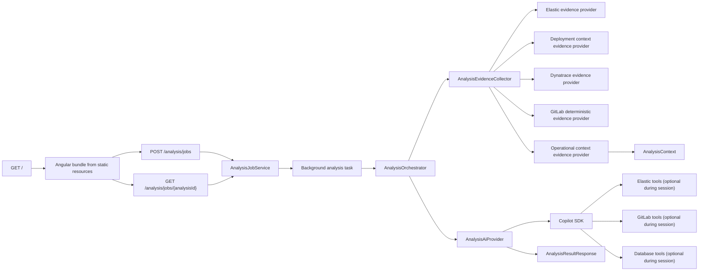

# System Overview

## Cel projektu

Projekt buduje aplikacje Spring Boot do analizy incydentow na podstawie
`correlationId`.

Docelowy flow jest nastepujacy:

1. uzytkownik wysyla zadanie analizy,
2. aplikacja zbiera evidence z systemow zewnetrznych,
3. AI interpretuje evidence,
4. AI moze dociagac dodatkowy kod z GitLaba i opcjonalnie zweryfikowac
   hipotezy danych przez Database tools,
5. aplikacja zwraca diagnoze i rekomendowany kolejny krok lub kierunek poprawki.

## Aktualny stan

Na dzisiaj projekt ma:

- zrodlowa aplikacje Angular w katalogu `frontend/`, ktora po buildzie
  produkcyjnym zapisuje bundle do `src/main/resources/static`,
- ekran `GET /` serwowany przez Spring Boot z mozliwoscia importu i eksportu
  zapisu zakonczonej analizy jako JSON,
- w ekranie `GET /` widok promptu przygotowanego dla AI, mozliwy do skopiowania
  nawet wtedy, gdy sesja Copilota zakonczy sie bledem,
- w ekranie `GET /` ostatni krok AI pokazuje tez pliki GitLaba dociagniete przez
  tools w trakcie sesji Copilota i odswieza je wraz z pollingiem joba,
- ekran `GET /evidence` do recznego testowania helper endpointow Elastica i
  GitLaba,
- glowne API `POST /analysis`,
- job-based API dla UI: `POST /analysis/jobs` i `GET /analysis/jobs/{analysisId}`,
- AI-first flow oparty o `AnalysisEvidenceProvider` i `AnalysisAiProvider`,
- przygotowany bridge pomiedzy Spring tools a GitHub Copilot Java SDK,
- MCP tools dla Elastica, GitLaba i warunkowo dla Database,
- pierwszy realny adapter REST do Elasticsearch/Kibana proxy,
- pierwszy realny adapter REST do Dynatrace Managed,
- pierwszy realny adapter REST do GitLaba,
- osobny endpoint do testowego wyszukiwania logow z Elastica po `correlationId`,
- osobny endpoint do testowego mapowania hintow komponentu na repozytoria i
  kandydatow plikow w GitLabie,
- osobny endpoint do rozwiazywania pliku z GitLaba po symbolu klasy/interfejsu.

## Glowne entrypointy HTTP

- `GET /`
  Angularowy ekran operacyjny do uruchamiania analizy z pola `correlationId`.
- `GET /evidence`
  Angularowy ekran pomocniczy do recznego testowania helper endpointow
  Elastica i GitLaba oraz podgladu odpowiedzi JSON.
- `POST /analysis/jobs`
  Asynchroniczny start analizy wykorzystywany przez UI Angular.
- `GET /analysis/jobs/{analysisId}`
  Odczyt statusu, evidence i wyniku asynchronicznej analizy.
- `POST /analysis`
  GLOWNY endpoint analizy incydentu.
- `POST /api/gitlab/source/resolve`
  Narzedzie pomocnicze do znalezienia pliku po symbolu.
- `POST /api/gitlab/source/resolve/preview`
  Wersja do recznego testowania, zwracajaca skrocona tresc pliku.
- `POST /api/gitlab/repository/search`
  Narzedzie pomocnicze do recznego testowania mapowania `component -> repo` i
  opcjonalnego wyszukiwania kandydatow plikow.
- `POST /api/elasticsearch/logs/search`
  Narzedzie pomocnicze do wyszukiwania logow z Kibana proxy po `correlationId`.
  To jest jedyny endpoint testowy Elastica. Nie ma juz wariantu `preview`.

## Glowny podzial pakietow

- `pl.mkn.incidenttracker.analysis`
  Wspolne DTO, wynik i wyjatki analizy.
- `pl.mkn.incidenttracker.analysis.flow`
  Orkiestracja runtime analizy i listenery postepu flow.
- `pl.mkn.incidenttracker.analysis.sync`
  Synchroniczny feature `POST /analysis`.
- `pl.mkn.incidenttracker.analysis.job`
  Asynchroniczny feature `POST /analysis/jobs` i `GET /analysis/jobs/{analysisId}`.
- `pl.mkn.incidenttracker.analysis.evidence`
  Deterministyczne zbieranie evidence przez providery i jawny opis krokow
  pipeline, z rownoleglym fan-outem Dynatrace + GitLab po deployment context.
- `pl.mkn.incidenttracker.analysis.evidence.provider.deployment`
  Wyprowadzanie deployment context z logs jako osobny krok przed Dynatrace i GitLabem.
- `pl.mkn.incidenttracker.analysis.ai`
  Generyczny kontrakt AI i model evidence przekazywany do AI.
- `pl.mkn.incidenttracker.analysis.evidence.provider.operationalcontext`
  Enrichment katalogiem operacyjnym: sygnaly incydentu, matcher i mapper evidence.
- `pl.mkn.incidenttracker.analysis.adapter.operationalcontext`
  Query-based adapter curated operational context catalog i filtrowania go do
  reuse'u przez evidence i kolejne capability.
- `pl.mkn.incidenttracker.analysis.ai.copilot.preparation`
  Budowanie konfiguracji, promptu, skilli i requestu do Copilot SDK.
- `pl.mkn.incidenttracker.analysis.ai.copilot.execution`
  Uruchamianie klienta Copilota, sesji i logowanie eventow runtime.
- `pl.mkn.incidenttracker.analysis.ai.copilot.tools`
  Most pomiedzy Spring tool callbacks a tool definitions Copilot SDK.
- `pl.mkn.incidenttracker.analysis.adapter.elasticsearch`
  Properties, porty, adapter REST, modele logow oraz endpoint testowy dla
  Elasticsearch/Kibana.
- `pl.mkn.incidenttracker.analysis.mcp.elasticsearch`
  MCP tools Elastica.
- `pl.mkn.incidenttracker.analysis.adapter.database`
  Routing polaczen, metadata Oracle, readonly query execution i SQL guard DB
  capability.
- `pl.mkn.incidenttracker.analysis.mcp.database`
  Session-bound MCP tools diagnostyki danych.
- `pl.mkn.incidenttracker.analysis.adapter.dynatrace`
  Modele i adapter REST dla runtime signals Dynatrace
  (`entities`, `problems`, `metrics`).
- `pl.mkn.incidenttracker.analysis.evidence.provider.dynatrace`
  Krok pipeline publikujacy runtime signals Dynatrace jako evidence.
- `pl.mkn.incidenttracker.analysis.adapter.gitlab`
  Konfiguracja, porty, adapter REST oraz pomocnicze endpointy testowe GitLaba.
- `pl.mkn.incidenttracker.analysis.evidence.provider.gitlabdeterministic`
  Deterministic mapowanie logs i deployment context na code evidence z GitLaba.
- `pl.mkn.incidenttracker.analysis.mcp.gitlab`
  MCP tools GitLaba.
- `pl.mkn.incidenttracker.analysis.adapter.gitlab.source`
  Osobny use case rozwiazywania pliku po symbolu.
- `pl.mkn.incidenttracker.api`
  Obsluga bledow API i wspolny kontrakt walidacji.
- `frontend/`
  Workspace Angular z komponentami, serwisami i konfiguracja buildu UI.
- `src/main/resources/static`
  Wygenerowany produkcyjny bundle Angulara serwowany przez Spring Boot.

## Aktualny model runtime

- Elasticsearch dziala przez rzeczywisty adapter REST do Kibana proxy.
- Dynatrace dziala przez rzeczywisty adapter REST.
- Dynatrace nie jest wystawiany jako MCP tool dla AI.
- Dynatrace sluzy tylko do inicjalnego wzbogacenia promptu
  o runtime signals skorelowane z logami Elastica i deployment context.
- GitLab w runtime dziala przez rzeczywisty adapter REST.
- Deployment context jest osobnym krokiem evidence i jest reuse'owany przez
  Dynatrace, GitLab deterministic provider i warstwe orchestration.
- Dynatrace i GitLab deterministic startuja po deployment context z tego samego
  snapshotu `AnalysisContext`, ale ich wyniki sa nadal dolaczane do evidence w
  stalej kolejnosci pipeline.
- GitLab deterministic provider i GitLab MCP tools sa wydzielone do osobnych
  pakietow, ale reuse'uja ten sam adapter GitLaba.
- Database diagnostics sa osobna, opcjonalna capability AI-guided i nie sa
  evidence providerem.
- Operational context jest osobnym enrichment stepem nad juz zebranym evidence.
- Bazowy curated operational context jest ladowany przez osobny adapter, a nie
  bezposrednio przez sam provider enrichmentu.
- Flow synchroniczny i jobowy reuse'uja ta sama orchestration warstwe
  `AnalysisOrchestrator`.
- Runtime AI providerem jest GitHub Copilot SDK.
- Skill Copilota jest pakowany jako resource aplikacji i wypakowywany do
  katalogu runtime.
- Frontend Angular jest buildowany w tym samym repo i serwowany z tego samego
  JAR-a jako statyczne zasoby.

## Najwazniejszy przeplyw

## Dodatkowy use case Elasticsearch log search

To jest osobny, pomocniczy flow diagnostyczno-testowy:

1. klient podaje tylko `correlationId`,
2. serwis bierze `analysis.elasticsearch.base-url`,
   `analysis.elasticsearch.kibana-space-id`,
   `analysis.elasticsearch.index-pattern`,
   `analysis.elasticsearch.authorization-header` i limity odpowiedzi z
   `application.properties`,
3. lokalny adapter REST zawsze ignoruje bledy certyfikatu i hosta tylko dla tej
   integracji,
4. serwis wywoluje Kibana console proxy przez `POST .../api/console/proxy`,
5. adapter mapuje `_source.fields`, `kubernetes` i `container` do typowanego
   modelu logu,
6. MCP tool i endpoint przyjmuja tylko `correlationId`, a adapter sam dobiera
   odpowiedni rozmiar i limity z konfiguracji,
7. endpoint zwraca wpisy, metadata i komunikat `OK` albo czytelny blad.

## Dodatkowy use case GitLab source resolve

To jest osobny, pomocniczy flow:

1. klient podaje `gitlabBaseUrl`, `groupPath`, `projectPath`, `ref`, `symbol`,
2. serwis pobiera drzewo repozytorium z GitLaba,
3. w granicach jednego requestu cache'uje to drzewo dla tego samego
   `gitlabBaseUrl/project/ref`,
4. ranking wybiera najlepszy plik,
5. serwis pobiera raw content,
6. endpoint zwraca kandydatow i tresc pliku.

Ten endpoint nie jest centralnym krokiem glownego `/analysis`, ale ten sam
serwis jest reuse'owany przez GitLab deterministic provider.

## Dodatkowy use case GitLab repository search

To jest osobny, pomocniczy flow do recznego testowania mapowania repozytorium:

1. klient podaje `projectHints`, opcjonalnie `branch`, `operationNames` i
   `keywords`,
2. serwis bierze `analysis.gitlab.group` z konfiguracji,
3. adapter wyszukuje projekty w tej grupie i podgrupach po znormalizowanych
   hintach, np. `agreement-process -> agreement_process`,
4. jesli request zawiera `operationNames` albo `keywords`, adapter dodatkowo
   szuka kandydatow plikow,
5. endpoint zwraca rozwiazane repozytoria i opcjonalnie kandydatow plikow.

Ten endpoint nie jest czescia glownego `/analysis`, ale pomaga recznie
zweryfikowac te sama logike mapowania, z ktorej korzysta deterministic provider
i AI-guided exploration przez tools.
