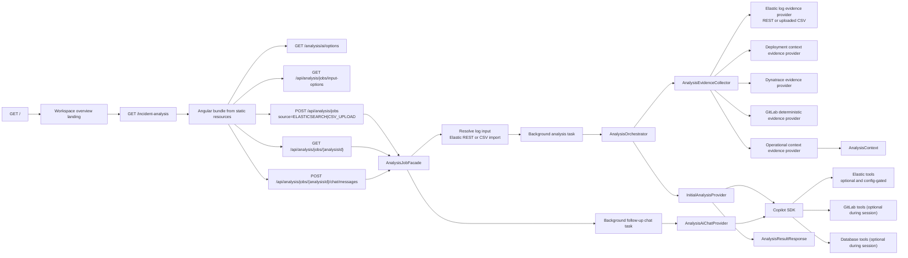

# System Overview

## Cel projektu

Projekt rozwija platforme do AI-augmented system analysis. Aplikacja ma
laczyc deterministic context gathering, curated operational context, reusable
agent tools i sesje AI, zeby pomagac operatorom, analitykom i developerom
rozumiec systemy.

Pierwszym produkcyjnym feature'em jest analiza incydentu na podstawie logow:
pobranych z Elasticsearch po `correlationId` albo zalaczonych jako CSV z
Kibana/Elastic Discover. Historyczna nazwa repo i publiczne URL-e
`/analysis/*` pochodza z pierwszego startu po `correlationId`, ale docelowo
nie ograniczaja produktu do incident trackingu.

Docelowy kierunek platformy:

1. dedykowany feature definiuje publiczny request, evidence/source gathering,
   prompt, tools policy i result contract,
2. reusable integracje zbieraja dane z systemow zewnetrznych,
3. reusable tools udostepniaja kontrolowana eksploracje kodu, logow,
   operational context i danych,
4. platforma AI uruchamia sesje z allowlista tools, hidden contextem,
   budgetami, usage i eventami runtime,
5. feature zwraca wynik zrozumialy dla operatora/analityka oraz jawne
   ograniczenia widocznosci.

Obecny incident flow jest pierwsza realizacja tego modelu:

1. operator wybiera zrodlo logow: Elasticsearch po `correlationId` albo upload
   CSV,
2. aplikacja pobiera albo waliduje i mapuje logi do wspolnej sekcji evidence,
3. aplikacja wzbogaca evidence danymi z systemow zewnetrznych,
4. AI interpretuje evidence,
5. AI moze dociagac dodatkowy kod z GitLaba i opcjonalnie zweryfikowac
   hipotezy danych przez Database tools,
6. aplikacja zwraca rozdzielony wynik: `functionalAnalysis` dla analityka
   biznesowo-systemowego oraz `technicalAnalysis` jako konkretny handoff do
   naprawy, weryfikacji albo przekazania dalej.

Planowane kolejne rodziny feature'ow to m.in. flow explorer, pytania o logike
funkcjonalna use case'ow oraz natural-language data diagnostics. Szczegolowy
kierunek produktu jest opisany w `00-product-direction.md`.

## Aktualny stan

Na dzisiaj projekt ma:

- zrodlowa aplikacje Angular w katalogu `frontend/`, ktora po buildzie
  produkcyjnym zapisuje bundle do `src/main/resources/static`,
- wspolny shell UI `Team Delivery Workspace` z lewym sidebarem, kontekstowym
  topbarem i grupami nawigacji `Analysis Features`, `Tool Workbench` oraz
  `Platform`,
- ekran `GET /` jako startowy `Platform / Team Delivery Workspace` overview,
  z szybkim wejsciem do aktywnych feature'ow i nietechnicznym opisem tego, jak
  platforma oszczedza czas w codziennej pracy,
- ekran `GET /incident-analysis` serwowany przez Spring Boot z mozliwoscia
  importu i eksportu zapisu zakonczonej analizy jako JSON,
- w ekranie `GET /incident-analysis` start analizy ma wybor zrodla logow:
  Elasticsearch po `correlationId` albo upload CSV; gdy konfiguracja
  Elasticsearch/Kibana jest niepelna, sciezka `correlationId` jest zablokowana,
  ale CSV upload pozostaje dostepny,
- w ekranie `GET /incident-analysis` widok promptu przygotowanego dla AI,
  mozliwy do skopiowania nawet wtedy, gdy sesja Copilota zakonczy sie bledem,
- w ekranie `GET /incident-analysis` ostatni krok AI pokazuje tez user-facing GitLab/DB evidence
  dociagniete przez tools w trakcie sesji Copilota i odswieza je wraz z
  pollingiem joba,
- w ekranie `GET /incident-analysis` ostatni krok AI pokazuje plaska liste
  aktywnosci Copilota i user-facing tool evidence:
  komunikaty/rozumowanie AI, usage/runtime oraz wywolania tools sa laczone w
  jeden tok wedlug zdarzen z pollingu, a kazdy wiersz ma ikone, prosty tekst,
  status i rozwijane szczegoly,
- w ekranie `GET /incident-analysis` ostatni krok AI pokazuje sumaryczne tokeny oraz
  uproszczona estymacje GitHub AI Credits i kosztu USD; tooltip tlumaczy
  nietechnicznie szczegoly z eventow Copilota i przelicznik tokenowy,
- ekrany Tool Workbench: `GET /elastic`, `GET /gitlab`, `GET /database` i
  `GET /operational-context` do recznego testowania, debugowania i zbierania
  inputu z reusable capability bez przenoszenia logiki incident analysis do
  tych widokow,
- ekran `GET /operational-context` w Tool Workbench do utrzymania katalogu
  systemow, repozytoriow, procesow, integracji, bounded contexts, zespolow,
  glossary, handoff rules, validation findings i open questions,
- ekran `GET /workspace-settings` w sekcji `Platform` do podgladu efektywnych
  wartosci z `application.properties` i zapisu lokalnych override'ow do
  `${tdw.workspace.directory}/settings.json` dla brandu UI oraz podstawowych
  parametrow Copilota, GitLaba, Elasticsearch i Dynatrace,
- glowne job-based API: `POST /api/analysis/jobs` i
  `GET /api/analysis/jobs/{analysisId}`,
  z wyborem zrodla logow oraz opcjonalnym wyborem modelu AI i
  `reasoningEffort` przy starcie joba; legacy aliasy `/analysis/**` pozostaja
  tylko dla kompatybilnosci,
- feature-owned endpoint `GET /api/analysis/jobs/input-options`, ktory mowi UI,
  czy start przez Elasticsearch po `correlationId` jest dostepny,
- follow-up chat dla zakonczonego joba przez
  `POST /api/analysis/jobs/{analysisId}/chat/messages`, ktory kontynuuje zapisana
  sesje Copilota i wysyla do niej tresc wiadomosci operatora,
- shared/operator API `/analysis/runs` dla lokalnej historii runow; snapshot
  runu jest zapisywany od startu joba i aktualizowany w trakcie pracy backendu,
  zeby UI moglo odtworzyc input i ostatni znany stan bez ponownego klikania,
- endpoint shared/operator API `GET /analysis/ai/options`, ktory zwraca
  katalog modeli i dozwolone `reasoningEffort` z GitHub Copilot SDK, zeby
  frontend nie trzymal lokalnej listy modeli,
- endpoint shared/operator API `GET /api/ui/config`, ktory zwraca runtime
  konfiguracje brandu UI z fallbackiem `Team Delivery Workspace`,
- shared/operator API `GET /api/workspace/settings` i
  `PUT /api/workspace/settings`, ktore laczy `application.properties` z
  lokalnym `settings.json`; jawny override z workspace'u ma pierwszenstwo,
- shared/operator API `GET /api/auth/github/status`,
  `GET /api/auth/github/start`, `GET /api/auth/github/callback` i
  `POST /api/auth/github/logout` dla autoryzacji Copilot SDK w trybach
  `LOCAL_TOKEN` oraz `GITHUB_APP`,
- shared/operator API `/api/operational-context/*` dla operator-facing widoku
  curated operational context,
- AI-first flow oparty o `AnalysisEvidenceProvider`, `InitialAnalysisProvider` i
  osobny `AnalysisAiChatProvider` dla kontynuacji zakonczonego joba,
- factory definicji tools dla GitHub Copilot Java SDK oparta o Spring tools,
- MCP tools dla Elastica, GitLaba i warunkowo dla Database,
- pierwszy realny adapter REST do Elasticsearch/Kibana proxy,
- pierwszy realny adapter REST do Dynatrace Managed,
- pierwszy realny adapter REST do GitLaba,
- osobny endpoint do testowego wyszukiwania logow z Elastica po `correlationId`,
- osobny endpoint do testowego mapowania hintow komponentu na repozytoria i
  kandydatow plikow w GitLabie,
- osobny endpoint do rozwiazywania pliku z GitLaba po symbolu klasy/interfejsu.

## Glowne entrypointy HTTP

- `GET /`
  Angularowy ekran `Platform / Team Delivery Workspace` jako overview
  platformy, szybkie wejscie do aktywnych feature'ow i customer-centric opis
  automatyzacji pracy bez eksponowania mechaniki AI/tools.
- `GET /incident-analysis`
  Angularowy ekran `Analysis Features / Incident Analysis` do uruchamiania
  analizy z logow pobranych po `correlationId` albo z zalaczonego CSV.
- `GET /elastic`
  Angularowy ekran `Tool Workbench / Elastic Logs` do recznego testowania
  helper endpointow Elastica oraz podgladu request/response JSON.
- `GET /gitlab`
  Angularowy ekran `Tool Workbench / GitLab Source` do recznego testowania
  helper endpointow GitLaba oraz podgladu request/response JSON. Legacy route
  `GET /evidence`
  przekierowuje w Angularze do `/elastic`.
- `GET /database`
  Angularowy ekran `Tool Workbench / Database Tools` do recznego testowania
  Database tools przez shared/operator endpointy `/api/database/*`.
- `GET /operational-context`
  Angularowy ekran `Tool Workbench / Operational Context` dla curated
  operational context: katalogu systemow, repozytoriow, code-search scopes,
  procesow, integracji, bounded contexts, zespolow, glossary, handoff rules,
  validation findings i open questions.
- `GET /workspace-settings`
  Angularowy ekran `Platform / Workspace Settings` do lokalnej customizacji
  workspace'u. Ekran pokazuje efektywne wartosci z `application.properties`
  oraz zrodlo kazdego pola; zapis trafia do
  `${tdw.workspace.directory}/settings.json`. Aktualny zakres obejmuje
  `app.ui.title`, lokalny token Copilota
  (`analysis.ai.copilot.auth.local.github-token`), podstawowe connection
  settings GitLaba, Elasticsearch i Dynatrace oraz sekrety tych integracji.
- `GET /api/analysis/jobs/input-options`
  Feature-owned endpoint dla UI startu analizy. Zwraca dostepne zrodla logow i
  powod blokady Elasticsearch, jezeli brakuje wymaganej konfiguracji
  Elasticsearch/Kibana.
- `POST /api/analysis/jobs`
  Asynchroniczny start analizy wykorzystywany przez UI Angular. Request jest
  multipart/form-data i niesie `source`, opcjonalne preferencje wykonania AI
  (`model`, `reasoningEffort`) oraz:
  `correlationId` dla `source=ELASTICSEARCH` albo `logFile` dla
  `source=CSV_UPLOAD`.
- `GET /api/analysis/jobs/{analysisId}`
  Odczyt statusu, evidence, wyniku asynchronicznej analizy i historii
  follow-up chatu.
- `POST /api/analysis/jobs/{analysisId}/chat/messages`
  Asynchroniczne polecenie lub pytanie do AI po zakonczonej analizie. Backend
  reuse'uje evidence, wynik, historie rozmowy, model/reasoning oraz hidden
  scope tools z oryginalnego joba.
- `GET /analysis/runs`
  Shared/operator API lokalnej historii runow z lekkiego `index.json`. Lista
  niesie status ostatniego snapshotu i nie laduje pelnych `run.json`.
- `GET /analysis/runs/{analysisId}`
  Odczyt pelnego lokalnego `run.json`, uzywany przez ekran historii do
  odtworzenia formularza i ostatniego znanego stanu runu.
- `GET /analysis/ai/options`
  Shared/operator API z katalogiem modeli AI dla UI. Backend pobiera go z
  Copilot SDK i zwraca `reasoningEffort` tylko dla modeli, ktore SDK opisuje
  jako wspierajace te ustawienia. Endpoint nie jest krokiem incident job flow.
- `GET /api/ui/config`
  Shared/operator API konfiguracji brandu UI. Gdy `app.ui.title` nie ma
  tekstu, frontend pokazuje tylko `Team Delivery Workspace`; gdy property jest
  ustawione, wartosc property jest tytulem, a `Team Delivery Workspace`
  podtytulem.
- `GET /api/workspace/settings`
  Shared/operator API odczytu efektywnych ustawien workspace'u, wartosci bazowej
  z `application.properties`, lokalnego override'u i zrodla pola.
- `PUT /api/workspace/settings`
  Shared/operator API zapisu lokalnych override'ow do `settings.json`. Pusta
  wartosc albo wartosc identyczna z `application.properties` usuwa override.
  Endpoint nie wystawia flag SSL ani limitow odpowiedzi integracji.
- `GET /api/auth/github/status`
  Shared/operator API statusu autoryzacji Copilota. W `LOCAL_TOKEN` pokazuje
  lokalny token jako backendowy tryb dev, a w `GITHUB_APP` tworzy backendowa
  operator session cookie i raportuje, czy konto GitHub jest polaczone.
- `GET /api/auth/github/start`
  Start GitHub App OAuth web flow. Akceptuje tylko lokalny `returnUrl`, tworzy
  jednorazowy `state` powiazany z operator session i redirectuje do GitHuba.
- `GET /api/auth/github/callback`
  Callback OAuth: wymienia code na GitHub App user access token, pobiera profil
  i zapisuje zaszyfrowane tokeny po stronie backendu.
- `POST /api/auth/github/logout`
  Odlacza autoryzacje GitHub App dla biezacej operator session.
- `POST /api/gitlab/source/resolve`
  Narzedzie pomocnicze do znalezienia pliku po symbolu.
- `POST /api/gitlab/source/resolve/preview`
  Wersja do recznego testowania, zwracajaca skrocona tresc pliku.
- `POST /api/gitlab/repository/search`
  Narzedzie pomocnicze do recznego testowania mapowania `component -> repo` i
  opcjonalnego wyszukiwania kandydatow plikow.
- `POST /api/gitlab/repository/endpoints`
  Narzedzie pomocnicze do recznego testowania inventory endpointow REST w
  konkretnym repozytorium GitLaba.
- `POST /api/elasticsearch/logs/search`
  Narzedzie pomocnicze do wyszukiwania logow z Kibana proxy po `correlationId`.
  To jest jedyny endpoint testowy Elastica. Nie ma juz wariantu `preview`.
- `POST /api/database/*`
  Narzedzia pomocnicze do recznego testowania capability udostepnianych przez
  `DatabaseToolService`: scope, discovery tabel/kolumn, opis tabel, typed
  count/sample/group, relacje, joiny, porownanie mappingu i opcjonalny
  readonly SQL. Publiczny job flow nadal nie przyjmuje recznego scope DB.
- `GET /api/operational-context/*`
  Shared/operator API dla katalogu operational context: summary, listy encji,
  search, szczegoly encji, validation i open questions. To jest fasada nad
  `integrations.operationalcontext`, a nie incident job flow.

## Glowny podzial pakietow

Szczegolowy diagram runtime/data-flow i compile-time importow jest w
`05-package-dependencies.md`.

- `pl.mkn.tdw`
  Glowna aplikacja Spring Boot.
- `pl.mkn.tdw.agenttools`
  Reusable tools/capability uzywane przez MCP wrappers i platforme AI, np.
  hidden tool context keys, nazwy tools oraz przenoszone wrappery MCP nad
  integracjami. Adaptery nie powinny importowac `agenttools`.
- `pl.mkn.tdw.common`
  Male helpery wspolne dla calej aplikacji, np. `JsonPayloadReader`.
- `pl.mkn.tdw.features.incidentanalysis.flow`
  Orkiestracja runtime analizy incydentu, response i listenery postepu flow.
- `pl.mkn.tdw.features.incidentanalysis.job`
  Asynchroniczny feature `POST /api/analysis/jobs`,
  `GET /api/analysis/jobs/{analysisId}` i
  `POST /api/analysis/jobs/{analysisId}/chat/messages`.
- `pl.mkn.tdw.features.incidentanalysis.job.api`
  Kontroler job API oraz request/response DTO dla UI.
- `pl.mkn.tdw.features.incidentanalysis.job.state`
  In-memory projekcja joba: statusy, kroki, chat messages, snapshot i listener
  mapujacy zdarzenia orkiestratora na stan joba.
- `pl.mkn.tdw.features.incidentanalysis.job.error`
  Wyjatki job API mapowane przez globalny handler bledow.
- `pl.mkn.tdw.api.aioptions`
  Shared/operator API dla katalogu modeli i endpointu
  `GET /analysis/ai/options`. Implementacja endpointu mapuje platformowy
  katalog modeli Copilota na obecne DTO aplikacji.
- `pl.mkn.tdw.api.uiconfig`
  Shared/operator API runtime konfiguracji brandu UI dla Angulara. Nie jest
  czescia incident job flow.
- `pl.mkn.tdw.api.workspacesettings`
  Shared/operator API lokalnych ustawien workspace'u. Pakiet laczy
  `application.properties` z `localworkspace.settings`, pokazuje zrodlo
  wartosci dla UI i aplikuje efektywne override'y do runtime properties
  uzywanych przez brand UI, lokalny token Copilota oraz integracje GitLaba,
  Elasticsearch i Dynatrace.
- `pl.mkn.tdw.api.githubauth`
  Shared/operator API autoryzacji GitHub dla UI oraz backendowa operator
  session cookie. Ten pakiet zna request HTTP, ale nie przechowuje tokenow w
  frontendzie ani publicznych requestach joba.
- `pl.mkn.tdw.features.incidentanalysis.evidence`
  Deterministyczne zbieranie evidence przez providery i jawny opis krokow
  pipeline, z rownoleglym fan-outem Dynatrace + GitLab po deployment context.
- `pl.mkn.tdw.features.incidentanalysis.evidence.provider.deployment`
  Wyprowadzanie deployment context z logs jako osobny krok przed Dynatrace i GitLabem.
- `pl.mkn.tdw.features.incidentanalysis.ai.initial`
  Poczatkowa analiza incydentu: provider, request, preparation i JSON-only
  response z rozdzielonym `functionalAnalysis` oraz `technicalAnalysis`.
- `pl.mkn.tdw.features.incidentanalysis.ai.chat`
  Follow-up chat po zakonczonej analizie incydentu.
- `pl.mkn.tdw.shared.ai`
  Neutralne preferencje wykonania AI, non-secret `AnalysisAiAuthRef` oraz
  kontrakty token/cost/usage i visible activity trace dla flow, job UI i
  feature'ow.
- `pl.mkn.tdw.shared.evidence`
  Neutralny model evidence przekazywany miedzy evidence pipeline, flow, job UI
  i AI: `AnalysisEvidenceSection`, `AnalysisEvidenceItem`,
  `AnalysisEvidenceAttribute`; zawiera tez neutralny listener aktualizacji tool
  evidence przekazywany miedzy providerem AI, jobem i feature'em.
- `pl.mkn.tdw.features.incidentanalysis.evidence.provider.operationalcontext`
  Enrichment katalogiem operacyjnym: sygnaly incydentu, matcher i mapper evidence.
- `pl.mkn.tdw.integrations.operationalcontext`
  Query-based adapter curated operational context catalog i filtrowania go do
  reuse'u przez evidence i kolejne capability.
- `pl.mkn.tdw.features.incidentanalysis.ai.copilot`
  Incidentowe initial/chat providery oraz budowanie promptu, artifact digestu,
  skill selection, tool policy, response parser i initial/follow-up run assembly.
  Ten pakiet sklada parametry dla platformowego runtime Copilota.
- `pl.mkn.tdw.aiplatform.copilot.runtime`
  Neutralne elementy runtime SDK: properties, model listing, client options,
  `SessionConfig`, `MessageOptions` i prepared session bez znajomosci incident
  promptu ani incident policy.
- `pl.mkn.tdw.aiplatform.copilot.runtime.auth`
  Platformowe rozstrzyganie tokena Copilot tuz przed zbudowaniem
  `CopilotClientOptions`. Runtime zawsze przekazuje `githubToken` jawnie i
  ustawia `useLoggedInUser=false`.
- `pl.mkn.tdw.aiplatform.copilot.runtime.options`
  Platformowy provider katalogu modeli Copilota i neutralne DTO opcji modeli.
  `api.aioptions` jest fasada mapujaca ten katalog na endpoint
  `GET /analysis/ai/options`.
- `pl.mkn.tdw.aiplatform.copilot.runtime.execution`
  Uruchamianie klienta Copilota, sesji, lifecycle logging oraz
  `CopilotExecutionResult` z trescia odpowiedzi i user-visible
  `AnalysisAiUsage`; session events SDK sa mapowane na neutralny
  `AnalysisAiActivityEvent`, bez wystawiania typow SDK do UI.
- `pl.mkn.tdw.aiplatform.copilot.tools.context`
  Budowanie hidden `ToolContext` i session-bound scope dla Spring tools jako
  neutralna mechanika platformy.
- `pl.mkn.tdw.aiplatform.copilot.tools`
  `CopilotToolInvocationHandler`, czyli neutralna granica wykonania Spring
  `ToolCallback`: policies, hidden context, eventy invocation, kontrolowany
  rejection i parsing wyniku dla SDK.
- `pl.mkn.tdw.aiplatform.copilot.tools.events`
  Wewnetrzne eventy tool invocation: `Started` oraz terminalny `Finished` z
  outcome `COMPLETED`, `REJECTED` albo `FAILED`.
- `pl.mkn.tdw.aiplatform.copilot.tools.policy`
  Neutralne kontrakty policy invocation, kontrolowany rejection oraz session
  validation.
- `pl.mkn.tdw.aiplatform.copilot.tools.policy.budget`
  Platformowa budget policy, state, registry, properties oraz neutralny
  kontrakt decyzji.
- `pl.mkn.tdw.aiplatform.copilot.tools.logging`
  Subskrypcja eventow invocation do operacyjnego logowania request/result.
- `pl.mkn.tdw.aiplatform.copilot.tools.description`
  Neutralny kontrakt customizacji opisow tools, wykonywany przez runtime
  factory bez wiedzy o semantyce konkretnego feature'a.
- `pl.mkn.tdw.aiplatform.copilot.tools.CopilotSdkToolFactory`
  Platformowa rejestracja Spring tools jako definicji Copilota.
- `pl.mkn.tdw.aiplatform.copilot.tools.evidence`
  Session-bound store publikujacy neutralne `AnalysisEvidenceSection` z wynikow
  tool invocation przez sink przekazany przez feature.
- `pl.mkn.tdw.features.incidentanalysis.ai.copilot.tools`
  Incident-specific subskrypcje eventow GitLab/Database tools i mapowanie
  wynikow do user-facing evidence.
- `pl.mkn.tdw.features.incidentanalysis.ai.copilot.tools.description`
  Incident-specific guidance doklejane do opisow GitLab/Database tools dla
  Copilota.
- `pl.mkn.tdw.integrations.elasticsearch`
  Properties, porty, adapter REST, modele logow oraz service search dla
  Elasticsearch/Kibana.
- `pl.mkn.tdw.api.elasticsearch`
  Shared/operator endpoint testowy `POST /api/elasticsearch/logs/search`
  delegujacy do integracji Elasticsearch.
- `pl.mkn.tdw.agenttools.elasticsearch.mcp`
  MCP tools Elastica delegujace do `integrations.elasticsearch`.
- `pl.mkn.tdw.integrations.database`
  Routing polaczen, metadata Oracle, readonly query execution i SQL guard DB
  capability.
- `pl.mkn.tdw.agenttools.database.mcp`
  Session-bound MCP tools diagnostyki danych delegujace do
  `pl.mkn.tdw.integrations.database`. Kontrakty
  request/result/scope i operatory DB mieszkaja przy integracji DB.
- `pl.mkn.tdw.integrations.dynatrace`
  Modele i adapter REST dla runtime signals Dynatrace
  (`entities`, `problems`, `metrics`).
- `pl.mkn.tdw.features.incidentanalysis.evidence.provider.dynatrace`
  Krok pipeline publikujacy runtime signals Dynatrace jako evidence.
- `pl.mkn.tdw.integrations.gitlab`
  Konfiguracja, porty, adapter REST oraz modele/search service GitLaba.
- `pl.mkn.tdw.integrations.github.auth`
  Integracja GitHub App OAuth: properties, klient exchange/refresh, profil
  uzytkownika, state store, zaszyfrowany authorization store i AES-GCM cipher.
- `pl.mkn.tdw.api.gitlab`
  Shared/operator endpoint repository search GitLaba delegujacy do integracji.
- `pl.mkn.tdw.api.gitlab.source`
  Shared/operator endpointy source resolve GitLaba:
  `POST /api/gitlab/source/resolve` i wariant preview.
- `pl.mkn.tdw.api.database`
  Shared/operator endpointy testowe nad `integrations.database.DatabaseToolService`.
  Controller buduje manualny `DbCapabilityScope` z operatorskiego
  `environment` i deleguje do typed DB capability.
- `pl.mkn.tdw.api.operationalcontext`
  Shared/operator endpointy i view service dla katalogu operational context.
  Pakiet mapuje reusable `integrations.operationalcontext` na DTO dla UI
  `/operational-context`, bez importowania incident flow.
- `pl.mkn.tdw.features.incidentanalysis.evidence.provider.gitlabdeterministic`
  Deterministic mapowanie logs i deployment context na code evidence z GitLaba.
- `pl.mkn.tdw.agenttools.gitlab.mcp`
  MCP tools GitLaba delegujace do `integrations.gitlab`.
- `pl.mkn.tdw.integrations.gitlab.source`
  Osobny use case rozwiazywania pliku po symbolu.
- `pl.mkn.tdw.api`
  Obsluga bledow API, wspolny kontrakt walidacji i shared/operator API dla
  endpointow FE niezaleznych od jednego feature'a, np. fasady nad platforma
  albo integracjami. Endpointy konkretnego use case'u zostaja przy
  `features.<feature>.api`.
- `pl.mkn.tdw.ui`
  Cienki routing Spring MVC dla route'ow Angulara, np. `/elastic`, `/gitlab`
  i `/operational-context`.
- Zamkniety root `pl.mkn.tdw.analysis`
  Produkcyjny i testowy root `analysis.*` jest zamkniety. Publiczne URL-e
  moga nadal zawierac slowo `analysis`, ale nowe klasy Javy trafiaja do
  aktualnych wlascicieli: `features`, `api`, `integrations`, `agenttools`,
  `aiplatform`, `shared`, `common` albo `ui`.
- `frontend/`
  Workspace Angular z komponentami, serwisami i konfiguracja buildu UI.
- `src/main/resources/static`
  Wygenerowany produkcyjny bundle Angulara serwowany przez Spring Boot.

## Aktualny model UI

UI jest product-facing workspace'em `Team Delivery Workspace`, a nie juz
nawigacja wokol nazwy repo albo jednego feature'a. Widoczny tytul workspace'u
pochodzi z `GET /api/ui/config`: jezeli `app.ui.title` nie jest ustawione, UI
pokazuje tylko `Team Delivery Workspace`; jezeli jest ustawione, property jest
glownym tytulem, a `Team Delivery Workspace` podtytulem.
Workspace Settings moze nadpisac `app.ui.title` lokalnie w `settings.json`; po
zapisie `GET /api/ui/config` zwraca juz efektywna wartosc z workspace'u.

Shell Angulara ma:

- lewy sidebar jako glowna nawigacje,
- zwijany rail ikonowy o stalej szerokosci dla pracy na szerszym ekranie,
- kontekstowy topbar z breadcrumbem i tytulem aktualnego widoku,
- ikone info w topbarze dla skompresowanego `capabilityInfo` ekranow
  Workbench,
- jasny motyw oparty o tokeny CSS i przygotowany do przyszlych wariantow.

Znaczenie grup UI:

- `Analysis Features` - pionowe feature'y produktowe. `Incident Analysis` jest
  pierwszym dostepnym feature'em; Flow Explorer, Functional Logic i Data
  Diagnostics sa placeholders dla przyszlych feature'ow.
- `Tool Workbench` - zaplecze operatorskie reusable capability. Elastic,
  GitLab, Database i Operational Context sa analysis-independent i nie
  eksponuja incidentowego `analysisRunId`; DB/GitLab scope dla AI pozostaje
  feature-owned hidden `ToolContext`.
- `Platform` - overview i konfiguracja samego Team Delivery Workspace:
  workspace settings, personalizacja, autentykacja i modele AI. V1 pokazuje
  ustawieniowe pozycje jako disabled placeholders, dopoki nie powstana ich
  dedykowane widoki.

## Aktualny model runtime

- Elasticsearch dziala przez rzeczywisty adapter REST do Kibana proxy.
- Elastic log evidence provider ma dwa wejscia: REST search po `correlationId`
  albo wczesniej sparsowane wpisy z uploadu CSV. W obu przypadkach publikuje
  te sama sekcje `elasticsearch/logs`, zeby deployment context, Dynatrace,
  GitLab deterministic, operational context i AI prompt nie rozgalezialy sie po
  zrodle logow.
- Dynatrace dziala przez rzeczywisty adapter REST.
- Dynatrace nie jest wystawiany jako MCP tool dla AI.
- Dynatrace sluzy tylko do inicjalnego wzbogacenia promptu
  o runtime signals skorelowane z logami Elastica i deployment context.
- GitLab w runtime dziala przez rzeczywisty adapter REST.
- Deployment context jest osobnym krokiem evidence i jest reuse'owany przez
  Dynatrace, GitLab deterministic provider i warstwe orchestration.
- Dynatrace i GitLab deterministic startuja po deployment context z tego samego
  snapshotu `AnalysisContext`, ale ich wyniki sa nadal dolaczane do evidence w
  stalej kolejnosci pipeline.
- GitLab deterministic provider i GitLab MCP tools sa wydzielone do osobnych
  pakietow; MCP tools mieszkaja w `agenttools.gitlab.mcp` i reuse'uja ten sam
  adapter GitLaba.
- GitLab MCP tools potrafia nie tylko szukac kandydatow repo i flow contextu,
  ale tez znajdowac referencje/importy dla ugruntowanej klasy, zeby lepiej
  naprowadzac DB diagnostics.
- Database diagnostics sa osobna, opcjonalna capability AI-guided i nie sa
  evidence providerem.
- Operational context jest osobnym enrichment stepem nad juz zebranym evidence.
- Bazowy curated operational context jest ladowany przez osobny adapter, a nie
  bezposrednio przez sam provider enrichmentu.
- Operational context publikuje dla dopasowanego systemu jawny code search
  scope: repozytoria/projekty, pakiety i class hints, zeby Copilot traktowal
  repo glowne, biblioteki i shared modules jako wspolny scope kodu tego
  systemu.
- Job flow reuse'uje orchestration warstwe `AnalysisOrchestrator`.
- Job flow moze przekazac do generycznego requestu AI opcjonalny wybor
  modelu i `reasoningEffort`; nie zmienia to evidence scope'u, branchy,
  srodowiska ani GitLab group.
- Follow-up chat jest kontynuacja zakonczonego joba, a nie nowym publicznym
  requestem analizy. Initial analysis tworzy sesje AI, a follow-up wznawia ja
  po zapisanym `copilotSessionId`, przekazuje jako prompt tylko tresc
  wiadomosci operatora oraz ponownie podpina session-bound tools w zakresie
  rozwiazanym przez pierwotna analize.
- Lista modeli i dostepnych `reasoningEffort` dla UI pochodzi z platformowego
  provider'a opcji Copilota przez backendowy shared/operator endpoint opcji AI.
  Frontend nie jest source of truth dla mozliwosci modeli.
- Runtime AI providerem jest GitHub Copilot SDK.
- Elasticsearch tools dla Copilota sa wystawiane tylko wtedy, gdy efektywna
  konfiguracja Elasticsearch/Kibana jest kompletna. Brak tej konfiguracji
  blokuje tools `elastic_*` w initial analysis i follow-up chat niezaleznie od
  coverage gaps.
- Zuzycie tokenow jest zbierane z eventow sesji Copilota i wystawiane do UI
  jako generyczne `shared.ai.AnalysisAiUsage`, bez typow SDK w kontrakcie
  frontendu.
  Frontend liczy orientacyjne GitHub AI Credits/USD z tokenow i modelu jako
  product-facing estymacje oplacalnosci, nie jako fakture.
- Aktywnosc sesji Copilota jest productized i widoczna w job state jako
  generyczne `shared.ai.AnalysisAiActivityEvent`: turny, komunikaty,
  wywolania tooli, snapshoty context tokens/messages i usage eventy. Frontend
  merge'uje te eventy z `toolEvidenceSections` w jeden timeline analizy.
- Skill Copilota jest pakowany jako resource aplikacji i wypakowywany do
  katalogu runtime.
- Frontend Angular jest buildowany w tym samym repo i serwowany z tego samego
  JAR-a jako statyczne zasoby.

## Najwazniejszy przeplyw

## Dodatkowy use case Elasticsearch log search

To jest osobny, pomocniczy flow diagnostyczno-testowy:

1. klient podaje tylko `correlationId`,
2. serwis bierze `analysis.elasticsearch.base-url`,
   `analysis.elasticsearch.kibana-space-id`,
   `analysis.elasticsearch.index-pattern`,
   `analysis.elasticsearch.authorization-header` i limity odpowiedzi z
   `application.properties`,
3. lokalny adapter REST zawsze ignoruje bledy certyfikatu i hosta tylko dla tej
   integracji,
4. serwis wywoluje Kibana console proxy przez `POST .../api/console/proxy`,
5. adapter mapuje `_source.fields`, `kubernetes` i `container` do typowanego
   modelu logu,
6. MCP tool i endpoint przyjmuja tylko `correlationId`, a adapter sam dobiera
   odpowiedni rozmiar i limity z konfiguracji,
7. endpoint zwraca wpisy, metadata i komunikat `OK` albo czytelny blad.

Ten helper nie jest wymagany dla uploadu CSV. Upload CSV jest alternatywnym
wejsciem do incident analysis i po walidacji zasila ten sam model logow, z
ktorego korzysta `elasticsearch/logs`.

## Dodatkowy use case GitLab source resolve

To jest osobny, pomocniczy flow:

1. klient podaje `gitlabBaseUrl`, `groupPath`, `projectPath`, `ref`, `symbol`,
2. serwis pobiera drzewo repozytorium z GitLaba,
3. w granicach jednego requestu cache'uje to drzewo dla tego samego
   `gitlabBaseUrl/project/ref`,
4. ranking wybiera najlepszy plik,
5. serwis pobiera raw content,
6. endpoint zwraca kandydatow i tresc pliku.

Ten endpoint nie jest centralnym krokiem job flow analizy, ale ten sam serwis
jest reuse'owany przez GitLab deterministic provider.

## Dodatkowy use case GitLab repository search

To jest osobny, pomocniczy flow do recznego testowania mapowania repozytorium:

1. klient podaje `projectHints`, opcjonalnie `branch`, `operationNames` i
   `keywords`,
2. serwis bierze `analysis.gitlab.group` z konfiguracji,
3. adapter wyszukuje projekty w tej grupie i podgrupach po znormalizowanych
   hintach, np. `crm-service -> crm_service`,
4. jesli request zawiera `operationNames` albo `keywords`, adapter dodatkowo
   szuka kandydatow plikow,
5. endpoint zwraca rozwiazane repozytoria i opcjonalnie kandydatow plikow.

Ten endpoint nie jest czescia glownego job flow analizy, ale pomaga recznie
zweryfikowac te sama logike mapowania, z ktorej korzysta deterministic
provider i AI-guided exploration przez tools.

## Dodatkowy use case GitLab endpoint inventory

To jest osobny, pomocniczy flow do recznego testowania listowania endpointow
REST udostepnianych przez konkretne repozytorium:

1. klient podaje `group`, `projectName`, `branch` oraz opcjonalne filtry
   `endpointPathPrefix`, `httpMethod` i `maxScannedFiles`,
2. backend deleguje do `integrations.gitlab.GitLabRepositoryEndpointService`,
3. serwis uzywa wspolnego GitLab repository tree/cache od root repozytorium i
   sam wybiera produkcyjne source rooty w ukladzie multi-module,
4. parser best-effort znajduje Spring MVC/REST controller mappings,
5. endpoint zwraca liste endpointow, klasy/metody handlerow, pliki, linie,
   request/response types, confidence, limitations i suggested next reads.

Ten endpoint nie jest czescia glownego job flow analizy. Sluzy operatorowi do
manualnej weryfikacji tej samej capability, ktora jest wystawiona AI jako
`gitlab_list_repository_endpoints`.

## Dodatkowy use case Database workbench console

To jest osobny, pomocniczy flow diagnostyczno-testowy:

1. klient podaje operatorski `environment` jako neutralny scope integracji,
2. endpoint `/api/database/*` buduje techniczny scope workbench bez
   przyjmowania `correlationId`, `analysisRunId` ani incident/session scope'u,
3. request operacji jest przekazywany bezposrednio do `DatabaseToolService`,
4. integracja DB nadal egzekwuje configured environment, allowliste schematow,
   typed filters, masking/limiting i blokade raw SQL,
5. frontend `/database` pokazuje payload requestu, status HTTP i odpowiedz JSON.

Ten endpoint jest analysis-independent i nie zmienia glownego job flow analizy.
Incidentowy scope DB dla AI pozostaje feature-owned i jest przekazywany przez
hidden `ToolContext`, nie przez Workbench API.

Layout Workbench jest celowo dwustrefowy: lewy panel zawiera wspolny scope i
liste elementow do testu, a glowna przestrzen pokazuje formularz wybranego
elementu oraz wynik pod formularzem dopiero po wykonaniu requestu. Nie uzywamy
stalego trzykolumnowego ukladu dla response, bo wyniki JSON potrafia byc
szerokie i zlozone. `Request preview` jest zwijalny i po otrzymaniu odpowiedzi
domyslnie mniej dominujacy niz `JSON response`.

## Dodatkowy use case Operational Context workbench

To jest operator-facing flow utrzymaniowy w `Tool Workbench` dla reusable
katalogu systemow:

1. frontend route `/operational-context` pobiera dane z
   `/api/operational-context/*`,
2. backendowa fasada w `api.operationalcontext` deleguje do
   `integrations.operationalcontext`,
3. UI pokazuje summary, signal resolver, listy encji, validation findings,
   open questions i szczegoly encji,
4. ten sam katalog jest reuse'owany przez incident evidence provider,
   `opctx_*` tools, GitLab repository discovery i przyszle feature'y.

To nie jest osobny krok incident job flow. To shared/operator powierzchnia do
utrzymania jakosci katalogu, ktory ma byc reusable poza analiza incydentow.

UI `/operational-context` pokazuje kompaktowy status katalogu, zakladki
katalogowe, Signal Resolver, listy encji, inbox `Validation`, inbox
`Open Questions` oraz prawy detail drawer. Drawer ma stale akcje `Copy`,
`Open raw` i `Close`; szczegoly encji i raw preview nie powinny byc modalem
blokujacym prace.

