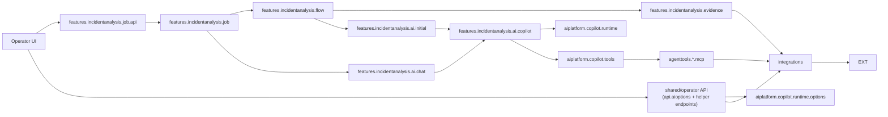
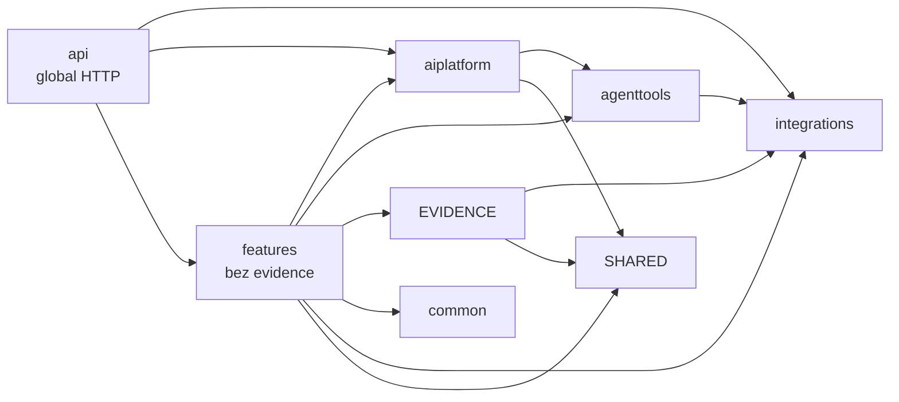

# Package Dependencies

## Cel

Ten dokument rozdziela dwa rozne widoki zaleznosci:

- runtime ownership: kto inicjuje kolejny krok i gdzie deleguje wykonanie,
- compile-time imports: ktory pakiet importuje klasy z innego pakietu.

Te widoki sa celowo osobne. Diagram runtime ownership pokazuje kierunek
wywolania/delegowania, a nie powrot wyniku. Compile-time graph pokazuje
rzeczywiste importy Javy.

Import graph ponizej powstal ze skanu `src/main/java` z uwzglednieniem
zwyklych i static importow.

W tabeli ponizej `features.incidentanalysis.evidence` jest pokazane jako osobny
wezlowy podgraf. Wiersze `features -> ...` licza wiec pozostale pakiety
feature'owe bez samego evidence pipeline, zeby nie dublowac tych samych
importow.

## Turbo Wazne: Model Rozszerzalnosci

Compile-time graph ma wspierac docelowy model produktu, a nie tylko wygladac
ladnie w diagramie. Incident analysis jest pierwszym dedykowanym feature'em,
ale adaptery, tools/MCP i runtime AI maja pozostac reusable dla kolejnych
analiz oraz innych sposobow ekspozycji capability.

Szczegolowy plan dojscia do tego modelu jest w
`06-modular-architecture-roadmap.md`.

Docelowa interpretacja warstw:

```text
dedykowane feature'y analityczne
  -> platforma AI runtime
  -> reusable tools/MCP
  -> reusable adaptery/integracje
  -> systemy zewnetrzne

dedykowane feature'y analityczne
  -> deterministic evidence / feature orchestration
  -> reusable adaptery/integracje
```

Historycznie te warstwy mieszkaly pod `analysis.*`, bo incident analysis byl
pierwszym use case'em. Produkcyjny root `analysis.*` jest juz zamkniety i nie
jest miejscem na nowe klasy. Przy kazdej wiekszej zmianie trzeba pilnowac
ponizszych zasad:

- `integrations.*` to docelowa reusable warstwa capability integracyjnych.
  Nie moze zalezec od evidence pipeline, MCP/tools, Copilota, flow ani job API.
  Ten sam adapter ma byc uzywalny przez provider evidence, tool, helper
  endpoint REST albo przyszly feature.
- Nowe i przenoszone capability integracyjne maja trafiac do `integrations.*`,
  nie do historycznych pakietow `analysis.*`.
- `agenttools` to reusable ekspozycja capability nad adapterami. Nie powinno
  zalezec od dedykowanej analizy incydentow ani od szczegolow providera
  Copilot SDK. Operational context tools sa takim neutralnym wrapperem:
  `opctx_*` wystawia katalogowy scope/list/search/detail, a znaczenie
  diagnostyczne dostaje dopiero w skillu i policy konkretnego feature'a.
- `aiplatform.copilot` to docelowa platforma AI runtime. Moze znac Copilot SDK,
  session lifecycle, allowliste, hidden context, eventy invocation i techniczna
  obsluge wynikow, ale dostaje prompt, skille, dostepne tools, evidence sink i
  response handling od feature'a.
- `features.incidentanalysis.ai.initial/chat` sa wlascicielami kontraktow AI
  specyficznych dla analizy incydentow. Nie przenosic ich do platformy,
  poniewaz zawieraja incident scope: `correlationId`, `environment`,
  `gitLabBranch` i `gitLabGroup`.
- Incident job, incident flow i incident-specific evidence/prompt sa
  feature'em analizy incydentow. Job, flow i evidence mieszkaja juz w
  `features.incidentanalysis.job`, `features.incidentanalysis.flow` oraz
  `features.incidentanalysis.evidence`. Feature moze zalezec od platformy,
  tools i adapterow, ale platforma, tools i adaptery nie moga zalezec od tego
  feature'a.
- Oprocz dedykowanych feature'ow istnieje kategoria shared/operator API dla
  frontendu: endpointy wspolne dla wielu ekranow albo bezposrednie fasady nad
  platforma/integracjami. Mieszkaja w `api.*`; feature-specific API zostaje
  przy `features.<feature>.api`.
- Historyczne `analysis.options` jest zamkniete. Neutralne preferencje
  wykonania AI mieszkaja w `shared.ai`, a endpoint
  `GET /analysis/ai/options` w `api.aioptions`.
- Przyszle feature'y, np. analiza dokumentacji, chatboty albo generowanie
  scenariuszy, powinny dostarczyc wlasny prompt, evidence/source pipeline,
  skille, hidden context, policy uzycia capability i kontrakt odpowiedzi,
  zamiast reuse'owac incidentowy flow jako generyczny core.
- `common` i neutralne kontrakty maja pozostac male. Wyciagaj tam tylko te
  typy, ktore naprawde sa wspolne dla kilku capability albo feature'ow.

Praktyczna konsekwencja: cykle importow usuwamy przez oddanie kontraktu do
warstwy, ktora jest jego wlascicielem, a nie przez przepinanie zaleznosci na
skroty. Brak cykli jest skutkiem zdrowych granic, nie celem samym w sobie.

Docelowy runtime Copilota ma byc parametryzowany: feature przekazuje prompt,
skille, allowliste tools, hidden context, evidence sink i response parser.
Platforma zna Copilot SDK, session lifecycle, tool invocation, policies,
user-visible usage i techniczna obsluge wynikow, ale nie wybiera incidentowych tools
ani nie zna `correlationId` jako stalego wymogu platformowego.

## Runtime Ownership Flow

Strzalka oznacza tutaj, kto inicjuje kolejny krok runtime albo do kogo
deleguje wykonanie. Nie pokazujemy tutaj powrotu wartosci do callera, bo taka
strzalka wyglada jak odwrotna zaleznosc pakietowa.



Wyniki wracaja do callera jako return values albo listener callbacks:
`AnalysisExecution`, `AnalysisResultResponse`, `preparedPrompt`,
`toolEvidenceSections` i `chatMessages`. To nie tworzy importu zwrotnego.

Najwazniejsze lancuchy ownership/dependency:

- deterministic initial analysis:
  `features.incidentanalysis.job -> features.incidentanalysis.flow -> features.incidentanalysis.evidence -> integrations`,
- initial AI:
  `features.incidentanalysis.flow -> features.incidentanalysis.ai.initial -> features.incidentanalysis.ai.copilot -> aiplatform.copilot.runtime`,
- AI-guided tools podczas initial analysis:
  `features.incidentanalysis.ai.copilot -> aiplatform.copilot.tools -> agenttools.*.mcp -> integrations`,
- follow-up chat:
    `features.incidentanalysis.job -> features.incidentanalysis.ai.chat -> features.incidentanalysis.ai.copilot -> aiplatform.copilot.tools -> agenttools.*.mcp -> integrations`,
- model/options:
  `Operator UI -> shared/operator API -> aiplatform.copilot.runtime.options`;
  fasada mieszka w `api.aioptions` i nie jest czescia incident job flow.
  Feature requesty tylko niosa neutralne preferencje wykonania AI z
  `shared.ai`.

## Compile-Time Import Graph

Strzalka oznacza tutaj: pakiet po lewej importuje pakiet po prawej.
Linie przerywane oznaczaja krawedzie odwrotne lub mocniej sprzegajace, ktore
warto pilnowac przy kolejnych refaktorach.



## Aktualne Krawedzie

| Krawedz importow | Liczba | Status | Co oznacza |
| --- | ---: | --- | --- |
| `features.incidentanalysis.evidence -> integrations` | 56 | oczekiwane | Providerzy Elasticsearch, Dynatrace, GitLab deterministic i operational context deleguja do docelowych reusable integracji. |
| `features.incidentanalysis.evidence -> shared` | 26 | oczekiwane | Evidence publikuje neutralne `AnalysisEvidenceSection` z `shared.evidence`. |
| `features (bez evidence) -> aiplatform` | 35 | oczekiwane przejsciowo | Incident Copilot preparation/provider sklada platformowy `CopilotRunRequest`, hidden session context, runtime types, execution gateway, factory tools, description customizer contract i uzywa platformowego session-bound evidence store. |
| `features (bez evidence) -> agenttools` | 25 | oczekiwane przejsciowo | Incident tool policy, GitLab/DB evidence capture i guidance opisow tools uzywaja neutralnych nazw tools oraz DTO capability, w tym `opctx_*`. |
| `features (bez evidence) -> features.incidentanalysis.evidence` | 23 | oczekiwane | Incident job/flow uruchamia collector i pokazuje kroki pipeline, a coverage/artifacts czytaja typed evidence view helpers. |
| `features (bez evidence) -> common` | 2 | oczekiwane | Incident tool evidence mappers uzywaja wspolnego `JsonPayloadReader`. |
| `features (bez evidence) -> integrations` | 1 | oczekiwane | Incident flow czyta `GitLabProperties` dla configured `gitLabGroup`; pozostale importy integracji w feature sa w wydzielonym podgrafie evidence. |
| `features (bez evidence) -> shared` | 53 | oczekiwane | Incident job/flow, initial/chat, artifacts, coverage, usage mapping, AI options i tool evidence capture czytaja neutralne DTO shared. |
| `aiplatform -> agenttools` | 6 | oczekiwane | Platformowy hidden `ToolContext` i budget runtime uzywaja keys/nazw z `agenttools`, bez importu capability implementations. |
| `aiplatform -> shared` | 11 | oczekiwane | Platformowy run request, prepared session, user-visible usage i tool evidence store niosa neutralny model evidence/usage jako runtime DTO. |
| `agenttools -> integrations` | 20 | oczekiwane | Przeniesione wrappery Elasticsearch, GitLab, Database i Operational Context MCP deleguja do `integrations`. |
| `api -> agenttools` | 1 | oczekiwane | Shared/operator helper API moze importowac neutralne nazwy/kontrakty tool capability bez zaleznosci od feature'a. |
| `api -> aiplatform` | 16 | oczekiwane | `api.aioptions` mapuje platformowy katalog modeli Copilota na kontrakt endpointu `GET /analysis/ai/options`; shared/operator API moze korzystac z platformowych fasad. |
| `api -> integrations` | 60 | oczekiwane | Shared/operator endpointy Elasticsearch/GitLab deleguja do `integrations`, a globalny handler HTTP mapuje wyniki/wyjatki helper endpointow. |
| `api -> features` | 3 | oczekiwane technicznie | Globalny handler HTTP mapuje wyjatki incident job API i `AnalysisDataNotFoundException` z incident flow. Nie traktowac tego jako wzorca dla shared/operator API, ktore nie powinno orkiestrowac feature'ow. |
| `api -> shared` | 3 | oczekiwane | Shared/operator HTTP kontrakty moga uzywac neutralnych DTO wspolnych dla UI i runtime. |

## Cykle Do Pilnowania

Po wydzieleniu generycznego modelu evidence i przeniesieniu incident AI
contracts aktualny kod nie ma juz pakietu produkcyjnego `analysis.ai`. To jest
zamknieta granica i nie nalezy jej przywracac.

Do obserwacji zostaly krawedzie wewnatrz feature'a:

1. `features (bez evidence) -> features.incidentanalysis.evidence`

   Incident job/flow uruchamiaja collector i pokazuja kroki pipeline, a
   coverage/artifacts czytaja typed evidence view helpers. To jest oczekiwane,
   ale kierunek ma zostac jednokierunkowy: evidence nie powinno importowac
   incident AI, flow ani joba.

## Kierunek Dla Nowych Zmian

Preferowany kierunek kompilacyjny dla obecnych pakietow:

```text
features.incidentanalysis.job -> features.incidentanalysis.flow -> features.incidentanalysis.evidence -> integrations
features.incidentanalysis.evidence -> shared
features.incidentanalysis.flow -> features.incidentanalysis.ai.initial
features.incidentanalysis.job -> features.incidentanalysis.ai.chat
features -> shared.ai/shared.evidence
features.incidentanalysis.ai.copilot -> aiplatform.copilot.runtime
features.incidentanalysis.ai.copilot -> aiplatform.copilot.runtime.execution
features.incidentanalysis.ai.copilot -> aiplatform.copilot.tools
features.incidentanalysis.ai.copilot.tools.description -> aiplatform.copilot.tools.description
features.incidentanalysis.ai.copilot -> agenttools
api.aioptions -> aiplatform.copilot.runtime.options
api.<sharedoperator> -> integrations/aiplatform/shared [target]
aiplatform.copilot.runtime.execution -> aiplatform.copilot.runtime/tools
aiplatform.copilot.tools -> agenttools
aiplatform.copilot.tools.policy.budget -> agenttools
aiplatform.copilot.tools.evidence -> shared
aiplatform.copilot.runtime -> shared
agenttools.*.mcp -> integrations
features -> shared
api -> feature exceptions [global error handling only]
any package -> common
```

Unikac nowych zaleznosci:

- `analysis.adapter -> analysis.evidence`,
- `analysis.adapter -> features.incidentanalysis.evidence`,
- `analysis.adapter -> analysis.mcp`,
- `analysis.adapter -> analysis.ai`,
- `analysis.adapter -> agenttools`,
- `any production package declaration under analysis.*`,
- `integrations -> analysis`,
- `integrations -> agenttools`,
- `integrations -> features`,
- `integrations -> aiplatform`,
- `integrations -> api`,
- `aiplatform -> analysis`,
- `aiplatform -> features`,
- `aiplatform -> integrations`,
- `analysis.ai -> features`,
- `features -> analysis.ai`,
- `any production package -> analysis.flow`,
- `any production package -> analysis.job`,
- `any production package -> analysis.evidence`,
- `features.incidentanalysis.evidence -> features.incidentanalysis.ai`,
- `features.incidentanalysis.evidence -> features.incidentanalysis.flow`,
- `features.incidentanalysis.evidence -> features.incidentanalysis.job`,
- `analysis.mcp -> analysis.ai.copilot`,
- `analysis.ai -> analysis.mcp`,
- `features.incidentanalysis.flow -> konkretne adaptery` poza waskim
  scope/config resolverem,
- `features.incidentanalysis.job -> features.incidentanalysis.evidence.provider.*` poza
  prostym odczytem runtime facts do statusu UI.
- `features.* -> api.*` dla shared/operator endpointow; feature powinien
  importowac neutralny kontrakt z `shared` albo platformy, nie kontroler/DTO
  fasady FE.
- `api.* -> features.*` dla cross-screen endpointow; jesli endpoint uruchamia
  konkretny use case, powinien mieszkac przy `features.<feature>.api`.

Zamkniete krawedzie, ktorych nie przywracac:

- `analysis.adapter -> analysis.evidence/features.incidentanalysis.evidence`:
  adapter Dynatrace nie buduje juz query z `ElasticLogEvidenceView`; factory
  tego mapowania mieszka po stronie evidence providerow.
- `integrations -> analysis`: przeniesione adaptery `integrations.dynatrace`,
  `integrations.elasticsearch`, `integrations.gitlab` i
  `integrations.operationalcontext` oraz `integrations.database` pozostaja
  czystymi integracjami bez importow warstw aplikacyjnych.
- `analysis.mcp -> analysis.ai.copilot`: MCP wrappery mieszkaja teraz w
  `agenttools.<capability>.mcp`, a hidden tool context keys mieszkaja w
  neutralnym `agenttools.context.AgentToolContextKeys`.
- `analysis.adapter -> analysis.mcp`: DB request/result/scope/operator
  contracts mieszkaja teraz w `integrations.database`, a Database Spring AI
  tools mieszkaja w `agenttools.database.mcp`.
- `analysis.adapter -> agenttools`: adapter DB ma wlasne capability DTO i scope
  w `integrations.database`; MCP mapuje hidden `ToolContext` na ten scope.
- `features.incidentanalysis.evidence -> analysis.ai`: incident evidence
  publikuje generyczne DTO z `shared.evidence`, a historyczne `analysis.ai`
  nie jest wlascicielem modelu evidence.
- Dawne `analysis.ai.evidence/usage`: listener tool evidence mieszka teraz w
  `shared.evidence`, a neutralny token/cost usage DTO w `shared.ai`. Feature
  nie importuje tych typow z `analysis.ai`.
- `analysis.ai -> analysis.mcp`: GitLab tool response DTO uzywane przez
  capture evidence mieszkaja teraz w `agenttools.gitlab.mcp`, a Copilot
  runtime nie importuje historycznej warstwy MCP.
- `analysis.ai -> features`: incidentowe providery, preparation i coverage
  mieszkaja teraz w `features.incidentanalysis.ai.copilot`, a `analysis.ai`
  nie powinien importowac dedykowanego feature'a.
- `features -> analysis.ai`: incident initial/chat contracts mieszkaja teraz w
  `features.incidentanalysis.ai.initial/chat`; feature nie importuje juz
  historycznego `analysis.ai`.
- `analysis.flow`: incident flow mieszka teraz w
  `features.incidentanalysis.flow`; historycznego pakietu produkcyjnego
  `analysis.flow` nie przywracac.
- `analysis.job`: incident job, API DTO, state i job errors mieszkaja teraz w
  `features.incidentanalysis.job`; historycznego pakietu produkcyjnego
  `analysis.job` nie przywracac.
- `analysis.evidence`: incident evidence collector, providery i typed evidence
  views mieszkaja teraz w `features.incidentanalysis.evidence`; historycznego
  pakietu produkcyjnego `analysis.evidence` nie przywracac.
- `analysis.options`: neutralne preferencje AI mieszkaja w `shared.ai`, a
  endpoint `GET /analysis/ai/options` w `api.aioptions`; historycznego pakietu
  produkcyjnego `analysis.options` nie przywracac.
- `analysis.adapter` i `analysis.mcp`: produkcyjne adaptery mieszkaja w
  `integrations.*`, a wrappery MCP w `agenttools.<capability>.mcp`; historycznych
  pakietow produkcyjnych `analysis.adapter` i `analysis.mcp` nie przywracac.
- `runtime tools -> capability evidence capture`: GitLab/DB user-facing tool
  evidence mapping mieszka teraz w
  `features.incidentanalysis.ai.copilot.tools`; platformowe runtime tools
  publikuja tylko neutralne eventy i session-bound evidence store.
- `runtime tools description -> incident guidance`: Copilot-facing guidance
  opisow GitLab/DB/Operational Context tools mieszka teraz w
  `features.incidentanalysis.ai.copilot.tools.description`, a runtime factory
  widzi tylko platformowy kontrakt `CopilotToolDescriptionCustomizer`.
- Dawne `factory/handler/context/events/policy/session/logging/budget/evidence store`
  spod `analysis.ai.copilot.tools`: `CopilotSdkToolFactory`, handler
  invocation, hidden `ToolContext`, eventy invocation, neutralne policy
  contracts, session validation, logging, description customization contract,
  budget policy/state/registry i session-bound evidence store mieszkaja teraz
  w `aiplatform.copilot.tools`.
- Dawne `analysis.ai.copilot.execution`: `CopilotSdkExecutionGateway`, lifecycle
  logger, event logger i invocation exception mieszkaja teraz w
  `aiplatform.copilot.runtime.execution`. Gateway zwraca `CopilotExecutionResult`
  z trescia odpowiedzi i user-visible `shared.ai.AnalysisAiUsage`, bez osobnego
  registry niewidocznej telemetryki.
- Dawne `analysis.ai.copilot.telemetry`: registry/loggery/listenery telemetry
  sesji Copilota zostaly usuniete z aktualnego runtime. Zostaje tylko usage
  widoczny w job state/UI oraz tool evidence widoczne dla operatora.
- Dawne `analysis.ai.copilot.CopilotSdkModelOptionsProvider`: provider
  katalogu modeli Copilota mieszka teraz w
  `aiplatform.copilot.runtime.options`. Preferencje requestu mieszkaja w
  `shared.ai`, a HTTP fasada `GET /analysis/ai/options` w `api.aioptions`.
- Dawne `analysis.ai.copilot.response/quality`: JSON-only parser odpowiedzi
  incidentu mieszka teraz w `features.incidentanalysis.ai.copilot.response`.
  Ukryty report-only quality gate zostal usuniety z aktualnego runtime.

Najwazniejsze zamkniete krawedzie sa pilnowane przez
`PackageDependencyGuardTest`, ktory skanuje importy w `src/main/java`.

Przy dodawaniu kolejnych dedykowanych analiz nie traktowac
incidentowych `job/flow/evidence` jako generycznego core. Najpierw
ustalic, ktora czesc jest reusable platform/capability, a ktora jest
feature-specific dla danej analizy.

Praktyczna zasada: jesli nowa klasa zaczyna potrzebowac importu "w gore" do
pakietu bardziej orchestration/UI/provider-specific, najpierw sprawdzic, czy
nie brakuje neutralnego DTO, resolvera albo listenera w blizszym pakiecie.
