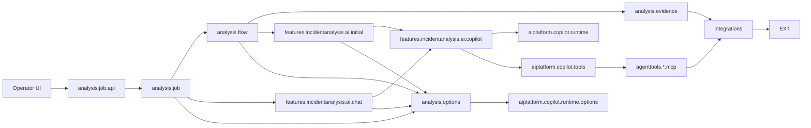
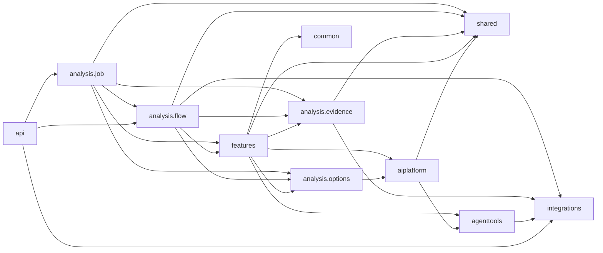

# Package Dependencies

## Cel

Ten dokument rozdziela dwa rozne widoki zaleznosci:

- runtime ownership: kto inicjuje kolejny krok i gdzie deleguje wykonanie,
- compile-time imports: ktory pakiet importuje klasy z innego pakietu.

Te widoki sa celowo osobne. Diagram runtime ownership pokazuje kierunek
wywolania/delegowania, a nie powrot wyniku. Compile-time graph pokazuje
rzeczywiste importy Javy.

Import graph ponizej powstal ze skanu `src/main/java` z uwzglednieniem
zwyklych i static importow.

## Turbo Wazne: Model Rozszerzalnosci

Compile-time graph ma wspierac docelowy model produktu, a nie tylko wygladac
ladnie w diagramie. Incident analysis jest pierwszym dedykowanym feature'em,
ale adaptery, tools/MCP i runtime AI maja pozostac reusable dla kolejnych
analiz oraz innych sposobow ekspozycji capability.

Szczegolowy plan dojscia do tego modelu jest w
`06-modular-architecture-roadmap.md`.

Docelowa interpretacja warstw:

```text
dedykowane feature'y analityczne
  -> platforma AI runtime
  -> reusable tools/MCP
  -> reusable adaptery/integracje
  -> systemy zewnetrzne

dedykowane feature'y analityczne
  -> deterministic evidence / feature orchestration
  -> reusable adaptery/integracje
```

W obecnym kodzie te warstwy nadal mieszkaja pod `analysis.*`, bo incident
analysis byl pierwszym use case'em. Nie oznacza to, ze wszystkie pakiety pod
`analysis` sa feature-specific. Przy kazdej wiekszej zmianie trzeba pilnowac
ponizszych zasad:

- `integrations.*` to docelowa reusable warstwa capability integracyjnych.
  Nie moze zalezec od evidence pipeline, MCP/tools, Copilota, flow ani job API.
  Ten sam adapter ma byc uzywalny przez provider evidence, tool, helper
  endpoint REST albo przyszly feature.
- `analysis.adapter` jest historycznym katalogiem po ekstrakcji adapterow.
  Nowe i przenoszone capability maja trafiac do `integrations.*`.
- `agenttools` to reusable ekspozycja capability nad adapterami. Nie powinno
  zalezec od dedykowanej analizy incydentow ani od szczegolow providera
  Copilot SDK.
- `aiplatform.copilot` to docelowa platforma AI runtime. Moze znac Copilot SDK,
  session lifecycle, allowliste, hidden context, eventy invocation i techniczna
  obsluge wynikow, ale dostaje prompt, skille, dostepne tools, evidence sink i
  response handling od feature'a.
- `features.incidentanalysis.ai.initial/chat` sa wlascicielami kontraktow AI
  specyficznych dla analizy incydentow. Nie przenosic ich do platformy,
  poniewaz zawieraja incident scope: `correlationId`, `environment`,
  `gitLabBranch` i `gitLabGroup`.
- `analysis.job`, `analysis.flow` i incident-specific evidence/prompt sa
  feature'em analizy incydentow. Moga zalezec od platformy, tools i adapterow,
  ale platforma, tools i adaptery nie moga zalezec od tego feature'a.
- Przyszle feature'y, np. analiza dokumentacji, chatboty albo generowanie
  scenariuszy, powinny dostarczyc wlasny prompt, evidence/source pipeline,
  skille, hidden context, policy uzycia capability i kontrakt odpowiedzi,
  zamiast reuse'owac incidentowy flow jako generyczny core.
- `common` i neutralne kontrakty maja pozostac male. Wyciagaj tam tylko te
  typy, ktore naprawde sa wspolne dla kilku capability albo feature'ow.

Praktyczna konsekwencja: cykle importow usuwamy przez oddanie kontraktu do
warstwy, ktora jest jego wlascicielem, a nie przez przepinanie zaleznosci na
skroty. Brak cykli jest skutkiem zdrowych granic, nie celem samym w sobie.

Docelowy runtime Copilota ma byc parametryzowany: feature przekazuje prompt,
skille, allowliste tools, hidden context, evidence sink i response parser.
Platforma zna Copilot SDK, session lifecycle, tool invocation, policies,
telemetryke i techniczna obsluge wynikow, ale nie wybiera incidentowych tools
ani nie zna `correlationId` jako stalego wymogu platformowego.

## Runtime Ownership Flow

Strzalka oznacza tutaj, kto inicjuje kolejny krok runtime albo do kogo
deleguje wykonanie. Nie pokazujemy tutaj powrotu wartosci do callera, bo taka
strzalka wyglada jak odwrotna zaleznosc pakietowa.



Wyniki wracaja do callera jako return values albo listener callbacks:
`AnalysisExecution`, `AnalysisResultResponse`, `preparedPrompt`,
`toolEvidenceSections` i `chatMessages`. To nie tworzy importu zwrotnego.

Najwazniejsze lancuchy ownership/dependency:

- deterministic initial analysis:
  `analysis.job -> analysis.flow -> analysis.evidence -> integrations`,
- initial AI:
    `analysis.flow -> features.incidentanalysis.ai.initial -> features.incidentanalysis.ai.copilot -> aiplatform.copilot.runtime`,
- AI-guided tools podczas initial analysis:
  `features.incidentanalysis.ai.copilot -> aiplatform.copilot.tools -> agenttools.*.mcp -> integrations`,
- follow-up chat:
    `analysis.job -> features.incidentanalysis.ai.chat -> features.incidentanalysis.ai.copilot -> aiplatform.copilot.tools -> agenttools.*.mcp -> integrations`,
- model/options:
  `analysis.job`, `analysis.flow` i incident AI korzystaja z bocznego
  kontraktu `analysis.options`, a fasada opcji deleguje do platformowego
  katalogu modeli Copilota w `aiplatform.copilot.runtime.options`.

## Compile-Time Import Graph

Strzalka oznacza tutaj: pakiet po lewej importuje pakiet po prawej.
Linie przerywane oznaczaja krawedzie odwrotne lub mocniej sprzegajace, ktore
warto pilnowac przy kolejnych refaktorach.



## Aktualne Krawedzie

| Krawedz importow | Liczba | Status | Co oznacza |
| --- | ---: | --- | --- |
| `analysis.job -> analysis.flow` | 6 | oczekiwane | Job uruchamia orchestrator i mapuje wynik flow do snapshotu UI. |
| `analysis.job -> analysis.evidence` | 7 | oczekiwane | Job pokazuje kroki pipeline i runtime facts wyprowadzone z evidence. |
| `analysis.job -> analysis.options` | 2 | oczekiwane | Start joba niesie opcjonalne preferencje AI. |
| `analysis.job -> features` | 7 | oczekiwane przejsciowo | Job trzyma incident chat i zapisany `InitialAnalysisRequest` dla follow-up. Zniknie po przeniesieniu joba do feature'a. |
| `analysis.job -> shared` | 6 | oczekiwane | Job snapshoty i API response niosa neutralny model evidence oraz usage DTO. |
| `analysis.flow -> analysis.evidence` | 5 | oczekiwane | Orchestrator uruchamia deterministic evidence collector. |
| `analysis.flow -> analysis.options` | 1 | oczekiwane | Flow przenosi preferencje AI do initial requestu. |
| `analysis.flow -> features` | 5 | oczekiwane przejsciowo | Orchestrator buduje incident `InitialAnalysisRequest` i wywoluje incident initial provider. Zniknie po przeniesieniu flow do feature'a. |
| `analysis.flow -> integrations` | 1 | do obserwacji | `AnalysisOrchestrator` czyta `GitLabProperties` dla `gitLabGroup`. Jezeli to urosnie, warto wydzielic neutralny resolver scope'u. |
| `analysis.flow -> shared` | 3 | oczekiwane | Flow przenosi neutralne evidence DTO i usage DTO miedzy collectorem, AI i response. |
| `analysis.evidence -> integrations` | 41 | oczekiwane | Providerzy Elasticsearch, Dynatrace, GitLab deterministic i operational context deleguja do docelowych reusable integracji. |
| `analysis.evidence -> shared` | 26 | oczekiwane | Evidence publikuje neutralne `AnalysisEvidenceSection` z `shared.evidence`. |
| `features -> aiplatform` | 43 | oczekiwane przejsciowo | Incident Copilot preparation/provider sklada platformowy `CopilotRunRequest`, hidden session context, runtime types, execution gateway, factory tools, description customizer contract, quality report payload, telemetry port i uzywa platformowego session-bound evidence store. |
| `features -> agenttools` | 21 | oczekiwane przejsciowo | Incident tool policy, GitLab/DB evidence capture i guidance opisow tools uzywaja neutralnych nazw tools oraz DTO capability. |
| `features -> analysis.evidence` | 11 | przejsciowe | Incident coverage/artifacts czytaja typed evidence view helpers do czasu przeniesienia evidence do feature'a. |
| `features -> analysis.options` | 3 | oczekiwane przejsciowo | Incident initial/chat request oraz session config niosa operator-facing preferencje modelu. |
| `features -> common` | 2 | oczekiwane | Incident tool evidence mappers uzywaja wspolnego `JsonPayloadReader`. |
| `features -> shared` | 27 | oczekiwane | Incident initial/chat, artifacts, preparation metrics, coverage, quality gate, usage mapping i tool evidence capture czytaja neutralne DTO shared. |
| `analysis.options -> aiplatform` | 3 | oczekiwane przejsciowo | Fasada endpointu `GET /analysis/ai/options` mapuje platformowy katalog modeli Copilota na obecny kontrakt aplikacji. |
| `aiplatform -> agenttools` | 8 | oczekiwane | Platformowy hidden `ToolContext`, neutralna klasyfikacja tool metrics i budget runtime uzywaja keys/nazw z `agenttools`, bez importu capability implementations. |
| `aiplatform -> shared` | 8 | oczekiwane | Platformowy run request, prepared session, telemetry session metrics i tool evidence store niosa neutralny model evidence/usage jako runtime DTO. |
| `agenttools -> integrations` | 9 | oczekiwane | Przeniesione wrappery Elasticsearch, GitLab i Database MCP deleguja do `integrations`. |
| `api -> integrations` | 6 | oczekiwane | Globalny handler HTTP mapuje wyniki/wyjatki helper endpointow Elasticsearch i GitLab z `integrations`. |
| `api -> analysis.flow` | 1 | oczekiwane | Globalny handler HTTP mapuje `AnalysisDataNotFoundException`. |
| `api -> analysis.job` | 2 | oczekiwane | Globalny handler HTTP mapuje wyjatki job API. |

## Cykle Do Pilnowania

Po wydzieleniu generycznego modelu evidence i przeniesieniu incident AI
contracts aktualny kod nie ma juz pakietu produkcyjnego `analysis.ai`. To jest
zamknieta granica i nie nalezy jej przywracac.

Do obserwacji zostaly krawedzie:

1. `analysis.flow/job -> features`

   Flow i job sa nadal w historycznym `analysis.*`, ale uzywaja juz
   incidentowych kontraktow AI z `features.incidentanalysis.ai.initial/chat`.
   To jest przejsciowe do czasu przeniesienia flow i joba do
   `features.incidentanalysis`.

2. `features -> analysis.evidence`

   Incident coverage/artifacts czytaja typed evidence view helpers. To jest
   przejsciowe do czasu przeniesienia evidence do `features.incidentanalysis`;
   nie uzywac tego jako pretekstu do importow `analysis.evidence -> features`.

## Kierunek Dla Nowych Zmian

Preferowany kierunek kompilacyjny dla obecnych pakietow:

```text
analysis.job -> analysis.flow -> analysis.evidence -> integrations
analysis.evidence -> shared
analysis.flow -> features.incidentanalysis.ai.initial
analysis.job -> features.incidentanalysis.ai.chat
analysis.flow/job -> shared.ai/shared.evidence
features.incidentanalysis.ai.copilot -> aiplatform.copilot.runtime
features.incidentanalysis.ai.copilot -> aiplatform.copilot.runtime.execution
features.incidentanalysis.ai.copilot -> aiplatform.copilot.runtime.telemetry
features.incidentanalysis.ai.copilot.quality -> aiplatform.copilot.runtime.quality
features.incidentanalysis.ai.copilot -> aiplatform.copilot.tools
features.incidentanalysis.ai.copilot.tools.description -> aiplatform.copilot.tools.description
features.incidentanalysis.ai.copilot -> agenttools
analysis.options -> aiplatform.copilot.runtime.options
aiplatform.copilot.runtime.telemetry.session -> aiplatform.copilot.runtime.quality/telemetry/tools
aiplatform.copilot.runtime.execution -> aiplatform.copilot.runtime/tools
aiplatform.copilot.tools -> agenttools
aiplatform.copilot.tools.telemetry -> agenttools
aiplatform.copilot.tools.policy.budget -> agenttools
aiplatform.copilot.tools.evidence -> shared
aiplatform.copilot.runtime -> shared
agenttools.*.mcp -> integrations
analysis.job/flow/features -> analysis.options
analysis.job/flow/features -> shared
api -> feature exceptions
any package -> common
```

Unikac nowych zaleznosci:

- `analysis.adapter -> analysis.evidence`,
- `analysis.adapter -> analysis.mcp`,
- `analysis.adapter -> analysis.ai`,
- `analysis.adapter -> agenttools`,
- `integrations -> analysis`,
- `integrations -> agenttools`,
- `integrations -> features`,
- `integrations -> aiplatform`,
- `aiplatform -> analysis`,
- `aiplatform -> features`,
- `aiplatform -> integrations`,
- `analysis.ai -> features`,
- `features -> analysis.ai`,
- `analysis.evidence -> features`,
- `analysis.mcp -> analysis.ai.copilot`,
- `analysis.ai -> analysis.mcp`,
- `analysis.flow -> konkretne adaptery` poza waskim scope/config resolverem,
- `analysis.job -> analysis.evidence.provider.*` poza prostym odczytem runtime
  facts do statusu UI.

Zamkniete krawedzie, ktorych nie przywracac:

- `analysis.adapter -> analysis.evidence`: adapter Dynatrace nie buduje juz
  query z `ElasticLogEvidenceView`; factory tego mapowania mieszka po stronie
  evidence providerow.
- `integrations -> analysis`: przeniesione adaptery `integrations.dynatrace`,
  `integrations.elasticsearch`, `integrations.gitlab` i
  `integrations.operationalcontext` oraz `integrations.database` pozostaja
  czystymi integracjami bez importow warstw aplikacyjnych.
- `analysis.mcp -> analysis.ai.copilot`: MCP wrappery mieszkaja teraz w
  `agenttools.<capability>.mcp`, a hidden tool context keys mieszkaja w
  neutralnym `agenttools.context.AgentToolContextKeys`.
- `analysis.adapter -> analysis.mcp`: DB request/result/scope/operator
  contracts mieszkaja teraz w `integrations.database`, a Database Spring AI
  tools mieszkaja w `agenttools.database.mcp`.
- `analysis.adapter -> agenttools`: adapter DB ma wlasne capability DTO i scope
  w `integrations.database`; MCP mapuje hidden `ToolContext` na ten scope.
- `analysis.evidence -> analysis.ai`: generyczne DTO evidence mieszkaja teraz
  w `shared.evidence`, a `analysis.ai` nie jest wlascicielem modelu evidence.
- Dawne `analysis.ai.evidence/usage`: listener tool evidence mieszka teraz w
  `shared.evidence`, a neutralny token/cost usage DTO w `shared.ai`. Feature
  nie importuje tych typow z `analysis.ai`.
- `analysis.ai -> analysis.mcp`: GitLab tool response DTO uzywane przez
  capture evidence mieszkaja teraz w `agenttools.gitlab.mcp`, a Copilot
  runtime nie importuje historycznej warstwy MCP.
- `analysis.ai -> features`: incidentowe providery, preparation i coverage
  mieszkaja teraz w `features.incidentanalysis.ai.copilot`, a `analysis.ai`
  nie powinien importowac dedykowanego feature'a.
- `features -> analysis.ai`: incident initial/chat contracts mieszkaja teraz w
  `features.incidentanalysis.ai.initial/chat`; feature nie importuje juz
  historycznego `analysis.ai`.
- `runtime tools -> capability evidence capture`: GitLab/DB user-facing tool
  evidence mapping mieszka teraz w
  `features.incidentanalysis.ai.copilot.tools`; platformowe runtime tools
  publikuja tylko neutralne eventy i session-bound evidence store.
- `runtime tools description -> incident guidance`: Copilot-facing guidance
  opisow GitLab/DB tools mieszka teraz w
  `features.incidentanalysis.ai.copilot.tools.description`, a runtime factory
  widzi tylko platformowy kontrakt `CopilotToolDescriptionCustomizer`.
- Dawne `factory/handler/context/events/policy/session/logging/budget/evidence store`
  spod `analysis.ai.copilot.tools`: `CopilotSdkToolFactory`, handler
  invocation, hidden `ToolContext`, eventy invocation, neutralne policy
  contracts, session validation, logging, description customization contract,
  budget policy/state/registry, neutralne tool metrics i session-bound evidence
  store mieszkaja teraz w `aiplatform.copilot.tools`.
- Dawne `analysis.ai.copilot.execution`: `CopilotSdkExecutionGateway`, lifecycle
  logger, event logger i invocation exception mieszkaja teraz w
  `aiplatform.copilot.runtime.execution`. Gateway uzywa neutralnego portu
  `CopilotSessionExecutionMetricsRecorder`, ktory pozwala platformowej
  telemetryce zostac wymienna implementacja.
- Dawne `analysis.ai.copilot.telemetry`: registry/loggery/listenery telemetry
  sesji Copilota mieszkaja teraz w
  `aiplatform.copilot.runtime.telemetry.session` i nie importuja `analysis.*`,
  `features.*` ani `integrations.*`.
- Dawne `analysis.ai.copilot.CopilotSdkModelOptionsProvider`: provider
  katalogu modeli Copilota mieszka teraz w
  `aiplatform.copilot.runtime.options`. `analysis.options` zostaje tylko
  fasada endpointu i mapperem na kontrakt aplikacji.
- Dawna konkretna zaleznosc telemetry w incident feature: preparation/provider
  uzywaja teraz platformowego `CopilotSessionTelemetry`, a
  `CopilotSessionMetricsRegistry` i `CopilotMetricsLogger` sa implementacja
  platformowa w `aiplatform.copilot.runtime.telemetry.session`.
- Dawne `analysis.ai.copilot.response/quality`: JSON-only parser odpowiedzi
  incidentu i incident-specific quality gate mieszkaja teraz w
  `features.incidentanalysis.ai.copilot.response/quality`. Telemetryka nie
  importuje feature'a, bo zapisuje neutralny
  `aiplatform.copilot.runtime.quality.CopilotResponseQualityReport`.

Najwazniejsze zamkniete krawedzie sa pilnowane przez
`PackageDependencyGuardTest`, ktory skanuje importy w `src/main/java`.

Przy dodawaniu kolejnych dedykowanych analiz nie traktowac
`analysis.job/flow/evidence` incydentow jako generycznego core. Najpierw
ustalic, ktora czesc jest reusable platform/capability, a ktora jest
feature-specific dla danej analizy.

Praktyczna zasada: jesli nowa klasa zaczyna potrzebowac importu "w gore" do
pakietu bardziej orchestration/UI/provider-specific, najpierw sprawdzic, czy
nie brakuje neutralnego DTO, resolvera albo listenera w blizszym pakiecie.
