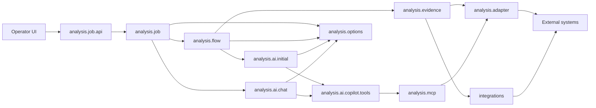
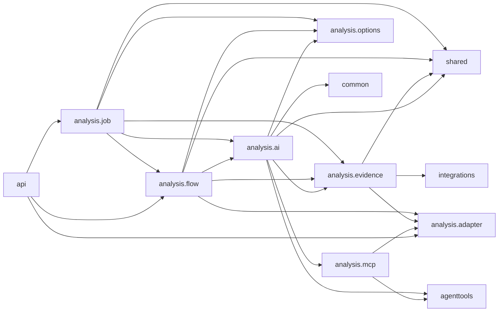

# Package Dependencies

## Cel

Ten dokument rozdziela dwa rozne widoki zaleznosci:

- runtime ownership: kto inicjuje kolejny krok i gdzie deleguje wykonanie,
- compile-time imports: ktory pakiet importuje klasy z innego pakietu.

Te widoki sa celowo osobne. Diagram runtime ownership pokazuje kierunek
wywolania/delegowania, a nie powrot wyniku. Compile-time graph pokazuje
rzeczywiste importy Javy.

Import graph ponizej powstal ze skanu `src/main/java` z uwzglednieniem
zwyklych i static importow.

## Turbo Wazne: Model Rozszerzalnosci

Compile-time graph ma wspierac docelowy model produktu, a nie tylko wygladac
ladnie w diagramie. Incident analysis jest pierwszym dedykowanym feature'em,
ale adaptery, tools/MCP i runtime AI maja pozostac reusable dla kolejnych
analiz oraz innych sposobow ekspozycji capability.

Szczegolowy plan dojscia do tego modelu jest w
`06-modular-architecture-roadmap.md`.

Docelowa interpretacja warstw:

```text
dedykowane feature'y analityczne
  -> platforma AI runtime
  -> reusable tools/MCP
  -> reusable adaptery/integracje
  -> systemy zewnetrzne

dedykowane feature'y analityczne
  -> deterministic evidence / feature orchestration
  -> reusable adaptery/integracje
```

W obecnym kodzie te warstwy nadal mieszkaja pod `analysis.*`, bo incident
analysis byl pierwszym use case'em. Nie oznacza to, ze wszystkie pakiety pod
`analysis` sa feature-specific. Przy kazdej wiekszej zmianie trzeba pilnowac
ponizszych zasad:

- `integrations.*` to docelowa reusable warstwa capability integracyjnych.
  Nie moze zalezec od evidence pipeline, MCP/tools, Copilota, flow ani job API.
  Ten sam adapter ma byc uzywalny przez provider evidence, tool, helper
  endpoint REST albo przyszly feature.
- `analysis.adapter` to przejsciowy dom dla integracji, ktore nie zostaly
  jeszcze fizycznie przeniesione do `integrations.*`. Obowiazuja go te same
  ograniczenia co `integrations.*`.
- `analysis.mcp` i przyszla warstwa tools to reusable ekspozycja capability
  nad adapterami. Nie powinny zalezec od dedykowanej analizy incydentow ani od
  szczegolow providera Copilot SDK.
- `analysis.ai.copilot` to aktualny adapter platformy AI runtime. Moze
  korzystac z reusable tools/MCP, budowac session config, allowliste,
  hidden context, telemetryke i evidence capture, ale docelowo ma robic to na
  podstawie parametrow przekazanych przez feature. Nie powinien stawac sie
  wlascicielem domenowej logiki analizy incydentu, promptu, skilli ani polityki
  doboru tools.
- `analysis.job`, `analysis.flow` i incident-specific evidence/prompt sa
  feature'em analizy incydentow. Moga zalezec od platformy, tools i adapterow,
  ale platforma, tools i adaptery nie moga zalezec od tego feature'a.
- Przyszle feature'y, np. analiza dokumentacji, chatboty albo generowanie
  scenariuszy, powinny dostarczyc wlasny prompt, evidence/source pipeline,
  skille, hidden context, policy uzycia capability i kontrakt odpowiedzi,
  zamiast reuse'owac incidentowy flow jako generyczny core.
- `common` i neutralne kontrakty maja pozostac male. Wyciagaj tam tylko te
  typy, ktore naprawde sa wspolne dla kilku capability albo feature'ow.

Praktyczna konsekwencja: cykle importow usuwamy przez oddanie kontraktu do
warstwy, ktora jest jego wlascicielem, a nie przez przepinanie zaleznosci na
skroty. Brak cykli jest skutkiem zdrowych granic, nie celem samym w sobie.

Docelowy runtime Copilota ma byc parametryzowany: feature przekazuje prompt,
skille, allowliste tools, hidden context, evidence sink i response parser.
Platforma zna Copilot SDK, session lifecycle, tool invocation, policies,
telemetryke i techniczna obsluge wynikow, ale nie wybiera incidentowych tools
ani nie zna `correlationId` jako stalego wymogu platformowego.

## Runtime Ownership Flow

Strzalka oznacza tutaj, kto inicjuje kolejny krok runtime albo do kogo
deleguje wykonanie. Nie pokazujemy tutaj powrotu wartosci do callera, bo taka
strzalka wyglada jak odwrotna zaleznosc pakietowa.



Wyniki wracaja do callera jako return values albo listener callbacks:
`AnalysisExecution`, `AnalysisResultResponse`, `preparedPrompt`,
`toolEvidenceSections` i `chatMessages`. To nie tworzy importu zwrotnego.

Najwazniejsze lancuchy ownership/dependency:

- deterministic initial analysis:
  `analysis.job -> analysis.flow -> analysis.evidence -> analysis.adapter`
  albo `analysis.job -> analysis.flow -> analysis.evidence -> integrations`,
- initial AI:
  `analysis.flow -> analysis.ai.initial`,
- AI-guided tools podczas initial analysis:
  `analysis.ai.initial -> analysis.ai.copilot.tools -> analysis.mcp -> analysis.adapter`,
- follow-up chat:
  `analysis.job -> analysis.ai.chat -> analysis.ai.copilot.tools -> analysis.mcp -> analysis.adapter`,
- model/options:
  `analysis.job`, `analysis.flow` i `analysis.ai` korzystaja z bocznego
  kontraktu `analysis.options`.

## Compile-Time Import Graph

Strzalka oznacza tutaj: pakiet po lewej importuje pakiet po prawej.
Linie przerywane oznaczaja krawedzie odwrotne lub mocniej sprzegajace, ktore
warto pilnowac przy kolejnych refaktorach.



## Aktualne Krawedzie

| Krawedz importow | Liczba | Status | Co oznacza |
| --- | ---: | --- | --- |
| `analysis.job -> analysis.flow` | 6 | oczekiwane | Job uruchamia orchestrator i mapuje wynik flow do snapshotu UI. |
| `analysis.job -> analysis.ai` | 9 | oczekiwane | Job trzyma chat, usage i zapisany `InitialAnalysisRequest` dla follow-up. |
| `analysis.job -> analysis.evidence` | 7 | oczekiwane | Job pokazuje kroki pipeline i runtime facts wyprowadzone z evidence. |
| `analysis.job -> analysis.options` | 2 | oczekiwane | Start joba niesie opcjonalne preferencje AI. |
| `analysis.job -> shared` | 4 | oczekiwane | Job snapshoty i API response niosa neutralny model evidence. |
| `analysis.flow -> analysis.evidence` | 5 | oczekiwane | Orchestrator uruchamia deterministic evidence collector. |
| `analysis.flow -> analysis.ai` | 6 | oczekiwane | Orchestrator buduje request AI i wywoluje initial provider. |
| `analysis.flow -> analysis.options` | 1 | oczekiwane | Flow przenosi preferencje AI do initial requestu. |
| `analysis.flow -> analysis.adapter` | 1 | do obserwacji | `AnalysisOrchestrator` czyta `GitLabProperties` dla `gitLabGroup`. Jezeli to urosnie, warto wydzielic neutralny resolver scope'u. |
| `analysis.flow -> shared` | 2 | oczekiwane | Flow przenosi neutralne evidence DTO miedzy collectorem, AI i response. |
| `analysis.evidence -> analysis.adapter` | 36 | oczekiwane przejsciowo | Providerzy evidence deleguja do adapterow systemow zewnetrznych, ktore jeszcze mieszkaja pod `analysis.adapter`. |
| `analysis.evidence -> integrations` | 5 | oczekiwane | Provider Dynatrace deleguje juz do docelowej reusable integracji. |
| `analysis.evidence -> shared` | 26 | oczekiwane | Evidence publikuje neutralne `AnalysisEvidenceSection` z `shared.evidence`. |
| `analysis.ai -> analysis.evidence` | 11 | sprzegajace | Copilot coverage/artifacts czytaja typed evidence view helpers. Trzymac to lokalnie w preparation/coverage, nie rozszerzac na kontrakt AI. |
| `analysis.ai -> analysis.mcp` | 26 | oczekiwane przejsciowo | Copilot runtime reuse'uje aktualne Spring AI/MCP tools. Docelowo platforma dostaje tool definitions/callbacks od feature'a i nie wybiera incidentowych capability sama. |
| `analysis.ai -> agenttools` | 3 | oczekiwane przejsciowo | Copilot runtime niesie hidden context jako neutralna mape oparta o context keys. |
| `analysis.ai -> analysis.options` | 6 | oczekiwane | Providerzy AI, preparation i chat dostaja preferencje modelu/reasoning. |
| `analysis.ai -> common` | 2 | oczekiwane | Mappery tool evidence uzywaja `JsonPayloadReader`. |
| `analysis.ai -> shared` | 26 | oczekiwane | Providerzy AI, Copilot runtime/preparation i evidence capture konsumuja neutralny model evidence. |
| `analysis.mcp -> analysis.adapter` | 9 | oczekiwane | Spring AI tools deleguja do adapterow/capability services i uzywaja capability DTO adaptera DB. |
| `analysis.mcp -> agenttools` | 16 | oczekiwane przejsciowo | MCP wrappers uzywaja neutralnych hidden context keys. |
| `api -> analysis.adapter` | 6 | oczekiwane | Globalny handler HTTP mapuje wyjatki helper endpointow adapterow. |
| `api -> analysis.flow` | 1 | oczekiwane | Globalny handler HTTP mapuje `AnalysisDataNotFoundException`. |
| `api -> analysis.job` | 2 | oczekiwane | Globalny handler HTTP mapuje wyjatki job API. |

## Cykle Do Pilnowania

Po wydzieleniu generycznego modelu evidence aktualny kod nie ma juz cyklu
`analysis.ai <-> analysis.evidence` wynikajacego z `AnalysisEvidenceSection`.
To jest zamknieta granica i nie nalezy jej przywracac.

Do obserwacji zostala krawedz:

1. `analysis.ai -> analysis.evidence`

   Copilot coverage/artifacts czytaja typed evidence view helpers. Trzymac to
   lokalnie w preparation/coverage, nie rozszerzac na publiczny kontrakt AI i
   nie uzywac jako pretekstu do importow `analysis.evidence -> analysis.ai`.

## Kierunek Dla Nowych Zmian

Preferowany kierunek kompilacyjny dla obecnych pakietow:

```text
analysis.job -> analysis.flow -> analysis.evidence -> integrations
analysis.job -> analysis.flow -> analysis.evidence -> analysis.adapter
analysis.evidence -> shared
analysis.flow -> analysis.ai.initial
analysis.ai.copilot -> analysis.mcp -> analysis.adapter
analysis.ai.copilot/analysis.mcp -> agenttools
analysis.job/flow/ai -> analysis.options
analysis.job/flow/ai -> shared
api -> feature exceptions
any package -> common
```

Unikac nowych zaleznosci:

- `analysis.adapter -> analysis.evidence`,
- `analysis.adapter -> analysis.mcp`,
- `analysis.adapter -> analysis.ai`,
- `analysis.adapter -> agenttools`,
- `integrations -> analysis`,
- `integrations -> agenttools`,
- `integrations -> features`,
- `integrations -> aiplatform`,
- `analysis.mcp -> analysis.ai.copilot`,
- `analysis.flow -> konkretne adaptery` poza waskim scope/config resolverem,
- `analysis.job -> analysis.evidence.provider.*` poza prostym odczytem runtime
  facts do statusu UI.

Zamkniete krawedzie, ktorych nie przywracac:

- `analysis.adapter -> analysis.evidence`: adapter Dynatrace nie buduje juz
  query z `ElasticLogEvidenceView`; factory tego mapowania mieszka po stronie
  evidence providerow.
- `integrations -> analysis`: pierwszy przeniesiony adapter
  `integrations.dynatrace` pozostaje czysta integracja bez importow warstw
  aplikacyjnych.
- `analysis.mcp -> analysis.ai.copilot`: hidden tool context keys mieszkaja
  teraz w neutralnym `agenttools.context.AgentToolContextKeys`, a Copilot
  runtime jest ich konsumentem.
- `analysis.adapter -> analysis.mcp`: DB request/result/scope/operator
  contracts mieszkaja teraz w `analysis.adapter.database`, a
  `analysis.mcp.database` zostaje ekspozycja Spring AI tools.
- `analysis.adapter -> agenttools`: adapter DB ma wlasne capability DTO i scope
  w `analysis.adapter.database`; MCP mapuje hidden `ToolContext` na ten scope.
- `analysis.evidence -> analysis.ai`: generyczne DTO evidence mieszkaja teraz
  w `shared.evidence`, a `analysis.ai.evidence` nie jest wlascicielem modelu
  evidence.

Najwazniejsze zamkniete krawedzie sa pilnowane przez
`PackageDependencyGuardTest`, ktory skanuje importy w `src/main/java`.

Przy dodawaniu kolejnych dedykowanych analiz nie traktowac
`analysis.job/flow/evidence` incydentow jako generycznego core. Najpierw
ustalic, ktora czesc jest reusable platform/capability, a ktora jest
feature-specific dla danej analizy.

Praktyczna zasada: jesli nowa klasa zaczyna potrzebowac importu "w gore" do
pakietu bardziej orchestration/UI/provider-specific, najpierw sprawdzic, czy
nie brakuje neutralnego DTO, resolvera albo listenera w blizszym pakiecie.
