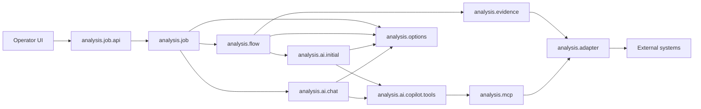
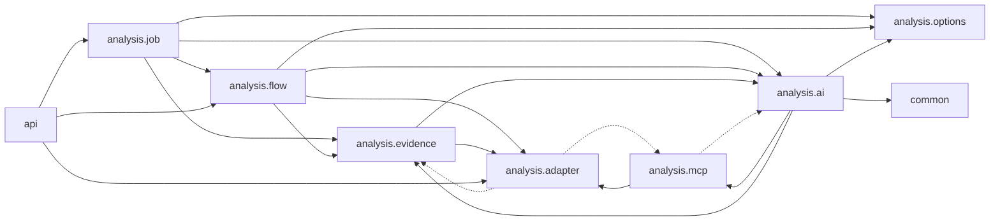

# Package Dependencies

## Cel

Ten dokument rozdziela dwa rozne widoki zaleznosci:

- runtime ownership: kto inicjuje kolejny krok i gdzie deleguje wykonanie,
- compile-time imports: ktory pakiet importuje klasy z innego pakietu.

Te widoki sa celowo osobne. Diagram runtime ownership pokazuje kierunek
wywolania/delegowania, a nie powrot wyniku. Compile-time graph pokazuje
rzeczywiste importy Javy.

Import graph ponizej powstal ze skanu `src/main/java` z uwzglednieniem
zwyklych i static importow.

## Turbo Wazne: Model Rozszerzalnosci

Compile-time graph ma wspierac docelowy model produktu, a nie tylko wygladac
ladnie w diagramie. Incident analysis jest pierwszym dedykowanym feature'em,
ale adaptery, tools/MCP i runtime AI maja pozostac reusable dla kolejnych
analiz oraz innych sposobow ekspozycji capability.

Szczegolowy plan dojscia do tego modelu jest w
`06-modular-architecture-roadmap.md`.

Docelowa interpretacja warstw:

```text
dedykowane feature'y analityczne
  -> platforma AI runtime
  -> reusable tools/MCP
  -> reusable adaptery/integracje
  -> systemy zewnetrzne

dedykowane feature'y analityczne
  -> deterministic evidence / feature orchestration
  -> reusable adaptery/integracje
```

W obecnym kodzie te warstwy nadal mieszkaja pod `analysis.*`, bo incident
analysis byl pierwszym use case'em. Nie oznacza to, ze wszystkie pakiety pod
`analysis` sa feature-specific. Przy kazdej wiekszej zmianie trzeba pilnowac
ponizszych zasad:

- `analysis.adapter` to reusable capability integracyjne. Nie moze zalezec od
  evidence pipeline, MCP/tools, Copilota, flow ani job API. Ten sam adapter ma
  byc uzywalny przez provider evidence, tool, helper endpoint REST albo
  przyszly feature.
- `analysis.mcp` i przyszla warstwa tools to reusable ekspozycja capability
  nad adapterami. Nie powinny zalezec od dedykowanej analizy incydentow ani od
  szczegolow providera Copilot SDK.
- `analysis.ai.copilot` to aktualny adapter platformy AI runtime. Moze
  korzystac z reusable tools/MCP, budowac session config, allowliste,
  hidden context, telemetryke i evidence capture, ale nie powinien stawac sie
  wlascicielem domenowej logiki analizy incydentu.
- `analysis.job`, `analysis.flow` i incident-specific evidence/prompt sa
  feature'em analizy incydentow. Moga zalezec od platformy, tools i adapterow,
  ale platforma, tools i adaptery nie moga zalezec od tego feature'a.
- Przyszle feature'y, np. analiza dokumentacji, chatboty albo generowanie
  scenariuszy, powinny dostarczyc wlasny prompt, evidence/source pipeline,
  policy uzycia capability i kontrakt odpowiedzi, zamiast reuse'owac
  incidentowy flow jako generyczny core.
- `common` i neutralne kontrakty maja pozostac male. Wyciagaj tam tylko te
  typy, ktore naprawde sa wspolne dla kilku capability albo feature'ow.

Praktyczna konsekwencja: cykle importow usuwamy przez oddanie kontraktu do
warstwy, ktora jest jego wlascicielem, a nie przez przepinanie zaleznosci na
skroty. Brak cykli jest skutkiem zdrowych granic, nie celem samym w sobie.

## Runtime Ownership Flow

Strzalka oznacza tutaj, kto inicjuje kolejny krok runtime albo do kogo
deleguje wykonanie. Nie pokazujemy tutaj powrotu wartosci do callera, bo taka
strzalka wyglada jak odwrotna zaleznosc pakietowa.



Wyniki wracaja do callera jako return values albo listener callbacks:
`AnalysisExecution`, `AnalysisResultResponse`, `preparedPrompt`,
`toolEvidenceSections` i `chatMessages`. To nie tworzy importu zwrotnego.

Najwazniejsze lancuchy ownership/dependency:

- deterministic initial analysis:
  `analysis.job -> analysis.flow -> analysis.evidence -> analysis.adapter`,
- initial AI:
  `analysis.flow -> analysis.ai.initial`,
- AI-guided tools podczas initial analysis:
  `analysis.ai.initial -> analysis.ai.copilot.tools -> analysis.mcp -> analysis.adapter`,
- follow-up chat:
  `analysis.job -> analysis.ai.chat -> analysis.ai.copilot.tools -> analysis.mcp -> analysis.adapter`,
- model/options:
  `analysis.job`, `analysis.flow` i `analysis.ai` korzystaja z bocznego
  kontraktu `analysis.options`.

## Compile-Time Import Graph

Strzalka oznacza tutaj: pakiet po lewej importuje pakiet po prawej.
Linie przerywane oznaczaja krawedzie odwrotne lub mocniej sprzegajace, ktore
warto pilnowac przy kolejnych refaktorach.



## Aktualne Krawedzie

| Krawedz importow | Liczba | Status | Co oznacza |
| --- | ---: | --- | --- |
| `analysis.job -> analysis.flow` | 6 | oczekiwane | Job uruchamia orchestrator i mapuje wynik flow do snapshotu UI. |
| `analysis.job -> analysis.ai` | 13 | oczekiwane | Job trzyma chat, usage, tool evidence i zapisany `InitialAnalysisRequest` dla follow-up. |
| `analysis.job -> analysis.evidence` | 7 | oczekiwane | Job pokazuje kroki pipeline i runtime facts wyprowadzone z evidence. |
| `analysis.job -> analysis.options` | 2 | oczekiwane | Start joba niesie opcjonalne preferencje AI. |
| `analysis.flow -> analysis.evidence` | 5 | oczekiwane | Orchestrator uruchamia deterministic evidence collector. |
| `analysis.flow -> analysis.ai` | 8 | oczekiwane | Orchestrator buduje request AI i wywoluje initial provider. |
| `analysis.flow -> analysis.options` | 1 | oczekiwane | Flow przenosi preferencje AI do initial requestu. |
| `analysis.flow -> analysis.adapter` | 1 | do obserwacji | `AnalysisOrchestrator` czyta `GitLabProperties` dla `gitLabGroup`. Jezeli to urosnie, warto wydzielic neutralny resolver scope'u. |
| `analysis.evidence -> analysis.adapter` | 41 | oczekiwane | Providerzy evidence deleguja do adapterow systemow zewnetrznych. |
| `analysis.evidence -> analysis.ai` | 26 | oczekiwane, ale sprzegajace | Evidence publikuje generyczne `AnalysisEvidenceSection` z pakietu `analysis.ai.evidence`. |
| `analysis.ai -> analysis.evidence` | 11 | sprzegajace | Copilot coverage/artifacts czytaja typed evidence view helpers. Trzymac to lokalnie w preparation/coverage, nie rozszerzac na kontrakt AI. |
| `analysis.ai -> analysis.mcp` | 26 | oczekiwane dla Copilota | Copilot policy, telemetry i capture znaja nazwy tools i DTO capability. |
| `analysis.ai -> analysis.options` | 6 | oczekiwane | Providerzy AI i chat dostaja preferencje modelu/reasoning. |
| `analysis.ai -> common` | 2 | oczekiwane | Mappery tool evidence uzywaja `JsonPayloadReader`. |
| `analysis.mcp -> analysis.adapter` | 7 | oczekiwane | Spring AI tools deleguja do adapterow/capability services. |
| `analysis.mcp -> analysis.ai` | 16 | do obserwacji | Tool DTOs importuja `CopilotToolContextKeys`. To tworzy sprzezenie MCP z aktualnym providerem Copilot. |
| `analysis.adapter -> analysis.mcp` | 9 | do obserwacji | DB adapter uzywa `DatabaseToolDtos`, `DbToolScope` i operatorow z pakietu MCP. |
| `analysis.adapter -> analysis.evidence` | 1 | do obserwacji | `DynatraceIncidentQuery.from(...)` zna `ElasticLogEvidenceView`. |
| `api -> analysis.adapter` | 6 | oczekiwane | Globalny handler HTTP mapuje wyjatki helper endpointow adapterow. |
| `api -> analysis.flow` | 1 | oczekiwane | Globalny handler HTTP mapuje `AnalysisDataNotFoundException`. |
| `api -> analysis.job` | 2 | oczekiwane | Globalny handler HTTP mapuje wyjatki job API. |

## Cykle Do Pilnowania

Aktualny kod ma kilka cykli na poziomie top-level pakietow. To jest stan
operacyjny, a nie wzorzec dla nowych zmian. Kazdy nowy import w tych miejscach
powinien przyblizac kod do modelu reusable adaptery -> reusable tools/MCP ->
platforma AI -> dedykowane feature'y, a nie utrwalac cykl.

1. `analysis.ai <-> analysis.mcp`

   Copilot zna nazwy tools i capability DTOs, a MCP DTOs znaja
   `CopilotToolContextKeys`. Docelowo context keys i tool contracts powinny byc
   neutralne dla platformy AI, zeby tools/MCP mozna bylo podpiac pod inny loop
   agenta niz Copilot SDK.

2. `analysis.adapter.database <-> analysis.mcp.database`

   MCP deleguje do DB adaptera, ale DB adapter importuje DTO tools z MCP.
   Najbardziej naturalny ruch to przeniesienie typed DB
   request/result/scope/operator contracts do neutralnego pakietu capability, a
   w `analysis.mcp.database` zostawienie tylko ekspozycji Spring AI tools.

3. `analysis.adapter.dynatrace <-> analysis.evidence`

   Evidence provider uzywa adaptera Dynatrace, ale `DynatraceIncidentQuery`
   buduje sie bezposrednio z `ElasticLogEvidenceView`. Czytelniejsza granica na
   przyszlosc: factory z `ElasticLogEvidenceView` trzymac w evidence providerze,
   a adapterowi przekazywac juz czysty `DynatraceIncidentQuery`.

4. `analysis.ai <-> analysis.evidence`

   To wynika z tego, ze generyczny model evidence (`AnalysisEvidenceSection`)
   mieszka w `analysis.ai.evidence`, a Copilot coverage/artifacts czytaja typed
   evidence view helpers. Docelowo generyczny model evidence powinien byc
   neutralny wzgledem AI, a Copilot moze go konsumowac razem z typed evidence
   view helpers bez wciskania provider-specific klas do publicznych requestow AI.

## Kierunek Dla Nowych Zmian

Preferowany kierunek kompilacyjny dla obecnych pakietow:

```text
analysis.job -> analysis.flow -> analysis.evidence -> analysis.adapter
analysis.flow -> analysis.ai.initial
analysis.ai.copilot -> analysis.mcp -> analysis.adapter
analysis.job/flow/ai -> analysis.options
api -> feature exceptions
any package -> common
```

Unikac nowych zaleznosci:

- `analysis.adapter -> analysis.evidence`,
- `analysis.adapter -> analysis.mcp`,
- `analysis.adapter -> analysis.ai`,
- `analysis.mcp -> analysis.ai.copilot` poza obecnymi context keys,
- `analysis.flow -> konkretne adaptery` poza waskim scope/config resolverem,
- `analysis.job -> analysis.evidence.provider.*` poza prostym odczytem runtime
  facts do statusu UI.

Przy dodawaniu kolejnych dedykowanych analiz nie traktowac
`analysis.job/flow/evidence` incydentow jako generycznego core. Najpierw
ustalic, ktora czesc jest reusable platform/capability, a ktora jest
feature-specific dla danej analizy.

Praktyczna zasada: jesli nowa klasa zaczyna potrzebowac importu "w gore" do
pakietu bardziej orchestration/UI/provider-specific, najpierw sprawdzic, czy
nie brakuje neutralnego DTO, resolvera albo listenera w blizszym pakiecie.
