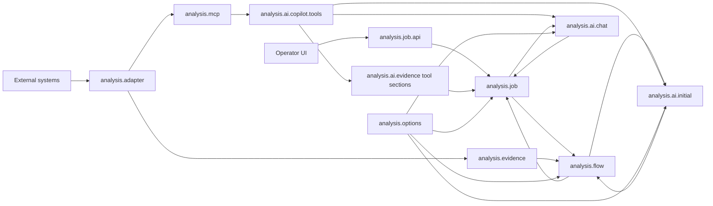
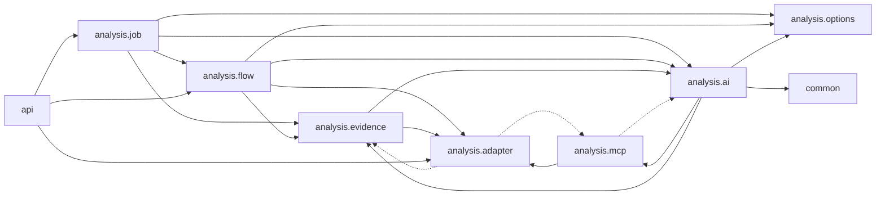

# Package Dependencies

## Cel

Ten dokument rozdziela dwa rozne widoki zaleznosci:

- runtime/data-flow: skad plyna dane i kto uruchamia kolejny krok,
- compile-time imports: ktory pakiet importuje klasy z innego pakietu.

Te widoki sa celowo osobne. W runtime dane plyna od adapterow do evidence,
AI i joba. W kodzie orkiestracja naturalnie importuje nizsze warstwy, wiec
czesc strzalek kompilacyjnych idzie w przeciwna strone.

Import graph ponizej powstal ze skanu `src/main/java` z uwzglednieniem
zwyklych i static importow.

## Runtime / Data Flow

Strzalka oznacza tutaj przeplyw danych albo sterowania runtime, nie import
Javy.



Najwazniejsze lancuchy runtime:

- deterministic initial analysis:
  `analysis.adapter -> analysis.evidence -> analysis.flow -> analysis.ai.initial -> analysis.flow -> analysis.job`,
- AI-guided tools podczas initial analysis:
  `analysis.adapter -> analysis.mcp -> analysis.ai.copilot.tools -> analysis.ai.initial -> analysis.job`,
- follow-up chat:
  `analysis.job -> analysis.ai.chat -> analysis.ai.copilot.tools -> analysis.job`,
- model/options:
  `analysis.options` jest bocznym kontraktem dla UI, joba, flow i providerow AI.

## Compile-Time Import Graph

Strzalka oznacza tutaj: pakiet po lewej importuje pakiet po prawej.
Linie przerywane oznaczaja krawedzie odwrotne lub mocniej sprzegajace, ktore
warto pilnowac przy kolejnych refaktorach.



## Aktualne Krawedzie

| Krawedz importow | Liczba | Status | Co oznacza |
| --- | ---: | --- | --- |
| `analysis.job -> analysis.flow` | 6 | oczekiwane | Job uruchamia orchestrator i mapuje wynik flow do snapshotu UI. |
| `analysis.job -> analysis.ai` | 13 | oczekiwane | Job trzyma chat, usage i tool evidence w kontrakcie UI. |
| `analysis.job -> analysis.evidence` | 7 | oczekiwane | Job pokazuje kroki pipeline i runtime facts wyprowadzone z evidence. |
| `analysis.job -> analysis.options` | 2 | oczekiwane | Start joba niesie opcjonalne preferencje AI. |
| `analysis.flow -> analysis.evidence` | 5 | oczekiwane | Orchestrator uruchamia deterministic evidence collector. |
| `analysis.flow -> analysis.ai` | 8 | oczekiwane | Orchestrator buduje request AI i wywoluje initial provider. |
| `analysis.flow -> analysis.options` | 1 | oczekiwane | Flow przenosi preferencje AI do initial requestu. |
| `analysis.flow -> analysis.adapter` | 1 | do obserwacji | `AnalysisOrchestrator` czyta `GitLabProperties` dla `gitLabGroup`. Jezeli to urosnie, warto wydzielic neutralny resolver scope'u. |
| `analysis.evidence -> analysis.adapter` | 41 | oczekiwane | Providerzy evidence deleguja do adapterow systemow zewnetrznych. |
| `analysis.evidence -> analysis.ai` | 26 | oczekiwane, ale sprzegajace | Evidence publikuje generyczne `AnalysisEvidenceSection` z pakietu `analysis.ai.evidence`. |
| `analysis.ai -> analysis.evidence` | 11 | sprzegajace | Copilot coverage/artifacts czytaja typed evidence view helpers. Trzymac to lokalnie w preparation/coverage, nie rozszerzac na kontrakt AI. |
| `analysis.ai -> analysis.mcp` | 26 | oczekiwane dla Copilota | Copilot policy, telemetry i capture znaja nazwy tools i DTO capability. |
| `analysis.ai -> analysis.options` | 6 | oczekiwane | Providerzy AI i chat dostaja preferencje modelu/reasoning. |
| `analysis.ai -> common` | 2 | oczekiwane | Mappery tool evidence uzywaja `JsonPayloadReader`. |
| `analysis.mcp -> analysis.adapter` | 7 | oczekiwane | Spring AI tools deleguja do adapterow/capability services. |
| `analysis.mcp -> analysis.ai` | 16 | do obserwacji | Tool DTOs importuja `CopilotToolContextKeys`. To tworzy sprzezenie MCP z aktualnym providerem Copilot. |
| `analysis.adapter -> analysis.mcp` | 9 | do obserwacji | DB adapter uzywa `DatabaseToolDtos`, `DbToolScope` i operatorow z pakietu MCP. |
| `analysis.adapter -> analysis.evidence` | 1 | do obserwacji | `DynatraceIncidentQuery.from(...)` zna `ElasticLogEvidenceView`. |
| `api -> analysis.adapter` | 6 | oczekiwane | Globalny handler HTTP mapuje wyjatki helper endpointow adapterow. |
| `api -> analysis.flow` | 1 | oczekiwane | Globalny handler HTTP mapuje `AnalysisDataNotFoundException`. |
| `api -> analysis.job` | 2 | oczekiwane | Globalny handler HTTP mapuje wyjatki job API. |

## Cykle Do Pilnowania

Aktualny kod ma kilka cykli na poziomie top-level pakietow. Nie wszystkie sa
od razu problemem, ale kazdy nowy import w tych miejscach powinien byc
swiadomy.

1. `analysis.ai <-> analysis.mcp`

   Copilot zna nazwy tools i capability DTOs, a MCP DTOs znaja
   `CopilotToolContextKeys`. Poniewaz Copilot jest core providerem, to jest
   akceptowalny stan operacyjny, ale nie powinien rosnac poza tool policy,
   telemetryke, context keys i capability contracts.

2. `analysis.adapter.database <-> analysis.mcp.database`

   MCP deleguje do DB adaptera, ale DB adapter importuje DTO tools z MCP.
   Jezeli ten obszar bedzie dalej porzadkowany, najbardziej naturalny ruch to
   przeniesienie typed DB request/result/scope/operator contracts do neutralnego
   pakietu capability, a w `analysis.mcp.database` zostawienie tylko ekspozycji
   Spring AI tools.

3. `analysis.adapter.dynatrace <-> analysis.evidence`

   Evidence provider uzywa adaptera Dynatrace, ale `DynatraceIncidentQuery`
   buduje sie bezposrednio z `ElasticLogEvidenceView`. Czytelniejsza granica na
   przyszlosc: factory z `ElasticLogEvidenceView` trzymac w evidence providerze,
   a adapterowi przekazywac juz czysty `DynatraceIncidentQuery`.

4. `analysis.ai <-> analysis.evidence`

   To wynika z tego, ze generyczny model evidence (`AnalysisEvidenceSection`)
   mieszka w `analysis.ai.evidence`, a Copilot coverage/artifacts czytaja typed
   evidence view helpers. Dopoki granica AI pozostaje generyczna dla flow i
   providerow, nie dokladac provider-specific klas do publicznych requestow AI.

## Kierunek Dla Nowych Zmian

Preferowany kierunek kompilacyjny dla nowych feature'ow:

```text
analysis.job -> analysis.flow -> analysis.evidence -> analysis.adapter
analysis.ai.copilot -> analysis.mcp -> analysis.adapter
analysis.job/flow/ai -> analysis.options
api -> feature exceptions
any package -> common
```

Unikac nowych zaleznosci:

- `analysis.adapter -> analysis.evidence`,
- `analysis.adapter -> analysis.mcp`,
- `analysis.adapter -> analysis.ai`,
- `analysis.mcp -> analysis.ai.copilot` poza obecnymi context keys,
- `analysis.flow -> konkretne adaptery` poza waskim scope/config resolverem,
- `analysis.job -> analysis.evidence.provider.*` poza prostym odczytem runtime
  facts do statusu UI.

Praktyczna zasada: jesli nowa klasa zaczyna potrzebowac importu "w gore" do
pakietu bardziej orchestration/UI/provider-specific, najpierw sprawdzic, czy
nie brakuje neutralnego DTO, resolvera albo listenera w blizszym pakiecie.
