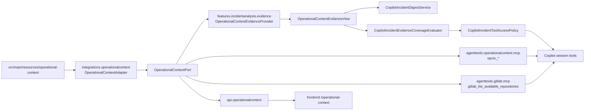

# Operational Context: model danych, tools i wykorzystanie

## Cel dokumentu

Ten dokument opisuje obecny model `operational-context` w projekcie:

- jaki problem rozwiazuje,
- jak wyglada model danych i konfiguracja katalogu,
- jakie tools sa wystawiane dla AI,
- jak katalog jest uzywany technicznie w evidence pipeline, Copilot runtime,
  GitLab tools, operator-facing API i frontendzie,
- jakie invarianty trzeba utrzymac przy dalszym rozwoju.

Operational context jest reusable capability katalogowa. Incident analysis jest
pierwszym konsumentem, ale katalog nie jest wlasnoscia feature'u incydentowego.
Warstwa integracji laduje i filtruje katalog, warstwa `agenttools` wystawia
neutralne tools, a feature incident analysis decyduje kiedy i jak uzyc tej
capability w analizie.

## Problemy, ktore rozwiazuje

### 1. Mapowanie sygnalow runtime na kanoniczny system

Logi, stacktrace, deployment context i runtime signals zwykle mowia jezykiem
technicznym: `serviceName`, `containerName`, endpoint, host, queue, topic,
package, klasa, repozytorium albo nazwa procesu. Same te sygnaly rzadko
wystarczaja do odpowiedzi operatorskiej:

- jaki logiczny system jest dotkniety,
- ktory proces biznesowy lub techniczny jest zwiazany z incydentem,
- gdzie szukac kodu,
- kogo potencjalnie wlaczyc do weryfikacji,
- jakie ograniczenia widocznosci trzeba uczciwie wskazac.

Operational context zamienia te sygnaly w kontrolowany graf katalogowy.
Kanonicznym wezlem aplikacji/uslugi jest `system`. Runtime, deployment,
container i service names sa metadanymi oraz sygnalami rozpoznania systemu, a
nie osobnym bytem referencyjnym.

### 2. Zakres szukania kodu przekraczajacy jedno repozytorium

Jedno wdrozenie moze miec kod w kilku repozytoriach, modulach, bibliotekach
shared, klientach generowanych albo konfiguracji deploymentowej. Bez katalogu
AI latwo konczy na pierwszym znalezionym repo i blednie uznaje, ze klasa albo
flow sa niedostepne.

`repo-map.yml` i `codeSearchScopes` definiuja, ktore repozytoria nalezy
przeszukiwac razem dla danego systemu, procesu, bounded contextu albo
integracji. Scope niesie role repozytoriow, priorytety, module ids, package
prefixes, class hints, endpoint hints, DB hints, workflow hints i strategie
szukania.

### 3. Ownership i handoff bez zgadywania jednego wlasciciela

Katalog nie zaklada, ze kazdy byt ma jednego prostego wlasciciela. Uzywa
relacji odpowiedzialnosci (`responsibilities`) i `handoffHints`, gdzie zespol
moze byc runtime operatorem, maintainerem repo, stewardem modulu, partnerem
integracji, wsparciem platformowym, data ownerem albo zewnetrznym wlascicielem.

Dzieki temu rekomendacja handoffu moze byc oparta o role i evidence, a nie o
proste "repo == owner".

### 4. Lokalny slownik, bounded context i procesy

Nazwy z logow i kodu czesto sa skrotami lokalnego jezyka domeny. Katalog
utrzymuje:

- `bounded-contexts.yml` dla granic semantycznych i lokalnego jezyka,
- `processes.yml` dla procesow i krokow,
- `glossary.md` dla terminow, aliasow, akronimow i markerow bledow.

To pomaga AI opisac `affectedFunction`, `affectedProcess` i
`affectedBoundedContext` jezykiem operatora, ale z waznym ograniczeniem:
kontekst katalogowy nie jest samodzielnym dowodem root cause.

### 5. Grounding DB i integracji

Operational context dostarcza DB hints i integration hints: datasource names,
schemas, tables, entities, repositories, HTTP endpoints, operation names,
queues, topics, routing keys, hosts, client classes i exception markers.

W flow incydentu te dane pomagaja zawesic GitLab i DB exploration. Nie zastepuja
jednak GitLab evidence ani DB tools. Przy symptomach JPA/repository/data access
AI ma najpierw sprobowac ugruntowac encje, repozytorium, tabele i relacje w
kodzie, a dopiero potem uzywac DB discovery jako fallbacku.

### 6. Operator-facing jakosc katalogu

Katalog jest rowniez widoczny w UI pod `/operational-context`.
Backend wystawia status, validation findings, open questions, wyszukiwarke i
szczegoly encji. To rozwiazuje praktyczny problem utrzymania katalogu:
operator i developer widza, dlaczego dana relacja istnieje, skad pochodzi i
co jest niekompletne.

## Granice i invarianty

- `system` jest kanonicznym bytem katalogowym dla aplikacji/uslugi.
- Runtime/deployment/service/container names sa sygnalami i metadanymi systemu.
  Nie przywracac osobnego canonical runtime component.
- Operational context jest katalogiem, nie dowodem przyczyny incydentu.
- `integrations.operationalcontext` nie importuje feature'ow, tools, API ani
  platformy AI.
- `agenttools.operationalcontext` nie importuje Copilota ani incident analysis.
- Incidentowe zasady uzycia katalogu mieszkaja w feature policy, prompt/guidance
  i skillu `incident-operational-context-tools`.
- Tools `opctx_*` nie przyjmuja `correlationId`, `environment`, `gitLabGroup`
  ani `gitLabBranch` jako model-facing input.
- Jedynym operatorskim argumentem wspolnym dla tooli jest krotki `reason`.
- Katalog nie powinien zawierac sekretow, tokenow, danych kontaktowych ani
  pelnych payloadow produkcyjnych.

## Zrodla konfiguracji

Runtime katalogu jest ladowany z classpath resource root konfigurowanego przez:

```properties
analysis.operational-context.enabled=false
# analysis.operational-context.resource-root=operational-context
# analysis.operational-context.max-items-per-type=2
# analysis.operational-context.max-glossary-terms=3
# analysis.operational-context.max-handoff-rules=2
```

Domyslny katalog znajduje sie w `src/main/resources/operational-context`.
Obecne pliki:

| Plik | Rola |
| --- | --- |
| `operational-context-index.md` | opis przeznaczenia katalogu, zasad modelowania, quality gates i update rules |
| `systems.yml` | logiczne systemy, runtime/deployment metadata, sygnaly rozpoznania, relacje i local code-search hints |
| `repo-map.yml` | repozytoria, moduly, source layout i top-level `codeSearchScopes` |
| `processes.yml` | procesy biznesowe, techniczne, scheduled, event-driven i ich kroki |
| `integrations.yml` | kontrakty integracyjne, strony komunikacji, transport, kanaly i failure modes |
| `bounded-contexts.yml` | granice domenowe, lokalny jezyk, relacje i operational signals |
| `teams.yml` | zespoly, external parties i role odpowiedzialnosci |
| `glossary.md` | lokalne terminy, aliasy, match signals i disambiguation notes |
| `handoff-rules.md` | reguly routingu i handoffu podporzadkowane faktom z katalogu |

Obecny katalog produkcyjny jest duzy. Prosty skan top-level entries pokazuje
rzad wielkosci: 39 systemow, 8 repozytoriow, 8 code-search scopes, 4 procesy,
47 integracji, 14 bounded contexts, 4 zespoly, ponad 100 wpisow glossary i
kilkadziesiat regul handoff. Dokladne runtime counts pochodza z parsera
adaptera, bo markdown i `gaps` sa parsowane semantycznie.

## Model danych

### Katalog

Glownym typem integracji jest `OperationalContextCatalog`.
Zawiera listy:

- `teams`,
- `processes`,
- `systems`,
- `integrations`,
- `repositories`,
- `codeSearchScopes`,
- `boundedContexts`,
- `glossaryTerms`,
- `handoffRules`,
- `openQuestions`,
- `indexDocument`.

Kazda lista jest niemutowalna po zbudowaniu. Braki sa normalizowane do pustych
list/map, co upraszcza mappery evidence, tools i API.

### Wspolny kontrakt encji

Wiekszosc encji implementuje `OperationalContextEntry`. Wspolne pola i
zachowania:

- `id`, `name`, `shortName`, `summary`, `purpose`,
- `aliases` i `useFor`,
- `references` do innych bytow katalogu,
- `responsibilities`,
- `matchSignals`,
- `handoffHints`,
- `relations`,
- `payload`, czyli niemutowalny raw map snapshot bez publikowania go w
  neutralnych tools.

`genericSignals()` zbiera aliasy, `useFor`, match signals i handoff route
signals. Konkretne typy encji rozszerzaja ten zbior o wlasne sygnaly, np.
repozytorium dodaje GitLab path, source roots, module paths, package prefixes i
class hints.

### System

`OperationalContextSystem` opisuje logiczny system:

- typ (`kind`), lifecycle, operational status, criticality,
- `deployment`: service names, application names, container names, deployment
  names, namespaces, images i artifact names,
- `codeSearchScope`: lokalne repozytoria, package prefixes, class hints,
  config prefixes, generated clients, shared libraries i notatki szukania,
- `references`: repozytoria, procesy, bounded contexts, integracje, terminy,
  zespoly, data stores i handoff rules,
- `responsibilities`, `relations`, `handoffHints`.

To najwazniejszy byt dla rozpoznania incydentu. Deployment metadata sluzy do
dopasowania, ale nie tworzy osobnego targetu runtime.

### Repository

`OperationalContextRepository` opisuje repozytorium i jego wewnetrzny layout:

- `git`: provider, group, project, projectPath, defaultBranch, url, aliases,
  inferred,
- `sourceLayout`: build tool, build files, source/test/resource roots, module
  paths, generated source paths, important paths, configuration, deployment,
  migrations, workflow definitions i docs,
- `modules`: modulowe source paths, package hints, lifecycle, references i
  match signals,
- `classHints`, `packagePrefixes`, `endpointHints`, `queueTopicHints`.

Repozytorium moze referencjonowac systemy, procesy, bounded contexts i
integracje. W GitLab tools ten model jest mapowany na `projectName`,
`gitLabPath`, aliasy i sygnaly wyszukiwania.

### Code Search Scope

`OperationalContextRepositorySearchScope` jest wirtualna encja z
`repo-map.yml/codeSearchScopes`. Nie jest komponentem runtime.

Scope definiuje:

- `target`: systemy, deployment components, procesy, bounded contexts,
  integracje i terminy, dla ktorych scope ma sens,
- `repositories`: repozytoria ze `role`, `priority`, `include`, `moduleIds` i
  `reason`,
- hints: package prefixes, class hints, endpoint hints, queue/topic hints,
- `databaseHints`: datasource names, Hikari pools, schemas, tables, entities,
  migrations,
- `workflowHints`: job names, workflow names, definition paths,
- `searchStrategy`: priority order, czy wlaczac generated clients, shared
  libraries, deployment config, documentation oraz notatki,
- `limitations`.

To najwazniejszy model dla wielorepozytoryjnego code grounding. AI ma traktowac
projekty ze scope'u jako jeden logiczny zakres kodu systemu.

### Process

`OperationalContextProcess` opisuje proces:

- typ, lifecycle, criticality,
- `participants`: actors, primary systems, supporting systems, external
  systems, platform components,
- `processBoundary`: m.in. sygnaly zakonczenia,
- `outcomes`: success artifacts,
- `steps`: kroki procesu z wlasnymi references i match signals,
- `failureModes`.

Procesy pomagaja tlumaczyc techniczny blad na funkcje operacyjna i routing.

### Integration

`OperationalContextIntegration` opisuje kontrakt miedzy systemami:

- category, integration style, flow direction, criticality,
- `participants`: source, targets, intermediaries, finalTargets,
- `transport`: HTTP, messaging i database signals,
- `channels`: typ, nazwa, kierunek i sygnaly,
- `implementation`: local side, client/controller/listener/publisher classes,
  generated clients, config classes,
- `failureModes`.

Integration entries sa uzywane do rozpoznania endpointow, hostow, kolejek,
topicow, klientow, exception markers i kierunku handoffu.

### Bounded Context

`OperationalContextBoundedContext` opisuje granice semantyczne:

- summary i purpose,
- references do systemow, repozytoriow, procesow, integracji i terminow,
- `operationalSignals`: np. service names, endpoint prefixes, package
  prefixes,
- relations do innych contextow.

Ten model jest pomocny w polach odpowiedzi AI typu `affectedBoundedContext`,
ale tylko gdy pasuje do evidence incydentu.

### Team

`OperationalContextTeam` opisuje zespol lub strone odpowiedzialnosci:

- purpose, aliases, useFor,
- references do obiektow katalogu,
- role w `responsibilities`,
- handoff hints.

Zespol nie powinien byc wyprowadzany prostym zgadywaniem po nazwie repo.
Katalog pozwala pokazac, jaka rola i zrodlo uzasadnia dana odpowiedzialnosc.

### Glossary Term

`OperationalContextGlossaryTerm` pochodzi z `glossary.md` i zawiera:

- `term`, `category`, `definition`,
- `useInContext`,
- `doNotConfuseWith`,
- `matchSignals`,
- `canonicalReferences`,
- `synonyms`,
- `notes`.

Glossary sluzy do lokalnego jezyka i disambiguation, nie do dowodzenia root
cause.

### Handoff Rule

`OperationalContextHandoffRule` pochodzi z `handoff-rules.md` i zawiera:

- `id`, `title`, `routeTo`,
- `useWhen`, `doNotUseWhen`,
- `requiredEvidence`,
- `expectedFirstAction`,
- `partnerTeams`,
- `notes`.

Reguly handoffu sa overlayem koordynacyjnym. Maja pomagac w rekomendacji
kolejnego kroku, ale nie nadpisuja faktow z systemow, integracji, procesow,
zespolow ani glossary.

### Open Questions

`OperationalContextOpenQuestion` reprezentuje trwale luki katalogu. Adapter
zbiera je z:

- sekcji `gaps` w YAML-ach,
- sekcji `## Gaps` w markdownach.

Open questions maja `sourceFile`, `entityType`, `entityId`, `question`,
`severity` i `status`. UI pokazuje je jako jawna liste rzeczy do dopracowania.

## Ladowanie i filtrowanie katalogu

`OperationalContextAdapter` implementuje `OperationalContextPort`.

Techniczny przeplyw:

1. Normalizuje `analysis.operational-context.resource-root`.
2. Laduje YAML-e przez `YamlMapFactoryBean`.
3. Laduje markdowni jako tekst UTF-8.
4. Mapuje raw mapy na typed records z `OperationalContextDtos`.
5. Parsuje `glossary.md` i `handoff-rules.md` przez
   `OperationalContextMarkdownParser`.
6. Zbiera `openQuestions` z YAML/markdown gaps.
7. Cache'uje zbudowany `OperationalContextCatalog` w polu `volatile`.
8. Dla zapytan innych niz `OperationalContextQuery.all()` zwraca przefiltrowany
   katalog.

`OperationalContextQuery` ma:

- `includedEntryTypes`,
- `filters`,
- `includeIndexDocument`.

`OperationalContextFilter` filtruje po typie encji, sciezce w payloadzie,
wartosciach i trybie `EXACT` albo `CONTAINS`. Sciezki obsluguja notacje
kropkowa, np. `references.systems` albo `git.projectPath`.

Istotne: filtrowanie jest capability adaptera, a nie logika incident analysis.
Dzieki temu ten sam port moze byc uzyty przez evidence provider, tools, GitLab
helper i operator API.

## Deterministyczny enrichment evidence

`OperationalContextEvidenceProvider` jest krokiem pipeline w
`features.incidentanalysis.evidence.provider.operationalcontext`.

Collector wykonuje operational context po:

1. Elasticsearch log evidence,
2. deployment context,
3. rownoleglym fan-out Dynatrace runtime signals i GitLab deterministic
   resolved code evidence.

Provider:

1. sprawdza `analysis.operational-context.enabled`,
2. laduje katalog przez `OperationalContextPort.loadContext(all)`,
3. buduje `OperationalContextIncidentSignals` z dotychczasowego
   `AnalysisContext`,
4. dopasowuje katalog przez `OperationalContextCatalogMatcher`,
5. mapuje wynik na `AnalysisEvidenceSection` przez
   `OperationalContextEvidenceMapper`,
6. w razie bledu zwraca pusta sekcje i loguje ostrzezenie.

### Sygnaly incydentu

`OperationalContextIncidentSignals` buduje:

- jeden znormalizowany `corpus` z providerow, kategorii, tytulow itemow,
  nazw atrybutow i wartosci atrybutow,
- `exactValues` z tytulow i wartosci atrybutow,
- `attributeNames` z nazw atrybutow.

Dzieki temu katalog moze dopasowac system, repozytorium albo integracje nie
tylko po tekscie logu, ale tez po strukturze evidence, np. `serviceName`,
`containerName`, `projectName`, `filePath`, `endpoint`, `queueName`.

### Scoring matcher

`OperationalContextCatalogMatcher` punktuje:

- systemy po identity, generic signals, referencjach do procesow, contextow i
  repozytoriow,
- integracje po identity, transport signals, protocols i dopasowanych systemach,
- repozytoria po project path, project, group, source roots, module paths,
  important paths, class hints i references,
- procesy po uczestnikach, krokach, completion signals i system matches,
- bounded contexts po signalach, operational signals i relacjach,
- zespoly po ownership/partner references do dopasowanych encji,
- glossary po terminach, definicjach, synonymach i match signals,
- handoff rules po wzorcach incydentu, np. timeout, queue/topic, JDBC/SQL,
  platform/deployment albo boundary mismatch.

Limity wynikow biora sie z properties:

- `max-items-per-type`,
- `max-glossary-terms`,
- `max-handoff-rules`.

### Evidence output

Sekcja evidence ma:

```text
provider = operational-context
category = matched-context
```

Mapper publikuje itemy typu:

- `Operational system ...`,
- `Operational integration ...`,
- `Operational process ...`,
- `Operational repository ...`,
- `Operational bounded context ...`,
- `Operational team ...`,
- `Operational glossary term ...`,
- `Operational handoff rule ...`.

Najwazniejsze atrybuty systemu:

- `systemId`, `name`,
- `ownerTeamIds`, `partnerTeamIds`, `externalOwner`,
- `processIds`, `contextIds`, `repositoryIds`,
- `codeSearchScopeIds`,
- `codeSearchRepositoryIds`,
- `codeSearchProjects`,
- `codeSearchRepositoryRoles`,
- `sourcePackages`,
- `classHints`,
- `matchedBy`.

`OperationalContextEvidenceView` jest typed read modelem nad generyczna
sekcja. Korzystaja z niego downstreamy, np. digest Copilota i coverage
evaluator.

## Wplyw na artefakty i prompt Copilota

Operational context trafia do Copilota na kilka sposobow.

### Evidence coverage

`CopilotIncidentEvidenceCoverageEvaluator` ustawia
`IncidentOperationalContextCoverage`:

- `NONE`, gdy nie ma sekcji operational context,
- `PARTIAL`, gdy sekcja istnieje bez itemow,
- `MATCHED`, gdy sekcja ma itemy.

W praktyce pusta sekcja nie jest dodawana do `AnalysisContext`, wiec brak
dopasowania zwykle oznacza `NONE` w koncowym snapshocie evidence.

### Digest

`CopilotIncidentDigestService` dodaje sekcje `Operational code search scope`.
Z `OperationalContextEvidenceView` zbiera:

- matched systems,
- code search scopes,
- GitLab projects to search as one deployment component,
- code search repository roles,
- package roots,
- class hints.

To jest skompresowany hint dla AI, zeby przy szukaniu kodu nie traktowac
pierwszego repozytorium jako pelnego zakresu systemu.

### Tool access policy

`CopilotIncidentToolAccessPolicy` wlacza `opctx_*` w initial session, gdy:

- operational context coverage jest `NONE` albo `PARTIAL`,
- albo istnieje luka `MISSING_FLOW_CONTEXT`,
- albo istnieje luka `AFFECTED_FUNCTION_GITLAB_RECOMMENDED`,
- albo istnieje luka `DB_CODE_GROUNDING_NEEDED`.

W follow-up chat operational context tools sa wlaczone zawsze, jesli callbacki
sa zarejestrowane. Powod: pytania follow-up czesto dotycza ownershipu,
procesu, znaczenia biznesowego, handoffu lub szerszego katalogu, a nie tylko
pierwotnego incident evidence.

### Prompt guidance

Prompt initial mowi, ze Operational Context tools sluza do:

- kontekstu,
- ownershipu,
- code scope,
- DB targeting,
- handoff gaps.

Kazdy tool call ma miec krotki powod po polsku w `reason`.

### Skill

Skill `src/main/resources/copilot/skills/incident-operational-context-tools`
jest incidentowym playbookiem dla neutralnych tools. Najwazniejsze zasady:

- najpierw uzyj artefaktow incydentu,
- `opctx_get_scope` najwyzej raz,
- `opctx_list_entities` tylko wasko, po jednym typie,
- `opctx_search` gdy jest konkretny sygnal z logow, kodu, tool resultu albo
  pytania uzytkownika,
- `opctx_get_entity` przed poleganiem na relacjach, ownershipie, handoffie,
  procesie, bounded context albo code-search scope,
- katalog nie jest dowodem root cause,
- `system` jest canonical,
- reason zawsze po polsku, krotko i praktycznie.

### Tool descriptions

`CopilotIncidentToolGuidanceCatalog` dokleja incidentowe guidance do opisow
neutralnych tools. Dla `opctx_*` przypomina m.in.:

- uzywaj katalogu jako grounding/scope guidance,
- nie traktuj go jako dowodu root cause,
- nie powtarzaj `opctx_get_scope`,
- po search/list zrob `opctx_get_entity` przed finalnymi twierdzeniami,
- nie nazywaj `affectedProcess`, `affectedBoundedContext` lub `affectedTeam`
  bez powiazania z evidence incydentu.

## Operational Context tools

Warstwa tools mieszka w `agenttools.operationalcontext`.
Nazwy tools sa w `OperationalContextToolNames`:

| Tool | Rola |
| --- | --- |
| `opctx_get_scope` | zwraca dostepne typy encji i liczniki |
| `opctx_list_entities` | zwraca paginowany indeks encji jednego typu |
| `opctx_search` | wyszukuje po konkretnym sygnale i zwraca ranking |
| `opctx_get_entity` | zwraca kompaktowe szczegoly jednej encji |

`OperationalContextMcpTools` jest aktywne tylko przy:

```properties
analysis.operational-context.enabled=true
```

Tools laduja katalog przez `OperationalContextPort`, ale nie przyjmuja
incidentowego scope'u jako input. `ToolContext` jest uzywany tylko do logowania
runtime metadata (`analysisRunId`, `copilotSessionId`, `toolCallId`).

### `opctx_get_scope`

Input:

- opcjonalny `reason`.

Output:

- `enabled`,
- lista `entityTypes`: `type`, `label`, `count`, `listable`, `searchable`,
  `detailAvailable`.

Uzycie: odkrycie, jakie obszary katalogu sa dostepne. Nie zwraca szczegolow
encji.

### `opctx_list_entities`

Input:

- `type`: `system`, `repository`, `codeSearchScope`, `process`,
  `integration`, `boundedContext`, `team`, `glossaryTerm`, `handoffRule`,
- `page`, domyslnie 1,
- `pageSize`, domyslnie 20, max 50,
- opcjonalny `filter`,
- opcjonalny `reason`.

Output:

- typ,
- stronicowanie,
- `totalItems`, `totalPages`, `truncated`,
- lekkie karty encji: `type`, `id`, `label`, `summary`, `facets`,
  `sourceRefs`.

Uzycie: table-of-contents browse, gdy model nie zna jeszcze terminu katalogu.

### `opctx_search`

Input:

- `query`,
- opcjonalne `types`,
- `limit`, domyslnie 8, max 20,
- opcjonalny `reason`.

Output:

- query,
- typy,
- limit,
- `truncated`,
- ranking `results`: `type`, `id`, `label`, `summary`, `confidence`,
  `matchedFields`, `matchedSignals`, `why`, `sourceRefs`.

Uzycie: wyszukiwanie po ugruntowanym sygnale z evidence albo pytania.

### `opctx_get_entity`

Input:

- `type`,
- `id`,
- opcjonalne `include`: `overview`, `relations`, `signals`, `codeSearch`,
  `handoff`, `sourceCoverage`, `openQuestions`,
- opcjonalny `reason`.

Output:

- `type`, `id`, `label`, `summary`, `purpose`,
- mapy `overview`, `relations`, `signals`, `codeSearch`, `handoff`,
  `sourceCoverage`,
- `openQuestions`,
- `sourceRefs`.

Uzycie: potwierdzenie szczegolow przed finalnym wykorzystaniem ownershipu,
handoffu, relacji, code scope albo ograniczen.

### Mapper tooli

`OperationalContextToolMapper` buduje wewnetrzny indeks katalogu. Dla kazdego
typu tworzy `OpctxCatalogEntity` z:

- identity values,
- summary values,
- signal values,
- relation values,
- facets,
- overview,
- relations,
- signals,
- codeSearch,
- handoff,
- sourceCoverage,
- openQuestions,
- sourceRefs.

Search scoring rozroznia moc dopasowania po polach identity, summary, sygnalach
i relacjach. Wynik toola jest kompaktowy i nie zwraca raw `payload`.

## Budzet i audyt tools

Budzet platformowy rozpoznaje `opctx_` po prefixie i przypisuje do grupy
`operational-context`.

Domyslne limity:

```properties
analysis.ai.copilot.tool-budget.max-operational-context-calls=4
analysis.ai.copilot.tool-budget.max-operational-context-returned-characters=32000
```

W trybie `soft` przekroczenia sa logowane i widoczne w budget snapshot, ale nie
blokuja wywolania. W trybie `hard` policy moze zwrocic kontrolowany rejection
z instrukcja zakonczenia eksploracji.

Operational Context tools w V1 nie publikuja osobnej user-facing evidence
category. Sa widoczne w `aiActivityEvents` jako tool calls. Ich wynik jest
traktowany jako katalogowe grounding/scope guidance, a nie jako dowod root
cause.

## Powiazanie z GitLab tools

Operational context jest uzywany takze przez GitLab capability.

`gitlab_list_available_repositories`:

- laduje z katalogu wpisy `REPOSITORY`,
- filtruje je do biezacej hidden `gitLabGroup`,
- zwraca repozytoria jako `GitLabAvailableRepository`,
- zwraca `codeSearchScopes` jako `GitLabAvailableCodeSearchScope`,
- przekazuje `projectName`, `gitLabPath`, aliases, systems, bounded contexts,
  processes, integrations, package prefixes, endpoint prefixes i module paths.

Jesli scope wskazuje kilka repozytoriow, AI ma uzyc wszystkich `projectName`
z dopasowanego scope'u jako jednego zakresu kodu. To jest szczegolnie wazne
dla shared libraries, generated clients i modulow wspoldzielonych.

Osobny helper `OperationalContextRepositoryProjectPathResolver` potrafi
rozwinac system hints na GitLab project paths zgodne z configured group. Jest
to adapterowy use case pomocniczy, a nie incident-specific mapper.

## Operator-facing API i UI

Backendowa fasada mieszka w `api.operationalcontext`.
Endpointy:

```http
GET /api/operational-context/summary
GET /api/operational-context/systems
GET /api/operational-context/repositories
GET /api/operational-context/code-search-scopes
GET /api/operational-context/processes
GET /api/operational-context/integrations
GET /api/operational-context/bounded-contexts
GET /api/operational-context/teams
GET /api/operational-context/glossary
GET /api/operational-context/handoff-rules
GET /api/operational-context/open-questions
GET /api/operational-context/validation
GET /api/operational-context/search?q=...
GET /api/operational-context/entities/{type}?id=...
GET /api/operational-context/entities/{type}/{id}
```

`OperationalContextViewService` buduje operator-facing DTO:

- summary counts i health cards,
- explainable aggregates,
- row DTO per typ katalogu,
- search results,
- entity detail drawer,
- validation findings,
- open questions,
- source references,
- raw source preview ograniczony do UI detail.

Walidacje obejmuja m.in.:

- reference integrity,
- ownership consistency,
- completeness,
- signal quality,
- modeling quality,
- handoff readiness.

Status katalogu:

- `empty`, gdy nie ma wpisow,
- `hasIssues`, gdy istnieje validation error,
- `partial`, gdy brakuje kluczowych typow,
- `ready`, gdy katalog jest wystarczajaco kompletny i bez errorow.

Frontend ma route `/operational-context` i zakladki:

- Overview,
- Signal Resolver,
- Systems,
- Repositories,
- Code Search,
- Processes,
- Integrations,
- Bounded Contexts,
- Teams,
- Glossary,
- Handoff,
- Validation,
- Open Questions.

Ekran uzywa `OperationalContextApiService` i tych samych DTO, ktore zwraca
backend. Link do katalogu jest dostepny z glownych ekranow operatorskich oraz
z finalnego wyniku analizy.

## Funkcjonalny sposob wykorzystania w analizie incydentu

Operational context wspiera analize, ale jej nie zastepuje.

Typowy flow:

1. Operator startuje `POST /analysis/jobs` tylko z `correlationId` i opcjami AI.
2. Evidence pipeline zbiera logi, deployment context, runtime signals i code
   evidence.
3. Operational context provider dopasowuje katalog do juz zebranych sygnalow.
4. Copilot dostaje digest z operational code search scope i coverage gaps.
5. Jesli brakuje kontekstu, AI moze uzyc `opctx_*`.
6. Jesli brakuje code grounding, AI moze uzyc GitLab tools, a
   `gitlab_list_available_repositories` wykorzysta code search scopes z
   katalogu.
7. Jesli potrzebna jest DB diagnostyka, operational context pomaga zawezic
   system/repo/DB hints, ale DB state jest weryfikowany przez DB tools.
8. Odpowiedz AI moze nazwac affected process/context/team tylko wtedy, gdy
   katalog jest zgodny z incident evidence albo tool resultami.
9. Rekomendacja handoffu moze uzyc handoff hints/rules, ale musi wskazac jakie
   evidence powinno trafic do odbiorcy.

## Techniczny przeplyw danych



## Co dodawac gdzie

### Nowa encja albo pole katalogu

1. Dodaj dane do odpowiedniego pliku w `src/main/resources/operational-context`.
2. Jesli pole ma byc typed, dodaj je w `integrations.operationalcontext`
   (`OperationalContextDtos` i mapper raw map).
3. Jesli ma byc widoczne dla AI tools, dodaj mapowanie w
   `OperationalContextToolMapper`.
4. Jesli ma byc widoczne dla operatora, dodaj mapping w
   `api.operationalcontext`.
5. Jesli ma wplywac na incident evidence, dodaj scoring/mapowanie w providerze
   operational context.

### Nowe zasady uzycia w analizie incydentu

Nie dodawaj ich do neutralnego MCP mappera. Wlasciwe miejsca:

- `features.incidentanalysis.ai.copilot.preparation` dla coverage i tool policy,
- `features.incidentanalysis.ai.copilot.tools.description` dla incidentowego
  guidance tool descriptions,
- `src/main/resources/copilot/skills/incident-operational-context-tools` dla
  stalego playbooka modelu.

### Nowy sposob ekspozycji katalogu

Jesli jest neutralny i reusable, powinien isc przez:

- `integrations.operationalcontext` dla portu/modelu danych,
- `agenttools.operationalcontext` dla agent tools,
- `api.operationalcontext` dla operator-facing HTTP.

Nie wpinaj go bezposrednio w incident job API, jesli nie jest specyficznym
use case'em analizy incydentu.

## Najwazniejsze antywzorce

- Traktowanie glossary albo handoff rule jako dowodu awarii.
- Dopisywanie `correlationId`, `environment`, `gitLabGroup` albo
  `gitLabBranch` do model-facing schema `opctx_*`.
- Przywracanie osobnego canonical runtime component obok `system`.
- Zgadywanie wlasciciela po pierwszym repozytorium albo po nazwie paczki.
- Konczenie GitLab exploration po jednym repo, gdy matched
  `codeSearchScope` wskazuje kilka projektow.
- Przenoszenie incidentowych heurystyk do `integrations.operationalcontext`
  albo `agenttools.operationalcontext`.
- Publikowanie raw `payload` z katalogu przez tools dla modelu.
- Dodawanie sekretow albo produkcyjnych payloadow do katalogu.

## Najkrotsze podsumowanie

Operational context jest curated operational graph: laczy systemy,
repozytoria, code-search scopes, procesy, integracje, bounded contexts,
zespoly, terminy i handoff rules. Funkcjonalnie pomaga rozumiec gdzie w
organizacyjnym i technicznym krajobrazie lezy incydent. Technicznie robi to
przez typed adapter katalogu, deterministic evidence enrichment, neutralne
`opctx_*` tools, GitLab repository discovery, incidentowe guidance/policy i
operator-facing API/UI do utrzymania jakosci katalogu.
