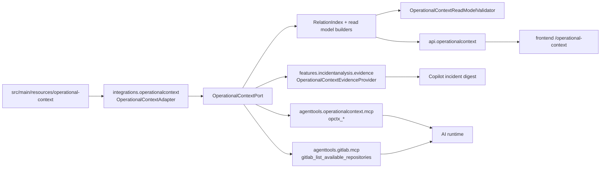

# Operational Context: knowledge index dla analizy systemowej

## Cel dokumentu

Ten dokument jest kanonicznym opisem `operational-context` w projekcie. Opisuje
zalozenia, cel, aktualna implementacje i zasady dalszego rozwoju katalogu jako
indeksu wiedzy dla AI-augmented system analysis.

Operational context jest reusable capability katalogowa. Incident analysis jest
pierwszym konsumentem, ale katalog nie jest wlasnoscia feature'u incydentowego.
Ma wspierac obecne i przyszle scenariusze:

- incident analysis po `correlationId`,
- flow explorer,
- functional logic explorer,
- natural-language data diagnostics,
- analiza zasiegu bledu,
- generowanie dokumentacji technicznej i funkcjonalnej,
- onboarding nowego analityka,
- inne przyszle feature'y wymagajace zrozumienia systemu as-is.

Katalog ma byc indeksem wiedzy, a nie dumpem dokumentacji. Ma pomagac AI
odnalezc wlasciwy obszar systemu, dobrac kod do doczytania, zrozumiec flow,
wskazac ograniczenia widocznosci i zdecydowac, jakie tools albo repozytoria
sa potrzebne do dalszej analizy.

## Problem

Analizowany krajobraz systemowy jest mieszany:

- czesc systemu jest legacy,
- czesc jest w trakcie przebudowy,
- czesc zostala przepisana,
- te same bounded contexty moga miec implementacje w monolicie, mikroserwisie,
  bibliotece shared albo rownolegle w starej i nowej implementacji,
- proces biznesowy moze przechodzic przez wiele bounded contextow i systemow,
- support capability, np. notifications, moze byc uzywane przez wiele core
  processow.

Sama wiedza z logow, stacktrace, nazw deploymentu albo pojedynczego repozytorium
nie wystarcza. LLM nie powinien zgadywac:

- czy klasa jest w glownym repozytorium, module, bibliotece shared albo
  wygenerowanym kliencie,
- ktory system jest kanonicznym wlascicielem runtime signal,
- czy znaleziony bounded context jest implementacja docelowa, zastepowana czy
  rownolegla,
- ktore integracje i systemy sa downstream/upstream dla konkretnego flow,
- do jakiego zespolu albo partnera nalezy skierowac handoff.

Operational context ma rozwiazac ten problem przez kontrolowany graf faktow,
read modele i narzedzia, ktore dostarczaja AI kompletny, ale ograniczony
tokenowo kontekst.

## Glowna zasada modelowania

Write model i read model maja rozne role.

Write model odpowiada na pytanie: gdzie fakt jest utrzymywany.

Read model odpowiada na pytanie: jaki kontekst dostaje FE, LLM albo tool dla
konkretnego zadania.

Kod moze replikowac relacje w read modelu, aby input dla LLM byl kompletny bez
wzgledu na to, od ktorej encji zaczyna analiza. YAML/MD nie powinny replikowac
tych samych relacji recznie. Kazdy fakt powinien miec jedno miejsce
utrzymania, a backlinki, sasiedztwo, scope'y i widoki zadaniowe powinny byc
generowane przez kod.

Konsekwencje:

- fakt ma wlasciciela wedlug typu faktu, a nie wedlug typu encji,
- `system` jest kanonicznym bytem aplikacji/uslugi,
- runtime/deployment/service/container names sa sygnalami systemu, nie osobnym
  bytem referencyjnym,
- relacje zwrotne sa projekcja read modelu,
- kazda relacja pochodna ma provenance,
- brak danych jest reprezentowany jako open question, validation finding albo
  limitation, a nie uzupelniany zgadywaniem.

## Granice capability

Operational context jest neutralna capability:

- `integrations.operationalcontext` laduje katalog, buduje read modele i
  waliduje graf,
- `agenttools.operationalcontext` wystawia neutralne tools `opctx_*`,
- `api.operationalcontext` wystawia operator-facing API i projekcje dla FE,
- feature'y analityczne decyduja, kiedy i jak uzyc katalogu.

Invarianty:

- `integrations.operationalcontext` nie importuje feature'ow, tools, API ani
  platformy AI.
- `agenttools.operationalcontext` nie importuje Copilota ani incident analysis.
- Incidentowe zasady uzycia katalogu mieszkaja w feature policy, prompt
  guidance i skillach Copilota.
- Tools `opctx_*` nie przyjmuja `correlationId`, `environment`, `gitLabGroup`
  ani `gitLabBranch` jako model-facing input.
- Jedynym wspolnym model-facing argumentem operatorskim tooli jest krotki
  `reason`.
- Katalog nie zawiera sekretow, tokenow, danych kontaktowych ani pelnych
  payloadow produkcyjnych.

## Potrzeby analityczne

Operational context musi wspierac szeroki zestaw pytan, nie tylko incydenty.

### Gdzie jest klasa, metoda albo konfiguracja

Read model musi wskazac:

- code-search scope,
- glowne repozytorium,
- biblioteki shared i generated clients,
- priorytet repozytoriow i modulow,
- source roots, module ids, package prefixes,
- class hints, endpoint hints, DB hints,
- lifecycle role implementacji,
- powody wlaczenia repozytorium do scope'u.

LLM nie powinien zgadywac, czy dana klasa jest w glownym repo, bibliotece,
module monolitu albo implementacji zastepowanej.

### Jak wyglada flow requestu albo use case'u

Read model musi opisac:

- trigger flow,
- kroki uporzadkowane,
- systemy, bounded contexty, implementacje i integracje na kazdym kroku,
- endpointy, kolejki, topic, tabele, payload hints, klasy i moduly,
- rozroznienie read/write, command/query, sync/async, scheduler,
- upstream/downstream wyliczony z krokow flow.

Przyklad klasy pytania:

```text
FE -> agreement process endpoint -> DB write -> notifications -> external system
```

### Jaki jest zasieg bledu albo zmiany

Blast-radius read model musi startowac od:

- endpointu,
- klasy,
- tabeli,
- kolejki/topicu,
- integracji,
- systemu,
- bounded contextu,
- procesu albo flow.

Wynik powinien wskazac impacted systems, bounded contexty, integracje, procesy,
flow, datastore i external parties, z confidence, direction, provenance i
recommended next reads.

### Jak zrozumiec proces as-is

Read model musi umiec pokazac:

- proces i jego kroki,
- bounded contexty i implementacje dla procesu,
- ktore kroki sa w monolicie, mikroserwisie, bibliotece shared albo
  implementacji docelowej,
- gdzie konczy sie core context, a zaczyna support/technical context,
- code-search scopes i glossary potrzebne do analizy procesu.

### Jak onboardowac nowego analityka

Onboarding view powinien byc generowany z read modelu i zawierac:

- najwazniejsze systemy i bounded contexty,
- lokalny jezyk, glossary i rzeczy, ktorych nie mylic,
- glowne procesy i flows,
- najwazniejsze repozytoria i code-search scopes,
- typowe awarie i handoff rules,
- migracje, rownolegle implementacje i known gaps.

### Jak generowac dokumentacje

Documentation view powinien byc projekcja read modelu, nie kopia raw YAML.
Musi pokazywac:

- fakty potwierdzone,
- fakty pochodne,
- heurystyki,
- ograniczenia widocznosci,
- provenance do miejsca utrzymania faktu.

## Zrodla katalogu

Runtime katalogu jest ladowany z classpath resource root:

```properties
analysis.operational-context.enabled=false
# analysis.operational-context.resource-root=operational-context
# analysis.operational-context.max-items-per-type=2
# analysis.operational-context.max-glossary-terms=3
# analysis.operational-context.max-handoff-rules=2
```

Domyslny katalog znajduje sie w `src/main/resources/operational-context`.

| Plik | Wlasciciel faktow |
| --- | --- |
| `operational-context-index.md` | opis katalogu, reguly modelowania, quality gates i update rules |
| `systems.yml` | kanoniczne systemy, runtime/deployment metadata, service names, aliases, local runtime signals |
| `repo-map.yml` | repozytoria, moduly, source layout, shared libraries, generated clients i code-search scopes |
| `processes.yml` | procesy, kroki procesow, participants procesu, outcomes i process boundaries |
| `integrations.yml` | kontrakty komunikacji, participants, transport, channels, implementation hints i failure modes |
| `bounded-contexts.yml` | granice semantyczne, local language, concepts, invariants i analysis hints |
| `teams.yml` | responsibilities, ownership roles, handoff hints i partner responsibilities |
| `glossary.md` | terminy, aliasy, akronimy, do-not-confuse, match signals i typed canonical references |
| `handoff-rules.md` | reguly routingu, wymagane evidence, expected first action i context links |

## Wlasciciele faktow

### `systems.yml`

Utrzymuje fakty o system identity i runtime:

- canonical system id,
- aliases,
- deployment/service/container/application names,
- health endpoints,
- criticality i lifecycle,
- runtime markers,
- platform dependencies tylko wtedy, gdy sa faktem runtime.

Nie powinien recznie utrzymywac:

- listy wszystkich integracji systemu,
- listy wszystkich bounded contextow, jezeli wynikaja z innych faktow,
- self-reference,
- relacji system-system wynikajacych z `integrations.yml` albo flow.

### `repo-map.yml`

Utrzymuje fakty o kodzie:

- GitLab paths,
- repositories,
- modules,
- source/test/resource roots,
- build files,
- generated sources,
- shared/imported libraries,
- package/class/endpoint/DB hints,
- `codeSearchScopes`.

To najwazniejszy plik dla wielorepozytoryjnego code grounding. Scope ma
obejmowac glowne repozytorium i biblioteki wymagane do analizy, aby LLM nie
musial zgadywac, gdzie jest klasa.

### `processes.yml`

Utrzymuje fakty procesowe:

- typ procesu,
- lifecycle,
- participants,
- steps,
- process boundary,
- outcomes,
- failure modes,
- relacje do flow albo bounded contextow, jezeli sa faktem procesu.

Nie powinien recznie utrzymywac pelnego call graphu technicznego.

### `integrations.yml`

Utrzymuje fakty o kontraktach komunikacji:

- source participant,
- target participant,
- intermediaries,
- final targets,
- HTTP, messaging, DB, file albo event transport,
- operation names,
- endpoints,
- queues/topics/routing keys,
- local implementation hints,
- retry/consistency/auth/failure modes.

Kanonicznym miejscem relacji integracja-system i integracja-bounded-context sa
`participants`. `references.*` nie powinny powtarzac tych samych faktow.

### `bounded-contexts.yml`

Utrzymuje fakty semantyczne:

- local language,
- granice domeny,
- core/support/technical classification,
- invariants,
- concepts,
- czego nie mylic,
- analysis hints.

Relacje implementacyjne do systemow, repozytoriow i integracji powinny wynikac
z implementation/code-search/integration/flow facts, jezeli sa tam
jednoznacznie opisane.

### `teams.yml`

Utrzymuje ownership i routing:

- responsibilities,
- target type i target id,
- role,
- confidence,
- evidence,
- handoff hints.

Ownership moze dotyczyc systemu, repozytorium, implementacji, integracji,
procesu albo flow step. Przy migracjach ownership implementacji bywa
precyzyjniejszy niz ownership calego bounded contextu.

### `glossary.md`

Utrzymuje local language:

- terminy,
- aliasy,
- akronimy,
- match signals,
- canonical references,
- do-not-confuse,
- disambiguation notes.

Glossary nie jest dowodem root cause i nie powinno byc glownym miejscem
utrzymywania grafu relacji. Typed references moga wskazywac encje katalogu,
a opisowe aliasy pozostaja free text.

### `handoff-rules.md`

Utrzymuje instrukcje operacyjne:

- kiedy routowac,
- kiedy nie routowac,
- jaka evidence jest wymagana,
- expected first action,
- partner labels,
- typed `Operational context links`.

Handoff rules moga linkowac do encji katalogu, ale nie powinny dublowac
relacji process/system/integration utrzymywanych gdzie indziej.

## Model danych integracji

Glownym modelem runtime jest `OperationalContextCatalog` z pakietu
`integrations.operationalcontext`. Zawiera listy:

- `teams`,
- `processes`,
- `systems`,
- `integrations`,
- `repositories`,
- `codeSearchScopes`,
- `boundedContexts`,
- `glossaryTerms`,
- `handoffRules`,
- `openQuestions`,
- `indexDocument`.

Wiekszosc encji implementuje `OperationalContextEntry` i ma wspolne pola:

- `id`, `name`, `shortName`, `summary`, `purpose`,
- `aliases`, `useFor`,
- `references`,
- `responsibilities`,
- `matchSignals`,
- `handoffHints`,
- `relations`,
- raw `payload` jako wewnetrzny snapshot.

Raw `payload` nie jest publikowany do neutralnych tools jako podstawowy sposob
pracy modelu. Tools i API powinny eksponowac skondensowane widoki.

## Ladowanie katalogu

`OperationalContextAdapter` implementuje `OperationalContextPort`.

Przeplyw:

1. Normalizuje `analysis.operational-context.resource-root`.
2. Laduje YAML przez `YamlMapFactoryBean`.
3. Laduje markdown jako UTF-8.
4. Mapuje raw mapy na typed records w `OperationalContextDtos`.
5. Parsuje `glossary.md` i `handoff-rules.md` przez
   `OperationalContextMarkdownParser`.
6. Zbiera `openQuestions` z YAML/markdown gaps.
7. Cache'uje zbudowany `OperationalContextCatalog`.
8. Dla zapytan innych niz `OperationalContextQuery.all()` zwraca katalog
   przefiltrowany.

`OperationalContextQuery` obsluguje:

- `includedEntryTypes`,
- `filters`,
- `includeIndexDocument`.

`OperationalContextFilter` filtruje po typie encji, sciezce w payloadzie,
wartosciach i trybie `EXACT` albo `CONTAINS`.

## Relation index

`OperationalContextRelationIndexBuilder` buduje graf relacji z write modelu.

Odpowiedzialnosci:

- normalizacja typow encji,
- budowanie `outgoingRelations`,
- budowanie `incomingRelations`,
- budowanie `neighbors`,
- deduplikacja identycznych relacji,
- wskazanie `canonicalOwner`,
- zachowanie `provenance`,
- raportowanie relation-level validation findings.

Podstawowe prymitywy read modelu:

- `EntityKey`,
- `EntityRef`,
- `SourceRef`,
- `Provenance`,
- `ReadModelRelation`,
- `ValidationFinding`.

Read model moze pokazywac relacje z obu stron, ale write model ma utrzymywac
fakt w jednym miejscu.

## Read modele

Read modele sa zadaniowymi projekcjami katalogu. Maja ograniczac tokeny i szum,
a nie odsylac LLM do calego katalogu.

### Entity relations

Entity relations odpowiada na pytanie: z czym encja jest powiazana i skad to
wiemy.

W API reprezentuje to `OperationalContextEntityRelationsReadModelDto`.
Zawiera:

- analysis target,
- outgoing relations,
- incoming relations,
- neighbors,
- validation findings,
- source references.

### Code search read model

`OperationalContextCodeSearchReadModel` odpowiada na pytanie: gdzie szukac kodu
i dlaczego.

Zawiera:

- target analizy,
- `ReadModelProfile`,
- dopasowane code-search scopes,
- repository views z role, priority i reason,
- Git metadata,
- source layout,
- modules,
- package/class/endpoint/queue/topic hints,
- database hints,
- workflow hints,
- search strategy,
- limitations,
- validation findings,
- provenance.

Ten model jest kluczowy dla GitLab tools. Jezeli scope wskazuje kilka
repozytoriow, AI powinno traktowac je jako jeden logiczny zakres kodu systemu.

### Implementation read model

`OperationalContextImplementationReadModel` odpowiada na pytanie: gdzie
bounded context albo system jest zaimplementowany.

Obecnie implementacje sa projektowane z `codeSearchScopes`, repozytoriow i
modulow. Model zawiera:

- implementation id,
- implementation kind,
- lifecycle role,
- system refs,
- bounded context refs,
- process refs,
- repository refs,
- module/package hints,
- code-search scope refs,
- source refs i provenance.

Lifecycle roles obejmuja m.in. `primary`, `source-implementation`,
`target-implementation`, `parallel`, `fallback`, `deprecated`,
`being-replaced` i `supporting-library`.

### Flow read model

`OperationalContextFlowReadModel` odpowiada na pytanie: jak przebiega request
albo use case.

Obecnie flow jest projektowany z `processes[*].steps`, relation indexu i
implementation read modelu. Model zawiera:

- analysis target,
- trigger,
- ordered steps,
- edges `next-step`,
- involved systems,
- bounded contexts,
- integrations,
- data stores,
- implementation refs,
- code-search scopes,
- endpoint/queue/topic/class/DB hints,
- integration hints,
- validation findings i provenance.

Flow read model jest podstawa dla flow explorer, documentation view i
blast-radius analysis.

### Blast-radius read model

`OperationalContextBlastRadiusReadModel` odpowiada na pytanie: co moze byc
dotkniete przez blad, zmiane albo niedostepnosc wskazanego elementu.

Moze startowac od:

- `process`,
- `system`,
- `repository`,
- `code-search-scope`,
- `bounded-context`,
- `integration`,
- `datastore`,
- `endpoint`,
- `class`,
- `table`,
- `queue`,
- `topic`.

Model zawiera impacted flows, impacted steps, impacted systems, bounded
contexts, integrations, implementations, impact type, confidence, reasons,
source refs i recommended next reads.

### Onboarding view

Onboarding nie jest osobnym wdrozonym recordem w obecnym kodzie. Jest
docelowym profilem wykorzystania istniejacych projekcji:

- entity relations,
- code-search,
- implementation,
- flow,
- blast-radius,
- glossary,
- handoff,
- open questions.

Nastepny etap optymalizacji powinien rozstrzygnac, czy onboarding view wymaga
osobnego read modelu, czy wystarczy profil/kompozycja istniejacych projekcji.

## Profile rozmiaru

Ten sam graf wiedzy musi obslugiwac UI i LLM, wiec payload powinien miec profil
rozmiaru:

- `index` - minimalny indeks do wyboru encji i kolejnego doczytania,
- `summary` - zwiezly kontekst do listy FE albo szybkiego promptu,
- `default` - domyslny kontekst dla odpowiedzi LLM,
- `expanded` - jawne doczytanie przez tool.

Zasady:

- LLM nie dostaje calego katalogu domyslnie.
- Kazdy payload ma pokazac, co zostalo uciete i jakie expanded reads sa
  dostepne.
- Related entities powinny byc limitowane i sortowane wedlug wartosci dla
  zadania.
- Dane powtarzalne w YAML nie powinny byc utrzymywane recznie; powtarzalnosc w
  read modelu jest akceptowalna, jezeli obniza koszt reasoning modelu.

### Kontrakt utrzymaniowy profili

Brak parametru `profile` w REST pozostaje kompatybilny z FE i zwraca widok
expanded. Profile `default`, `summary` i `index` sa kontraktem dla LLM, tools i
oszczednego REST. Nowe pola albo read modele powinny najpierw okreslic, w
ktorym profilu maja wartosc.

`default` powinien zawierac tylko dane, ktore pomagaja podjac kolejna decyzje:

- wybrac repozytorium, modul, shared library albo generated client,
- rozroznic `primary`, `target`, `parallel`, `legacy`, `fallback` albo
  `support` implementation,
- zrozumiec flow, upstream/downstream albo blast radius,
- pokazac confidence, limitations, validation summary i provenance,
- wskazac najmniejszy sensowny next read albo tool.

`expanded` przechowuje kosztowne dane potrzebne UI, diagnostyce albo
exhaustive analysis:

- raw source preview,
- pelne explainability groups,
- pelne validation findings,
- pelne sourceRef repetition,
- wszystkie hinty code-search,
- kompletne implementation refs per flow/blast step,
- dlugie inventories i health cards.

Nie nalezy przenosic pola do `default` tylko dlatego, ze jest dostepne w
builderze. Pole trafia do `default`, jezeli zmienia wybor kolejnego kroku albo
ogranicza zakres eksploracji. Jezeli pole tylko potwierdza UI table/detail
view, zostaje w no-profile/expanded.

### Affordances dla LLM

Default payload ma byc samonawigowalny. To nie jest klasyczne HATEOAS dla REST,
tylko praktyczna instrukcja dla agenta, jak doczytywac kontekst stopniowo.

W default/read-model responses utrzymuj:

- `links` do self, expanded i sibling read models,
- `availableExpansions` z nazwami ciezszych widokow,
- `suggestedNextReads` jako konkretne, male nastepne REST/tool reads,
- `suggestedTools` jako neutralne capability names,
- `reasonToExpand` tylko wtedy, gdy expanded ma realna wartosc,
- `omittedBecause` i `truncation`, gdy default ucina dane,
- `relevanceScore` i `reasonToRead` na elementach top-N,
- `confidence`, `limitations`, `provenance` i compact `sourceRefs`.

`suggestedNextReads` powinny zawierac kolejny najmniejszy read, nie liste
wszystkiego. Dla relacji preferuj peer entity lub sibling read model
(`code-search`, `flow`, `blast-radius`) zgodny z typem encji. Dla blast-radius
najpierw wskaz impacted flow/implementation/code-search, a dopiero potem
GitLab/DB exploration.

### Provenance i sourceRefs

Default provenance ma dawac mozliwosc sprawdzenia faktu bez powielania
dlugiego katalogowego payloadu:

- top-level `provenance.sourceRefs` powinno streszczac liczbe i rozklad refs,
- top-level `sourceRefs` powinny byc deduplikowane i stabilne,
- compact sourceRef powinien miec `refId`, `file`, `path`, `target`, `role`,
- elementy list powinny zwykle niesc `sourceRefCount`, a nie pelne source refs,
- pelne source refs i raw preview zostaja w expanded/diagnostic.

Nested refs w default powinny byc lekkie. Uzywaj `type`, `id`, opcjonalnie
`label` i `lifecycleStatus`. Nie powtarzaj `summary` w kazdym nested ref,
jezeli summary nie zmienia next read albo blast-radius decision.

### Scoring i truncation

Top-N w default musi byc deterministyczny i uzasadniony. Sortuj po kombinacji:

- confidence,
- canonical/direct provenance,
- lifecycle role i migration status,
- relation/impact type,
- target type przydatny dla dalszej eksploracji,
- criticality,
- sourceRef coverage.

Kazdy scoring jest heuristic read-model logic, nie faktem write modelu. Nie
zapisuj scoringu w YAML/MD. Szerokie sygnaly runtime (`class`, `table`,
`queue`, `topic`) powinny miec guard i nizszy `relevanceScore`, gdy lapia zbyt
duzo implementacji. Wtedy default powinien sugerowac doprecyzowanie sygnalu
przed kosztownym czytaniem kodu.

## Selekcja kontekstu dla LLM

Minimalne profile:

| Pytanie | Minimalny payload |
| --- | --- |
| Klasa/metoda/konfiguracja | code-search read model + implementation/entity envelope |
| Endpoint | flow read model + code-search bundle + DB/integration hints |
| Kolejka/topic | integration envelope + affected flows + producer/consumer code-search |
| Proces | process envelope + flows + bounded context implementations |
| Blad danych | blast-radius from table/entity + DB hints + code-search scopes |
| Onboarding | onboarding composition z top-N sasiedztwem |
| Dokumentacja | documentation view z flow, provenance i limitations |

Kazdy payload dla LLM powinien zawierac:

- task-specific context,
- source refs albo provenance,
- known gaps,
- validation/quality signals,
- suggested tools to fetch more evidence.

## Walidacja i jakosc

`OperationalContextReadModelValidator` waliduje write model i read-model graph.
Realny runtime katalog powinien ladowac sie bez validation errors i warnings.

Strict validation blokuje m.in.:

- self-reference,
- unknown relation targets,
- bidirectional references bez uzasadnionego wlasciciela,
- duplikacje `participants` i `references`,
- system dependencies odtwarzalne z integracji,
- bounded context references odtwarzalne z read modelu,
- process participant references powtorzone w `references`,
- code-search target references odtwarzalne z repository references,
- team references odtwarzalne z `responsibilities`,
- code-search scope bez repository albo target,
- unknown code-search repository.

Warning-only findings moga pozostac w kodzie jako diagnostyka dla
syntetycznych/przyszlych przypadkow, ale realny katalog nie powinien ich
zawierac bez swiadomej decyzji.

Walidacja ma sluzyc trzem celom:

- utrzymac jedno miejsce prawdy w write modelu,
- chronic LLM przed niekompletnym lub niespojnym kontekstem,
- pokazac operatorowi/reviewerowi, gdzie poprawic katalog.

## Operational Context tools

Warstwa tools mieszka w `agenttools.operationalcontext`.
Nazwy tools:

| Tool | Rola |
| --- | --- |
| `opctx_get_scope` | zwraca dostepne typy encji i liczniki |
| `opctx_list_entities` | zwraca paginowany indeks encji jednego typu |
| `opctx_search` | wyszukuje po konkretnym sygnale i zwraca ranking |
| `opctx_get_entity` | zwraca kompaktowe szczegoly jednej encji |

Tools laduja katalog przez `OperationalContextPort`. Nie przyjmuja
incidentowego scope'u jako input. `ToolContext` sluzy do runtime metadata
takich jak `analysisRunId`, `copilotSessionId` i `toolCallId`.

### `opctx_get_scope`

Input:

- opcjonalny `reason`.

Output:

- `enabled`,
- `entityTypes`: `type`, `label`, `count`, `listable`, `searchable`,
  `detailAvailable`.

Uzycie: odkrycie, jakie obszary katalogu sa dostepne.

### `opctx_list_entities`

Input:

- `type`,
- `page`,
- `pageSize`,
- opcjonalny `filter`,
- opcjonalny `reason`.

Output:

- typ,
- paginacja,
- `totalItems`, `totalPages`, `truncated`,
- lekkie karty encji z `facets` i `sourceRefs`.

Uzycie: browse indeksu, gdy model nie zna jeszcze konkretnego id.

### `opctx_search`

Input:

- `query`,
- opcjonalne `types`,
- `limit`,
- opcjonalny `reason`.

Output:

- ranking wynikow,
- confidence,
- matched fields,
- matched signals,
- `why`,
- source refs.

Uzycie: wyszukiwanie po sygnale z evidence, kodu, tool resultu albo pytania.

### `opctx_get_entity`

Input:

- `type`,
- `id`,
- opcjonalne `include`: `overview`, `relations`, `signals`, `codeSearch`,
  `handoff`, `sourceCoverage`, `openQuestions`,
- opcjonalny `reason`.

Output:

- identity,
- overview,
- relations,
- signals,
- codeSearch,
- handoff,
- sourceCoverage,
- openQuestions,
- sourceRefs.

Uzycie: potwierdzenie szczegolow przed finalnym wykorzystaniem ownershipu,
handoffu, relacji albo code scope.

## Budzet tooli

Platformowy budget policy rozpoznaje `opctx_` po prefixie i przypisuje do
grupy `operational-context`.

Domyslne limity:

```properties
analysis.ai.copilot.tool-budget.max-operational-context-calls=4
analysis.ai.copilot.tool-budget.max-operational-context-returned-characters=32000
```

Wyniki `opctx_*` sa katalogowym grounding/scope guidance, a nie dowodem root
cause. Sa widoczne w aktywnosci AI jako tool calls.

## GitLab tools i code grounding

Operational context zasila GitLab capability.

`gitlab_list_available_repositories`:

- laduje wpisy `REPOSITORY`,
- filtruje je do biezacej hidden `gitLabGroup`,
- zwraca `projectName`, `gitLabPath`, aliases i signals,
- zwraca `codeSearchScopes`,
- przenosi systems, bounded contexts, processes, integrations, package
  prefixes, endpoint prefixes i module paths.

Jesli dopasowany scope zawiera kilka repozytoriow, AI ma przeszukiwac je jako
jeden zakres komponentu. To dotyczy szczegolnie bibliotek shared, generated
clients, modulow wspoldzielonych i konfiguracji deploymentowej.

`OperationalContextRepositoryProjectPathResolver` rozwija system hints na
GitLab project paths zgodne z configured group. Jest to neutralny helper
adapterowy, nie logika incident analysis.

## Operator API i FE

Backendowa fasada mieszka w `api.operationalcontext`.

Endpointy katalogowe:

```http
GET /api/operational-context/summary
GET /api/operational-context/systems
GET /api/operational-context/repositories
GET /api/operational-context/code-search-scopes
GET /api/operational-context/processes
GET /api/operational-context/integrations
GET /api/operational-context/bounded-contexts
GET /api/operational-context/teams
GET /api/operational-context/glossary
GET /api/operational-context/handoff-rules
GET /api/operational-context/open-questions
GET /api/operational-context/validation
GET /api/operational-context/search?q=...
GET /api/operational-context/entities/{type}?id=...
GET /api/operational-context/entities/{type}/{id}
```

Endpointy read modelu:

```http
GET /api/operational-context/read-model/entities/{type}/{id}/relations
GET /api/operational-context/read-model/entities/{type}/{id}/code-search
GET /api/operational-context/read-model/entities/{type}/{id}/implementations
GET /api/operational-context/read-model/entities/{type}/{id}/flow
GET /api/operational-context/read-model/entities/{type}/{id}/blast-radius
GET /api/operational-context/read-model/entities/{type}/relations?id=...
GET /api/operational-context/read-model/entities/{type}/code-search?id=...
GET /api/operational-context/read-model/entities/{type}/implementations?id=...
GET /api/operational-context/read-model/entities/{type}/flow?id=...
GET /api/operational-context/read-model/entities/{type}/blast-radius?id=...
GET /api/operational-context/read-model/blast-radius?type=...&id=...
```

`OperationalContextViewService` buduje:

- summary counts i health cards,
- row DTO per typ katalogu,
- search results,
- entity detail drawer,
- validation findings,
- open questions,
- entity relations read model,
- code-search read model,
- implementation read model,
- flow read model,
- blast-radius read model.

Frontend route `/operational-context` pokazuje katalog i detail drawer.
Detail drawer doczytuje projekcje read modelu rownolegle z detalem encji, aby
UI pokazywalo pelny kontekst bez recznej redundancji w YAML.

## Incident analysis jako pierwszy konsument

Operational context wspiera incident analysis, ale jej nie zastepuje.

Typowy przeplyw:

1. Operator startuje `POST /analysis/jobs` z `correlationId` i opcjami AI.
2. Evidence pipeline zbiera logi, deployment context, runtime signals i code
   evidence.
3. Operational context provider dopasowuje katalog do zebranych sygnalow.
4. Copilot dostaje digest z operational code search scope i coverage gaps.
5. AI moze uzyc `opctx_*`, gdy potrzebuje dodatkowego katalogowego kontekstu.
6. AI moze uzyc GitLab tools, a GitLab repository discovery korzysta z
   code-search scopes operational context.
7. AI moze uzyc DB tools, a operational context pomaga zawesic DB hints.
8. Odpowiedz AI moze nazwac affected process/context/team tylko wtedy, gdy
   katalog jest zgodny z incident evidence albo tool resultami.

Katalog nie jest samodzielnym dowodem root cause. Jest warstwa grounding,
scope selection, handoff guidance i visibility limitations.

## Techniczny przeplyw danych



## Zasady dalszej optymalizacji read modelu

Kolejny etap powinien optymalizowac read model pod ilosc danych, szum i jakosc.
Zmiany powinny byc mierzone pytaniem: czy dany fragment zwieksza skutecznosc
analizy, czy tylko zuzywa tokeny.

### Kryteria wartosci informacji

Dane w read modelu sa wartosciowe, jezeli pomagaja przynajmniej w jednym z
ponizszych:

- wybor wlasciwego repozytorium, modulu albo biblioteki,
- rozroznienie legacy, target, parallel albo supporting implementation,
- zrozumienie flow i upstream/downstream,
- wskazanie blast radius,
- unikniecie pomylenia pojec lokalnego jezyka,
- zawezenie DB/integration/code exploration,
- uzasadnienie handoffu,
- pokazanie ograniczen widocznosci,
- wskazanie next reads/tools.

Dane sa podejrzane jako szum, jezeli:

- sa ogolnym opisem bez sygnalow dopasowania,
- powtarzaja label encji bez dodania relacji albo ograniczenia,
- nie maja provenance,
- nie wplywaja na decyzje LLM, FE albo tool selection,
- sa duplikatem informacji dostepnej z innego pola read modelu,
- sa szerokim raw payloadem zamiast skondensowanego faktu.

### Minimalny zestaw metryk

Optymalizacja powinna mierzyc:

- rozmiar payloadu per read model,
- liczbe relacji i source refs per payload,
- liczbe repeated labels/ids,
- liczbe warnings/errors,
- liczbe included repositories per code-search scope,
- liczbe hints bez provenance albo bez powiazania z targetem,
- liczbe fields nieuzywanych przez FE/tools/prompt,
- skutecznosc odpowiedzi AI na reprezentatywnych pytaniach.

### Priorytet optymalizacji

1. Najpierw mierzyc payloady i szum.
2. Potem ograniczac pola, ktore nie pomagaja w decyzjach.
3. Potem rozdzielac profile `index`, `summary`, `default`, `expanded`.
4. Dopiero potem zmieniac write model, jezeli read model pokazuje trwaly brak
   wlasciciela faktu.

## Jak rozwijac katalog

### Nowa encja albo pole

1. Umiesc fakt w pliku, ktory jest jego wlascicielem.
2. Dodaj typed mapping w `integrations.operationalcontext`, jezeli fakt ma byc
   czescia kontraktu.
3. Dodaj relation/index mapping, jezeli fakt tworzy relacje.
4. Dodaj walidacje, jezeli fakt moze byc zdublowany albo wskazywac nieistniejacy
   target.
5. Dodaj mapping do API albo tools tylko wtedy, gdy fakt wnosi wartosc dla FE,
   LLM albo tool selection.

### Nowy feature analityczny

Feature powinien:

- wybrac profil read modelu,
- dostarczyc prompt, policy i response contract,
- uzyc `aiplatform`, `agenttools`, `integrations`, `shared` i `common`,
- nie duplikowac logiki grafu operational context.

Operational context nie powinien zawierac promptow albo zasad specyficznych dla
feature'u. Daje indeks wiedzy i tools, a feature decyduje, jak ich uzyc.

### Nowy sposob ekspozycji

Neutralne ekspozycje powinny isc przez:

- `integrations.operationalcontext` dla portu i read modelu,
- `agenttools.operationalcontext` dla AI tools,
- `api.operationalcontext` dla operator-facing API.

Nie nalezy podpinac neutralnych capability bezposrednio pod incident job API.

## Antywzorce

- Traktowanie glossary albo handoff rule jako dowodu awarii.
- Publikowanie raw katalogu jako domyslnego payloadu LLM.
- Dopisywanie `correlationId`, `environment`, `gitLabGroup` albo
  `gitLabBranch` do model-facing schema `opctx_*`.
- Przywracanie osobnego canonical runtime component obok `system`.
- Zgadywanie wlasciciela po pierwszym repozytorium.
- Konczenie GitLab exploration po jednym repozytorium, gdy code-search scope
  wskazuje biblioteki albo generated clients.
- Przenoszenie incidentowych heurystyk do `integrations.operationalcontext`
  albo `agenttools.operationalcontext`.
- Dodawanie recznych backlinkow w YAML tylko po to, zeby widok FE/LLM byl
  kompletny.
- Utrzymywanie tego samego faktu w `participants`, `references`, `target` i
  `responsibilities` naraz.
- Dodawanie sekretow albo produkcyjnych payloadow do katalogu.

## Najkrotsze podsumowanie

Operational context jest curated knowledge index dla analizy systemowej. Laczy
systemy, repozytoria, code-search scopes, procesy, integracje, bounded contexty,
zespoly, terminy i handoff rules. YAML/MD sa reviewowalnym write modelem z
jednym miejscem prawdy dla faktu. Kod buduje relation index, read modele,
walidacje i task-specific payloady dla FE, LLM, GitLab tools, DB diagnostics,
flow explorer, blast-radius analysis, dokumentacji i onboardingu.
