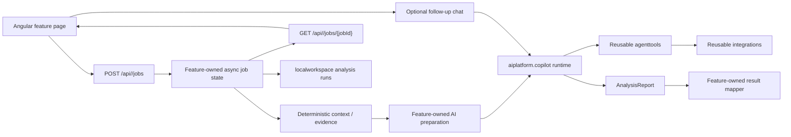

# Playbook dostarczania i rozwoju feature'a analitycznego

## Cel i status

Ten dokument jest repozytoryjna instrukcja projektowania, implementowania,
rozwijania i weryfikowania feature'a analitycznego w Team Delivery Workspace.
Ma pomoc Codexowi i developerowi zarowno dostarczyc nowy pionowy feature, jak i
bezpiecznie zmieniac istniejacy bez rozjazdu od architektury wzorcowej. Obejmuje
potrzebe biznesowa, backend, Copilot runtime, tools, frontend, historie lokalna,
testy i dokumentacje, przy maksymalnym reuse obecnych mechanizmow.

Status: kanoniczny playbook wykonawczy dla calego cyklu zycia feature'ow.

Ostatnio zweryfikowano z kodem: 2026-07-29. Przy zmianie mechanizmow
opisanych w playbooku aktualizuj jednoczesnie ten dokument.

Playbook stosuj:

- przed rozpoczeciem nowego feature'a analitycznego,
- przed zmiana istniejacego feature'a, jesli dotyka publicznego kontraktu,
  pipeline context/evidence, promptu, artifacts, runtime skills, tools, policy,
  hidden context, reportu, job state, persistence albo shared UX,
- przed ekstrakcja mechanizmu do `shared`, `aiplatform`, `agenttools`,
  `integrations`, `api`, `localworkspace` albo wspolnego frontendu,
- podczas review i okresowego audytu jako checkliste granic, kontraktow,
  kompatybilnosci i kompletnosci pionowego slice'a.

Nie stosuj go mechanicznie do kazdego helper endpointu albo ekranu
diagnostycznego. Lokalny bugfix, ktory nie zmienia kontraktu, ownership,
zaleznosci ani zachowania przekrojowego, moze uzyc trybu lekkiego opisanego
nizej. Nadal obowiazuja najblizsze `AGENTS.md` i niezmienniki architektury.

## Dlaczego ten plik nie jest `SKILL.md`

To jest zwykly dokument repozytoryjny, a nie runtime skill aplikacji ani
samodzielny skill Codexa.

Powody:

- opisuje architekture jednego repo i musi zmieniac sie razem z kodem,
- podlega normalnemu code review i jest ladowany przez root oraz lokalne
  `AGENTS.md`,
- `src/main/resources/copilot/skills/**/SKILL.md` zawiera skille uzywane przez
  Copilot SDK podczas analiz, a nie instrukcje tworzenia aplikacji,
- drugi pelny `SKILL.md` duplikowalby zasady i szybko zaczalby driftowac.

Jesli kiedys powstanie osobny skill Codexa typu "utworz lub rozwin feature",
powinien byc cienkim workflow: odczytac ten playbook, wykonac preflight,
przygotowac plan i prowadzic checkliste. Nie powinien kopiowac tresci tego
dokumentu.

## Priorytet zrodel i wzorzec referencyjny

Przy rozbieznosci stosuj ponizsza kolejnosc:

1. aktualne polecenie uzytkownika oraz najblizsze `AGENTS.md`,
2. twarde niezmienniki z root `AGENTS.md`,
3. ten playbook oraz stabilne decyzje z `00-product-direction.md`,
   `02-key-decisions.md`, `05-package-dependencies.md` i
   `08-operational-context-model-tools-and-usage.md`,
4. aktualny kod produkcyjny i jego testy jako prawda o dostepnych mechanizmach,
5. Incident Analysis jako tie-breaker wspolnego lifecycle, safety,
   observability i UX, ale nie feature-specific requestu, wyniku, evidence ani
   tool scope'u,
6. Flow Explorer i Change Verification jako dodatkowe przyklady drugiego i
   trzeciego konsumenta platformy,
7. dokumenty planistyczne i roadmapy jako material pomocniczy, nie automatyczny
   kontrakt aktualnego systemu.

Incident Analysis jest wzorcem do czytania i porownania, ale nie jest
importowalnym core. Nowy feature nie moze zalezec od
`features.incidentanalysis`.

Przed edycja:

1. przeczytaj root `AGENTS.md`,
2. przeczytaj dokumenty `00`-`08` wskazane w root `AGENTS.md`,
3. przeczytaj ten playbook,
4. przeczytaj wszystkie lokalne `AGENTS.md` na sciezkach, ktore beda zmieniane,
5. sprawdz `git status` i zachowaj zmiany uzytkownika,
6. porownaj przynajmniej Incident Analysis oraz jeden inny feature,
7. sprawdz aktualny kod i testy zamiast zgadywac na podstawie nazwy klasy albo
   starego planu.

## Tryby zmiany i kontrola architecture drift

Ten sam playbook ma dwa glowne zastosowania:

- delivery mode - nowy pionowy feature albo nowa capability,
- evolution mode - zmiana istniejacego feature'a lub mechanizmu wspolnego.

Evolution mode nie polega na ponownym projektowaniu calego feature'a. Najpierw
ustala aktualny baseline, potem opisuje zamierzony delta i sprawdza, czy zmiana
nie przesuwa odpowiedzialnosci do niewlasciwej warstwy.

### Poziom zmiany

Przed planem wybierz najwyzszy pasujacy poziom:

| Poziom | Przyklad | Wymagany tryb |
| --- | --- | --- |
| L0 - lokalny | poprawka tekstu, stylu albo implementacji bez zmiany kontraktu i grafu zaleznosci | najblizsze `AGENTS.md`, test celowany, krotki drift check |
| L1 - feature | request/result, krok joba, provider, prompt, skill, report section, chat albo feature UI | baseline + conformance delta + testy calego dotknietego feature'a |
| L2 - przekrojowy | zmiana `shared`, `api`, `localworkspace`, wspolnego komponentu FE, integracji, toola albo platformy | pelny reuse/consumer audit i regresja wszystkich konsumentow |
| L3 - architektoniczny | nowy kierunek zaleznosci, delivery mode artifacts, model sesji, persistence, security boundary albo publiczna migracja | decyzja architektoniczna, plan etapowania/rollbacku i pelna weryfikacja |

Jesli zmiana zaczyna jako L0, ale w trakcie wymaga nowego pola DTO, shared
helpera, tool schema, hidden scope albo specjalnego przypadku w platformie,
podnies jej poziom przed dalsza implementacja.

Nowy feature zaczyna co najmniej na L1. Kazda jego zmiane w warstwie neutralnej
klasyfikuj dodatkowo jako L2 albo L3; caly zakres przyjmuje najwyzszy poziom.
Nie dziel zmiany sztucznie po to, aby ominac wymagania wyzszego poziomu.

### Preflight zmiany istniejacego feature'a

Przed baseline dla L1-L3:

1. przejdz aktualny pion end-to-end: HTTP DTO, job/state, context/evidence,
   AI preparation/runtime/tools/report, local workspace, modele/API/UI FE,
2. wyszukaj importy, nazwy kontraktow, endpointy, feature ids, schema versions
   i selektory, aby wypisac wszystkich konsumentow,
3. uruchom testy celowane baseline albo zapisz zastany failure, ktory utrudnia
   odroznienie regresji,
4. porownaj kod z root/lokalnymi `AGENTS.md`, dokumentami kanonicznymi i
   testami,
5. oddziel zamierzony delta od zastanego debt/drift,
6. dopiero z baseline i conformance delta wyprowadz plan implementacji.

### Baseline istniejacego feature'a

Przed zmiana L1-L3 zapisz stan, ktory ma pozostac prawdziwy:

```text
Feature/capability:
Obecna wartosc dla operatora:
Publiczny input i output:
Kanoniczne endpointy:
Lifecycle joba i kroki:
Deterministic context/evidence:
Prompt, artifacts i runtime skills:
Tools, allowlista, policy, hidden scope i budzet:
Report sections i mapper:
Follow-up semantics:
Local history/import/export/continuation:
Shared komponenty i modele FE:
Aktualne visibility limits:
Testy chroniace zachowanie:
Znane drifty w dotykanym obszarze:
```

Baseline nie jest opisem wszystkich klas. Ma uchwycic zachowania, granice i
kontrakty, ktore review musi porownac po zmianie.

### Conformance delta

Dla zmiany L1-L3 przygotuj przed kodowaniem:

```text
Cel zmiany:
Dlaczego nie wystarcza obecny mechanizm:
Warstwa bedaca wlascicielem:
Zmiana publicznego API/DTO:
Zmiana context/evidence:
Zmiana prompt/artifacts/skills:
Zmiana tools/policy/hidden scope/budzetu:
Zmiana report/result:
Zmiana job state/persistence/export:
Zmiana shared FE/UX:
Nowe lub usuniete zaleznosci:
Konsumenci dotknietego shared mechanizmu:
Kompatybilnosc i migracja:
Testy regresji:
Dokumentacja:
Znany drift: naprawiany, izolowany albo nietkniety:
```

Kazda pozycja powinna miec wartosc albo jawne "bez zmian". To chroni przed
przypadkowym rozszerzeniem scope'u podczas implementacji.

### Bramka zgodnosci przed edycja

Przed zmiana L1-L3 potwierdz:

- [ ] ownership pozostaje zgodny z grafem zaleznosci,
- [ ] feature nie zaczyna importowac sibling feature'a,
- [ ] platforma/tool/integracja nie otrzymuje semantyki jednego use case'u,
- [ ] zmiana wspolnego kontraktu ma liste wszystkich konsumentow BE i FE,
- [ ] publiczne DTO, export schema i local continuation maja plan
  kompatybilnosci,
- [ ] prompt, skill i tool policy sa zmieniane jako jeden spojny runtime
  kontrakt, jesli zmiana dotyka AI,
- [ ] hidden scope nie wraca przypadkiem do model-facing schema,
- [ ] report factory, hidden report scope, mapper i UI pozostaja zgodne,
- [ ] shared UX jest rozszerzany przed skopiowaniem lokalnego komponentu,
- [ ] istniejace testy nie sa usuwane ani oslabiane tylko po to, by zmiana
  przeszla.

### Bramka zgodnosci po implementacji

Po zmianie L1-L3 wykonaj architecture diff:

1. porownaj baseline z nowym zachowaniem,
2. przejrzyj nowe importy miedzy top-level pakietami,
3. przejrzyj nowe publiczne pola, enumy, endpointy i aliasy,
4. przejrzyj zmiany model-facing tool schema i hidden context,
5. porownaj wykonany prompt, wybrane skills, allowliste i budzet,
6. sprawdz report section IDs, result mapper, export i local restore,
7. sprawdz wszystkie istniejace ekrany/konsumentow zmienionego shared
   mechanizmu,
8. uruchom `PackageDependencyGuardTest` oraz testy regresji adekwatne do
   poziomu zmiany,
9. zaktualizuj dokumentacje stanu, jesli delta zmienila invariant albo runtime,
10. zapisz pozostaly drift w `07-open-work-plan.md` z powodem i warunkiem
    usuniecia.

Review powinno umiec odpowiedziec nie tylko "czy dziala", ale tez:

- czy odpowiedzialnosc nadal mieszka we wlasciwej warstwie,
- czy kolejny feature moze reuse'owac capability bez importu tego feature'a,
- czy operator widzi ten sam lifecycle, evidence, usage, report i chat w
  znanym wzorcu,
- czy zmiana nie utrwalila zastanego driftu jako nowego standardu.

### Zasady pracy ze znanym driftem

Dotkniecie pliku z driftem nie oznacza automatycznie obowiazku duzego
refaktoru, ale zabrania bezrefleksyjnego kopiowania problemu.

Dla kazdego dotknietego driftu wybierz jawnie:

- napraw - gdy zakres jest bezpieczny i obejmuje wszystkich konsumentow,
- izoluj - gdy feature moze uzyc poprawnego lokalnego adaptera/extension point
  bez rozszerzania driftu,
- pozostaw - gdy naprawa bylaby osobna migracja; zapisz follow-up, powod i
  warunek wyjscia.

Nie oznaczaj driftu jako "wzorca" tylko dlatego, ze wystepuje w Incident
Analysis. Tie-breaker dotyczy zamierzonego lifecycle, safety, observability i
UX, nie przypadkowego historycznego ksztaltu kodu.

Obowiazuje architecture-drift ratchet:

- zmiana nie moze dodac nowego driftu ani rozszerzyc zasiegu istniejacego,
- drift na bezposrednio zmienianej granicy napraw albo ogranicz adapterem i
  testem kompatybilnosci; wyjatek wymaga jawnego uzasadnienia,
- drift poza zakresem pozostaw nietkniety; jesli ma realny skutek, zapisz w
  `07-open-work-plan.md` skutek, wlasciciela, nastepny krok i warunek usuniecia,
- jesli usuniecie driftu jest konieczne dla bezpiecznej zmiany, podnies poziom
  zmiany i zaktualizuj plan zamiast ukrywac dodatkowy zakres.

### Tryb lekki dla L0

Dla rzeczywiscie lokalnej zmiany wystarczy:

1. przeczytac najblizsze `AGENTS.md`,
2. potwierdzic brak zmiany publicznego kontraktu, ownership i zaleznosci,
3. nie tworzyc nowej lokalnej kopii shared mechanizmu,
4. uruchomic test celowany,
5. sprawdzic diff pod katem przypadkowego rozszerzenia scope'u.

Jesli ktorykolwiek z tych punktow nie jest prawdziwy, przejdz do L1-L3.

## Najpierw sklasyfikuj zmiane

Nie kazdy nowy ekran albo endpoint jest nowym feature'em.

| Pytanie | Wlasciwy obszar |
| --- | --- |
| Czy to samodzielny use case operatora z wlasnym inputem, przebiegiem AI i wynikiem? | `features.<feature>` oraz `frontend/src/app/features/<feature>` |
| Czy to reusable dostep do zewnetrznego systemu? | `integrations.<capability>` |
| Czy AI ma korzystac z tej capability niezaleznie od feature'a? | `agenttools.<capability>` i opcjonalnie `.mcp` |
| Czy to mechanika uruchamiania Copilota, sesji, allowlisty, budzetu, reportu albo eventow? | `aiplatform.copilot` |
| Czy endpoint zasila wiele ekranow/operatora? | `api.<area>` |
| Czy to reczny ekran diagnostyczny capability bez feature-owned analizy? | `Tool Workbench`, nie feature analityczny |
| Czy kontrakt jest maly, stabilny i faktycznie wspolny dla wielu feature'ow? | `shared.*` |
| Czy to maly, neutralny helper bez ownership domenowego? | `common` |

Nowy feature analityczny powinien miec:

- jasno nazwanego uzytkownika i decyzje, ktora wynik wspiera,
- wlasny request, wynik, prompt, policy i publiczne API,
- wlasny lifecycle joba oraz stan potrzebny UI,
- wlasny wybor sources, artifacts, runtime skills i tools,
- jawne visibility limits i sposob prezentacji niepewnosci,
- brak importow do lub z innych feature'ow.

Jesli zmiana tylko udostepnia GitLab, DB, Jira, Confluence, Elasticsearch albo
Operational Context do recznego uzycia, jest raczej capability/Workbench.
Jesli laczy takie capability w dedykowany workflow i kontrakt wyniku, jest
feature'em.

## Zlote zasady

1. Feature jest wlascicielem semantyki use case'u.
2. Integracje, tools i platforma sa reusable i nie znaja feature'a.
3. Sibling feature'y nie importuja sie nawzajem.
4. Reuse oznacza uzycie neutralnego kontraktu albo komponentu, a nie import
   klasy Incident Analysis.
5. Nie przenos feature-specific DTO do `shared` tylko po to, by usunac cykl.
6. Deterministic context/evidence i AI-guided tool reads to dwa rozne kanaly.
7. Prompt, policy, artifacts, hidden context, skille i result mapping sa
   skladane przez feature i przekazywane do platformy.
8. Publiczny wynik jest report-first; finalny tekst modelu jest co najwyzej
   fallbackiem diagnostycznym.
9. Scope znany aplikacji pozostaje w hidden context, a nie w model-facing
   parametrach toola.
10. Sekrety nie trafiaja do requestu HTTP, snapshotu, promptu, evidence,
    activity, eksportu ani local history.
11. UI reuse'uje wspolny shell, przebieg runu, AI activity, evidence, usage,
    report, chat i historie.
12. Nowa abstrakcja wspolna powstaje po potwierdzeniu realnego drugiego
    konsumenta; przy trzecim powtorzeniu trzeba jawnie uzasadnic brak
    ekstrakcji.
13. Live job jest obecnie in-memory. Local workspace daje historie i
    kontynuacje, ale nie jest durable worker queue ani recovery wykonania.
14. Widoczne activity, usage, tool evidence i feedback sa elementem produktu.
    Nie dodawaj niewidocznej telemetryki sesji Copilota bez osobnej decyzji.
15. Rozwoj istniejacego feature'a dziala jak ratchet: nie dodaje nowego driftu
    i nie rozszerza zasiegu driftu zastanego.

## Docelowy kierunek zaleznosci

```text
features.<feature>
  -> aiplatform
  -> agenttools
  -> integrations
  -> localworkspace
  -> shared
  -> common

api
  -> aiplatform / integrations / shared / localworkspace

agenttools
  -> integrations / shared / common

aiplatform
  -> agenttools / shared / common

integrations
  -> common

localworkspace
  -> shared / common
```

Zakazane:

```text
integrations -> agenttools / aiplatform / api / features
agenttools    -> aiplatform / features
aiplatform    -> features
feature A     -> feature B
shared        -> features
localworkspace -> api / features / agenttools / aiplatform / integrations / analysis
```

Reguly musza byc utrzymane i rozszerzone w
`src/test/java/pl/mkn/tdw/architecture/PackageDependencyGuardTest.java`.
Aktualny test ma takze jawne reguly dla istniejacych sibling feature'ow, wiec
nowy pakiet trzeba do nich dopisac albo bezpiecznie wzmocnic regule generyczna.
Produkcyjny i testowy root `pl.mkn.tdw.analysis` pozostaje zamkniety.

## Pelny przebieg feature'a



Kazdy blok ma jednego wlasciciela:

| Element | Wlasciciel |
| --- | --- |
| potrzeba, request, wynik, steps i workflow | feature |
| deterministic source/context pipeline | feature korzystajacy z `integrations` |
| prompt, artifacts, skille i tool policy | feature |
| sesja Copilota, execution, hooks i report/tool mechanics | `aiplatform` |
| neutralne callbacki AI | `agenttools` |
| komunikacja z systemami zewnetrznymi | `integrations` |
| neutralne run/evidence/report/chat/usage DTO | `shared` |
| cross-screen HTTP i historia operatora | `api` oraz `localworkspace` |
| ekran, formularz i wynik use case'u | frontendowy feature |
| powtarzalny operator workflow | frontend `core` i `components` |

## Faza 0 dla nowego feature'a: kontrakt i Definition of Ready

Nie zaczynaj od kopiowania katalogu innego feature'a. Najpierw zapisz krotki
kontrakt discovery, najlepiej jako osobny dokument biznesowy/planistyczny.
Przy rozwoju istniejacego feature'a odpowiednikiem tej fazy sa baseline i
conformance delta z sekcji kontroli driftu.

Minimalny szablon:

```text
Nazwa i stabilny feature id:
Slug URL:
Uzytkownik i jego decyzja:
Problem dzisiaj:
Minimalny input:
Wynik i jego sekcje:
Co musi byc jawnie niewidoczne/niepewne:
Deterministic sources:
Opcjonalne AI-guided capabilities:
Czy potrzebny jest follow-up chat:
Czy potrzebna jest local history/import/export:
Success metrics:
Non-goals:
Ryzyka i dzialania wymagajace zgody czlowieka:
```

Definition of Ready:

- [ ] feature ma jednoznaczna wartosc i wlasciciela,
- [ ] input i wynik sa opisane bez zaleznosci od Copilot SDK,
- [ ] known facts, derived facts i AI interpretation sa rozdzielone,
- [ ] sekcje reportu oraz minimalne kryteria kompletnosci sa znane,
- [ ] zrodla danych i visibility gaps sa jawne,
- [ ] rozstrzygnieto feature vs capability vs Workbench,
- [ ] zidentyfikowano dzialania read-only i mutujace,
- [ ] mutacje zewnetrzne maja osobny human-approval boundary,
- [ ] wiadomo, czy MVP obejmuje chat, persistence i import/export,
- [ ] lista reusable mechanizmow i rzeczywistych luk jest gotowa.

## Faza 1: reuse-first i capability gap analysis

Przed kodowaniem nowego feature'a albo zmiany L1-L3 przygotuj tabele:

| Potrzeba feature'a | Istniejacy mechanizm | Reuse bez zmian | Mala neutralna ekstrakcja | Nowa capability |
| --- | --- | --- | --- | --- |
| job steps/status | `shared.ai.AnalysisJobStepResponse` | tak/nie | opis | opis |
| evidence/context | `shared.evidence.*` | tak/nie | opis | opis |
| AI activity/usage | `shared.ai.*` | tak/nie | opis | opis |
| report | `shared.ai.report.*` | tak/nie | opis | opis |
| tools | `agenttools.*` | tak/nie | opis | opis |
| integracje | `integrations.*` | tak/nie | opis | opis |
| auth/model options | `api.githubauth`, `api.aioptions` | tak/nie | opis | opis |
| local history | `localworkspace.analysisruns` | tak/nie | opis | opis |
| FE workflow | shared Angular components | tak/nie | opis | opis |

Dla istniejacego feature'a wpisuj tylko elementy dotkniete przez delta, ale
lista konsumentow zmienianego mechanizmu musi byc kompletna.

Szukaj najpierw po kontrakcie i zachowaniu, nie tylko po nazwie. Obowiazkowo
sprawdz:

- `src/main/java/pl/mkn/tdw/shared`,
- `src/main/java/pl/mkn/tdw/aiplatform`,
- `src/main/java/pl/mkn/tdw/agenttools`,
- `src/main/java/pl/mkn/tdw/integrations`,
- `src/main/java/pl/mkn/tdw/localworkspace`,
- `src/main/java/pl/mkn/tdw/api`,
- `frontend/src/app/core`,
- `frontend/src/app/components`,
- Incident Analysis i co najmniej jeden kolejny konsument.

Zasada ekstrakcji:

- pierwszy konsument moze miec implementacje feature-owned,
- drugi konsument jest sygnalem do porownania i ewentualnej neutralnej
  ekstrakcji,
- przy trzecim powtorzeniu trzeba wyciagnac stabilny mechanizm albo zapisac
  konkretne uzasadnienie, dlaczego semantyka nadal jest inna.

Nie abstrahuj razem rzeczy, ktore tylko wygladaja podobnie. Wspolna warstwa
powinna miec neutralna nazwe, neutralne zaleznosci i test co najmniej dwoch
konsumentow.

## Blueprint backendu

Docelowy ksztalt, z katalogami opcjonalnymi zaleznymi od use case'u:

```text
src/main/java/pl/mkn/tdw/features/<feature>/
  AGENTS.md
  api/                         # opcjonalne preflight/config/catalog feature'a
  job/
    api/                       # start/get/chat DTO i controller joba
    state/                     # thread-safe live state i snapshot projection
    error/                     # feature-owned bledy
    validation/                # walidacja/preflight requestu
    export/                    # wersjonowany publiczny envelope
    localworkspace/            # adaptery do neutralnego store
  flow/ lub orchestration/     # jeden pionowy use-case flow
  context/ lub evidence/
    provider/                  # feature-owned deterministic providers
  source/                      # feature-owned source discovery, jesli potrzebne
  ai/
    initial/                   # waski kontrakt AI feature'a
    chat/                      # osobny kontrakt follow-up
    preparation/               # prompt/artifacts/coverage
    copilot/                   # adapter feature'a do platformy
      report/
      tools/
      tools/description/
```

Nie kazdy feature potrzebuje kazdego katalogu. Nie tworz pustych warstw. Musi
jednak pozostac czytelny podzial:

- controller/fasada joba zarzadza transportem i lifecycle,
- orkiestrator wykonuje use case,
- feature AI contract nie zalezy od SDK,
- adapter Copilota sklada platformowy request,
- platforma wykonuje request,
- feature mapuje platformowy report na publiczny wynik.

Konwencje:

- Spring Boot `3.5.x`, Java 17,
- DTO preferencyjnie jako `record`,
- request walidowany przez `@Valid` i `jakarta.validation`,
- zaleznosci przez `@RequiredArgsConstructor`,
- nie dodawaj produkcyjnych konstruktorow tylko dla testow; utworz test creator
  w odpowiadajacym pakiecie `src/test/java`,
- integracyjne HTTP przez `RestClient`,
- publiczne bledy mapuje `ApiExceptionHandler`,
- testy controllerow przez `MockMvc`, adapterow HTTP przez
  `MockRestServiceServer`.

## Publiczne API i komunikacja joba

### Kanoniczny ksztalt

Nowy feature powinien domyslnie wystawic:

```text
POST /api/<feature-slug>/jobs
GET  /api/<feature-slug>/jobs/{jobId}
POST /api/<feature-slug>/jobs/{jobId}/chat/messages   # opcjonalnie
GET  /api/<feature-slug>/jobs/input-options           # tylko gdy potrzebne
```

`POST` zwraca `202 Accepted` i natychmiastowy snapshot, zamiast blokowac do
konca AI. Controller jest cienki i deleguje do feature-owned facade/service.
Prefix `/api` jest kanoniczny. Nie dodawaj nowego aliasu `/analysis/**`;
istniejace aliasy sa tylko kompatybilnoscia historyczna.

Request:

- zawiera tylko input use case'u oraz opcjonalne `model` i
  `reasoningEffort`,
- nie zawiera tokenu, OAuth code, loginu ani technicznego scope'u, ktory
  backend juz zna,
- nie zawiera danych wyprowadzanych dopiero z context/evidence,
- ma jawna walidacje pol oraz cross-field validation,
- jesli ma rozne sources albo tryby, backend wystawia input options zamiast
  pozwalac frontendowi zgadywac konfiguracje.

Opcje modeli i reasoning pobieraj z kanonicznego
`GET /api/analysis/ai/options`. Status auth pobieraj przez
`GET /api/auth/github/status`. Nie hardcoduj list modeli, domyslnych effort ani
tokenow na froncie lub w feature controllerze.

Frontend najpierw pobiera status auth. Katalog modeli pobiera dopiero, gdy
status jest connected; obsluguje tez `authStartUrl`, reauth i brak lokalnego
tokenu. Frontend wybiera wartosci z aktualnego katalogu. Backend obecnie
waliduje ksztalt i dlugosc, ale nie ma neutralnego cross-checku wzgledem
katalogu SDK. Jesli taki preflight jest potrzebny, dodaj go raz w
`aiplatform` i wystaw przez shared/operator API, nie kopiuj do kazdego
feature'a.

### Snapshot

Feature ma wlasny snapshot, ale reuse'uje neutralne elementy. Zalecane pola:

```text
feature-owned public job identifier
feature-owned request summary i resolved context
aiModel, reasoningEffort
status, currentStepCode, currentStepLabel
errorCode, errorMessage
createdAt, updatedAt, completedAt
steps: AnalysisJobStepResponse[]
contextSections: AnalysisEvidenceSection[]
toolEvidenceSections: AnalysisEvidenceSection[]
aiActivityEvents: AnalysisAiActivityEvent[]
toolFeedback: AnalysisAiToolFeedback[]
chatMessages: AnalysisChatMessageResponse[]
preparedPrompt
feature-owned result
report: AnalysisReport
```

Nowy feature wybiera jedno pole publicznego identyfikatora joba i uzywa go
konsekwentnie w `POST`, `GET`, chat i frontendzie. Na granicy
`LocalAnalysisRun*` mapuje je jawnie do wspolnego `analysisId`. `jobId` w
Flow/Change i `analysisId` w Incidencie to zastana roznica, nie powod do
utrzymywania dwoch identyfikatorow w nowym kontrakcie. Wartosc zapisana w
query param `localRunId` musi byc kluczem akceptowanym przez
`GET /api/analysis/runs/{analysisId}`.

Dla nowych nieincidentowych feature'ow preferuj nazwe `contextSections`.
`evidenceSections` w Incidencie jest nazwa historyczna. Frontend mapuje
wybrana liste do inputu `evidenceSections` wspolnego steps panelu.

Nie mieszaj:

- deterministic evidence/context,
- evidence dociagnietego przez tools,
- runtime activity,
- modelowego feedbacku o toolach,
- finalnego reportu.

To oddzielne dane o innym znaczeniu i lifecycle.

Kazdy `AnalysisJobStepResponse` powinien miec stabilny `code`, label, phase,
status, timestamps, message, item count oraz - jesli dotyczy -
`consumesEvidence`, `producesEvidence` i `usage`. Te referencje pozwalaja
wspolnemu frontendowi mapowac krok do danych bez incidentowych hardcode'ow.

### Lifecycle i wspolbieznosc

Feature-owned job state:

- jest thread-safe; mutacje snapshotu sa synchronizowane,
- publikuje kolejne snapshoty po waznych zmianach,
- rozroznia `QUEUED`, zbieranie context/evidence, AI, `COMPLETED` i `FAILED`,
- zapisuje stabilny user-facing error code,
- nie wykonuje orkiestracji w controllerze,
- nie rozpoczyna dwoch follow-upow dla tego samego joba,
- nie usuwa stanu potrzebnego do local continuation.

Feature-owned bledy dziedzicza z
`shared.error.UserFacingApplicationException`, gdy maja stabilny publiczny
kod. HTTP mapping pozostaje w `ApiExceptionHandler`. Snapshot i UI nie
pokazuja stack trace ani surowej odpowiedzi adaptera jako komunikatu dla
operatora; techniczny detal moze trafic tylko do kontrolowanego debug view.

Nie buduj jeszcze uniwersalnego job engine przez przeniesienie pol Incident
Analysis do `shared`. Wspolne sa male kontrakty UI, nie semantyka lifecycle
kazdego feature'a.

## Deterministic context i evidence

Nie kazdy feature potrzebuje pelnego incidentowego pipeline. Jesli wejscie jest
juz kompletne, wystarczy feature-owned preparation. Jesli trzeba pozyskac i
wyprowadzic fakty przed AI, zbuduj jawny pipeline w nowym feature.

Zasady:

1. `integrations.<system>` dostarcza typowany port, adapter i modele.
2. Feature-owned provider przeksztalca wynik do
   `shared.evidence.AnalysisEvidenceSection`.
3. Feature utrzymuje wlasny immutable/context snapshot.
4. Kolejnosc, zaleznosci i fan-out sa jawne w collectorze.
5. Merge wynikow rownoleglych jest deterministyczny.
6. Provider deklaruje descriptor: code, label, phase, consumed i produced
   evidence.
7. Dla odczytu neutralnej sekcji tworz typowany feature-owned view; nie
   rozsiewaj stringowego parsowania provider/category/attribute po flow.
8. Brak danych jest jawna informacja o widocznosci, nie pretekstem do
   zgadywania.

Nie auto-discoveruj pipeline przez `List<Provider>` i `@Order`. Collector ma
jawnie pokazywac graf, snapshoty wejsciowe, dozwolone grupy rownolegle i
kolejnosc merge.

Incidentowy wzorzec kolejnosci:

```text
source logs
  -> deployment context
  -> Dynatrace + GitLab deterministic na wspolnym snapshotcie
  -> operational context
```

Nowy feature projektuje wlasny graf. Nie reuse'uje
`features.incidentanalysis.evidence` jako generycznego core.

Przy dodaniu zrodla:

- najpierw dodaj reusable integracje,
- potem provider feature'a,
- dodaj descriptor kroku i jawne wpiecie do collectora,
- zaktualizuj artifacts i coverage,
- przetestuj success, empty, partial, failure, kolejnosc i rownoleglosc.

### Operational Context

Operational Context jest katalogowym groundingiem:

- pomaga znalezc `system`, proces, bounded context, repozytoria, integracje,
  team i handoff,
- wyznacza scope dalszego czytania,
- nie jest dowodem root cause ani potwierdzeniem runtime behavior,
- uzywa `system` jako kanonicznego bytu,
- deployment/runtime/service names pozostaja sygnalami i wlasciwosciami
  systemu, nie osobnym katalogowym komponentem.

Backend feature'a korzysta z `integrations.operationalcontext`. Frontend i
operator korzystaja z `/api/operational-context`. `features.*` nie importuje
`api.*`.

## Kontrakt AI i przygotowanie runu

### Waska granica AI

Orkiestrator feature'a powinien znac tylko:

- feature-owned request AI,
- neutralne `AnalysisEvidenceSection` albo feature-owned context DTO,
- feature-owned response,
- neutralne listenery evidence/activity.

Nie przepuszczaj przez granice AI klas `RestClient`, adapter DTO, Copilot SDK,
GitLab/Elasticsearch/Dynatrace response ani job state.

Referencyjny podzial Incident Analysis:

- `InitialAnalysisProvider`,
- `InitialAnalysisRequest`,
- `InitialAnalysisPreparation`,
- `InitialAnalysisResponse`,
- adapter `CopilotInitialAnalysisProvider`.

Preparation powinna powstac raz. Ten sam `preparedPrompt`:

- jest wysylany do runtime,
- trafia bez zmian do snapshotu i eksportu,
- jest pokazywany operatorowi.

Nie buduj osobnego "display prompt", ktory moze roznic sie od wykonanego.
Prompt konstruuj bez sekretow od poczatku. Sanitizacja eksportu usuwa pola
auth i hidden context, ale nie tworzy alternatywnej wersji promptu.
Zasob przygotowanej sesji jest zamykany przez `AutoCloseable`/try-with-resources.

### Artifacts

Feature przygotowuje logiczne artifacts, np.:

- manifest i wersje formatu,
- digest Markdown,
- request/context snapshot,
- osobne raw evidence sections,
- coverage report,
- jawna deklaracje scope i visibility.

Platforma nie dostarcza `artifactContents` modelowi. Feature-owned preparation
i renderer musza jawnie osadzic potrzebna tresc artifacts w `prompt`.
`artifactContents` jest mapa diagnostyczna/introspekcyjna przechowywana obok
wykonanego promptu, a `MessageOptions` dostaje tylko `prompt`. Nie sa to SDK
attachments ani lokalne pliki widoczne modelowi. Nie podawaj modelowi sciezek
i nie instruuj go, by czytal filesystem. Zmiana delivery mode na attachments
wymaga osobnej decyzji, testow, dokumentacji i rollback planu.

### `CopilotRunRequest`

Feature sklada neutralny:

```text
CopilotRunRequest(
  runReference,
  auth,
  sessionTarget,
  prompt,
  sessionConfigRequest,
  artifactContents,
  initialReport,
  evidenceSink,
  activitySink
)
```

Assembler feature'a powinien kolejno zbudowac:

1. hidden tool context,
2. `CopilotToolSessionContext`,
3. zarejestrowane tool definitions,
4. feature-owned allowliste/policy,
5. wybrane runtime skills,
6. artifacts,
7. prompt,
8. poczatkowy report,
9. `CopilotRunRequest`.

`CopilotSessionTarget.newSession()` sluzy initial runowi.
`CopilotSessionTarget.existing(sessionId)` sluzy jawnej kontynuacji.

Auth:

- publiczny stan moze przechowywac tylko `AnalysisAiAuthRef`,
- token jest rozwiazywany tuz przed utworzeniem klienta,
- runtime jawnie ustawia `githubToken` i `useLoggedInUser=false`,
- token nie moze trafic do hidden context, evidence, activity, reportu ani
  eksportu.

Jesli semantyka opcji SDK nie wynika z lokalnego Java wrappera, sprawdz
upstream `github/copilot-sdk`, szczegolnie dokumentacje Node/CLI i schemat
`@github/copilot`. Nie zgaduj defaultow.

## Runtime skills

Skille wykonawcze feature'a:

```text
src/main/resources/copilot/skills/<skill-name>/SKILL.md
```

Zasady:

- tresc proceduralna jest po polsku,
- techniczne nazwy tooli, pol JSON, klas i endpointow pozostaja oryginalne,
- jeden skill ma jedna czytelna odpowiedzialnosc,
- feature jawnie wybiera potrzebny podzbior,
- platforma nie wybiera skilli za feature,
- prompt mowi, ktore skille sa wymagane i kiedy maja byc uzyte,
- kontrakt skillu ma test frontmatter/nazwy oraz test feature-owned selection.

Dobry podzial:

- orchestrator/readiness,
- source lub grounding,
- interpretacja/quality rules,
- zapis konkretnych sekcji reportu,
- follow-up chat.

`SessionConfig.skillDirectories` musi dostac root zawierajacy wybrane
podkatalogi-siblings z `SKILL.md`. Uzyj
`CopilotNamedSkillDirectoryResolver` i `CopilotSkillRuntimeLoader`. Nie
przekazuj listy bezposrednich katalogow pojedynczych skilli, bo built-in tool
`skill` moze nie zobaczyc siblingow. Przy skonfigurowanych skill directories
`CopilotSessionConfigRequest` dodaje `skill` do efektywnej allowlisty.

## Tools, scope i polityki

### Reuse istniejacej capability

Feature:

1. wybiera neutralne tools z `agenttools`,
2. buduje hidden scope,
3. tworzy definitions przez `CopilotSdkToolFactory`,
4. filtruje je przez feature-owned policy,
5. przekazuje tylko jawne `availableToolNames`,
6. ustawia feature profile opisow, jesli potrzebny,
7. mapuje tylko user-facing evidence potrzebne operatorowi.

Samo istnienie beana `@Tool` nie oznacza:

- ze callback provider go zarejestrowal,
- ze warunki konfiguracji sa zgodne,
- ze feature go dopuscil,
- ze runtime allowlista pozwala go wywolac.

Weryfikuj wszystkie cztery poziomy.

`SessionConfig.availableTools` oraz `SessionHooks.onPreToolUse` tworza twarda
allowliste runtime. Policy feature'a wybiera nazwy przed przygotowaniem sesji,
a hook odrzuca probe wywolania spoza allowlisty. Nie usuwaj jednego z tych
zabezpieczen tylko dlatego, ze callback provider jest filtrowany.

### Dodanie nowej capability/toola

Nowy reusable tool wymaga:

1. portu i adaptera w `integrations.<capability>`, jesli czyta system
   zewnetrzny,
2. stalej nazwy w `*ToolNames`,
3. neutralnego input/result DTO,
4. callbacka w `agenttools.<capability>.mcp`,
5. jawnego `MethodToolCallbackProvider`,
6. zgodnych warunkow aktywacji beana/provider configuration,
7. testu nazwy i publicznego JSON schema,
8. testu rejestracji w application context,
9. feature-owned allowlisty i policy,
10. decyzji o budzecie dla nowego prefixu,
11. user-facing evidence mappera/listenera, jesli wynik ma byc widoczny.

Definicja neutralnego toola opisuje capability, nie Incident Analysis ani
inny feature. Feature-specific guidance dodaj przez
`CopilotToolDescriptionContext.profile("<feature-id>")` i
`CopilotToolDescriptionCustomizer`.

### Hidden context

Hidden scope jest neutralna mapa w `CopilotToolSessionContext`, budowana przez
`CopilotToolContextFactory` i feature-owned factories. `AgentToolContextKeys`
zawiera tylko klucze naprawde wspoldzielone. Nie dodawaj tam kazdego
feature-specific markera ani convenience accessora do platformowego contextu;
klucze uzywane przez jeden feature trzymaj przy tym feature.

W hidden context umieszczaj:

- run/session/feature identifier,
- dozwolony scope repozytoriow, branch i environment, jesli wynika z backendu,
- report id, feature i allowed section IDs,
- capability-specific bezpieczne ograniczenia,
- dane potrzebne listenerom capture.

Model-facing input ma zawierac tylko wybor, ktorego model rzeczywiscie musi
dokonac. Znany backendowi `gitLabGroup`, `gitLabBranch`, `environment`,
`reportId` albo wewnetrzny run id nie powinien wracac do schema toola.
Database uzywa ukrytego environment scope'u.

Docelowo znany branch GitLaba takze powinien byc hidden. Aktualny kontrakt
GitLab jest jednak zastanym driftem: wymaga model-facing `branchRef`;
`gitLabGroup` jest rozwiazywany przez konfiguracje/Operational Context.
Dopoki kontrakt nie zostanie zmigrowany, feature reuse'ujacy obecne GitLab
tools przekazuje branch w prompt/artifacts i testuje jawny `branchRef`. Nie
kopiuj tego wzorca do nowych tools. Jawny `correlationId` w Elasticsearch jest
drugim znanym driftem.

GitLab i Database tools moga miec prosty operator-facing `reason`. Nie
dodawaj modelowych pytan diagnostycznych ani pseudo-heurystyk tylko po to, by
ladniej opisac evidence.

`opctx_*` nie przyjmuje `correlationId`, `environment`, `gitLabGroup` ani
`gitLabBranch` - ani jawnie, ani jako incidentowy hidden scope. Scope katalogu
pochodzi z konfiguracji i `integrations.operationalcontext`; model-facing input
moze zawierac tylko neutralny `reason`.

### Policy i budzety

Feature-owned tool access policy:

- jest default-deny,
- dopuszcza tylko capability potrzebne temu runowi,
- uwzglednia availability konfiguracji,
- uwzglednia deterministic coverage i znane luki,
- rozroznia initial i follow-up,
- ma testy kazdej galezi allow/deny,
- odrzuca syntetyczny/nieznany zarejestrowany tool,
- nie polega na kolejnosci rejestracji beanow.

`effectiveAvailableToolNames` musi byc podzbiorem nazw zarejestrowanych
definitions, z jedynym platformowym wyjatkiem dla built-in `skill`.
Incidentowa policy konczaca nieznane nazwy `return true` jest driftem, nie
wzorcem.

Typowy wzorzec:

- report tools dla report-first initial runu,
- feedback tool, jesli ma byc widoczny sygnal jakosci,
- Operational Context, gdy potrzebne jest katalogowe grounding,
- GitLab/Elasticsearch jako fallback, gdy odpowiednich danych nie ma juz w
  artifacts,
- Database tylko przy bezpiecznym scope i rzeczywistej potrzebie danych.

Budzet to platformowa mechanika w
`aiplatform.copilot.tools.policy.budget`. Nowy prefix toola wymaga jawnej
decyzji: osobny limit albo swiadome uzycie limitu total. Nie omijaj policy
przez lokalny licznik w callbacku. Report tools zuzywaja obecnie globalny
`maxTotalCalls`; tylko feedback jest wylaczony z naliczania. Feature z wieloma
sekcjami reportu musi uwzglednic wymagane report calls w tescie budzetu.

### Lifecycle invocation i widocznosc

Obowiazujacy przeplyw:

```text
SDK ToolDefinition handler
  -> beforeInvocation policies
  -> STARTED event
  -> ToolCallback
  -> afterInvocation policies
  -> FINISHED event
  -> logging / capture listeners
  -> evidence/activity/feedback sinks
  -> job snapshot/UI
```

Przy odrzuceniu przed callbackiem nie ma `STARTED`; publikowany jest
`FINISHED/REJECTED`. Policy musi zablokowac wywolanie przed side effectem.

Nie dodawaj feature-specific `if` do
`CopilotToolInvocationHandler`. Walidacja i limit to policy; side effect i
capture to listener eventu; mapowanie domenowe pozostaje przy capability albo
feature.

Globalny listener musi filtrowac run/feature po hidden context. Nie reuse'uj
listenera innego feature'a i nie rejestruj dwoch listenerow mapujacych ten sam
event, bo powstanie podwojne evidence. Reusable GitLab mapping jest w
`agenttools.gitlab.evidence`; feature-owned listener odpowiada za scope i
publikacje do konkretnego joba.

Rozdziel:

- tool evidence: dane dociagniete przez AI i widoczne operatorowi,
- activity: lifecycle, reasoning/messages, tool start/end, usage i bledy,
- tool feedback: jawna ocena wyniku poprzedniego toola,
- deterministic evidence: fakty zebrane przed AI.

`record_tool_feedback` nie jest quality gate, ukryta telemetria ani
deterministic evidence. Feedback z follow-up przypisz do konkretnej odpowiedzi
assistant.

## Report-first i publiczny wynik

Neutralne kontrakty:

- `AnalysisReport`,
- `AnalysisReportSection`,
- `AnalysisReportMeta`,
- `AnalysisReportReference`.

Platformowe tools:

- `report_get_current`,
- `report_update_header`,
- `report_upsert_section`,
- `report_update_meta`.

Feature musi:

1. zdefiniowac stabilne section IDs,
2. utworzyc scaffold przez feature-owned report factory,
3. przekazac `reportId`, feature i allowed section IDs w hidden context,
4. udostepnic tylko potrzebne report tools,
5. przekazac scaffold jako `CopilotRunRequest.initialReport`,
6. poinstruowac model, ze report tools sa source of truth,
7. zwalidowac obecnosc i kompletnosc sekcji,
8. zmapowac `AnalysisReport` na feature-owned public result,
9. zachowac parser finalnej odpowiedzi wylacznie jako kontrolowany fallback,
10. pokazac raw/diagnostic failure bez udawania kompletnego wyniku.

Przed runem asercje musza potwierdzic:

```text
initialReport.reportId == hidden REPORT_ID
hidden REPORT_FEATURE == stabilny feature id
initial report section IDs sa zgodne z hidden allowed section IDs
```

Report jest source of truth, ale aktualny execution gateway nadal wymaga
niepustej finalnej odpowiedzi assistant. Prompt powinien wymagac krotkiego,
niepustego potwierdzenia po zapisaniu reportu.

Incidentowe referencje:

- `CopilotIncidentReportFactory`,
- `CopilotIncidentReportMapper`,
- `CopilotResponseParser`.

`reportId` nie jest model-facing parametrem. Platformowy report store jest
session-bound i efemeryczny; execution gateway zwraca ostatni snapshot i
sprzata rejestracje po runie.

Publiczny result pozostaje feature-specific. Nie wystawiaj samego generycznego
reportu jako zamiennika dobrze nazwanego kontraktu produktu. UI moze
jednoczesnie pokazywac feature result i wspolny panel `AnalysisReport`.

## Follow-up chat

Chat jest osobnym use case'em i kontraktem AI, nie dopiskiem do initial promptu.

Wzorzec:

- feature-owned chat request/response/provider,
- reuse scope zakonczonego runu,
- `CopilotSessionTarget.existing(copilotSessionId)`,
- ponowne przekazanie tools, skilli, hidden context, hooks, modelu i effort,
- message operatora jako jedyny nowy input albo feature-owned follow-up
  renderer,
- tool evidence/activity/feedback przypisane do odpowiedzi assistant,
- polling tego samego job snapshotu po wyslaniu wiadomosci,
- brak rownoleglych follow-upow dla jednego runu.

Aktualny stan: initial report jest report-first, ale plan
`11-report-follow-up-chat-plan.md` nie jest wdrozony. Incident Analysis
follow-up nie przekazuje `initialReport`, nie udostepnia report scope i nie
aktualizuje publicznego reportu. Nie zakladaj mutacji reportu podczas chatu.
Jesli follow-up nie rejestruje aktualnego reportu i hidden report scope, usun
report tools z `availableTools`; globalnie zarejestrowany callback nie jest
powodem, by wystawiac dangling tool.
Jesli nowy feature jej potrzebuje, wdroz jawnie caly kontrakt: aktualny report
w request/state, hidden scope, rejestracje store, report tools, mapowanie
wyniku, persistence, blokade wspolbieznosci i testy.

Importowany publiczny JSON pozostaje read-only. Kontynuacja jest mozliwa tylko
dla live joba albo lokalnego runu z waznym `copilotSessionId`, continuation
metadata i mozliwoscia bezpiecznego odtworzenia scope'u po stronie backendu.

## Local workspace, historia i import/export

Neutralny mechanizm:

```text
localworkspace.analysisruns
api.analysisruns
```

Kluczowe kontrakty:

- `LocalAnalysisRunStore`,
- `LocalAnalysisRunRecord`,
- `LocalAnalysisRunContinuation`,
- `LocalAnalysisRunChatHandler`,
- `AnalysisRunHistoryService`.

Nowy feature:

1. definiuje stabilny, unikalny feature id,
2. dostarcza feature-owned persister/export envelope,
3. zapisuje snapshot po waznych zmianach state,
4. rejestruje chat handler, jesli wspiera continuation,
5. pozwala `AnalysisRunHistoryService` wybrac handler po feature id,
6. aktualizuje frontendowy routing/label/icon historii,
7. testuje uszkodzony rekord, brak kontynuacji i migracje envelope.

`LocalAnalysisRunContinuation` nie jest magazynem calego `ToolContext`. Ma
zamkniety zestaw sanitizowanych metadata, np. auth ref, session id i wybrane
runtime/scope fields. Nie persystuj tokenow ani pelnej hidden mapy. Feature
odtwarza scope z sanitizowanego snapshotu/exportu i aktualnej konfiguracji.
Nowe neutralne continuation metadata wymagaja jawnego rozszerzenia kontraktu,
migracji oraz testow wszystkich konsumentow.

Publiczny export musi byc sanitizowany i nie moze zawierac tokenow, auth
secrets, hidden tool context, wewnetrznych sciezek ani danych, ktore nie sa
elementem produktu. Jest innym kontraktem niz wewnetrzny wrapper
`LocalAnalysisRunRecord`.

Rekomendowany envelope dla nowych feature'ow powinien miec:

```text
schema
version
exportedAt
payload.type
resultContract/version
diagnostics
job snapshot
```

Frontendowy parser:

- waliduje schema, version i payload type,
- po walidacji wspieranej wersji normalizuje opcjonalne/brakujace pola,
- obsluguje starsza wersje tylko przez jawna galaz migracji i jej test,
- odrzuca niezgodny feature,
- dla publicznego importu wymaga zakonczonego runu i reportu,
- dla lokalnego restore moze przyjac stan nieterminalny,
- nie wlacza continuation dla zwyklego importu pliku.

Eksport jest dostepny dla zakonczonego runu z kanonicznym reportem i bez
aktywnej wiadomosci assistant. Importowany rezultat mozna ponownie
wyeksportowac, ale nie moze uruchamiac akcji backendowych. Local restore
waliduje `detail.feature` i jawnie ustawia tryb niewymagajacy terminalnego
statusu.

Uzyj wspolnych utili:

- `sanitizeFileNamePart`,
- `formatFileTimestamp`,
- `downloadJsonFile`,
- `readJsonFile`.

## Blueprint frontendu

Docelowy ksztalt:

```text
frontend/src/app/features/<feature-slug>/
  models/<feature>.models.ts
  services/<feature>-api.service.ts
  pages/<feature>-page/
    <feature>-page.ts
    <feature>-page.html
    <feature>-page.scss
    <feature>-page.spec.ts
  components/                  # tylko feature-specific prezentacja semantyczna
  utils/<feature>-import-export.utils.ts
  utils/<feature>-result-markdown.utils.ts   # jesli potrzebne
```

Frontend jest standalone Angular, strict, zoneless. Preferuj signals/computed i
Reactive Forms. Nie wprowadzaj nowego globalnego state managera dla jednego
feature'a.

### Modele

Reuse'uj z `frontend/src/app/core/models/analysis.models.ts` neutralne:

- `ApiErrorResponse`,
- auth i model options,
- `AnalysisAiUsage`,
- `AnalysisAiActivityEvent`,
- `AnalysisAiToolFeedback`,
- `AnalysisEvidenceSection`,
- `AnalysisJobStepResponse`,
- `AnalysisChatMessageResponse`,
- `AnalysisReport`,
- `LocalAnalysisRunListItemResponse`,
- `LocalAnalysisRunListResponse`,
- `LocalAnalysisRunDetailResponse`.

Nie reuse'uj incidentowych:

- `AnalysisStartRequest`,
- `AnalysisLogSource`,
- `AnalysisJobInputOptionsResponse`,
- `AnalysisResultResponse`,
- `AnalysisJobStateSnapshot`,
- `AnalysisExportEnvelope`,
- `ExportState`.

Nowy feature ma wlasny start request, result, job snapshot i export envelope,
nawet jesli czesc pol wyglada podobnie.

### Serwis API

Feature-owned serwis:

- uzywa `/api/<feature-slug>`,
- typuje start/get/chat/input-options,
- nie zawiera logiki prezentacji,
- wysyla i odbiera typowany transport; normalizacja envelope/result nalezy do
  feature utils/facade,
- nie zgaduje brakujacych backendowych defaultow,
- ma testy `HttpTestingController`,
- korzysta ze wspolnego auth i katalogu opcji AI.

`core/services/analysis-api.service.ts` ma incidentowa nazwe mimo czesci
wspolnych endpointow. `getAiModelOptions()` ma juz kilku konsumentow. Przed
dodaniem kolejnego wyciagnij neutralny `AiOptionsApiService` i zmigruj
istniejacych konsumentow albo zapisz jawne, ograniczone odroczenie. Reuse'uj
selection logic z `core/utils/analysis-ai-model-options.utils.ts`.

Auth ma juz neutralny `GithubAuthService`; reuse'uj go i jego return URL
semantics, nie tworz kolejnego auth clienta. Historia ma neutralny
`AnalysisRunHistoryApiService`.

### Wspolne komponenty

Maksymalnie reuse'uj:

- `analysis-feature-aside` - wspolny uklad boczny i projection slots,
- `analysis-steps-panel` - steps, evidence, AI timeline, feedback i usage,
- `analysis-follow-up-chat` - chat runu,
- `analysis-result-header`,
- `analysis-result-tabs`,
- `analysis-report-panel`,
- `analysis-report-section-content`,
- `analysis-report-meta`,
- `analysis-evidence-panel`,
- `markdown-content`.

`analysis-feature-aside` wystawia sloty `progressPanel`, `aiPanel`,
`chatPanel` i `feedbackPanel`. Ustaw w nim
`showProgress/showAi/showChat/showFeedback` i wypelnij odpowiadajace sloty.
Nie tworz kolejnego feature-owned aside tylko po to, aby przestawic te same
panele.

`analysis-final-result` i `analysis-overview-card` sa incident-specific. Nie
uzywaj ich jako neutralnego API nowego feature'a.

Dla nieincidentowego feature'a `analysis-steps-panel` moze dostac
`result=null` i `finalResultAvailable=!!snapshot.report`. Gdy steps panel jest
renderowany wewnatrz osobnych slotow aside, ustaw `staticPanels=true` i filtruj
jego zawartosc przez `showProgress/showAiWorkflow/showToolFeedback`.

Jesli wspolny komponent ma pojedynczy incidentowy hardcode, najpierw dodaj
male neutralne wejscie/extension point i test drugiego feature'a. Nie kopiuj
calego komponentu. Jednoczesnie nie dokladaj duzego generycznego renderer API
dla jednego specjalnego przypadku.

Nie kazdy nowy provider potrzebuje specjalnego renderera w
`analysis-steps-panel`. Najpierw uzyj generic evidence view. Specjalny renderer
dodaj dopiero, gdy materialnie poprawia powtarzalna semantyke i ma shared test.

Markdown renderuj przez `MarkdownContentComponent`, ktory sanitizuje wynik
DOMPurify. Nie uzywaj bezposredniego `[innerHTML]` w feature template.
Reuse'uj tokeny CSS i rzeczywiscie shared klasy ze
`frontend/src/styles.scss`, np. page shell, fields, buttons, status oraz
loading/error. Nie traktuj kazdego legacy/feature-specific selektora jako
neutralnego API i nie kopiuj duzych arkuszy Flow Explorera.

### Odpowiedzialnosc strony

Page component powinien orkiestrac:

- formularz i validation,
- start/restore/import,
- polling,
- view state,
- delegacje do shared i feature-specific components.

Dedicated feature jest roboczym workspace'em:

- bez marketingowego hero jako pierwszego viewportu,
- z jednym dominujacym primary action,
- z finalnym wynikiem wykorzystujacym pelna dostepna szerokosc,
- z progress/AI/chat/feedback we wspolnym aside,
- z konsekwentnymi empty/loading/error/partial/imported states,
- z `aria-label` i `title` dla icon-only controls,
- bez lokalnego duplikatu topbaru/breadcrumbu nalezacego do `app-shell`.

Gdy plik zaczyna laczyc transport, ogromna normalizacje, polling, import,
formatowanie wyniku i wiele paneli, rozdziel go na feature facade/store,
utils i komponenty. Wielotysieczne page controllery Flow/Incident sa znanym
kosztem utrzymania, nie wzorcem do kopiowania.

### Polling

Przy rozbieznosci kopiuj semantyke Incident Analysis:

1. po `POST` natychmiast zapisz `localRunId` w query param,
2. przy wejsciu obsluz restore przez `?localRunId=...`,
3. pobierz snapshot,
4. po zakonczeniu odpowiedzi zaplanuj kolejny `setTimeout` ok. 1500 ms,
5. nie uruchamiaj kolejnego requestu, gdy poprzedni trwa,
6. anuluj lifecycle przez `DestroyRef`/`takeUntilDestroyed`,
7. zatrzymaj polling dopiero, gdy job jest terminalny i nie ma assistant
   message `IN_PROGRESS`,
8. po follow-up uruchom polling ponownie,
9. imported state pozostaje read-only.

Blad pollingu zatrzymuje scheduler, zachowuje ostatni poprawny snapshot i
pokazuje kontrolowany error/retry. Nie uruchamiaj petli requestow po bledzie.
Auth required/reauth kieruj przez `GithubAuthService` z zachowaniem return URL;
field errors z `ApiErrorResponse` mapuj do formularza.

Nie kopiuj `setInterval` z Flow Explorera ani trzeciej lokalnej implementacji.
Jesli kolejny feature wymaga tego samego lifecycle, wyciagnij wspolny,
przetestowany polling helper/facade.

### Follow-up live i lokalny

Frontend obsluguje dwa tory:

- live job: feature API
  `POST /api/<slug>/jobs/{jobId}/chat/messages` zwraca feature snapshot,
- local history: `AnalysisRunHistoryApiService.sendChatMessage(localRunId, ...)`
  zwraca `LocalAnalysisRunDetailResponse`, z ktorego parser odtwarza
  feature-owned envelope.

Local chat wlaczaj tylko przy `detail.continuationEnabled`. Przed requestem
uzyj `appendOptimisticChatTurn` z
`core/utils/analysis-chat-optimistic.utils.ts`; przy bledzie przywroc poprzedni
job/export state. Polling trwa do zakonczenia assistant `IN_PROGRESS`.

### Wynik, report i usage

- prosty liniowy report pokazuj przez `analysis-report-panel`,
- gdy produkt wymaga tabow albo semantycznej prezentacji, komponuj
  `analysis-result-header`, `analysis-result-tabs`,
  `analysis-report-section-content` i `analysis-report-meta` oraz maly
  feature-specific component,
- nie duplikuj wspolnego naglowka, tabs, meta ani renderowania Markdown,
- references, gaps, warnings, open questions i visibility limits zachowaj,
- usage pokazuj przez `AnalysisJobStepResponse.usage` i wspolny steps panel,
- nie przeliczaj sam total tokenow i nie reimplementuj pricing/formatterow;
  uzyj backendowego `AnalysisAiUsage` oraz
  `core/utils/analysis-ai-usage-cost.utils.ts`,
- jesli potrzebny jest total usage poza steps panelem, najpierw wydziel shared
  summary component/helper,
- przygotowany prompt pokazuj jako faktycznie wykonany prompt.

`analysis-steps-panel` ma obecnie incidentowe hardcode'y decydujace, dla
ktorych step codes pokazac prepared prompt. Nie nadawaj nowemu krokowi
falszywego kodu tylko dla UI. Dodaj neutralne metadata/extension point z testem
drugiego konsumenta albo osobny shared prompt panel.

### Rejestracja w shellu

Nowy frontendowy feature nie jest kompletny, dopoki nie zostanie dodany do:

- `frontend/src/app/app.routes.ts` jako lazy route z sekcja
  `Analysis Features` i tytulem,
- `frontend/src/app/components/app-shell/app-shell.ts` w `NAV_GROUPS`,
  lacznie z ikona, route i swiadoma decyzja o `reloadOnActiveClick`,
- `frontend/src/app/app.spec.ts`, lacznie z remount aktywnego feature'a jako
  fresh screen, gdy `reloadOnActiveClick=true`,
- `frontend/src/app/features/platform-landing/platform-landing.html` oraz
  `app.spec.ts` albo dedykowanego landing spec,
- `frontend/src/app/features/analysis-history/analysis-history-page.ts`:
  route, label i icon, oraz testu.

`capabilityInfo` dotyczy Workbench; nie ustawiaj go tylko dlatego, ze feature
uzywa tools.

## Macierz kontraktu backend-frontend

Przed implementacja uzgodnij jednoznacznie:

| Backend | Frontend | Regula |
| --- | --- | --- |
| start request | Reactive Form + feature start DTO | identyczne nazwy i enumy |
| `202` snapshot | immediate page state | bez czekania na pierwszy poll |
| job status | page/polling terminal logic | unknown status ma bezpieczny fallback |
| step code/phase | steps panel | brak incidentowego zgadywania, gdy sa references |
| context/evidence sections | progress/evidence | deterministic dane osobno |
| tool evidence | AI workflow | powiazanie po tool call/event |
| activity events | timeline | stabilne id, parent id i timestamps |
| tool feedback | panel/message | follow-up feedback przy message |
| report | shared result primitives | source of truth initial result |
| feature result | semantyczny wynik | osobny kontrakt feature'a |
| prepared prompt | prompt panel/export | ten sam tekst co runtime |
| usage | step/report UI | backend usage + shared cost/format utilities |
| error code/fields | transport error/validation | user-facing, bez stack trace |
| chat message status | chat/polling | `IN_PROGRESS` utrzymuje polling |
| local feature id | history routing | stabilny i unikalny |
| export schema/version | import parser | jawna kompatybilnosc i normalizacja |

Nie zmieniaj tylko jednej strony kontraktu. Kazda zmiana DTO wymaga wyszukania
backendu, frontendowego modelu, parsera importu, persistence, fixture i testow.

## Zalecana kolejnosc implementacji

Pracuj pionowymi, weryfikowalnymi inkrementami. Dla nowego feature'a stosuj
ponizsza kolejnosc. Dla rozwoju istniejacego wybierz tylko inkrementy objete
conformance delta, ale zawsze zacznij od baseline i zakoncz architecture
diffem.

### Inkrement 1: kontrakt i skeleton

- dokument potrzeby i scope,
- feature id, slug, request/result/report sections,
- package i route skeleton,
- architecture guard,
- lokalne `AGENTS.md`,
- test pustego/cienkiego controllera.

### Inkrement 2: deterministic context

- brakujace reusable integrations,
- feature-owned context/source pipeline,
- typed views, visibility limits i step descriptors,
- testy collector/providerow.

### Inkrement 3: report-first AI

- waski AI contract,
- artifacts, prompt i coverage,
- report factory/mapper/fallback,
- runtime skill selection,
- `CopilotRunRequest`,
- tool policy i hidden scope,
- test assemblera bez live Copilota.

### Inkrement 4: async job i obserwowalnosc

- facade/state/executor,
- steps, evidence, activity, usage, feedback,
- error mapping,
- local persistence.

### Inkrement 5: frontend happy path

- models/API/form/start,
- polling bez overlap,
- shared aside/steps/report/result,
- shell/landing/history.

### Inkrement 6: continuation i portability

- follow-up chat, jesli potrzebny,
- local continuation,
- versioned import/export,
- read-only imported state.

### Inkrement 7: hardening

- partial/empty/failure paths,
- authorization/config availability,
- budget/policy boundaries,
- accessibility i responsive UI,
- full regression build.

Kazdy inkrement powinien kompilowac sie i miec testy. Nie tworz najpierw
wszystkich DTO, a dopiero na koncu jednego nieweryfikowalnego runtime flow.

## Macierz testow

### Backend

- [ ] architecture guard: warstwy i sibling feature isolation,
- [ ] request validation i controller `MockMvc`,
- [ ] start zwraca `202` i natychmiastowy snapshot,
- [ ] async success, empty, partial i failure state,
- [ ] step lifecycle, consumes/produces references i usage,
- [ ] jesli jest pipeline: collector, kolejnosc, fan-out i deterministic merge,
- [ ] jesli sa providers: kazdy provider oraz typowany evidence/context view,
- [ ] prompt/artifacts/digest/coverage,
- [ ] initial run assembler: NEW session, auth, prompt, artifacts i report,
- [ ] jesli jest chat: follow-up assembler, EXISTING session i scope,
- [ ] jesli sa runtime skills: names, frontmatter, selected root i selection,
- [ ] jesli sa tools: callback names, schema, provider registration i context,
- [ ] jesli sa tools: feature policy allow/deny, unknown tool i availability,
- [ ] jesli sa tools: effective names sa podzbiorem definitions poza `skill`,
- [ ] jesli jest hidden scope: nie wystepuje w publicznym schema,
- [ ] report factory, allowed sections, completeness i mapper,
- [ ] final response fallback/parser,
- [ ] jesli jest capture: evidence/activity/feedback bez podwojenia listenerow,
- [ ] jesli sa tools: budzet dla uzywanych prefixow i report calls,
- [ ] jesli jest historia: persistence, export sanitization i feature selection,
- [ ] chat continuation, concurrency i message-level evidence, jesli dotyczy.

### Frontend

- [ ] API service przez `HttpTestingController`, exact optional fields i
  bezpieczne kodowanie job id,
- [ ] form validation, field errors i request mapping,
- [ ] auth required/reauth CTA przez `GithubAuthService` z return URL,
- [ ] start i natychmiastowe `localRunId`,
- [ ] restore z query param i feature validation,
- [ ] polling bez overlap oraz poprawne zatrzymanie,
- [ ] polling error zatrzymuje scheduler, zachowuje snapshot i daje retry,
- [ ] report-first final result,
- [ ] shared aside/steps/activity/evidence/feedback/usage,
- [ ] follow-up optimistic state, rollback i restart pollingu,
- [ ] import/export round-trip oraz walidacja schema, version, resultContract,
  type, feature, terminal status i reportu,
- [ ] unsupported version i result contract sa odrzucane,
- [ ] local restore stanu nieterminalnego,
- [ ] imported state jest read-only,
- [ ] shell, route, landing i history mapping,
- [ ] empty, loading, partial, failed i completed UI,
- [ ] accessibility podstawowych kontrolek i responsywny layout.

### Komendy

Pelna weryfikacja:

```text
mvn -q clean test
npm --prefix frontend test -- --watch=false
npm --prefix frontend run build
mvn -q -DskipTests package
```

`npm --prefix frontend run build` generuje produkcyjny bundle w
`src/main/resources/static`. Nie edytuj wygenerowanych plikow recznie.
Przy mniejszym inkremencie najpierw uruchom testy celowane, a przed oddaniem
pelny zestaw proporcjonalny do zmiany.

## Znane drifty, ktorych nie kopiujemy

Ponizsze elementy istnieja albo wystepuja w starszej dokumentacji, ale nie sa
docelowym wzorcem:

- aliasy `/analysis/**`; nowy kod uzywa `/api/**`,
- importowanie Incident Analysis jako core dla kolejnego feature'a,
- convenience/accessory incidentowe w platformowym
  `CopilotToolSessionContext`,
- model-facing `branchRef` w obecnych GitLab tools,
- model-facing `correlationId` w Elasticsearch toolu,
- capability-specific przypadki w `CopilotToolInvocationHandler`,
- incidentowa semantyka w neutralnym opisie toola,
- feature-specific global listener bez filtra feature/run-kind,
- zalozenie, ze `@Tool` automatycznie tworzy callback provider i allowliste,
- bezposrednie katalogi pojedynczych skilli w `skillDirectories`,
- traktowanie inline artifacts jak SDK attachments lub plikow,
- aktualizacja reportu przez follow-up - obecnie to tylko niewdrozony plan,
- report tools dopuszczone w follow-up bez aktywnego report store/scope,
- incidentowa policy dopuszczajaca nieznane tool names przez koncowe
  `return true`,
- `setInterval` i kilka roznych implementacji pollingu,
- wielotysieczne Angular page controllery,
- zduplikowany model selector i formatter usage,
- incidentowo nazwany wspolny `analysis-api.service.ts`,
- hardcoded step-to-evidence fallback zamiast `consumes/producesEvidence`,
- reczne mapowania route/label/icon bez aktualizacji wszystkich testow,
- stare roadmapy mowiace o "drugim feature" jako przyszlosci,
- plan Change Verification traktowany automatycznie jako kontrakt aktualnego
  kodu,
- local history traktowana jako durable job queue,
- globalna niewidoczna telemetria Copilota,
- generyczny `shared` jako miejsce na przypadkowe DTO.

Drift mozna poprawic w ramach nowego feature'a tylko wtedy, gdy:

- ekstrakcja ma neutralne ownership,
- obejmuje wszystkich istniejacych konsumentow,
- ma testy migracji/regresji,
- nie rozszerza niepotrzebnie scope'u feature'a.

W przeciwnym razie zapisz follow-up i nie kopiuj problemu.

## Aktualizacja dokumentacji

Nowy feature albo zmiana L1-L3 aktualizuje wszystkie dotkniete zrodla prawdy:

- root `AGENTS.md`, jesli powstaje nowy niezmiennik lub mapa pakietow,
- lokalnego `features/AGENTS.md`,
- `features/<feature>/AGENTS.md` - utworzonego dla nowego feature'a albo
  zmienionego, gdy ewoluuje jego lokalny kontrakt,
- frontendowych `AGENTS.md`, jesli zmienia sie wzorzec reuse,
- `00-product-direction.md`, jesli zmienia sie oferta produktu,
- `01-system-overview.md` i `03-runtime-flow.md`, jesli zmienia sie runtime,
- `02-key-decisions.md`, jesli podjeto nowa stabilna decyzje,
- `05-package-dependencies.md` i architecture guard, jesli zmienia sie graf,
- `07-open-work-plan.md`, jesli pozostaja jawne follow-upy,
- `08-operational-context-model-tools-and-usage.md`, jesli zmienia sie katalog
  lub policy jego uzycia,
- `docs/README.md` i landing/navigation opisujacych widoczne feature'y.

Plan implementacji nie zastepuje dokumentacji stanu. Po zakonczeniu etapu
oznacz status planu i przenies stabilne decyzje do dokumentow kanonicznych.
Zmiana istniejacego feature'a nie moze zostawic starego opisu jako wyzszego
autorytetu niz nowy kod.

## Definition of Done dla nowego lub rozwijanego feature'a

Feature albo zmiana feature'a jest gotowa, gdy:

Lista jest oceniana wzgledem conformance delta. Dla L0 wystarcza potwierdzenie
poziomu, zachowanie baseline, test celowany, drift check i nietkniete zmiany
spoza scope'u. `Nie dotyczy` jest poprawne tylko dla obszaru, ktorego delta
rzeczywiscie nie zmienia.

- [ ] poziom L0-L3 odpowiada rzeczywistemu zakresowi,
- [ ] dla L1-L3 baseline i conformance delta zgadzaja sie z finalnym diffem,
- [ ] zachowanie baseline jest zachowane albo zmienione jawnie z migracja i
  testem,
- [ ] wszyscy konsumenci zmienionego shared kontraktu zostali zweryfikowani,
- [ ] realizuje opisany use case i success criteria,
- [ ] ma wlasny request/result/prompt oraz - jesli uzywa tools - policy i
  hidden context,
- [ ] nie importuje sibling feature'a,
- [ ] maksymalnie reuse'uje platforme, tools, integrations, shared i FE
  components bez przecieku semantyki,
- [ ] jesli ma oba kanaly, deterministic context i AI-guided reads sa
  rozdzielone,
- [ ] jesli uzywa AI, report jest source of truth initial wyniku,
- [ ] visibility limits, gaps i errors sa widoczne operatorowi,
- [ ] jesli uzywa tools, allowlista, hook, policy i budzet je ograniczaja,
- [ ] sekrety i ewentualny hidden scope nie przeciekaja do publicznych danych,
- [ ] jesli zmienia job, snapshot nadal zasila shared
  progress/activity/evidence/usage UI,
- [ ] jesli zmienia polling, requesty nadal sie nie nakladaja,
- [ ] jesli sa w delta, local history/import/export/continuation zachowuja
  kontrakt,
- [ ] dla nowego feature'a albo zmiany nawigacji shell, route, landing i
  history sa spojne,
- [ ] adekwatne backend, frontend i architecture tests przechodza,
- [ ] jesli zmienia frontend, produkcyjny bundle zostal zbudowany,
- [ ] dokumentacja i lokalne `AGENTS.md` sa aktualne,
- [ ] architecture-drift ratchet zostal zachowany,
- [ ] nie pozostawiono nieoznaczonego driftu ani nie dodano nowego
  nieuzasadnionego aliasu,
- [ ] zmiany uzytkownika spoza scope'u pozostaly nietkniete.

## Procedura pracy Codexa

Gdy uzytkownik prosi o nowy feature albo rozwoj istniejacego, Codex powinien:

1. odczytac wymagane dokumenty i lokalne instrukcje,
2. sprawdzic worktree i nie nadpisywac obcych zmian,
3. sklasyfikowac zmiane jako L0-L3,
4. dla nowego feature'a zrobic discovery kontraktu biznesowego, a dla
   istniejacego przygotowac baseline,
5. sklasyfikowac ownership kazdego elementu,
6. wykonac conformance delta oraz reuse/gap analysis BE i FE,
7. wypisac konsumentow zmienianych kontraktow i shared mechanizmow,
8. porownac Incident Analysis oraz drugiego konsumenta tam, gdzie dotyczy to
   wspolnego lifecycle/UX/platformy,
9. przygotowac pionowy plan z testami, kompatybilnoscia i non-goals,
10. implementowac inkrementami, utrzymujac kompilowalny stan,
11. po kazdym duzym kroku sprawdzac granice i publiczny kontrakt,
12. wykonac testy celowane, architecture diff i weryfikacje poziomu L0-L3,
13. zaktualizowac dokumentacje stanu, nie tylko plan,
14. oddac wynik z lista plikow, testow, migracji i pozostalych ograniczen.

Przy braku decyzji wybieraj najmniejszy pionowy MVP, ktory:

- daje uzytkownikowi kompletny wynik,
- nie zamyka platformy na kolejne feature'y,
- nie tworzy przedwczesnego generycznego core,
- zostawia jawne visibility limits zamiast zgadywania.

Dla rozwoju istniejacego feature'a wybieraj najmniejszy spojny delta, ktory
zachowuje baseline, aktualizuje wszystkich konsumentow zmienionego kontraktu i
nie zwieksza architecture drift.

## Mapa implementacji referencyjnej

Czytaj te miejsca jako przyklady odpowiedzialnosci, nie jako klasy do importu:

### Incident Analysis - behavioral reference

- `features/incidentanalysis/flow/AnalysisOrchestrator`
- `features/incidentanalysis/evidence/AnalysisEvidenceCollector`
- `features/incidentanalysis/job/api/AnalysisJobController`
- `features/incidentanalysis/job/AnalysisJobFacade`
- `features/incidentanalysis/job/state/AnalysisJobState`
- `features/incidentanalysis/ai/initial`
- `features/incidentanalysis/ai/chat`
- `features/incidentanalysis/ai/copilot/preparation`
- `features/incidentanalysis/ai/copilot/report`
- `features/incidentanalysis/job/localworkspace`

### Neutralny backend

- `aiplatform/copilot/runtime`
- `aiplatform/copilot/tools`
- `agenttools`
- `integrations`
- `shared/ai`
- `shared/ai/report`
- `shared/evidence`
- `localworkspace/analysisruns`
- `api/analysisruns`
- `api/aioptions`
- `api/githubauth`

### Frontend

- `frontend/src/app/core/models/analysis.models.ts`
- `frontend/src/app/core/services/github-auth.service.ts`
- `frontend/src/app/core/services/analysis-run-history-api.service.ts`
- `frontend/src/app/core/utils/analysis-ai-model-options.utils.ts`
- `frontend/src/app/core/utils/analysis-ai-usage-cost.utils.ts`
- `frontend/src/app/core/utils/analysis-chat-optimistic.utils.ts`
- `frontend/src/app/core/utils/analysis-import-export.utils.ts`
- `frontend/src/app/core/utils/analysis-display.utils.ts`
- `frontend/src/app/core/utils/json-file.utils.ts`
- `frontend/src/app/core/utils/clipboard.utils.ts`
- `frontend/src/app/core/utils/markdown.utils.ts`
- `frontend/src/app/components/analysis-feature-aside`
- `frontend/src/app/components/analysis-steps-panel`
- `frontend/src/app/components/analysis-follow-up-chat`
- `frontend/src/app/components/analysis-report-panel`
- `frontend/src/app/components/analysis-result-*`
- `frontend/src/app/features/analysis-history`
- `frontend/src/app/features/analysis-console`
- `frontend/src/app/features/flow-explorer`
- `frontend/src/app/features/change-verification`

Flow Explorer pokazuje drugi pelny feature i dynamiczne sekcje reportu.
Change Verification pokazuje etapowany workflow i feature-specific result/
action UI. Oba sa dodatkowymi przykladami; przy rozbieznosci Incident Analysis
pozostaje tie-breakerem.

## Ostateczna regula decyzyjna

Jesli nowa logika odpowiada na pytanie "jak ten konkretny use case ma zebrac
kontekst, uzyc AI i pokazac wynik", nalezy do feature'a.

Jesli odpowiada na pytanie "jak dowolny feature komunikuje sie z systemem,
udostepnia tool, uruchamia Copilota albo pokazuje powtarzalny fragment pracy
operatora", powinna byc neutralna i reusable.

Najpierw zachowaj ownership, potem maksymalizuj reuse. Nigdy odwrotnie.
