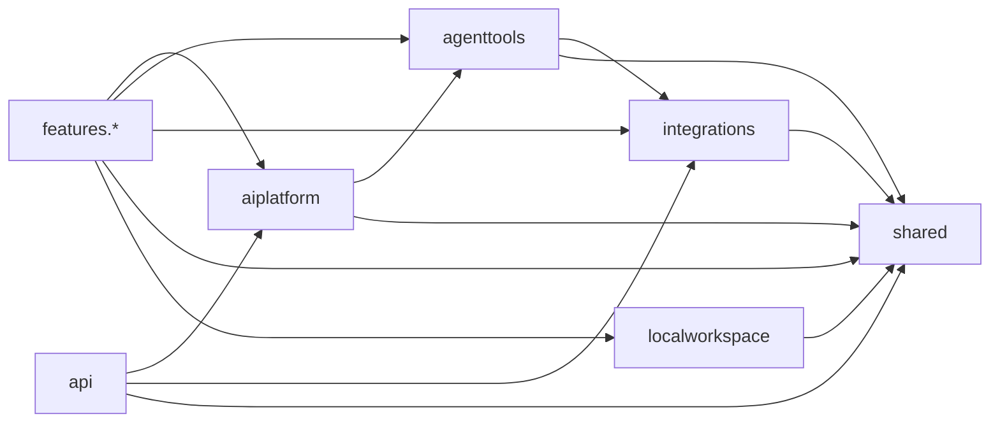

# Architecture Summary

## Cel i model produktu

`Team Delivery Workspace` jest platforma do AI-augmented system analysis dla zespolu wytworczego. Laczy deterministyczne zbieranie kontekstu z systemow zewnetrznych, curated operational context, kontrolowane narzedzia agenta oraz sesje AI. Incident Analysis, poczatkowo glowny cel repozytorium, jest pierwszym feature'em pionowym, a nie generycznym rdzeniem produktu.

Kazdy feature analityczny posiada wlasny kontrakt HTTP, workflow, zrodla evidence, prompt, skills, polityke narzedzi, hidden scope oraz wynik dla operatora. Reuse dotyczy capability, mechaniki runtime i wspolnych elementow interfejsu, nie orchestration ani semantyki innego feature'a.

## Backend

Backend to monolit Spring Boot 3.5 na Java 17. Aplikacja korzysta z GitHub Copilot SDK jako aktualnej platformy wykonania AI, Spring AI MCP do ekspozycji narzedzi oraz adapterow REST do systemow zewnetrznych. Angular jest budowany osobno i jego produkcyjny bundle trafia do `src/main/resources/static`, skad serwuje go Spring Boot.

Warstwy backendu maja nastepujace ownership:

```text
features.<feature>  - pionowy use case: API, job/run, evidence, AI i wynik
aiplatform          - neutralny runtime AI i mechanika sesji Copilota
agenttools          - neutralne tools/MCP nad capability
integrations        - porty, adaptery REST, konfiguracja i modele systemow zewnetrznych
api                 - shared/operator API niezalezne od pojedynczego feature'a
shared              - male, stabilne kontrakty miedzy warstwami i feature'ami
localworkspace      - lokalne ustawienia, historia runow i bezpieczny zapis plikow
common              - male helpery techniczne bez ownership domenowego
```

Dozwolony kierunek zaleznosci jest jednokierunkowy:



Reusable warstwy nie moga importowac `features.*`. Feature nie importuje rodzenstwa ani `api.*`; shared/operator API nie orkiestuje feature'ow. `shared` i `common` nie stanowia magazynu przypadkowych DTO. Produkcyjny i testowy root `analysis.*` jest zamkniety dla nowych klas.

## Integracje i tools

`integrations` dostarcza reusable capability dla Elasticsearch/Kibana, Dynatrace, GitLaba, Jiry, Confluence, bazy danych i Operational Context. Adaptery nie znaja feature'ow, tooli, Copilota ani HTTP API. GitLab wystepuje w trzech rozdzielonych rolach: generyczny adapter/source resolve, deterministyczne evidence oraz AI-guided lookup przez tools.

`agenttools` opakowuje capability jako neutralne narzedzia i MCP. Model-facing argumenty pozostaja waskie; w szczegolnosci scope repozytorium, branch, environment i podobne dane sa przekazywane session-bound przez hidden `ToolContext`, a nie wybierane przez model. Operational Context udostepnia neutralne tools pod prefiksem `opctx_`.

## Platforma AI

`aiplatform.copilot` realizuje lifecycle sesji, autoryzacje, katalog modeli, allowliste tools, hooks, hidden context, policy i budget wywolan, evidence capture, activity trace, usage/cost oraz polityke context tier. Feature przekazuje do platformy `CopilotRunRequest` z promptem, artefaktami, dozwolonymi tools, hidden contextem, policy i parserem/projekcja wyniku; platforma nie wybiera incidentowego promptu, skills ani kontraktu odpowiedzi.

Skills sa packaged runtime resources w `src/main/resources/copilot/skills`. Przy starcie immutable seed uzupelnia tylko brakujace pliki w efektywnym katalogu pod `tdw-data/copilot/skills`. Kazda sesja dostaje ten sam root i built-in tool `skill`; feature wskazuje workflow i starter w prompcie, ale nie wybiera katalogow ani nazw skilli per run.

Copilot otrzymuje evidence jako logical artifacts osadzone inline w prompcie, nie jako SDK attachments. Wynik initial analysis jest report-first: model aktualizuje session-bound `AnalysisReport` przez platformowe report tools, a feature waliduje raport wobec evidence i mapuje go na wlasny kontrakt HTTP. Finalna odpowiedz tekstowa modelu nie jest kanonicznym wynikiem.

Autoryzacja Copilota dziala w trybie lokalnego tokena albo GitHub App user access tokena. Token nie jest elementem requestu feature'a ani stanu joba; runtime rozwiazuje go tuz przed utworzeniem klienta SDK.

## Incident Analysis

Kanoniczny start pierwszego feature'a to `POST /api/analysis/jobs`. Operator wybiera `ELASTICSEARCH` z wymaganym `correlationId` albo `CSV_UPLOAD` z plikiem `logFile`, a opcjonalnie model i `reasoningEffort`. `environment` i `gitLabBranch` sa wyprowadzane z evidence, natomiast `gitLabGroup` pochodzi z konfiguracji. Historyczne aliasy `/analysis/**` pozostaja tylko dla kompatybilnosci.

Job uruchamia feature-owned orchestration: buduje `AnalysisContext`, zbiera deterministyczne `AnalysisEvidenceSection`, przygotowuje prompt raz, zapisuje go do snapshotu i wykonuje AI. Typowy pipeline obejmuje logi, deployment context, rownolegly fan-out Dynatrace i GitLab deterministic evidence oraz Operational Context. Granica AI wykorzystuje jedynie neutralne evidence, nie DTO adapterow.

Follow-up chat wznawia zapisana sesje Copilota i uzywa juz rozwiazanego hidden scope'u. Nie ponawia collectora ani initial promptu. Lokalny run zapisuje snapshoty od stanu `QUEUED`, ale nie jest durable worker queue: restart backendu zachowuje historie, lecz nie wznawia pracy w tle.

## Feature'y i API

Obok Incident Analysis produkt posiada lub rozwija niezalezne feature'y: Flow Explorer, Change Verification, Config Drift Viewer, Delivery Complexity Assessment, eksperymentalny Delivery Scope Complexity, Delivery Complexity Trends oraz UI Explorer. Kazdy z nich jest odrebnym pionem w `features` i reuse'uje capability platformy bez zaleznosci od Incident Analysis.

`api.*` udostepnia shared/operator fasady, m.in. katalog modeli, konfiguracje UI, ustawienia workspace'u, GitHub auth, effective AI Skills, Operational Context oraz lokalna historie runow. Endpointy konkretnego use case'u sa feature-owned i mieszcza sie przy jego API/job workflow.

## Frontend i dane lokalne

Angularowy frontend ma shell z trzema grupami nawigacji: `Analysis Features`, `Tool Workbench` i `Platform`. Feature'y sa ekranami pracy nad wynikiem, Workbench jest laboratorium reusable capability bez semantyki incydentu, a Platform obejmuje overview, ustawienia, auth, modele i AI Skills. UI jest jasne, korporacyjne i robocze; wspolne elementy przebiegu runu, activity, evidence, follow-up chatu, usage/cost oraz stanow widokow sa wspoldzielone przez Angular `core` i `components`.

`localworkspace` przechowuje bezpiecznie lokalne ustawienia, indeks i koperty runow. Feature posiada wlasny codec, sanitizer oraz decyzje, czy zapis wspiera kontynuacje. Historia i import/export sa granicami walidacji niezaufanych danych, a nie kanalem do odtwarzania ukrytego scope'u albo sekretow.

## Utrzymanie

Przy nowej zmianie najpierw nalezy rozstrzygnac, czy nalezy ona do reusable capability, mechaniki platformy, shared/operator API czy feature-specific workflow. Nowy feature zaczyna sie od zatwierdzonej potrzeby i planu, a jego trwale decyzje po realizacji trafiaja do `docs/architecture`. Szczegolowe, kanoniczne kontrakty i runtime flow pozostaja w dokumentach tematycznych w tym katalogu.