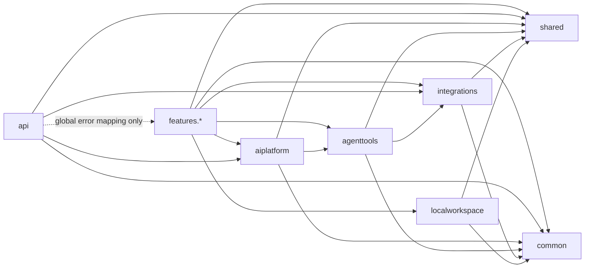
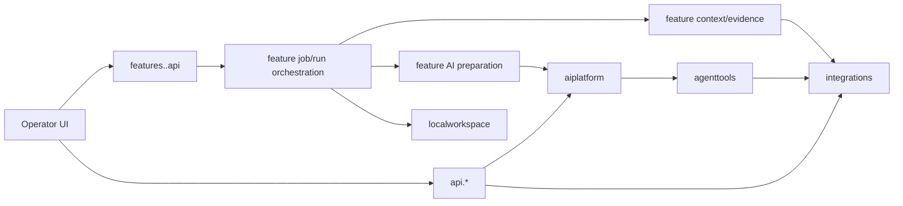

# Package Dependencies

## Cel

Ten dokument definiuje docelowy ownership warstw i dozwolony kierunek
zaleznosci. Jest kontraktem dla nowych klas, refaktorow, testow
architektonicznych oraz ekstrakcji wspolnych mechanizmow.

Nie jest raportem liczby importow ani historia migracji pakietow. Aktualny kod
ma zblizac sie do ponizszego modelu, a jawny drift trafia do `../plans/`, nie
do definicji architektury.

## Model rozszerzalnosci

Produkt jest platforma AI-augmented system analysis. Dedykowane feature'y
skladaja reusable capability, ale zadna warstwa reusable nie zna konkretnego
feature'a.

```text
feature analityczny
  -> platforma AI
  -> reusable tools
  -> integracje
  -> systemy zewnetrzne

feature analityczny
  -> deterministic context/evidence
  -> integracje

feature analityczny
  -> local workspace
```

Incident Analysis, Flow Explorer, Change Verification i Config Drift Viewer sa
rodzenstwem. Zaden z nich nie jest generycznym core dla
pozostalych.

Mala `common.PlatformSourceCodeProperties` posiada wymagany
`platform.source-code.default-branch`. Feature'y oraz shared/operator UI config
moga ja konsumowac bez importowania siebie nawzajem; nie powstaje
feature-specific wlasciciel wspolnego defaultu.

## Docelowe warstwy backendu

### `integrations`

Warstwa posiada:

- properties i konfiguracje klientow zewnetrznych,
- porty, adaptery REST i capability services,
- request/result DTO konkretnej integracji,
- techniczne wyjatki i lokalne zachowania zewnetrznego systemu.

`integrations.gitlab.frontend` jest przykladem takiej reusable capability:
buduje bounded Angular/Nx route/view catalog i screen source context przez
`GitLabRepositoryPort`, ale nie zna UI Explorer, API, Copilota ani kontraktu
raportu. Statyczne heurystyki zwracaja diagnostics, source revision i jawne
limity; nie uruchamiaja ani nie kompiluja badanego frontendu. Lokalny resolver
w tej samej integracji moze odczytac `tsconfig*.json`, rozwiazac ograniczone
aliasy `baseUrl`/`paths` oraz importowane statyczne modele tras. Nie jest to
generyczny TypeScript runtime ani powod do przenoszenia logiki parsera do
feature'a.

Ten sam adapter ma byc mozliwy do wywolania przez evidence provider, tool,
shared/operator API albo kolejny feature.

`features.uiexplorer.catalog` jest feature-owned composition boundary nad
Operational Context i `integrations.gitlab.frontend`: rozwiazuje system do
jednego primary repository, przekazuje ukryty GitLab scope do integracji i
mapuje wynik na publiczny katalog bez danych repository. Publiczne DTO w
`features.uiexplorer.api` i `contract` nie importuja klas integracji.

`features.uiexplorer.context` jest feature-owned pipeline nad wybranym
katalogowym ekranem. Rozwiazuje hidden repository scope przez katalog
frontendu, wymaga oczekiwanej source revision, wywoluje neutralny screen
context builder i mapuje wynik na wewnetrzny snapshot, coverage aktywnych
sekcji oraz publiczne `AnalysisEvidenceSection`. Surowa tresc source files
pozostaje w wewnetrznym snapshotcie joba; publiczne evidence zawiera tylko
manifest i nie importuje kontraktow integracji.

`features.uiexplorer.ai.preparation` jest feature-owned granica przygotowania
AI. Buduje logical artifacts, klasyfikuje opis uzytkownika i source files jako
untrusted evidence, renderuje feature prompt oraz starter guidance wskazujace
trzy runtime skills. Reuse'uje jedynie neutralny model
`CopilotRenderedArtifact` i mapper tresci z `aiplatform`; nie uruchamia sesji,
nie wybiera tools i nie dodaje semantyki UI Explorer do platformy.

`features.uiexplorer.ai.readiness`, `response` i `copilot` posiadaja runtime
konkretnego feature'a: readiness aktywnych sekcji, strict parser jednego
`UiExplorerResultResponse`, hidden repository scope, default-deny allowliste,
targeted GitLab fallback budget oraz zlozenie `CopilotRunRequest`. Provider
reuse'uje neutralne preparation/execution z `aiplatform`, genericzne tools z
`agenttools` i deterministyczny report assembler. `features.uiexplorer.job`
uruchamia ten provider asynchronicznie, przechowuje atomowy snapshot krokow,
evidence, activity, usage, result i report oraz mapuje kontrolowane stany
terminalne. `features.uiexplorer.job.localworkspace` posiada feature codec i
sanitizer, mapuje terminalny snapshot na neutralny `LocalAnalysisRunRecord` i
zapisuje go przez `LocalAnalysisRunStore`. Shared History API oraz
`localworkspace` nie importuja UI Explorer. Platforma, tools i integracje nie
importuja tych pakietow. `features.uiexplorer.job.export` posiada odrebny
portable contract i odczytuje feature-owned local envelope tylko jako fallback
po restarcie. `features.uiexplorer.job.importing` waliduje i sanitizuje
niezaufany portable payload, po czym zapisuje nowy read-only run przez port
persistence feature'a; nie importuje shared `api.analysisruns`.

Warstwa nie posiada:

- promptow i skilli,
- evidence pipeline,
- tooli ani MCP exposure,
- Copilot SDK runtime,
- job state i workflow feature'a.

### `agenttools`

Warstwa posiada:

- neutralne nazwy i kontrakty tools,
- Spring AI/MCP exposure capability,
- mapowanie session-bound hidden context do scope'u integracji,
- delegacje do `integrations`,
- neutralne input/output DTO potrzebne wielu runtime'om agenta.

MCP jest tylko sposobem ekspozycji capability. Tool nie moze zakladac, ze
wywoluje go Incident Analysis albo Copilot SDK.

Warstwa nie posiada:

- promptow, skilli i response parserow,
- feature-specific heurystyk oraz evidence mapping,
- job state,
- mechaniki sesji konkretnego providera AI.

### `aiplatform`

Warstwa posiada neutralna mechanike uruchamiania AI:

- lifecycle i konfiguracje sesji providera,
- przygotowanie technicznego runtime z inputu feature'a,
- allowliste tools i blokady workspace,
- invocation handler, eventy, policy contracts i budzety,
- hidden context jako mechanizm,
- session-bound evidence store,
- model/options catalog,
- user-visible usage i techniczne wykonanie requestu.

Feature przekazuje platformie prompt, guidance do uzycia skilli, available
tools, hidden context, policy, evidence sink i kontrakt obslugi odpowiedzi.
Platforma sama udostepnia wszystkim sesjom pelny katalog runtime skilli, ale
nie wybiera incidentowego workflow, promptu, tooli ani response contractu i
nie traktuje `correlationId` jako uniwersalnego inputu.

### `features.<feature>`

Feature posiada:

- publiczny request i result contract use case'u,
- API, job/run state i orchestration,
- deterministic context albo evidence pipeline,
- prompt, tresc skilli, guidance ich uzycia i result parser,
- feature-owned tool policy i hidden scope,
- mapowanie tool evidence na rezultat dla operatora,
- feature-specific persistence codec i UI mapping.

Feature moze korzystac z reusable warstw, ale nie importuje innego
`features.<sibling>`. Reuse podobnych fragmentow dwoch feature'ow zaczyna sie
od porownania semantyki i ownership; wspolny kod powstaje dopiero po
potwierdzeniu stabilnego kontraktu.

### `api`

`api.*` jest globalnym shared/operator API dla endpointow wspolnych wielu
ekranom albo bedacych stabilna fasada nad platforma i integracjami.

Feature-specific endpoint pozostaje przy `features.<feature>.api`.
Shared/operator API nie orkiestuje feature'a i nie jest importowane przez
feature. Globalny `ApiExceptionHandler` jest waskim composition boundary i
moze mapowac feature-specific exception na wspolny HTTP error contract; nie
upowaznia to pozostalych `api.*` do importowania flow, DTO ani services
feature'a.

### `shared`

`shared` posiada male, stabilne kontrakty uzywane przez co najmniej dwa
feature'y albo warstwy, np.:

- evidence,
- AI usage i activity,
- user-facing tool feedback,
- neutralne fragmenty run projection.

Nie jest magazynem przypadkowych DTO. Typ pozostaje przy swoim wlascicielu,
jezeli wspoldzielona jest tylko jego nazwa albo ksztalt, a nie semantyka.

### `common`

`common` posiada male helpery techniczne bez domenowego ownership, np.
bezpieczne parsowanie payloadu. Nie zawiera orchestration, kontraktow feature'a
ani integracji.

### `localworkspace`

Warstwa posiada neutralny lokalny zapis:

- ustawien i token references,
- indeksu i kopert runow,
- bezpiecznych operacji na sciezkach i plikach.

Feature posiada codec swojej zawartosci i decyduje, czy zapis wspiera
kontynuacje. Local workspace nie importuje feature'ow i nie jest durable job
queue.

## Docelowy graf importow backendu

Strzalka oznacza, ze pakiet po lewej moze importowac pakiet po prawej:



Dozwolone krawedzie sa waskie: obecność strzalki nie oznacza, ze kazdy pakiet
powinien importowac wszystkie typy warstwy docelowej.

## Zakazane kierunki backendu

```text
integrations -> agenttools
integrations -> aiplatform
integrations -> features.*
integrations -> api
integrations -> localworkspace

agenttools -> aiplatform
agenttools -> features.*
agenttools -> api
agenttools -> localworkspace

aiplatform -> features.*
aiplatform -> api
aiplatform -> integrations
aiplatform -> localworkspace

api -> features.* poza globalnym mapowaniem typow bledow
features.* -> api
features.<feature> -> features.<sibling>

shared -> integrations / agenttools / aiplatform / features.* / api
common -> integrations / agenttools / aiplatform / features.* / api
localworkspace -> features.* / api / aiplatform / agenttools / integrations
```

Produkcyjny i testowy root `analysis.*` jest zamkniety. Nowe klasy i testy
trafiaja do aktualnego wlasciciela kontraktu.

## Runtime ownership

Runtime ownership nie jest tym samym co graf importow. Strzalka ponizej
oznacza inicjowanie albo delegowanie wykonania; wynik moze wrocic do callera
bez tworzenia odwrotnej zaleznosci pakietowej.



Feature pozostaje composition rootem swojego use case'u. Platforma i tools
wykonuja przekazana konfiguracje; nie rekonstruuja decyzji feature'a z nazw
tooli, evidence albo endpointu.

Config Drift Viewer realizuje ten graf bez dodatkowej warstwy
posredniej: feature posiada parsing/diff, orchestration, prompt, skille,
policy, persistence codec i API; korzysta z nazwanej integracji GitLab dla
repozytorium konfiguracji, neutralnego GitLaba i Operational Context dla
`DEEP`, platformy Copilot oraz `localworkspace`. Test architektoniczny blokuje
importy do sibling feature'ow i odwrotne zaleznosci reusable warstw. Dodatkowa
regula zabrania pakietowi
`features.configdriftviewer.ai` importowania operatorskiej
`deterministic.projection` z dokladnymi wartosciami oraz warstwy
`presentation`; adnotacje DEEP sa laczone dopiero poza granica AI.

## Frontend

Docelowy kierunek zaleznosci Angulara:

```text
app shell / routes
  -> features/<feature>
  -> components
  -> core

features/<feature> -> components + core
components -> core
core -> Angular/framework/external libraries
```

Zasady:

- `core` zawiera neutralne modele, serwisy, auth i shared state; nie importuje
  feature pages,
- `components` zawiera reusable elementy workflow operatora i nie importuje
  dedykowanych feature'ow,
- feature posiada request/result models, copy, page orchestration i
  feature-specific presentation,
- feature nie importuje komponentow ani modeli rodzenstwa,
- shell jest composition rootem routingu i nawigacji; nie przenosi semantyki
  jednego feature'a do wspolnego serwisu,
- podobny wyglad nie jest wystarczajacym powodem ekstrakcji; wspolny komponent
  musi miec wspolna semantyke, input i lifecycle.

## Jak usuwac cykle

Usuwaj cykl przez przeniesienie kontraktu do jego rzeczywistego wlasciciela:

1. nazwij semantyke typu i wszystkich konsumentow,
2. wybierz najnizsza warstwe, ktora moze byc wlascicielem bez importu w gore,
3. przenies kontrakt i zaktualizuj wszystkich konsumentow,
4. dodaj test blokujacy powrot zlej krawedzi.

Nie przenos typow do `shared` albo `common` tylko po to, aby kompilacja
przeszla.

## Enforcement

`PackageDependencyGuardTest` lub rownowazne reguly maja:

- blokowac nowe klasy w zamknietym `analysis.*`,
- blokowac importy reusable warstw do `features.*`,
- blokowac zaleznosci sibling feature -> sibling feature,
- blokowac importy `integrations -> agenttools/aiplatform/api`,
- blokowac importy `agenttools -> aiplatform`,
- blokowac aplikacyjne zaleznosci z `shared` i `common`,
- byc wzmacniane inkrementalnie wraz z usuwaniem jawnego driftu.

Zmiana grafu zaleznosci jest zmiana architektoniczna. Wymaga aktualizacji tego
dokumentu, testu architektonicznego oraz zatwierdzonego planu zgodnego z
`../AGENTS.md`.

## Kryterium zgodnosci nowego feature'a

Nowy feature jest zgodny z architektura, gdy:

- ma wlasny request, result, prompt, skille i policy,
- sklada neutralny runtime zamiast kopiowac Incident Analysis,
- wybiera capability z `agenttools` i `integrations`,
- reuse'uje wspolne modele oraz UI tylko tam, gdzie semantyka jest wspolna,
- nie wymaga dodania swojej semantyki do platformy, tools ani sibling
  feature'a,
- jego usuniecie nie wymaga zmiany reusable warstw poza usunieciem
  niewykorzystywanych rozszerzen.
