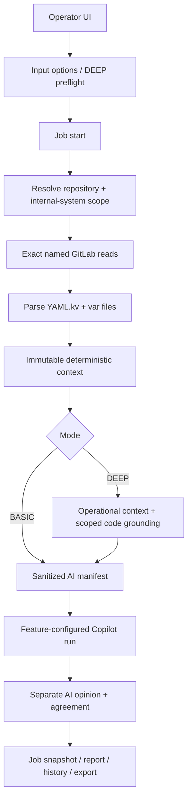

# Runtime Configuration Verification Runtime Flow

## Cel

Feature wykrywa rozjazd runtime configuration wybranego `internal-system`
pomiedzy branchami srodowiskowymi przed wdrozeniem. Operator dostaje:

1. deterministyczne fakty: coverage, diff i findings,
2. oddzielna interpretacje AI jako druga pare oczu,
3. w `DEEP` funkcjonalne znaczenie, code grounding i ownership/handoff,
4. jawne ograniczenia widocznosci i status kompletności.

Publiczny target to `systemId`. Configuration directory jest rozstrzygany z
Operational Context, a repozytorium konfiguracji z backendowej allowlisty.
Obslugiwane branche maja format `devX` i `zt00X`, gdzie `X` jest jedna cyfra.

## Publiczne wejscia

```http
GET  /api/runtime-configuration-verification/input-options
GET  /api/runtime-configuration-verification/deep-preflight
POST /api/runtime-configuration-verification/jobs
GET  /api/runtime-configuration-verification/jobs/{jobId}
POST /api/runtime-configuration-verification/imports
```

Start joba przyjmuje tryb `BASIC` albo `DEEP`, repository id, `systemId`,
source/target branch, opcjonalny `codeRef` i preferencje AI. Connection id,
GitLab project path, tokeny i configuration directory nie sa swobodnym
inputem klienta.

## Przeplyw wspolny



Job publikuje kroki `SOURCE`, `PARSE`, `DIFF`, opcjonalne
`OPERATIONAL_CONTEXT`, `CODE_GROUNDING`, `OWNERSHIP` oraz `AI`. Snapshot jest
dostepny od stanu `QUEUED` i jest aktualizowany bez nakladajacych sie odczytow
pollingu.

## Deterministyczne zrodla i wynik

Dla kazdego brancha loader czyta dokladnie:

- `global.var`,
- `<configuration-directory>/local.var`,
- jeden z `<configuration-directory>/application.yml.kv` albo
  `application.yaml.kv`.

Obecnosc obu wariantow application file jest ambiguity. Brak brancha, pliku,
niepelny/truncated odczyt i blad integracji trafiaja do coverage jako jawny
status i stabilny error code.

Parser zachowuje dokumenty i zagniezdzona strukture YAML. Var files sa
normalizowane do sciezek parametrow. Deterministyczny engine tworzy:

- sanitizowany obraz calego schematu, rowniez niezmienionych parametrow,
- stabilne differences z typem `ADDED`, `REMOVED`, `CHANGED` lub
  type/structure change,
- findings wynikajace z coverage, brakow i ryzyk strukturalnych,
- status niezalezny od opinii AI.

Niesensytywne wartosci dostaja pseudonimy stabilne tylko w ramach runu.
Wartosci sensytywne nie dostaja raw value, hash ani tokenu porownawczego.

## Tryb BASIC

`BASIC` konczy zbieranie kontekstu na deterministic result. Prompt zawiera
sanitizowany manifest i kontrakt wyniku, ale nie Operational Context ani kod.
Allowlista Copilota zawiera tylko narzedzia reportu; policy dodatkowo odrzuca
GitLab i `opctx_*`, nawet gdyby zostaly omylkowo zarejestrowane.

To jest sciezka o najmniejszym budzecie i opoznieniu. Gwarancja ma charakter
strukturalny: brak wywolan enrichment/code tools, a nie wall-clock SLA zalezne
od sieci i modelu.

## Tryb DEEP

Preflight `DEEP` wymaga:

- wlaczonego i dostepnego Operational Context,
- jednoznacznego `internal-system` i configuration directory,
- code-search scope targetujacego system,
- repozytorium kodu i bezpiecznego refu.

Requested `codeRef` jest sprawdzany w GitLab. Fallback do default branch jest
dozwolony tylko z jawnym ostrzezeniem, ze nie potwierdza wdrozonej wersji.
Code search i file reads sa ograniczone do project/ref/path prefixes ze
scope'u. Feature-specific policy egzekwuje takze budzet liczby tool calls.

Enrichment probuje wyjasnic, jakich systemow, funkcji, procesow albo bounded
contextow dotycza zmienione klucze. Ownership jest rozstrzygany z systemu lub
bounded contextu i nie jest przypisywany repozytorium jako nowy fakt.

Pusty lub niepelny katalog blokuje start, gdy nie da sie zbudowac bezpiecznego
scope'u. Awaria enrichmentu juz po starcie nie usuwa deterministic result:
job zwraca wynik czesciowy z visibility limit.

## Granica AI

AI nie otrzymuje raw source files. Artefakty wejściowe zawieraja wylacznie:

- nazwy i sciezki parametrow,
- typy i strukture,
- change kind, sensitivity i stabilne referencje,
- run-local pseudonimy tylko dla niesensytywnych wartosci,
- coverage/findings oraz, w `DEEP`, ograniczony kontekst operational/code.

Artefakty maja limit per file oraz laczny limit manifestu. Przekroczenie
powoduje deterministyczne grupowanie/truncation marker i visibility limit,
bez modyfikowania deterministic result.

AI zapisuje tylko feature-owned sekcje reportu. Parser odrzuca niezgodny
response contract, a agreement evaluator porownuje referencje i wnioski z
deterministycznym wynikiem. UI zawsze etykietuje `FACT`, `DERIVED` i
`AI INTERPRETATION`.

## Bledy i bezpieczenstwo integracji

Named GitLab adapter:

- waliduje connection id, project path, ref i file path,
- odrzuca traversal i niebezpieczne refy przed wywolaniem sieci,
- koduje targety w URI,
- ogranicza liczbe zwracanych znakow backendowym maksimum,
- mapuje 401, 403, 404 oraz timeout/transport failure do typowanych bledow.

Coverage i user-facing error zawieraja tylko stabilny kod albo ogolny
komunikat. Response body, URL, token, raw exception message i raw
configuration nie sa propagowane. Log joba zawiera identyfikator runu i typ
awarii, bez tekstu wyjatku.

## Historia, import i export

Sanitizowany snapshot jest zapisywany w shared local workspace od utworzenia
joba i aktualizowany wraz z postepem. Feature nie wspiera chat continuation.

Export jest wersjonowany i read-only. Import waliduje wersje i nie tworzy
kontynuowalnego runu. Przed persistence i exportem snapshot sanitizer usuwa
ewentualne wartosci/tokenu z wezlow oznaczonych jako sensytywne.

## Architecture And Security Review

Stan wdrozony spelnia granice warstw:

- `features.runtimeconfigurationverification` jest composition rootem,
- named/exact GitLab pozostaje reusable capability w `integrations.gitlab`,
- Operational Context i GitLab tools sa neutralne,
- Copilot runtime nie importuje feature'a,
- persistence techniczne pozostaje w `localworkspace`,
- sibling feature'y nie importuja sie wzajemnie.

Security review obejmuje testy: raw-secret leak przez artifacts/report/history/
export, limity duzych plikow i manifestu, 401/403/404/timeout, traversal,
`BASIC` bez deep dependencies, `DEEP` scope i budget, puste/niepelne
Operational Context oraz bezpieczne bledy joba. Regresje granic pakietow
egzekwuje `PackageDependencyGuardTest`.
