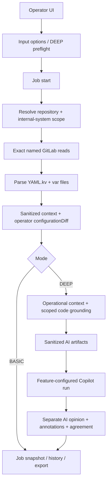

# Config Drift Verification Runtime Flow

## Cel

Feature wykrywa rozjazd runtime configuration wybranego `internal-system`
pomiedzy branchami srodowiskowymi przed wdrozeniem. Operator dostaje:

1. deterministyczne fakty: coverage, diff i findings,
2. operatorska projekcje per plik z dokladnymi wartosciami source/target,
3. tylko w `DEEP`: oddzielna interpretacje AI, funkcjonalne znaczenie,
   code grounding i ownership/handoff,
4. jawne ograniczenia widocznosci i status kompletnosci.

Publiczny target to `systemId`. Configuration directory jest rozstrzygany z
Operational Context, a repozytorium konfiguracji z backendowej allowlisty.
Domyslna lista branchy to `dev`, `dev2`, `uat`, `uat2`. Lista prezentowana
przez input-options jest konfigurowana przez
`features.runtime-configuration-verification.branches` w
`application.properties`; glowny formularz i Tool Workbench korzystaja z tego
samego kontraktu opcji. Walidacja requestu dopuszcza bezpieczne nazwy refow Git,
z rodzin `dev`, `test`, `uat` i `zt`, opcjonalnie zakonczone wielocyfrowym
numerem. Brak sufiksu pozostaje dozwolony dla domyslnych `dev` i `uat`.

## Publiczne wejscia

```http
GET  /api/runtime-configuration-verification/input-options
GET  /api/runtime-configuration-verification/deep-preflight
POST /api/runtime-configuration-verification/jobs
GET  /api/runtime-configuration-verification/jobs/{jobId}
POST /api/runtime-configuration-verification/imports
```

Start joba przyjmuje tryb `BASIC` albo `DEEP`, repository id, `systemId` oraz
source/target branch. `codeRef` i preferencje AI sa dozwolone tylko dla
`DEEP`. Connection id, GitLab project path, tokeny i configuration directory
nie sa swobodnym inputem klienta.

Named connection `runtime-config` bierze wartosci bazowe z
`integrations.gitlab.named.connections.runtime-config.base-url` oraz `token`.
Oba pola moga byc lokalnie nadpisane w Workspace Settings. Zapis aktualizuje
ten sam properties bean, ktory przy kazdym odczycie rozwiazuje
`GitLabNamedConnectionRegistry`, dlatego nowa wartosc obowiazuje bez restartu.

Podczas aktualnego rollout readiness glowny formularz operatorski pozwala
wybrac tylko `BASIC`. Opcja `DEEP` pozostaje widoczna jako disabled z badgem
`SOON`; publiczny kontrakt backendu, Workbench oraz renderowanie zapisanych i
importowanych wynikow `DEEP` pozostaja bez zmian.

## Przeplyw wspolny



Job publikuje kroki `SOURCE`, `PARSE`, `DIFF`, opcjonalne
`OPERATIONAL_CONTEXT`, `CODE_GROUNDING`, `OWNERSHIP` oraz `AI`. Snapshot jest
dostepny od stanu `QUEUED` i jest aktualizowany bez nakladajacych sie odczytow
pollingu.

## Deterministyczne zrodla i wynik

Dla kazdego brancha loader czyta dokladnie:

- `global.var`,
- `<configuration-directory>/local.var`,
- jeden z `<configuration-directory>/application.yml.kv` albo
  `application.yaml.kv`.

Obecnosc obu wariantow application file jest ambiguity. Brak brancha, pliku,
niepelny/truncated odczyt i blad integracji trafiaja do coverage jako jawny
status i stabilny error code.

Parser zachowuje dokumenty i zagniezdzona strukture YAML. Var files sa
normalizowane do sciezek parametrow. Jeden deterministic build tworzy:

- sanitizowany obraz calego schematu, rowniez niezmienionych parametrow,
- operatorski `configurationDiff` per plik i dokument z oryginalnymi nazwami
  oraz dokladnymi wartosciami `source`/`target`,
- stabilne differences z typem `ADDED`, `REMOVED`, `CHANGED` lub
  type/structure change,
- findings wynikajace z coverage, brakow i ryzyk strukturalnych,
- status niezalezny od opinii AI.

Niesensytywne wartosci dostaja pseudonimy stabilne tylko w ramach runu.
Wartosci sensytywne nie dostaja raw value, hash ani tokenu porownawczego.

Finding parsera zachowuje lokalizacje plik:linia. Gdy nieobslugiwana skladnia
konkretnego klucza bezposrednio powoduje unresolved reference, wynik publikuje
jeden finding root-cause z powiazanym `referenceId`, zamiast liczyc skutek jako
drugi niezalezny problem. Literalne dodanie wartosci sklasyfikowanej jako
sensytywna ma kod `HARDCODED_SENSITIVE_VALUE_ADDED` i severity `ERROR`;
placeholder pozostaje odroznialny od hardcoded value.
Deterministic findings sa ograniczone do technicznej niekompletnosci wyniku
(coverage, parser, unresolved/cyclic reference) i twardej polityki literalnego
sekretu. Zmiana typu, zmiana efektywna, sensitive placeholder, rowny parametr
srodowiskowy, marker nazwy brancha oraz unrelated global diff pozostaja faktami
w diffie/referencjach i nie tworza findingow. Ich znaczenie ocenia warstwa AI.
W plikach `.var` operatory przypisania `=` i `:` sa rownowazne dla wartosci
skalarnych, list i map. Uzycie `:` nie tworzy issue parsera ani unresolved
reference.

Projekcja operatorska jest prezentowana jako pelne drzewo source/target.
Kardynalnosc kolekcji nie jest wyswietlana. Sygnal zmiany wystepuje tylko przy
lisciu: czerwony dla dodania/usuniecia, pomaranczowy dla zmiany lub zmiany typu
i zolty dla zmiany efektywnej; opis pozostaje w tooltipie. Niezmieniony lisc
pokazuje jawnie `source = target` oraz wspolna wartosc bez znacznika.
Rozne wartosci skalarne sa prezentowane jako `source != target` i inline diff:
dla tekstu z czerwonym fragmentem usunietym oraz zielonym fragmentem dodanym,
a dla pozostalych typow z cala wartoscia source oznaczona na czerwono i cala
wartoscia target oznaczona na zielono.
Dodanie i usuniecie sa prezentowane bez ramek i etykiet source/target:
strzalka pokazuje kierunek, brakujaca strona jest oznaczona jako czerwone
`BRAK` z tlem i obramowaniem, dodana wartosc jest zielona, a usuwana wartosc
jest czerwona i przekreslona.
Zmiana efektywna zachowuje literalna wartosc w drzewie, a po hover/focus
pokazuje po prawej resolved source/target inline diff z tym samym kodem
czerwono-zielonym.
Wielodokumentowy YAML jest renderowany jako jeden ciagly plik z separatorami
`---`, bez zagniezdzonych ramek i naglowkow `Dokument N`. Profil
`spring.config.activate.on-profile` pozostaje zwyklym lisciem drzewa: wspolna
wartosc jest pokazywana jako `source = target`, a w widoku samych zmian
niezmieniony profil jest pomijany.
Pliki sa porzadkowane od konfiguracji najbardziej szczegolowej do najbardziej
ogolnej: application `.kv`, `local.var`, `global.var`.

## Tryb BASIC

`BASIC` konczy run po `DIFF`. Nie rozwiazuje auth Copilota, nie buduje promptu
ani artefaktow AI, nie laduje runtime skilla, nie tworzy sesji i nie publikuje
reportu, activity, usage ani pustej sekcji AI. Status koncowy jest bezposrednim
mapowaniem deterministic statusu.

Gwarancja ma charakter strukturalny i jest testowana przez brak interakcji z
auth resolverem, enrichmentem, prompt preparation, runnerem, assessmentem,
reportem i adnotacjami AI.

## Tryb DEEP

Preflight `DEEP` wymaga:

- wlaczonego i dostepnego Operational Context,
- jednoznacznego `internal-system` i configuration directory,
- code-search scope targetujacego system,
- repozytorium kodu i bezpiecznego refu.

Requested `codeRef` jest sprawdzany w GitLab. Fallback do default branch jest
dozwolony tylko z jawnym ostrzezeniem, ze nie potwierdza wdrozonej wersji.
Code search i file reads sa ograniczone do project/ref/path prefixes ze
scope'u. Feature-specific policy egzekwuje takze budzet liczby tool calls.

Enrichment probuje wyjasnic, jakich systemow, funkcji, procesow albo bounded
contextow dotycza zmienione klucze. Ownership jest rozstrzygany z systemu lub
bounded contextu i nie jest przypisywany repozytorium jako nowy fakt.

Pusty lub niepelny katalog blokuje start, gdy nie da sie zbudowac bezpiecznego
scope'u. Awaria enrichmentu juz po starcie nie usuwa deterministic result:
job zwraca wynik czesciowy z visibility limit.

## Granica AI w `DEEP`

Warstwa AI jest wywolywana wylacznie dla `DEEP` i nie importuje operatorskiej
projekcji `deterministic.projection`. AI nie otrzymuje raw source files ani
dokladnych wartosci z `configurationDiff`. Artefakty wejściowe zawieraja
wylacznie:

- nazwy i sciezki parametrow,
- typy i strukture,
- change kind, sensitivity i stabilne referencje,
- run-local pseudonimy tylko dla niesensytywnych wartosci,
- coverage/findings oraz, w `DEEP`, ograniczony kontekst operational/code.

Artefakty maja limit per file oraz laczny limit manifestu. Przekroczenie
powoduje deterministyczne grupowanie/truncation marker i visibility limit,
bez modyfikowania deterministic result.

AI zapisuje tylko feature-owned sekcje reportu. Parser odrzuca niezgodny
response contract, a agreement evaluator porownuje referencje i wnioski z
deterministycznym wynikiem. Backend laczy krotkie adnotacje z liniami diffu
tylko przez direct albo finding-transitive IDs i nie podmienia tokenow w
swobodnym tekscie AI. UI zawsze etykietuje `FACT`, `DERIVED` i
`AI INTERPRETATION`.

## Bledy i bezpieczenstwo integracji

Named GitLab adapter:

- waliduje connection id, project path, ref i file path,
- odrzuca traversal i niebezpieczne refy przed wywolaniem sieci,
- koduje targety w URI,
- ogranicza liczbe zwracanych znakow backendowym maksimum,
- mapuje 401, 403, 404 oraz timeout/transport failure do typowanych bledow.

Coverage i user-facing error zawieraja tylko stabilny kod albo ogolny
komunikat. Response body, URL, token, raw exception message i raw
configuration nie sa propagowane. Log joba zawiera identyfikator runu i typ
awarii, bez tekstu wyjatku.

## Historia, import i export

Snapshot feature'a jest zapisywany w shared local workspace od utworzenia
joba i aktualizowany wraz z postepem. `configurationDiff` zachowuje
znormalizowane wartosci widoczne operatorowi, ale nie byte-identical pliki,
komentarze ani token dostepowy GitLaba. Feature nie wspiera chat continuation.

Export jest wersjonowany i read-only. Import waliduje wersje i nie tworzy
kontynuowalnego runu. Import starszego rekordu bez `configurationDiff` uzywa
fallbacku prezentacji. Rekordy projekcji maja redacted `toString`, aby
przypadkowe logowanie DTO nie ujawnilo wartosci.

## Architecture And Security Review

Stan wdrozony spelnia granice warstw:

- `features.runtimeconfigurationverification` jest composition rootem,
- named/exact GitLab pozostaje reusable capability w `integrations.gitlab`,
- Operational Context i GitLab tools sa neutralne,
- Copilot runtime nie importuje feature'a,
- persistence techniczne pozostaje w `localworkspace`,
- sibling feature'y nie importuja sie wzajemnie.

Security review obejmuje testy: brak actual values w artefaktach/promptcie/
raporcie/activity i zaleznosciach pakietu AI, limity duzych plikow i manifestu,
401/403/404/timeout, traversal, `BASIC` bez auth ani AI dependencies, `DEEP`
scope i budget, puste/niepelne Operational Context oraz bezpieczne bledy joba.
Regresje granic pakietow egzekwuje `PackageDependencyGuardTest`.
