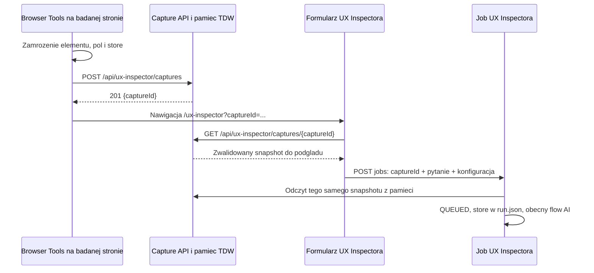

# UX Inspector: capture przez REST i snapshot w pamieci

Status: in-progress

Source need: [Jedno przekazanie obserwacji wybranego elementu](../needs/ux-inspector-capture-snapshot.md)

## Potrzeba / dlaczego

Zastapic wieloetapowe przekazywanie UX capture jednym zapisem calej obserwacji
bezposrednio z badanej strony do backendu TDW. Operator ma otworzyc formularz
z ID, zobaczyc kompaktowy podglad, uzupelnic pytanie i uruchomic obecny flow
analizy. Formularz i start maja korzystac z jednego zrodla danych.

Plan uwzglednia decyzje uzytkownika z 2026-09-29: brak `postMessage` w
przeplywie UX capture, `@CrossOrigin` z properties z domyslnym `*`, jeden
upload, pamiec bez limitow i bez odtwarzania po restarcie oraz brak
kompatybilnosci wstecznej. Uzytkownik doprecyzowal, ze po starcie analizy
store nadal jest utrwalany w `run.json` jak obecnie.

## Poziom zmiany i baseline

**L3**: zmienia transport, publiczny start, lifecycle danych przed analiza
oraz granice cross-origin. Zmiana obejmuje backend i frontend.

Stan zweryfikowany w kodzie 2026-09-29:

| Obszar | Obecne zachowanie |
| --- | --- |
| Wartosc | Jedno pytanie o jeden element z profilu `ELEMENT_CONTEXT` albo `FORM_DIAGNOSTICS`. |
| Browser Tools | `runtime.js` tworzy capture v2 i klientowe `captureId`, odczytuje widoczne pola oraz opcjonalnie raz `getStoreState()`. |
| Transport | `READY/CAPTURE/RECEIVED`, origin/source/nonce oraz osobne `FORM_CHUNK/ACK` i `STORE_CHUNK/ACK` po 32000 znakow. |
| Pamiec przed startem | Angular `UxInspectorCaptureIngressService` trzyma capture, pola i store. Odswiezenie karty je traci. |
| Upload | `UxInspectorFacade.startJob()` wykonuje dwa opcjonalne POST-y do `store-snapshots` i `form-fields-snapshots`, a potem POST joba. |
| Pending BE | Oba serwisy snapshotow maja osobne mapy, limit 8 wpisow, TTL 900 s, limit 16 MiB i jednorazowy claim po capture/origin/auth. |
| Capture | Strict deserializer i normalizer; 128 KiB przed i po normalizacji. Pelny lancuch przodkow i component boundaries, ograniczone deskryptory DOM i redakcja. |
| Start | `UxInspectorJobStartRequest` zawiera caly capture i dwa refs. Ten sam DTO sluzy tez wewnetrznemu runtime, providerowi AI i follow-up. |
| Job | Walidacja AI, normalizacja, claim, wymagany zapis `QUEUED`, opcjonalny zapis store, dispatch; target resolution, preparation, AI. |
| Evidence | Target-first resolver, pinned source, component source pack, drzewo repozytorium i repository guidance. |
| AI | Capture inline; komplet bezpiecznych pol inline do obecnego budzetu; przekroczenie budzetu oznacza jawne `UNAVAILABLE`. Store ma tylko manifest w prompcie. |
| Tools i skille | Neutralne repository/report tools oraz, gdy store istnieje, `run_store_list_paths`, `run_store_read_value` i skill `ux-inspector-store-grounding`. Hidden scope i budzety nalezy zachowac. |
| Wynik | Jednosekcyjny `AnalysisReport` (`answer`), feature result i jawne visibility limits. |
| Historia | Capture w request snapshot, pola w przygotowanym prompcie, store w prywatnym polu `run.json`, poza portable export. |
| Continuation | Follow-up korzysta z zapisanej sesji, pinned scope i store runu po restarcie; import jest read-only. Istnieje fallback dla legacy sesji. |
| Export/import | Export v2 i wynik v2, odczyt legacy v1; capture wymagany obecnie w v2. |
| UI | Rozbudowana karta capture z atrybutami, rozwijane pola i ograniczenia. Shared aside, chat, historia, usage oraz report pozostaja konsumentami joba. |
| Autoryzacja | `CurrentAnalysisAiAuthRefResolver` zwraca wspolna tozsamosc workspace PAT; nie jest uwierzytelnieniem operatora przesylajacego capture. |
| UI Explorer | Osobny page-context v1 i handshake w tych samych statycznych plikach; nie zbiera pol ani store. |

Porownanie z Incident Analysis i UI Explorerem potwierdza reuse zasady zapisu
`QUEUED` przed dispatch, shared run UI i continuation. Capture ingress jest
wlasnoscia UX Inspectora; nie ma powodu przenosic go do platformy ani
importowac sibling feature'a.

### Baseline testow

- `node --test frontend/tests/browser-tools/browser-tools.test.mjs`: 18/18.
- `mvn -q -Pbackend-dev '-Dtest=UxInspectorCaptureContractTest,UxInspectorFormFieldsSnapshotServiceTest,UxInspectorStoreSnapshotServiceTest,UxInspectorStoreSnapshotControllerTest,UxInspectorJobControllerTest,UxInspectorJobServiceTest,UxInspectorPromptAndSkillsTest,UxInspectorImportServiceTest,UxInspectorLocalRunChatHandlerTest' test`: 31/31, exit 0.
- `npm --prefix frontend test -- --watch=false --include=src/app/features/ux-inspector/services/ux-inspector-capture-ingress.service.spec.ts --include=src/app/features/ux-inspector/state/ux-inspector.facade.spec.ts --include=src/app/features/ux-inspector/pages/ux-inspector-page/ux-inspector-page.spec.ts --include=src/app/features/ux-inspector/services/ux-inspector-api.service.spec.ts`: 25/25. Pierwsza proba w sandboxie zatrzymala kompilator na odmowie dostepu do katalogow; powtorzenie poza sandboxem zakonczylo sie powodzeniem.

Sa to testy stanu wyjsciowego, nie dowod implementacji planu.

### Zastany drift objety planem

- `system-overview.md`, `key-decisions.md`, `package-dependencies.md` i
  `codex-continuation-guide.md` zawieraja starsze opisy capture v1, formularza
  albo transportu. Aktualny runtime i testy uzywaja capture v2. Krok
  dokumentacyjny ujednolici opisy dotknietego flow.
- `docs/README.md` wskazuje usuniete potrzeby/plany store'a; indeks dotyczacy
  UX Inspectora zostaje zastapiony aktualnymi linkami.
- DTO publicznego startu jest jednoczesnie requestem wewnetrznym AI.
  Zmiana na samo ID wymaga rozdzielenia tych odpowiedzialnosci w feature.
- Obecny globalny test Browser Tools zabrania jakichkolwiek API calls.
  Nowy kontrakt musi zezwalac na jeden upload UX i nadal chronic pozostale
  granice, zamiast usuwac caly test bez zastepstwa.

## Proponowane rozwiazanie

### Kontrakty i jedna tozsamosc capture

`POST /api/ux-inspector/captures` jest jedynym endpointem **zapisu** obserwacji.
`GET /api/ux-inspector/captures/{captureId}` sluzy formularzowi do jej odczytu;
nie jest drugim uploadem. Start joba nie przenosi ponownie danych capture.

Proponowany `UxInspectorCaptureUploadRequest` zawiera:

- `capture`: obecna obserwacja elementu z czasem, profilem, page, target,
  ancestors, traversal, signals, limits i client; bez ID nadawanego w JS,
- `formFields`: `status` (`NOT_REQUESTED`, `AVAILABLE`, `UNAVAILABLE`),
  `fields` oraz ewentualny techniczny powod niedostepnosci bez tresci strony,
- `store`: `status` (`AVAILABLE`, `UNAVAILABLE`), `state` oraz ewentualny
  powod niedostepnosci.

`AVAILABLE` z `[]` dla pol albo `{}`/`[]` dla store jest prawidlowym odczytem.
`ELEMENT_CONTEXT` ma `formFields.status=NOT_REQUESTED` i brak wartosci pol.
Nieudany odczyt opcjonalny nie uniewaznia poprawnej obserwacji elementu.

Backend nadaje losowe UUID i przechowuje `UxInspectorCaptureSnapshot`:
`captureId`, znormalizowany `capture`, bezpieczne `formFields` oraz `store`
wraz ze statusami i metadanymi redakcji. Jeden identyfikator obowiazuje w
receipt, URL, GET, jobie i wyniku; nie powstaje klientowe ID obok serwerowego.
Snapshot jest niemutowalny dla konsumentow, rowniez dla zawartych `JsonNode`.

Walidacja ksztaltu i redakcja sa reuse'owane z obecnego normalizera i serwisow
pol/store, po oddzieleniu od ich pending maps. Blad wymaganej obserwacji lub
koperty daje `400`; bledna opcjonalna czesc daje `UNAVAILABLE` tej czesci i
jawna informacje w podgladzie/preparation. Redakcja sekretow pozostaje
niezalezna w przegladarce i backendzie.

Zapis zwraca `201 {captureId}` dopiero po umieszczeniu calosci w pamieci.
GET zwraca ten sam bezpieczny snapshot, `Cache-Control: no-store`, a dla
nieznanego ID `404` z kodem `UX_INSPECTOR_CAPTURE_NOT_FOUND` przez wspolny
kontrakt bledow API. Przegladarka nie zapisuje payloadu w URL ani storage.

### CORS, dostep i konfiguracja

Property: `ux-inspector.capture.allowed-origins=*`. Metoda POST otrzymuje
`@CrossOrigin(origins = "${ux-inspector.capture.allowed-origins:*}", allowCredentials = "false")`.
Konfiguracja ma obslugiwac `*` oraz jawna liste originow rozdzielona przecinkami;
test MockMvc potwierdzi rozwiniecie property przez uzywana wersje Springa.
Adnotacja jest na metodzie zapisu, nie na calym kontrolerze ani globalnym API.

Browser Tools uzywa `fetch` z `mode: 'cors'`, `credentials: 'omit'`,
`Content-Type: application/json` i URL-em wyprowadzonym z `tdwOrigin`.
Standardowy preflight `OPTIONS` nie jest drugim zapisem. Upload nie uruchamia
AI, nie wymaga PAT i nie przekazuje sekretow TDW na badana strone. Przy
obecnym modelu workspace nie deklarujemy izolacji per operator. GET i start
pozostaja wywolaniami z karty TDW i nie dostaja wildcard CORS.

Naglowek `Origin`, jezeli jest obecny, musi zgadzac sie z `capture.page.origin`;
ta kontrola chroni spojnosc obserwacji, nie stanowi uwierzytelnienia klienta.
Nie dodajemy tokenow uploadu, nowych sesji, OAuth ani katalogowej allowlisty
originow poza property wskazanym przez uzytkownika.

Semantyka adnotacji i credentials jest opisana w
[Spring Framework 6.2 CrossOrigin](https://docs.spring.io/spring-framework/docs/6.2.x/javadoc-api/org/springframework/web/bind/annotation/CrossOrigin.html).

### Pamiec i znaczenie braku limitow

Feature-owned repository w `features.uxinspector.capture` przechowuje caly
snapshot w thread-safe mapie. Nie zapisuje pending capture do pliku ani bazy.
Nie ma limitu bajtow uploadu, liczby wpisow, TTL ani automatycznego eviction.
Odczyt jest niedestrukcyjny: odswiezenie, podglad, ponowienie nieudanego startu
i kolejny start z tym samym ID korzystaja z tego samego snapshotu. Wpisy
pozostaja do restartu procesu; nie ma mechanizmu jednorazowego claim.

Usuwamy ograniczenia 128 KiB calego capture, 16 MiB pol/store, 8 pending,
900 s oraz 600 porcji ze wszystkich dotknietych warstw. Sprawdzenie parsera
JSON obejmuje rowniez duza pojedyncza wartosc; nie wolno zastapic usunietych
progow ukrytym limitem nowego kontrolera. Ewentualna konfiguracja parsera
ma dotyczyc tej sciezki, bez globalnego oslabiania pozostalych API.

Zachowujemy obecny zakres zbieranych danych i semantyczna normalizacje
deskryptorow DOM, np. krotki opis targetu, oraz wykluczenia sekretow.
Nie rozszerzamy capture do pelnego HTML. Budzet initial promptu, stronicowanie
odpowiedzi tools oraz timeout odczytu aplikacyjnego `getStoreState()` pozostaja
osobnymi zasadami obecnej analizy; brak limitu zapisu nie oznacza wstawiania
dowolnie duzego store'a lub formularza do promptu.

### Browser Tools i przejscie do formularza

Klik selekcji przechwytuje natywna akcje elementu i zamraza obecne dane.
Runtime wykonuje jeden upload po zakonczeniu opcjonalnych odczytow. Usuwane
sa UX handshake, nonce transportu, ACK, porcjowanie, oczekiwanie na receiver
oraz zaleznosc od `window.opener`. Nie ma fallbacku do `postMessage`.

Nowa karta moze byc otwarta synchronicznie w obsludze wyboru elementu, a
przekierowana dopiero po sukcesie POST. Zapobiega to uzaleznieniu `window.open`
od utrzymania gestu uzytkownika podczas asynchronicznego odczytu i uploadu.
Karta nie potrzebuje `opener` do dzialania. Przy popup blockerze lub zamknieciu
karty runtime pokazuje zwykly link/przycisk otwierajacy formularz z juz
otrzymanym ID; nie ponawia zapisu ani nie kopiuje danych miedzy kartami.

Blad sieci/CORS lub bledny receipt pozostawia czytelny blad w Browser Tools.
Jawne ponowienie wysyla ten sam zamrozony payload, bez ponownego odczytu
DOM/store. Nie ma automatycznej petli ponowien. Utrata odpowiedzi po zapisie
moze utworzyc drugi wpis przy recznym retry; deduplikacja nie jest celem planu.

Loader i bookmarklet dostaja nowa wersje zasobow. Nie utrzymujemy adaptera
starego launchera ani starego transferu UX. UI Explorer zachowuje swoj
osobny page-context i handshake; usuwane sa tylko nieuzywane symbole UX.

### Formularz i podglad

Route przyjmuje `captureId` jako query parameter. Serwis odczytu snapshotu
zastepuje `UxInspectorCaptureIngressService`. Stany to loading, ready oraz
error; brak ID pozostawia instrukcje wskazania elementu. Nieznane ID, np.
po restarcie, daje komunikat o koniecznosci ponownego capture. Blad sieci
dopuszcza ponowienie GET, bez nadpisania pytania i wyborow operatora.

Formularz nadal sam wybiera Application, Branch, View, pinned revision,
model, effort i pytanie. Obecny matcher sugeruje View z route i boundaries
po zaladowaniu katalogu; snapshot z badanej strony nie wybiera scope'u kodu.
Zaleznosci ladowania musza dzialac w obu kolejnosciach: najpierw capture albo
najpierw katalog. Pozna odpowiedz dla poprzedniego ID nie nadpisuje nowego.

Zamiast rozbudowanej karty: krotki wiersz z nazwa elementu, route i akcja
`Dane z przegladarki`. Po rozwinieciu: opis elementu/DOM, pola z wartosciami
i walidacja, podglad zredagowanego JSON store'a oraz redakcje i braki.
Statusy `[]`, niedostepne i niezbierane sa rozroznialne. Sekrety nie wracaja
do preview. Rozwijanie nie uruchamia analizy ani dodatkowego odczytu strony.
Duzy JSON jest formatowany/renderowany dopiero na zadanie; prezentacja nie
ucina snapshotu. Uzywamy obecnych tokenow, wzorcow `
` i dostepnych
akcji podgladu; nie tworzymy drugiego generycznego run UI.

Po starcie URL usuwa `captureId` i przechodzi na `localRunId`; nie mozna
polegac wylacznie na obecnym `rememberLocalRunId`, ktory scala query params.
Gdy oba ID wystapia w wejsciu, `localRunId` ma pierwszenstwo. Historia nie
odczytuje pending capture ani nie wymaga jego istnienia po restarcie.

### Start, prompt, tools i historia

Publiczny `UxInspectorJobStartRequest` zawiera `captureId`, `systemId`,
`branch`, `viewId`, `sourceRevision`, `question`, `model`, `reasoningEffort`.
Pola `capture`, `storeSnapshotRef` i `formFieldsSnapshotRef` sa odrzucane.

`UxInspectorJobService` najpierw odczytuje wskazany snapshot z pamieci;
brak ID zatrzymuje start przed utworzeniem joba i przed wywolaniem AI.
Nastepnie waliduje konfiguracje AI i tworzy feature-owned
`UxInspectorAnalysisRequest` z ID, pelnym capture i konfiguracja operatora.
Ten wewnetrzny kontrakt zastepuje DTO HTTP w state, prompt preparation,
providerze, assemblerze i follow-up. Pelne dane sa rozwiazywane raz;
asynchroniczny wykonawca nie wykonuje REST ani ponownego lookupu pending ID.

Zapis `QUEUED` pozostaje wymagany przed dispatch. Po nim bezpieczny store
trafia do `run.json` przez istniejacy mechanizm, a pola do preparation.
Awaria opcjonalnego zapisu store'a pozostaje jawna luka bez blokowania AI.
Blad wymaganego zapisu runu nie usuwa pending capture; operator moze ponowic
start bez ponownego uploadu.

`UxInspectorJobRequestSnapshot` zachowuje pelny canonical capture i dodaje
serwerowe `captureId`. Report mapper otrzymuje ten sam identyfikator.
Zapisana historia i follow-up odtwarzaja wewnetrzny request z runu,
nie z pamieci pending capture. Capture oraz pola trafiaja do tych samych
miejsc promptu, store do obecnych neutralnych tools po `runId`. Nie zmieniamy
tool schema, hidden scope, skill workflow, tresci raportu ani polityki AI.

### Jedno wydanie bez kompatybilnosci

Nowy kontrakt obserwacji to capture v3 (ID przeniesione do snapshotu), a
export ma jedna aktualna wersje v3 i `ux-inspector-result-v3`. Zmiana dotyczy
koperty i identyfikacji danych; merytoryczny wynik pozostaje taki sam.
Nie ma migratorow, alternatywnego startu z inline capture, starych uploadow,
legacy export v1/v2 ani fallbacku odtwarzajacego stara sesje po nazwie.
Nowe rodzime runy musza miec jawny continuation contract.

Publiczne snapshoty nadal nie zawieraja pelnego store'a, a import nowego
exportu pozostaje read-only. Nie wykonujemy automatycznego czyszczenia danych
workspace'u; brak kompatybilnosci oznacza brak obslugi starych formatow.

### Reuse i alternatywy

Reuse obejmuje normalizacje/redakcje, `frontendcatalog`, matching View,
shared run UI, local run persistence, `RunStoreTools` oraz platforme Copilota.
Nowe API i repozytorium pamieci nalezy do `features.uxinspector.capture`.
Nie potrzeba neutralnego magazynu wszystkich feature'ow ani nowego MCP toola.

Alternatywy rozpatrzone: wspolny upload dopiero z karty TDW zachowuje
niechciany transport miedzy kartami; trwaly magazyn pending capture jest
sprzeczny z wybranym lifecycle; polaczenie uploadu ze startem pozbawia
formularz wczesniejszego zapisu i podgladu. Dlatego plan stosuje wskazany
bezposredni REST i pamiec przed startem.

## Conformance delta i konsumenci

| Granica | Delta i konsumenci |
| --- | --- |
| Ownership / zaleznosci | Nowe capture API/store i wewnetrzny request pozostaja przy UX Inspectorze. Brak nowych importow do feature z platformy, tools, integracji lub localworkspace. |
| Publiczne API | Jeden POST capture, jeden GET po ID, start po ID; usuniecie obu starych uploadow i refs. Konsumenci: Browser Tools, modele Angulara, API service, facade, controller tests. |
| Context/evidence | To samo zamrozone evidence, z jednej pamieciowej kopii. Resolver, source pack i GitLab discovery zachowuja zachowanie. |
| Prompt/artifacts/skills | Aktualizacja wejscia/identyfikatora i statusow; bez zmiany semantyki inline capture/pol ani store grounding. Konsumenci: preparation, provider, assembler, prompt tests. |
| Tools/policy/hidden scope | Bez zmiany schematow, uprawnien i budzetow. Store po starcie nadal przez `RunStoreToolSetFactory`, `RunStoreTools` i `LocalAnalysisRunStore`. |
| Report/result | Ta sama jedna sekcja i tresc, serwerowe ID. Report mapper i testy spojnosci eksportu uzywaja nowego request snapshotu. |
| Job/state/history | HTTP DTO oddzielony od wewnetrznego requestu; `QUEUED` i trwalosc po starcie zachowane. Konsumenci: job service/state, persistence adapter, export/import, local chat handler. |
| Frontend/shared UX | Nowy capture loader i zwijany preview, uproszczony submit. Run aside/chat/usage/result i historia korzystaja z dotychczasowych shared komponentow. |
| Browser Tools wspolne | Zmiana runtime/protocol/loader/bookmarklet i testu zakazu REST. Regresja UI Explorer page-context; bez zmiany jego API i transportu. |
| Kompatybilnosc | Jedna aktualna wersja; usuniecie legacy galezi UX i starego launchera, bez migracji danych. |
| Dokumentacja | Runtime flow UX, dotkniete fragmenty ogolnych dokumentow architektury, lokalne AGENTS UX, Browser Tools README i indeks docs. |

## Zakres

- Jeden upload i odczyt snapshotu po ID; lokalny CORS z properties.
- Pamiec bez progow uploadu, pojemnosci mapy, TTL i jednorazowego claim.
- Wycofanie UX transportu `postMessage` oraz dwoch uploadow z formularza.
- Lekki start po ID, wewnetrzny request z pelnymi danymi i dotychczasowe
  podlaczenie danych do promptu/tools oraz persistence po starcie.
- Kompaktowy, rozwijany preview i obsluga refresh/restart/bledow.
- Jedna wersja kontraktow bez legacy i regresja wspolnego Browser Tools.

## Non-goals

- Zmiana UI Explorer page-context, jego `postMessage` lub wynikow analiz.
- Nowe kategorie obserwacji, pelny HTML, screenshoty albo ruch sieciowy.
- Zmiana target-first discovery, source pack, repository guidance,
  raportowania, modelu Copilota albo platformowej polityki kontekstu.
- Autoryzacja per operator, nowy token uploadu, globalny CORS i nowe tools.
- Trwale pending capture, rozproszony cache, TTL, eviction lub migracje.

## Ograniczenia i ryzyka

- `*` dopuszcza zapis z dowolnego originu, a brak limitow i TTL pozwala
  zwiekszac zuzycie heap az do wyczerpania pamieci. Jest to bezposrednia
  konsekwencja wymagania; plan nie dodaje w zamian ukrytych limitow.
- Snapshoty istnieja tylko w jednej instancji JVM. Restart przed startem
  uniewaznia ID, a wieloinstancyjny backend wymagalby kierowania do tej samej
  instancji. Rozproszone przechowywanie pozostaje poza zakresem.
- CORS backendu nie zmienia CSP `connect-src`, mixed content ani polityk
  dostepu do sieci lokalnej badanej strony. Niepowodzenie ma byc widoczne;
  plan nie obiecuje dzialania na stronach blokujacych taki request.
- Serializacja, parsowanie i podglad duzych JSON-ow zuzywaja pamiec po obu
  stronach. Nie tworzymy kolejnych niepotrzebnych stringowych kopii; preview
  jest tworzony dopiero po rozwinieciu.
- Calego nieudanego POST nie da sie zaakceptowac czesciowo. Nieblokujace
  braki dotycza opcjonalnych danych wewnatrz poprawnie zapisanego snapshotu.
- Dane trafiaja do backendu juz przy wyborze elementu. Setup/Browser Tools
  jasno komunikuja zapis obserwacji w TDW; pytanie nadal uruchamia AI dopiero
  po recznym starcie.
- Pytanie i wybory formularza nie sa automatycznie utrwalane przed startem;
  odswiezenie odzyskuje capture, nie nowy mechanizm zapisu roboczego formularza.

## Kryteria akceptacji

1. UX Browser Tools wykonuje jeden POST z elementem, polami i store, bez
   komunikatow UX `postMessage`, chunkow i ACK. Response zawiera serwerowe ID.
2. Domyslny CORS POST to `*`; skonfigurowane originy i preflight sa testowane,
   credentials sa pomijane. GET i start nie dziedzicza wildcard CORS.
3. Poprawne payloady przekraczajace stare progi i wiecej niz 8 wpisow sa
   przyjmowane. Odczyty nie zuzywaja ID i nie wygasaja po 15 minutach.
4. GET/refresh dziala bez badanej karty. Po restarcie pending ID jest jawnie
   niedostepne, a UI nie startuje analizy z pustym lub innym snapshotem.
5. Preview jest domyslnie zwiniete, kompletne, bezpieczne i dostepne przed
   startem. Rozroznia brak danych od pustego poprawnego wyniku.
6. Start zawiera ID i konfiguracje, bez payloadu/refs. Backend odczytuje
   snapshot, zapisuje `QUEUED`, przekazuje te same dane do promptu/tools i
   zachowuje mozliwosc retry po bledzie wymaganego zapisu.
7. Store jest utrwalony po starcie; nowy run i follow-up po restarcie nie
   wymagaja pending capture. Braki opcjonalne nadal nie blokuja analizy.
8. Obowiazuje tylko nowy kontrakt. Stare uploady, start, exporty i legacy
   continuation nie sa obslugiwane. UI Explorer zachowuje swoje zachowanie.
9. Regresja, produkcyjny bundle, backend-dev package i kontrola granic
   przechodza; dokumentacja opisuje jeden spojny, wynikowy flow.

## Macierz weryfikacji

| Warstwa | Dowod wymagany przy implementacji |
| --- | --- |
| Capture API | MockMvc: 201/GET, unknown ID, malformed core, isolated optional failure, no-store, CORS default i override, OPTIONS, brak CORS na GET/jobs. |
| Pamiec / normalizacja | Oba profile, puste kolekcje, redakcje, nieznane pola, payload >128 KiB i >16 MiB, duza pojedyncza wartosc, >8 wpisow, niemutowalnosc, ponowny odczyt/start, brak TTL i brak odtworzenia w nowej instancji. |
| Browser Tools | Jeden fetch po wyborze, credentials omit, komplet danych z tej samej obserwacji, blad odczytu opcjonalnego, malformed receipt, CORS/network error, retry bez recapture, popup blocker/zamkniecie karty i przejscie po ID. |
| Angular | Capture GET, loading/404/retry, obie kolejnosci ladowania katalogu, zmiana ID i stare odpowiedzi, collapsed preview, klawiatura, form/store statuses, start bez payloadu, usuniecie captureId z URL po starcie, history precedence. |
| Job / AI | Lookup przed jobem, brak snapshotu, QUEUED failure i retry, inline capture/pola, store manifest i odczyt przez tools, obecny budzet pol, zapis store failure, report z tym samym ID. |
| Historia | Nowy export/import, odrzucenie dawnych wersji, jawne continuation, store zachowany przy kolejnych zapisach, follow-up po restarcie bez pending mapy. |
| Wspolne granice | UI Explorer Browser Tools, `PackageDependencyGuardTest`, `FrontendPageTest`, shared run UI i neutralne run-store tools. |
| Manualny pilot | Dwa rozne originy, realna przegladarka, oba profile, widocznosc preview, refresh, restart przed startem i kontynuacja nowego runu po restarcie. |

## Kroki

- [x] Krok 1: Dodac nowe DTO capture/snapshot, backendowy zapis i GET oraz
  feature-owned pamiec. Wyodrebnic obecne walidacje/redakcje, nadawac jedno
  ID, ustawic CORS POST z property i usunac limity rozmiaru/storage tej
  sciezki. Wynik: testowalne API pojedynczego snapshotu bez persistence
  przed startem. Dowod: testy API, CORS, redakcji, duzych payloadow, >8
  wpisow, niedestrukcyjnego odczytu i pustego store po restarcie serwisu.
- [x] Krok 2: Przestawic publiczny start na `captureId`, wydzielic wewnetrzny
  `UxInspectorAnalysisRequest` i dostosowac wszystkich jego konsumentow.
  Zachowac QUEUED, inline evidence, zapis store i tools; dostosowac historie,
  report mapper i follow-up. Usunac stare endpointy/pending maps/refs i legacy
  import/continuation, ustawic jeden kontrakt v3. Wynik: start i kontynuacja
  dzialaja z nowymi danymi, bez zaleznosci historii od pending mapy. Dowod:
  testy joba/promptu/tools/export/import/continuation oraz grafu zaleznosci.
- [x] Krok 3: Przestawic UX Browser Tools na jeden cross-origin POST,
  usunac UX handshake/chunks/ACK i klientowe ID, wdrozyc przejscie z receipt
  oraz obsluge bledow i popup blockerow. Zaktualizowac wersje runtime,
  loader/bookmarklet i usunac stara konfiguracje launchera. Wynik: badana
  strona zapisuje snapshot i otwiera TDW po ID. Dowod: Node Browser Tools
  tests, brak komunikatow UX i regresja page-context UI Explorera.
- [x] Krok 4: Zastapic Angular ingress odczytem GET, uproscic facade/start,
  wdrozyc kompaktowy podglad z rozwijanymi danymi oraz routing
  captureId -> localRunId. Wynik: operator przeglada snapshot, uzupelnia
  konfiguracje/pytanie i uruchamia analize bez uploadow z formularza.
  Dowod: celowane testy Angulara z macierzy i przeglad interakcji w UI.
- [ ] Krok 5: Zaktualizowac kanoniczne opisy i lokalne AGENTS po wdrozeniu,
  Browser Tools README, root AGENTS w dotknietych opisach oraz docs index.
  Zamknac/usunac zakonczony plan widocznych pol, jezeli nie pelni juz roli
  operacyjnej. Przejrzec caly diff i powiazane fixtures pod katem fikcyjnej
  domeny CRM oraz pozostalosci starego flow. Uruchomic kolejno
  `node --test frontend/tests/browser-tools/browser-tools.test.mjs`,
  `npm --prefix frontend test -- --watch=false`,
  `npm --prefix frontend run build`,
  `mvn -q -Pbackend-dev clean package` oraz potwierdzic
  `PackageDependencyGuardTest` i `FrontendPageTest` w wynikach. Wykonac
  manualny pilot z macierzy. Wynik: spojny bundle/backend i udokumentowany
  kontrakt; krok gotowy dopiero po dowodach testow i pilota.

Kazdy krok jest osobno weryfikowalny; wydanie wymaga wszystkich krokow.
`npm ci` jest potrzebne tylko przy braku zaleznosci lub zmianie package files.

## Wynik weryfikacji 2026-09-29

- `node --test frontend/tests/browser-tools/browser-tools.test.mjs`: 15/15.
- Pelny zestaw Angulara: 83 pliki, 638/638 testow. Domyslne uruchomienie
  mialo losowe timeouty 5 s w niezmienianych specyfikacjach; wynik bez
  timeoutow uzyskano z tymczasowym `maxWorkers=2` i `testTimeout=15000`.
  Tymczasowa konfiguracja zostala usunieta.
- Celowane testy Angulara po ostatnich zmianach szablonu i bookmarkleta:
  3/3. Produkcyjny `npm --prefix frontend run build`: exit 0.
- `mvn -q -Pbackend-dev clean package`: exit 0; `FrontendPageTest` 15/15
  i `PackageDependencyGuardTest` 4/4. Pierwsza proba ujawnila oczekiwanie
  wersji Browser Tools `1.4.0` w `FrontendPageTest`; test poprawiono do
  `1.5.0` przed udanym buildem.
- Pilot na lokalnym JAR-ze w przegladarce: dwa originy HTTP na portach
  8095/8096, profile `ELEMENT_CONTEXT` i `FORM_DIAGNOSTICS`, serwerowe ID,
  automatyczna nawigacja, zwijany podglad, redakcja store, pominiecie pola
  hasla, odtworzenie po refresh i `404` po restarcie backendu przed startem.
  Przegladarka korzystala z testowego otwartego shadow DOM, by automatyzacja
  mogla sterowac menu; transport i capture uzywaly produkcyjnego JAR-a.
- Pozostal manualny start nowego runu i continuation po restarcie. Izolowany
  workspace pilota nie ma skonfigurowanego frontendu ani PAT Copilota,
  wiec UI blokuje start zgodnie z kontraktem. Sciezki joba, zapisu store,
  importu i follow-up sa objete testami backendowymi. Krok 5 pozostaje
  otwarty do pelnego pilota na skonfigurowanym srodowisku.

## Etapowanie i rollback

Wdrozenie jest jednym spojnym wydaniem backendu, bundle'a i Browser Tools.
Etapy sluza realizacji i testom, nie rownoleglej publikacji starych i nowych
API. Bookmarklet jest instalowany z aktualnego modala po aktualizacji.

Rollback oznacza przywrocenie calego poprzedniego wydania i jego bookmarkleta.
Pending capture znika przy restarcie i trzeba je pobrac ponownie. Nowe runy
nie sa migrowane do starszego formatu; nie gwarantujemy ich odczytu przez
starsze wydanie. Nie dodajemy przelacznika do starego transportu.

## Zatwierdzenie

Uzytkownik zatwierdzil caly plan poleceniem „Wykonaj plan” (2026-09-29).
